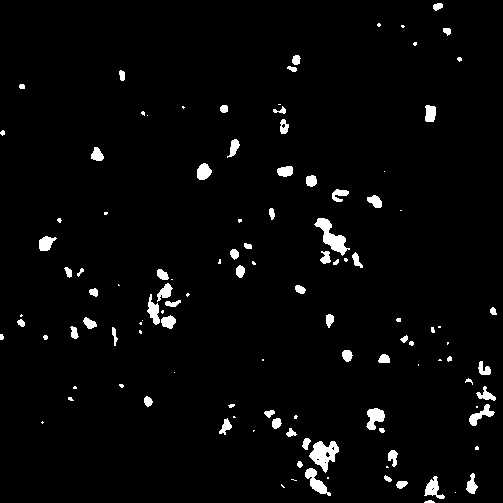

#  BIOIMAGING - INEB/i3S
Eduardo Conde-Sousa (econdesousa@gmail.com)

## Cell density assessement

* 3D cell segmentation from DAPI channel using ilastik pixel classification workflow
* Cell type evaluated from other channels
* output
	* Cell density map (DAPI) 
	* Cell density map (other markers)
 
### code version
0.1

### last modification
18/04/2021 at 16:41 (GMT)

### Attribution:
If you use this macro please add in the acknowledgements of your papers and/or thesis (MSc and PhD) the reference to Bioimaging and the project PPBI-POCI-01-0145-FEDER-022122.
As a suggestion you may use the following sentence:
 * The authors acknowledge the support of the i3S Scientific Platform Bioimaging, member of the national infrastructure PPBI - Portuguese Platform of Bioimaging (PPBI-POCI-01-0145-FEDER-022122).


# setup

```java

run("Bio-Formats Macro Extensions");
Ext.setId(inputfile);
Ext.getSeriesCount(seriesCount);
run("CLIJ2 Macro Extensions", "cl_device=[]");
Ext.CLIJ2_clear();
	
close("*");
resetNonImageWindows();
run("Record...");


```

# load data original data

```java
	
setBatchMode(true);
run("Bio-Formats Importer", "open=["+inputfile+"] color_mode=Colorized rois_import=[ROI manager] view=Hyperstack stack_order=XYCZT series_"+series);
mainName=File.nameWithoutExtension;
path2file=File.directory;
origID=getImageID();
if (isReg2Crop) cropRegion(x1, y1, width1, height1);

run("Duplicate...", "title=CD45 duplicate channels=2");
setBatchMode("show");
setMinAndMax(0, 5000);
run("Green");
selectImage(origID);
run("Duplicate...", "title=CD19 duplicate channels=3");
setBatchMode("show");
setMinAndMax(0, 5000);
run("Red");
selectImage(origID);
run("Duplicate...", "title=DAPI duplicate channels=4");
selectImage(origID);close();
selectWindow("DAPI");
setBatchMode(false);

dapiID=getImageID();

```
<a href="image_1618765204369.png"></a>
<a href="image_1618765207846.png"></a>
<a href="image_1618765210348.png"></a>

# Threshold intensity data
DAPI channel is kept as is while other channels are thresholded (after smoothing)

```java

selectWindow("CD45");
run("Gaussian Blur 3D...", "x=3 y=3 z=3");
stackThresh("Otsu dark");
selectWindow("CD19");
run("Gaussian Blur 3D...", "x=3 y=3 z=3");
stackThresh("Otsu dark");

	
```
<a href="image_1618765213757.png"></a>
<a href="image_1618765214168.png"></a>

# Predictions (from Ilastik)
1. Create Prediction 
2. Get only channel of interest 
3. Filter

```java
run("Run Pixel Classification Prediction", "projectfilename="+modelPath+" inputimage=DAPI pixelclassificationtype=Probabilities");
	
predID=getImageID();
selectImage(predID);run("Duplicate...", "title=maskRestrict duplicate channels=1");
maskRestrictID=getImageID();
selectImage(predID);close();
selectImage(dapiID);
getVoxelSize(width, height, depth, unit);
selectImage(maskRestrictID);
setVoxelSize(width, height, depth, unit);
zSmooth=0.5*smoothScale;
run("Gaussian Blur 3D...", "x="+smoothScale+" y="+smoothScale+" z="+zSmooth);

```
<a href="image_1618765352272.png"></a>

# Prediction masks
Method: hysteresis threshold with two thresholds
 * smallTh to generate maskRough
 * largeTh to generate maskRestrict

```java
selectImage(maskRestrictID);
run("Duplicate...", "title=maskRough duplicate");
maskRoughID=getImageID();

getMask(maskRoughID,smallTh, 1);
getMask(maskRestrictID, largeTh, 1);
```
<a href="image_1618765354512.png"></a>
<a href="image_1618765355068.png"></a>

# Marker Controlled Watershed
1. get inverted version of main image
2. Apply MorpholibJ's Marker-controlled Watershed 

```java
selectImage(dapiID);run("Duplicate...", "title=inverted duplicate channels=1");
selectWindow("inverted");
invertedID=getImageID();
run("Invert", "stack");
selectImage(dapiID);

label_map = "labeledImage";
run("Marker-controlled Watershed", "input=inverted marker=maskRestrict mask=maskRough binary calculate use");
rename(label_map);
run("glasbey_on_dark");
selectImage(maskRestrictID);close();
selectImage(maskRoughID);close();
selectImage(invertedID);close();
```
<pre>
> -> Compute marker labels
> -> Running watershed...
>   Extracting voxel values...
>   Extraction took 3332 ms.
>   Flooding from 1183485 voxels...
>   Flooding took: 14399 ms
> Watershed 3d took 20797 ms.
</pre>
<a href="image_1618765378595.png"></a>

# averageDistance

```java
Ext.CLIJ2_push(label_map);
averageDistance(label_map,"labels_distance_",nNeig,"Fire",true);

```
<a href="image_1618765382395.png"></a>
<a href="image_1618765383362.png"></a>

# group cell by positivity at channel x

```java
cd45 = "CD45";
Ext.CLIJ2_push(cd45);
cd19 = "CD19";
Ext.CLIJ2_push(cd19);
number_of_dilations = 6;
threshold=0.1;

cd45PosCells="cd45PosCells";
cd19PosCells="cd19PosCells";
PosCells="PosCells";
	
getPosNuc(cd45,label_map,number_of_dilations,threshold,cd45PosCells);
getPosNuc(cd19,label_map,number_of_dilations,threshold,cd19PosCells);
Ext.CLIJ2_binaryAnd(cd45PosCells, cd19PosCells, PosCells);
Ext.CLIJ2_pull(PosCells);

```
<a href="image_1618765388161.png"></a>
<a href="image_1618765388634.png"></a>
<a href="image_1618765388860.png"></a>
<a href="image_1618765389384.png"></a>
<a href="image_1618765389831.png"></a>

# averageDistance between groups

```java
cd45PosCellsLabels=cd45PosCells+"Labels";
cd19PosCellsLabels=cd19PosCells+"Labels";
PosCellsLabels=PosCells+"Labels";
Ext.CLIJ2_mask(label_map, cd45PosCells, tmp);
Ext.CLIJ2_closeIndexGapsInLabelMap(tmp, cd45PosCellsLabels);
	
Ext.CLIJ2_mask(label_map, cd19PosCells, tmp);
Ext.CLIJ2_closeIndexGapsInLabelMap(tmp, cd19PosCellsLabels);
	
Ext.CLIJ2_mask(label_map, PosCells, tmp);
Ext.CLIJ2_closeIndexGapsInLabelMap(tmp, PosCellsLabels);
	
Ext.CLIJ2_release(tmp);

selectWindow(cd45PosCells);close();Ext.CLIJ2_release(cd45PosCells);
selectWindow(cd19PosCells);close();Ext.CLIJ2_release(cd19PosCells);
selectWindow(PosCells);close();Ext.CLIJ2_release(PosCells);
	
	
averageDistance(cd45PosCellsLabels,"cd45PosCellsLabels_",nNeig,"Fire",true);
averageDistance(cd19PosCellsLabels,"cd19PosCellsLabels_",nNeig,"Fire",true);
averageDistance(PosCellsLabels,"PosCellsLabels_",nNeig,"Fire",true);
```
<a href="image_1618765393853.png"></a>
<a href="image_1618765394289.png"></a>
<a href="image_1618765394586.png"></a>

# clean up garbage

```java
//drawResult(label_map, dataVector,"dataVector");
//drawResult(label_map, aboveThreshMask,"aboveThreshMask");
	
run("Tile");
	
Ext.CLIJ2_clear();
run("Synchronize Windows");
```

# Convinient methods

```java

function resetNonImageWindows(){
	list = getList("window.titles");
	for (i = 0; i < lengthOf(list); i++) {
		selectWindow(list[i]);run("Close");
	}
}

function show(input, text) {
	selectWindow(input);
	run("Duplicate...", "title=max_projection duplicate channels=4");
	run("Z Project...", "projection=[Max Intensity]");
	setColor(pow(2,bitDepth())-1);
	drawString(text, 20, 20);
}
function showCLIJ(input, text) {
	Ext.CLIJ2_maximumZProjection(input, max_projection);
	Ext.CLIJ2_pull(max_projection);
	setColor(pow(2,bitDepth())-1);
	drawString(text, 20, 20);
	Ext.CLIJ2_release(max_projection);
}

function cropRegion(x, y, w, h){
	makeRectangle(x, y, w, h);
	run("Crop");
}


function getMask(id, th1,th2) { 
	selectImage(id);
	setThreshold(th1, th2);
	run("Convert to Mask", "stack");
	if (is("Inverting LUT")) {
		run("Invert LUT");
	}
	run("Fill Holes", "stack");
}


function averageDistance(inputImage,outputName,nNeig,LUT,CalibrationBar){
	outputImage=outputName+nNeig;
	Ext.CLIJx_averageDistanceOfNClosestNeighborsMap(inputImage, outputImage, nNeig);
	Ext.CLIJ2_pull(outputImage);
	Ext.CLIJ2_release(outputImage);
	run(LUT);
	if (CalibrationBar){
		run("Calibration Bar...", "location=[Upper Right] fill=White label=Black number=5 decimal=0 font=12 zoom=1 overlay");
	}
}

function stackThresh(method) { 
	setAutoThreshold(method+" stack");
	setOption("BlackBackground", true);
	run("Convert to Mask", "method=Otsu background=Dark black");
}


function labelDilation(imageIN,nDilations,is2pull,keepOnGPU) { 
	Ext.CLIJ2_copy(imageIN, flip);
	for (i = 0; i < floor(nDilations/2); i++) {
		Ext.CLIJ2_onlyzeroOverwriteMaximumDiamond(flip, flop);
		Ext.CLIJ2_onlyzeroOverwriteMaximumDiamond(flop, flip);
	}
	if (floor(nDilations/2)*2<nDilations){
		Ext.CLIJ2_onlyzeroOverwriteMaximumDiamond(flip, flop);
		Ext.CLIJ2_copy(flop, flip);
	}
	if (is2pull){
		Ext.CLIJ2_pull(flip);
		nameExtended="ExtendedSpotsAfter_" + (i * 2) + "_dilations";
		rename(nameExtended);
		run("glasbey_on_dark");
	}
	Ext.CLIJ2_release(flop);
	if (keepOnGPU){
		return flip;
	}else {
		Ext.CLIJ2_release(flip);
		return 0;
	}
}


function drawResult(label_map, measurement,outName) {
	// replace label in the label map with corresponding measurements
	Ext.CLIJ2_replaceIntensities(label_map, measurement, outName);
	// show the parametric image
	Ext.CLIJ2_pull(outName);
	run("Fire");
}


// This function takes a vector, binarizes it by thresholding 
// and visualizes the results as regions of interests:
function above_bellow_threshold_vector(vector, labelmap, threshold) {

	// threshold the vector in two vectors:
	Ext.CLIJ2_smallerConstant(vector, bellowThresh, threshold);
	Ext.CLIJ2_greaterOrEqualConstant(vector, aboveThresh, threshold);

	bellowThresh_map="bellowThresh";
	aboveThresh_map="aboveThresh";
	// visualise resulting binary images
	Ext.CLIJ2_replaceIntensities(labelmap, bellowThresh, bellowThresh_map);
	Ext.CLIJ2_replaceIntensities(labelmap, aboveThresh, aboveThresh_map);

	Ext.CLIJ2_pull(bellowThresh_map);
	Ext.CLIJ2_pull(aboveThresh_map);

}


function getPosNuc(markerImage,label_map,number_of_dilations,threshold,aboveThreshMask) {

	dataVector="MEAN_INTENSITY";
	
	
	dilatedMask = labelDilation(markerImage,number_of_dilations,false,true);
	Ext.CLIJ2_statisticsOfBackgroundAndLabelledPixels(dilatedMask, label_map);
	setResult(dataVector, 0, 0);//remove signal outside cells
	
	Ext.CLIJ2_pushResultsTableColumn(dataVector, dataVector);
	selectWindow("Results");run("Close");

	Ext.CLIJ2_replaceIntensities(label_map, dataVector, aboveThreshMask);
	Ext.CLIJ2_pull(aboveThreshMask);aboveThreshMask="aboveThreshMask";
	setThreshold(threshold, pow(2,bitDepth())-1 );
	setOption("BlackBackground", true);
	run("Convert to Mask", "method=Default background=Dark black");
}
```


