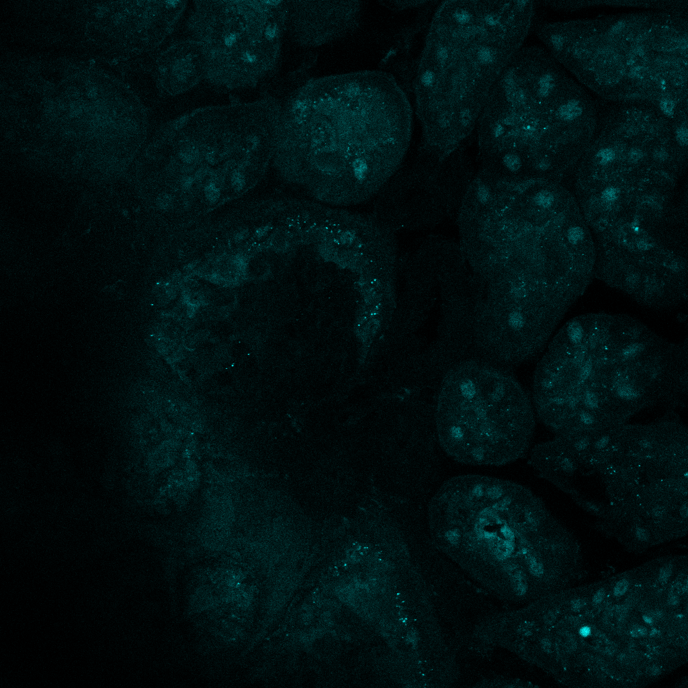
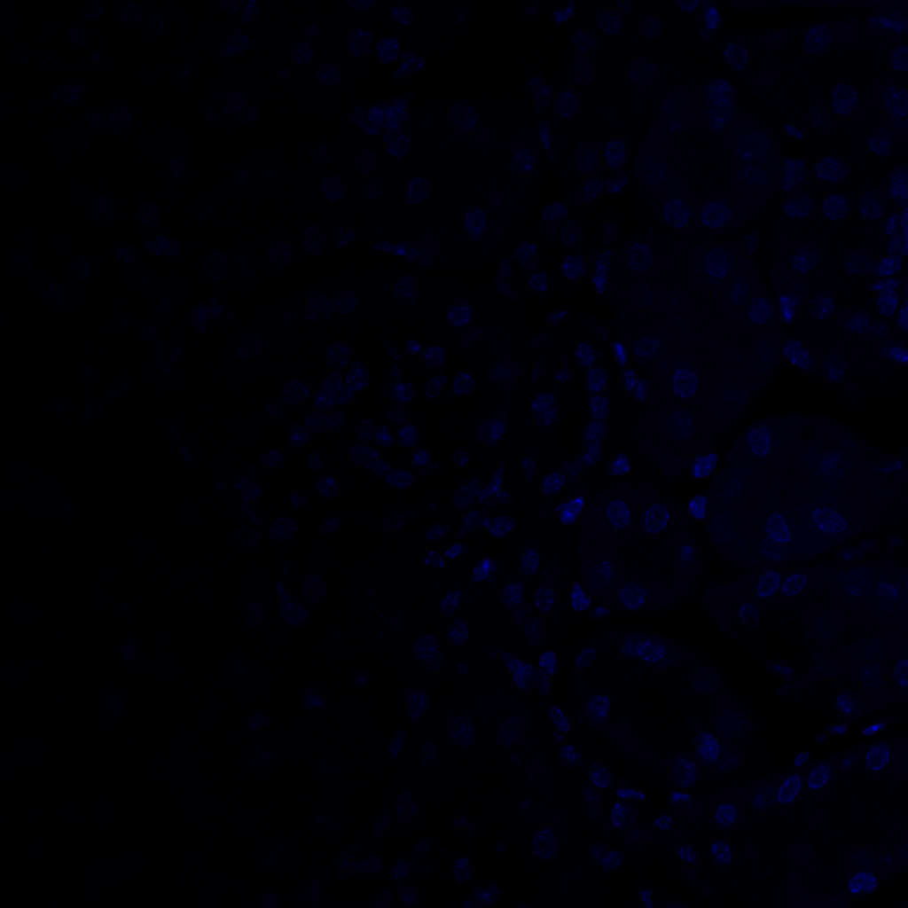
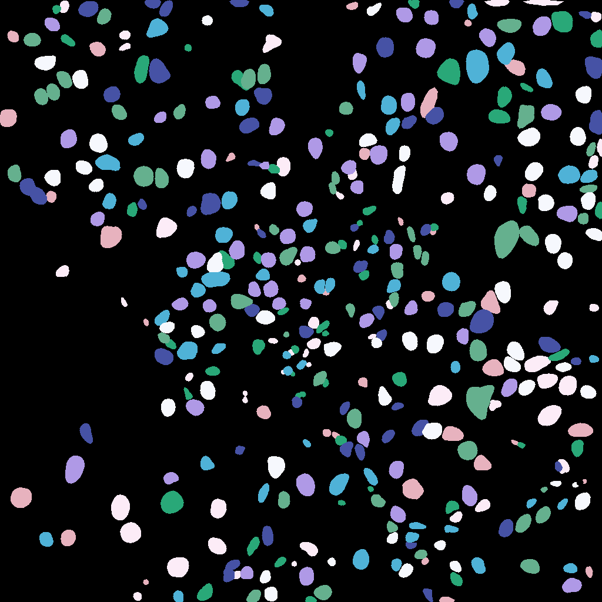
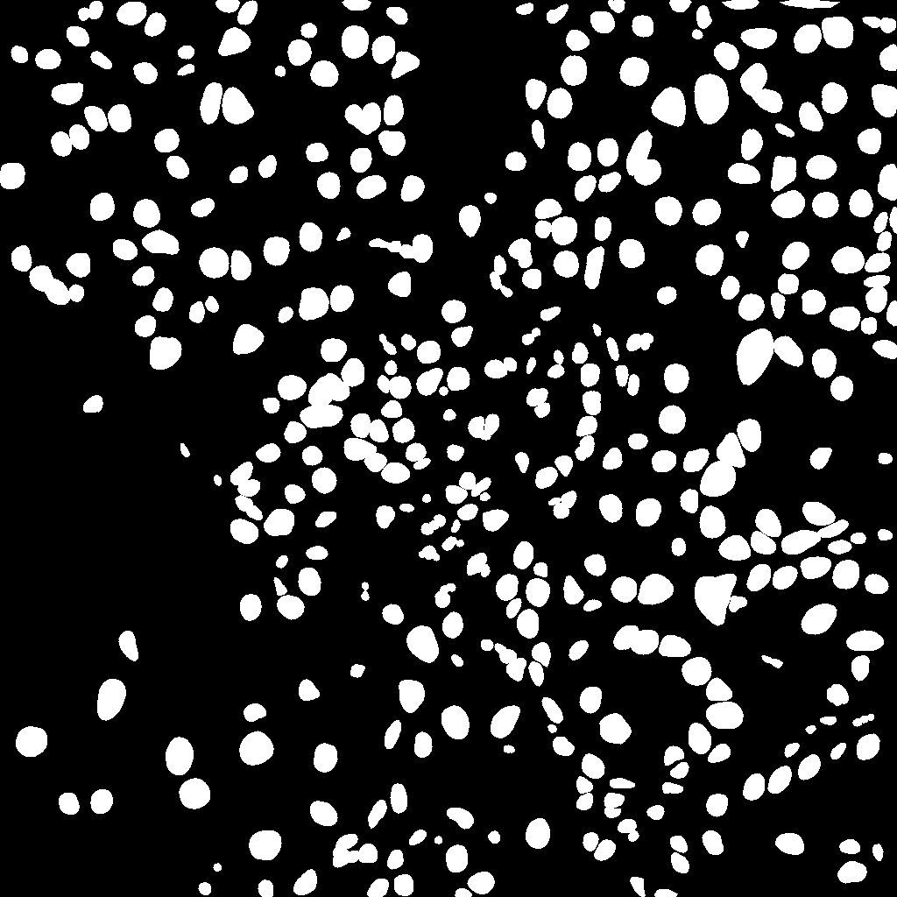
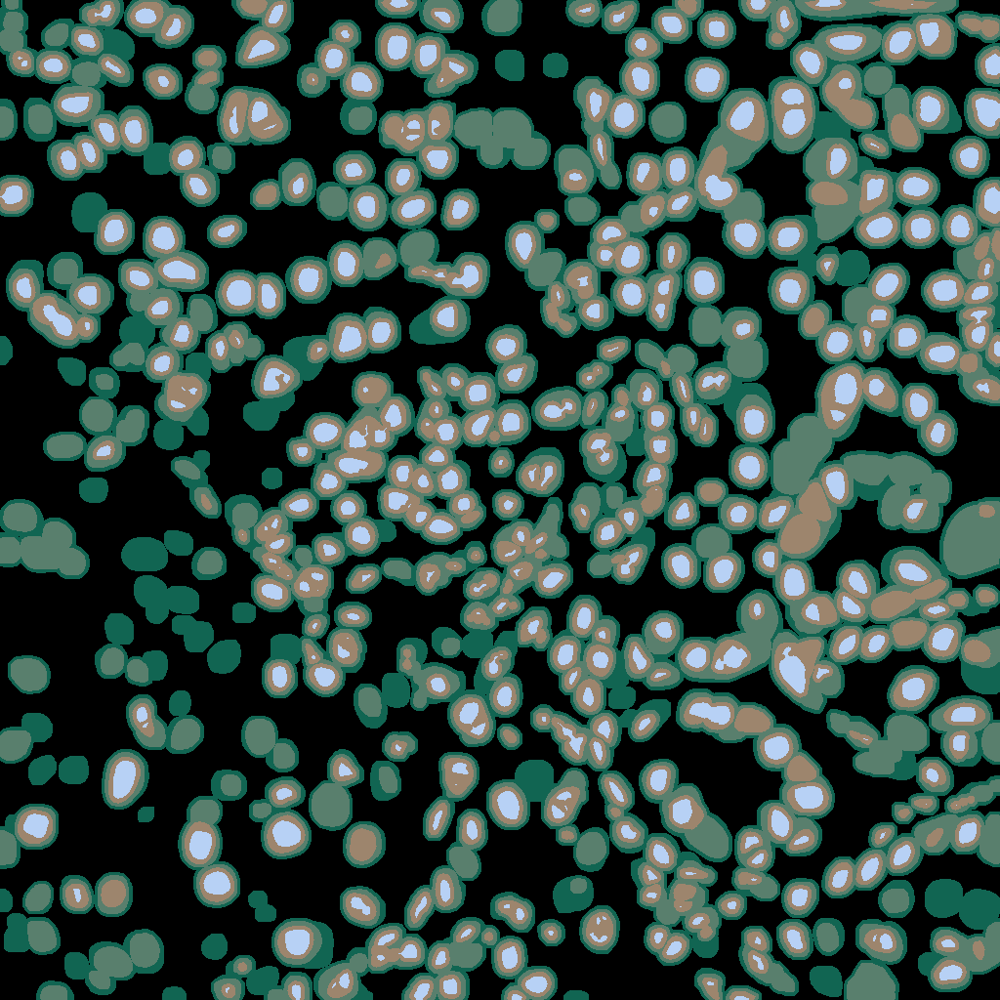

#  BIOIMAGING - INEB/i3S
Eduardo Conde-Sousa (econdesousa@gmail.com)

## Coloc - inside/outide nuc intensity

* 3D nuclei segmentation (Stardist)
* Split image into 4 labels 	
*	nucSmall (eroded (3pix) nuc)
*	nucInsideBorder (3pixels long nuc ring)
*	border (3px outisde nuc)
*	outerRing (ring 3pixels outside border )
* Measure intensity in channel 4 at each of the four regions
 
 
### code version
2.1

	
### last modification
25/10/2021

### Requirements
* update sites (see https://imagej.net/plugins/morpholibj#installation):
	* IJPB-plugins
	* CLIJ2
	* Stadist
	* CSBDeep
	


### Attribution:
If you use this macro please add in the acknowledgements of your papers and/or thesis (MSc and PhD) the reference to Bioimaging and the project PPBI-POCI-01-0145-FEDER-022122.
As a suggestion you may use the following sentence:
 * The authors acknowledge the support of the i3S Scientific Platform Bioimaging, member of the national infrastructure PPBI - Portuguese Platform of Bioimaging (PPBI-POCI-01-0145-FEDER-022122).

please cite:
* this macro: https://github.com/econdesousa/ImageAnalysis/tree/master/Coloc_InsideOutideNucIntensity
* CLIJ https://www.nature.com/articles/s41592-019-0650-1
* Stardist: https://imagej.net/plugins/stardist#references
*

```java

inputFile=File.openDialog("Choose Lif");
close("*");
run("CLIJ2 Macro Extensions", "cl_device=[]");
Ext.CLIJ2_clear();
eval("script", "IJ.getInstance().setAlwaysOnTop(true)");

```

# load data and setup

```java

setBatchMode(true);
run("Bio-Formats Importer", "open=["+inputFile+"] autoscale color_mode=Default rois_import=[ROI manager] view=Hyperstack stack_order=XYCZT");
mainName = File.nameWithoutExtension();
id= getImageID();
// Get DAPI and SIGNAL images
run("Duplicate...", "title=DAPI duplicate channels=1");
setBatchMode("show");
selectImage(id);
run("Duplicate...", "title=Signal duplicate channels=4");
selectImage(id);
close();
setBatchMode(false);
run("Tile");
selectWindow("DAPI");
getVoxelSize(width, height, depth, unit);

```
<a href="image_1635158659766.png"></a>
<a href="image_1635158661915.png"></a>

# StarDist to segment DAPI
	
Stardist only works in 2D so image is converted from 3D to 2D+t

The output is and virtual stack. It is duplicated to allow further processing

```java

run("Re-order Hyperstack ...", "channels=[Channels (c)] slices=[Frames (t)] frames=[Slices (z)]");
run("Command From Macro", "command=[de.csbdresden.stardist.StarDist2D], args=['input':'DAPI', 'modelChoice':'Versatile (fluorescent nuclei)', 'normalizeInput':'true', 'percentileBottom':'1.0', 'percentileTop':'99.8', 'probThresh':'0.5', 'nmsThresh':'0.4', 'outputType':'Label Image', 'nTiles':'1', 'excludeBoundary':'2', 'roiPosition':'Automatic', 'verbose':'false', 'showCsbdeepProgress':'false', 'showProbAndDist':'false'], process=[false]");
selectWindow("Label Image");
run("Duplicate...", "duplicate");
selectWindow("Label Image");close();
rename("Label Image");


```
<a href="image_1635158709870.png"></a>
<a href="image_1635158712012.png"></a>

# Threshold 

object separation is not important here so we convert labels to mask

```java

run("16-bit");
setThreshold(1, 65535);
setOption("BlackBackground", true);
run("Convert to Mask", "method=Default background=Dark black");

```
<a href="image_1635158712234.png"></a>

# reset frames and slices back again

```java

run("Re-order Hyperstack ...", "channels=[Channels (c)] slices=[Frames (t)] frames=[Slices (z)]");


```
<a href="image_1635158712535.png"></a>

# Get ROIs

1. generate 4 images:
	1. nucSmall (label 1)
	2. nucInsideBorder (label 2)
	3. border (label 3)
	4. outerRing (label 4)
2. and add them into a single labeled image

```java


inputImage = getTitle();
Ext.CLIJ2_push(inputImage);

// get nuc center and border pixels
nucInsideBorder = "nucInsideBorder";
Ext.CLIJ2_erodeLabels(inputImage, Image_labels_destination, 3, false);
Ext.CLIJ2_multiplyImageAndScalar(Image_labels_destination, Image_destination, 255);
Ext.CLIJ2_release(Image_labels_destination);
Ext.CLIJ2_subtractImages(inputImage, Image_destination, nucInsideBorderMask);
Ext.CLIJ2_release(Image_destination);

nucSmall = "nucSmall";
Ext.CLIJ2_subtractImages(inputImage, nucInsideBorderMask, nucSmallMask);
Ext.CLIJ2_multiplyImageAndScalar(nucSmallMask, nucSmall, 1/255);
Ext.CLIJ2_release(nucSmallMask);
//Ext.CLIJ2_pull(nucSmall);

Ext.CLIJ2_multiplyImageAndScalar(nucInsideBorderMask, nucInsideBorder, 2/255);
Ext.CLIJ2_release(nucInsideBorderMask);
//Ext.CLIJ2_pull(nucInsideBorder);


// Get nuc envelope
border = "border";
Ext.CLIJ2_dilateLabels(inputImage, Image_destination, 3);
Ext.CLIJ2_subtractImages(Image_destination, inputImage, border_tmp);


Ext.CLIJ2_multiplyImageAndScalar(border_tmp, border, 3/255);
Ext.CLIJ2_release(border_tmp);
//Ext.CLIJ2_pull(border);


outerRing="outerRing";
Ext.CLIJ2_dilateLabels(inputImage, Image_destination2, 6);
Ext.CLIJ2_subtractImages(Image_destination2, Image_destination, outerRingMask);
Ext.CLIJ2_release(Image_destination);
Ext.CLIJ2_release(Image_destination2);
Ext.CLIJ2_release(inputImage);
Ext.CLIJ2_multiplyImageAndScalar(outerRingMask, outerRing, 4/255);
Ext.CLIJ2_release(outerRingMask);


// get label image
output = "label_0_1_2_3_4";
Ext.CLIJ2_addImages(nucSmall, nucInsideBorder, tmp);
Ext.CLIJ2_addImages(tmp, border, tmp2);
Ext.CLIJ2_release(tmp);
Ext.CLIJ2_addImages(tmp2, outerRing, output);
Ext.CLIJ2_release(tmp2);
Ext.CLIJ2_release(nucSmall);
Ext.CLIJ2_release(nucInsideBorder);
Ext.CLIJ2_release(border);
Ext.CLIJ2_release(outerRing);

Ext.CLIJ2_pull(output);
Ext.CLIJ2_release(output);
run("glasbey_on_dark");

setVoxelSize(width, height, depth, unit);
eval("script", "IJ.getInstance().setAlwaysOnTop(false)");

```
<a href="image_1635158713210.png"></a>
<a href="image_1635158713502.png"></a>

# Get stats

```java

run("Intensity Measurements 2D/3D", "input=Signal labels=label_0_1_2_3_4 mean stddev max min median mode volume");
Table.rename("Signal-intensity-measurements", "Results");
vec=newArray(4);
vec[0]="nucSmall";
vec[1]="nucInsideBorder";
vec[2]="border";
vec[3]="outerRing";

for (i = 0; i < nResults; i++) {
	setResult("filename", i, mainName);
	setResult("Label", i, vec[i]);
}

```
<table>
<tr><th>Label</th><th>Mean</th><th>StdDev</th><th>Max</th><th>Min</th><th>Median</th><th>Mode</th><th>Volume</th><th>filename</th></tr>
<tr><td>nucSmall</td><td>5736.503</td><td>5130.402</td><td>65535</td><td>0</td><td>4366</td><td>43</td><td>52904.698</td><td>Experimental 23#172 Ki</td></tr>
<tr><td>nucInsideBorder</td><td>3824.407</td><td>3511.367</td><td>65535</td><td>0</td><td>2867</td><td>42</td><td>163718.052</td><td>Experimental 23#172 Ki</td></tr>
<tr><td>border</td><td>3384.400</td><td>3100.096</td><td>65535</td><td>0</td><td>2604</td><td>45</td><td>223257.939</td><td>Experimental 23#172 Ki</td></tr>
<tr><td>outerRing</td><td>3352.296</td><td>3160.251</td><td>65535</td><td>0</td><td>2534</td><td>47</td><td>153329.297</td><td>Experimental 23#172 Ki</td></tr>
</table>


# Reset windows

```java
selectWindow("label_0_1_2_3_4");
close("\\Others");

```


```
```
