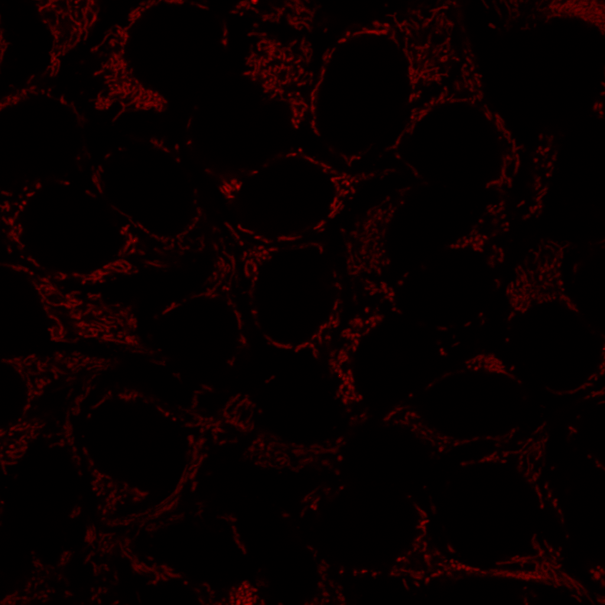
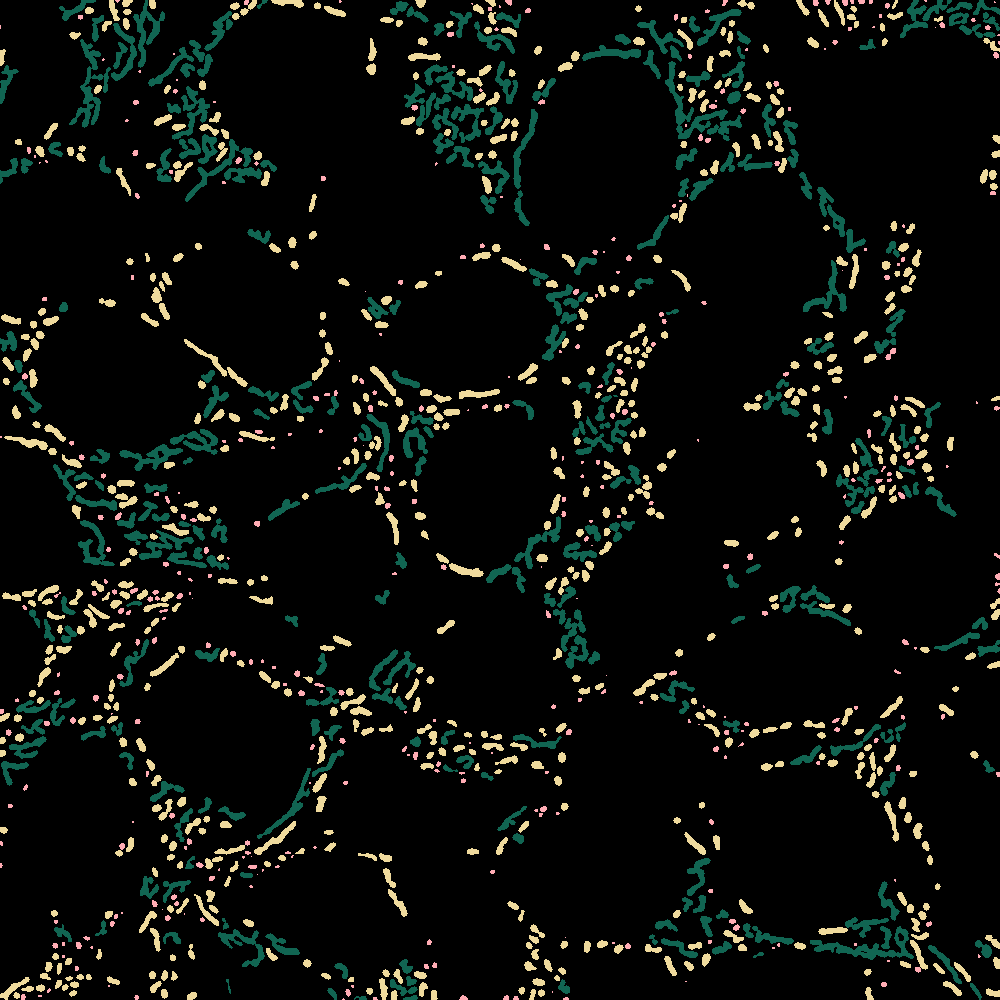
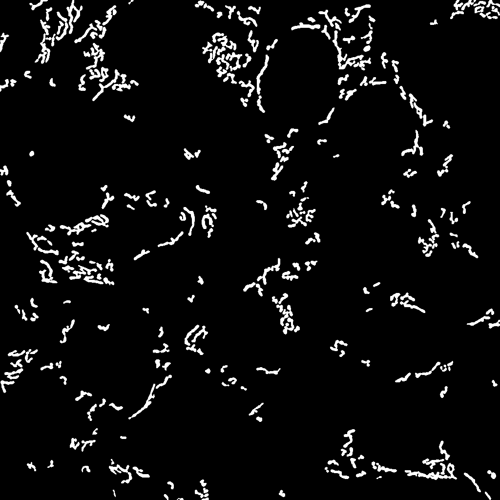

#  BIOIMAGING - INEB/i3S
Eduardo Conde-Sousa (econdesousa@gmail.com)

****************************************************
## Mitochondrial stats
****************************************************

1. mitochondrial segmentation with
 * difference of gaussian
 * ilastik
2. mitochodrial classification
 * ilastik
3. Nuclei segmentation
 * Stardist (after smoothing and rescaling)
4. Distance between mitochroria and closest nucleus
 * 3D ImageJ suite

### requirements
* CLIJ2
* 3D ImageJ suite
* Ilastik

### code version
1

### last modification
11/05/2021

### Attribution:
If you use this macro please add in the acknowledgements of your papers and/or thesis (MSc and PhD) the reference to Bioimaging and the project PPBI-POCI-01-0145-FEDER-022122.
As a suggestion you may use the following sentence:
 * The authors acknowledge the support of the i3S Scientific Platform Bioimaging, member of the national infrastructure PPBI - Portuguese Platform of Bioimaging (PPBI-POCI-01-0145-FEDER-022122).


# Setup

```java

close("\\Others");
run("Select None");
resetNonImageWindows();
projectName = File.openDialog("Select ilastik object classification project");
sigma1x = 1.5;
sigma2x = 2;
scaleFactor = 2;
run("CLIJ2 Macro Extensions", "cl_device=");
Ext.CLIJ2_clear();

```

# call main function

```java

main=getTitle();
proc1file(main,1,sigma1x,sigma2x,projectName,2,scaleFactor);


function proc1file(main,chMito,sigma1x,sigma2x,projectName,chDapi,scaleFactor){
	mainImageID=getImageID();
	close("\\Others");
	Stack.setChannel(chMito);
	procMITO(main,sigma1x,sigma2x,projectName);
	selectImage(mainImageID);
	Stack.setChannel(chDapi);
	procDAPI(main,chDapi,scaleFactor);
	selectImage(mainImageID);
	getVoxelSize(width, height, depth, unit);
	for (im = 1; im <= nImages; im++) {
		selectImage(im);
		setVoxelSize(width, height, depth, unit);
	}
	selectImage(mainImageID);
	outputName=newArray("Puncta","Rods","Networks");
	for (gr = 1; gr <= 3; gr++) {
		run("Tile");
		selectImage(mainImageID);
		mask = "labelMask_"+gr;
		distMitoNuc(main,mask,chMito,outputName[gr-1]);
	}
	
	run("Tile");
	run("Show All");
}


```
<pre>
> 
> Building objects population
> 
> Closest 370 / 371              
> ResultsTable.show(): the system ResultTable should only be displayed in the "Results" window.
> Finished
> 
> Building objects population
> 
> Closest 644 / 645              
> ResultsTable.show(): the system ResultTable should only be displayed in the "Results" window.
> Finished
> 
> Building objects population
> 
> Closest 278 / 279              
> ResultsTable.show(): the system ResultTable should only be displayed in the "Results" window.
> Finished
</pre>
<a href="image_1620731983718.png"></a>
<a href="image_1620731986849.png"></a>
<a href="image_1620731987218.png"></a>
<a href="image_1620731987345.png"></a>
<a href="image_1620731987659.png"></a>
<a href="image_1620731987978.png"></a>
<table>
<tr><th>Label</th><th>Area</th><th>Mean</th><th>Max</th><th>Min</th><th>Median</th><th>Mode</th><th>Distance2Nuc</th></tr>
<tr><td>1</td><td>0.106</td><td>7969.222</td><td>10188</td><td>6528</td><td>7340</td><td>6528</td><td>11.872</td></tr>
<tr><td>2</td><td>0.258</td><td>7650.818</td><td>10127</td><td>4878</td><td>7824</td><td>4878</td><td>0.583</td></tr>
<tr><td>3</td><td>0.082</td><td>3612.571</td><td>4075</td><td>3188</td><td>3587</td><td>3188</td><td>1.067</td></tr>
<tr><td>4</td><td>0.352</td><td>5421.267</td><td>8294</td><td>2977</td><td>5355</td><td>2977</td><td>9.307</td></tr>
<tr><td>5</td><td>0.282</td><td>4054.708</td><td>4963</td><td>3332</td><td>4061</td><td>3332</td><td>9.825</td></tr>
<tr><td>6</td><td>0.364</td><td>4035.677</td><td>5390</td><td>2892</td><td>4015</td><td>2892</td><td>6.493</td></tr>
<tr><td>7</td><td>0.246</td><td>4966.000</td><td>6941</td><td>2917</td><td>5014</td><td>5014</td><td>6.100</td></tr>
<tr><td>8</td><td>0.364</td><td>7263.774</td><td>9738</td><td>5046</td><td>7339</td><td>5046</td><td>5.192</td></tr>
<tr><td>9</td><td>0.200</td><td>7468.529</td><td>8703</td><td>6086</td><td>7342</td><td>6086</td><td>5.137</td></tr>
<tr><td>10</td><td>0.293</td><td>6152.360</td><td>8419</td><td>4237</td><td>6687</td><td>4237</td><td>4.704</td></tr>
<tr><td>11</td><td>0.176</td><td>4195.933</td><td>5386</td><td>3257</td><td>4200</td><td>3257</td><td>4.351</td></tr>
<tr><td>12</td><td>0.059</td><td>8915.400</td><td>10074</td><td>6997</td><td>9176</td><td>6997</td><td>2.656</td></tr>
<tr><td>13</td><td>0.035</td><td>6663.000</td><td>7224</td><td>5826</td><td>6939</td><td>5826</td><td>3.577</td></tr>
<tr><td>14</td><td>0.035</td><td>5648.333</td><td>6359</td><td>5194</td><td>5392</td><td>5194</td><td>12.173</td></tr>
<tr><td>15</td><td>0.270</td><td>4842.696</td><td>6110</td><td>3521</td><td>4647</td><td>3521</td><td>3.158</td></tr>
<tr><td>16</td><td>0.059</td><td>6310.800</td><td>7207</td><td>5267</td><td>6621</td><td>5267</td><td>9.861</td></tr>
<tr><td>17</td><td>0.188</td><td>9007.688</td><td>10841</td><td>7373</td><td>9263</td><td>7373</td><td>10.212</td></tr>
<tr><td>18</td><td>0.293</td><td>3730.080</td><td>5022</td><td>2572</td><td>3845</td><td>2572</td><td>7.432</td></tr>
<tr><td>19</td><td>0.176</td><td>3470.133</td><td>4320</td><td>2785</td><td>3442</td><td>2785</td><td>8.085</td></tr>
<tr><td>20</td><td>0.270</td><td>4487.652</td><td>5733</td><td>3320</td><td>4488</td><td>3320</td><td>5.427</td></tr>
<tr><td>21</td><td>0.141</td><td>3408.083</td><td>4045</td><td>2795</td><td>3498</td><td>2795</td><td>2.575</td></tr>
<tr><td>22</td><td>0.246</td><td>7178.095</td><td>9145</td><td>4939</td><td>7065</td><td>4939</td><td>15.015</td></tr>
<tr><td>23</td><td>0.235</td><td>11984.100</td><td>13263</td><td>10191</td><td>12118</td><td>10191</td><td>0.583</td></tr>
<tr><td>24</td><td>0.305</td><td>7911.923</td><td>11436</td><td>5005</td><td>7886</td><td>5005</td><td>0.000</td></tr>
<tr><td>25</td><td>0.047</td><td>5601.500</td><td>6046</td><td>4673</td><td>5951</td><td>4673</td><td>15.410</td></tr>
<tr><td>26</td><td>0.258</td><td>12370.136</td><td>14409</td><td>9756</td><td>12414</td><td>9756</td><td>0.766</td></tr>
<tr><td>27</td><td>0.059</td><td>3605.600</td><td>4143</td><td>3214</td><td>3675</td><td>3214</td><td>1.750</td></tr>
<tr><td>28</td><td>0.141</td><td>6828.500</td><td>8287</td><td>5453</td><td>6968</td><td>5453</td><td>8.120</td></tr>
<tr><td>29</td><td>0.176</td><td>4406.600</td><td>5307</td><td>3525</td><td>4402</td><td>3525</td><td>2.473</td></tr>
<tr><td>30</td><td>0.012</td><td>5248.000</td><td>5248</td><td>5248</td><td>5248</td><td>5248</td><td>0.000</td></tr>
<tr><td>31</td><td>0.364</td><td>6229.194</td><td>7984</td><td>4081</td><td>6305</td><td>4081</td><td>8.706</td></tr>
<tr><td>32</td><td>0.059</td><td>10885.800</td><td>11852</td><td>9849</td><td>10659</td><td>9849</td><td>1.152</td></tr>
<tr><td>33</td><td>0.246</td><td>3824.095</td><td>5448</td><td>2348</td><td>3685</td><td>2348</td><td>1.747</td></tr>
<tr><td>34</td><td>0.082</td><td>11037.857</td><td>13039</td><td>9263</td><td>10925</td><td>9263</td><td>0.825</td></tr>
<tr><td>35</td><td>0.094</td><td>4229.875</td><td>4965</td><td>3189</td><td>4444</td><td>3189</td><td>7.280</td></tr>
<tr><td>36</td><td>0.047</td><td>2904.500</td><td>3142</td><td>2759</td><td>2906</td><td>2759</td><td>1.682</td></tr>
<tr><td>37</td><td>0.352</td><td>6575.600</td><td>8972</td><td>3098</td><td>7040</td><td>3098</td><td>0.000</td></tr>
<tr><td>38</td><td>0.047</td><td>4180.250</td><td>4777</td><td>3715</td><td>4132</td><td>3715</td><td>4.231</td></tr>
<tr><td>39</td><td>0.200</td><td>4419.765</td><td>5058</td><td>3846</td><td>4375</td><td>3846</td><td>3.149</td></tr>
<tr><td>40</td><td>0.106</td><td>5377.778</td><td>6156</td><td>4389</td><td>5559</td><td>4389</td><td>10.989</td></tr>
<tr><td>41</td><td>0.106</td><td>6811.222</td><td>8113</td><td>5502</td><td>6678</td><td>5502</td><td>8.061</td></tr>
<tr><td>42</td><td>0.082</td><td>3269.143</td><td>3616</td><td>2546</td><td>3477</td><td>2546</td><td>7.800</td></tr>
<tr><td>43</td><td>0.047</td><td>3383.250</td><td>3786</td><td>2880</td><td>3600</td><td>2880</td><td>3.740</td></tr>
<tr><td>44</td><td>0.317</td><td>5404.593</td><td>8212</td><td>3450</td><td>5466</td><td>3450</td><td>2.231</td></tr>
<tr><td>45</td><td>0.117</td><td>7280.800</td><td>8197</td><td>5756</td><td>7720</td><td>5756</td><td>6.304</td></tr>
<tr><td>46</td><td>0.246</td><td>6401.667</td><td>8090</td><td>5224</td><td>6499</td><td>5224</td><td>5.013</td></tr>
<tr><td>47</td><td>0.211</td><td>4279.889</td><td>5820</td><td>3332</td><td>4322</td><td>3332</td><td>3.902</td></tr>
<tr><td>48</td><td>0.376</td><td>6721.719</td><td>9383</td><td>3467</td><td>6866</td><td>3467</td><td>0.000</td></tr>
<tr><td>49</td><td>0.352</td><td>3554.000</td><td>5200</td><td>2523</td><td>3448</td><td>2523</td><td>7.812</td></tr>
<tr><td>50</td><td>0.047</td><td>5593.750</td><td>5964</td><td>5105</td><td>5825</td><td>5105</td><td>4.442</td></tr>
<tr><td>51</td><td>0.070</td><td>4065.333</td><td>4846</td><td>2967</td><td>4511</td><td>2967</td><td>0.108</td></tr>
<tr><td>52</td><td>0.376</td><td>7560.781</td><td>9461</td><td>6034</td><td>7679</td><td>6034</td><td>3.792</td></tr>
<tr><td>53</td><td>0.352</td><td>8599.833</td><td>12326</td><td>4348</td><td>8506</td><td>4348</td><td>1.816</td></tr>
<tr><td>54</td><td>0.141</td><td>3820.417</td><td>4678</td><td>2872</td><td>3796</td><td>2872</td><td>0.433</td></tr>
<tr><td>55</td><td>0.270</td><td>4534.870</td><td>7244</td><td>2997</td><td>4397</td><td>3701</td><td>5.417</td></tr>
<tr><td>56</td><td>0.106</td><td>2718.778</td><td>3493</td><td>1973</td><td>2771</td><td>1973</td><td>5.743</td></tr>
<tr><td>57</td><td>0.106</td><td>11467.444</td><td>12674</td><td>10025</td><td>11430</td><td>10025</td><td>0.867</td></tr>
<tr><td>58</td><td>0.305</td><td>5636.423</td><td>7893</td><td>3121</td><td>5674</td><td>3121</td><td>2.383</td></tr>
<tr><td>59</td><td>0.293</td><td>5135.560</td><td>7361</td><td>3221</td><td>4977</td><td>3221</td><td>3.142</td></tr>
<tr><td>60</td><td>0.282</td><td>4977.875</td><td>6296</td><td>3259</td><td>5366</td><td>5366</td><td>1.408</td></tr>
<tr><td>61</td><td>0.340</td><td>3477.138</td><td>6211</td><td>1787</td><td>3018</td><td>1787</td><td>3.601</td></tr>
<tr><td>62</td><td>0.070</td><td>7446.333</td><td>8347</td><td>6690</td><td>7478</td><td>6690</td><td>0.727</td></tr>
<tr><td>63</td><td>0.376</td><td>12487.156</td><td>17024</td><td>8847</td><td>12346</td><td>8847</td><td>1.305</td></tr>
<tr><td>64</td><td>0.082</td><td>4330.143</td><td>5174</td><td>3245</td><td>4470</td><td>3245</td><td>0.000</td></tr>
<tr><td>65</td><td>0.153</td><td>12781.846</td><td>15498</td><td>9052</td><td>13337</td><td>9052</td><td>0.391</td></tr>
<tr><td>66</td><td>0.270</td><td>7015.435</td><td>10768</td><td>4869</td><td>6792</td><td>4869</td><td>0.650</td></tr>
<tr><td>67</td><td>0.035</td><td>5524.000</td><td>5867</td><td>4888</td><td>5817</td><td>4888</td><td>0.000</td></tr>
<tr><td>68</td><td>0.117</td><td>3323.100</td><td>3679</td><td>2850</td><td>3369</td><td>2850</td><td>0.000</td></tr>
<tr><td>69</td><td>0.176</td><td>12920.733</td><td>15406</td><td>9878</td><td>12846</td><td>9878</td><td>5.962</td></tr>
<tr><td>70</td><td>0.270</td><td>3330.435</td><td>4439</td><td>2570</td><td>3404</td><td>2570</td><td>0.000</td></tr>
<tr><td>71</td><td>0.129</td><td>5495.545</td><td>6691</td><td>4377</td><td>5290</td><td>4377</td><td>4.443</td></tr>
<tr><td>72</td><td>0.258</td><td>5054.636</td><td>6619</td><td>3484</td><td>5089</td><td>3484</td><td>0.000</td></tr>
<tr><td>73</td><td>0.258</td><td>4878.000</td><td>6193</td><td>3953</td><td>4801</td><td>3953</td><td>1.357</td></tr>
<tr><td>74</td><td>0.070</td><td>9580.667</td><td>11228</td><td>7349</td><td>9484</td><td>7349</td><td>0.694</td></tr>
<tr><td>75</td><td>0.070</td><td>5572.167</td><td>6585</td><td>4623</td><td>5578</td><td>4623</td><td>2.058</td></tr>
<tr><td>76</td><td>0.070</td><td>6534.833</td><td>7252</td><td>5173</td><td>6722</td><td>5173</td><td>0.926</td></tr>
<tr><td>77</td><td>0.153</td><td>4771.538</td><td>6141</td><td>3031</td><td>4648</td><td>3031</td><td>1.318</td></tr>
<tr><td>78</td><td>0.106</td><td>4057.000</td><td>4905</td><td>3094</td><td>4096</td><td>3094</td><td>1.300</td></tr>
<tr><td>79</td><td>0.153</td><td>3026.000</td><td>3893</td><td>2291</td><td>3219</td><td>2291</td><td>0.000</td></tr>
<tr><td>80</td><td>0.223</td><td>3839.000</td><td>4686</td><td>2313</td><td>3707</td><td>2313</td><td>0.766</td></tr>
<tr><td>81</td><td>0.364</td><td>4320.548</td><td>5599</td><td>3394</td><td>4048</td><td>3394</td><td>0.000</td></tr>
<tr><td>82</td><td>0.106</td><td>3499.667</td><td>4369</td><td>2655</td><td>3601</td><td>2655</td><td>4.117</td></tr>
<tr><td>83</td><td>0.258</td><td>4002.182</td><td>5979</td><td>2261</td><td>4103</td><td>2261</td><td>0.000</td></tr>
<tr><td>84</td><td>0.082</td><td>3517.286</td><td>4098</td><td>3108</td><td>3299</td><td>3108</td><td>0.153</td></tr>
<tr><td>85</td><td>0.258</td><td>4476.182</td><td>5044</td><td>3770</td><td>4572</td><td>3770</td><td>0.242</td></tr>
<tr><td>86</td><td>0.317</td><td>3440.185</td><td>5421</td><td>2132</td><td>3265</td><td>2132</td><td>2.134</td></tr>
<tr><td>87</td><td>0.211</td><td>4431.833</td><td>5475</td><td>2897</td><td>4539</td><td>2897</td><td>1.870</td></tr>
<tr><td>88</td><td>0.012</td><td>4816.000</td><td>4816</td><td>4816</td><td>4816</td><td>4816</td><td>0.727</td></tr>
<tr><td>89</td><td>0.106</td><td>4012.000</td><td>4569</td><td>3408</td><td>3935</td><td>3408</td><td>2.383</td></tr>
<tr><td>90</td><td>0.012</td><td>4919.000</td><td>4919</td><td>4919</td><td>4919</td><td>4919</td><td>1.793</td></tr>
<tr><td>91</td><td>0.141</td><td>2632.750</td><td>3832</td><td>1839</td><td>2571</td><td>1839</td><td>2.860</td></tr>
<tr><td>92</td><td>0.176</td><td>3520.733</td><td>4250</td><td>2789</td><td>3462</td><td>2789</td><td>0.919</td></tr>
<tr><td>93</td><td>0.293</td><td>3884.800</td><td>5030</td><td>2889</td><td>3957</td><td>2889</td><td>3.358</td></tr>
<tr><td>94</td><td>0.246</td><td>4021.429</td><td>5418</td><td>3200</td><td>4033</td><td>3200</td><td>0.217</td></tr>
<tr><td>95</td><td>0.340</td><td>8614.966</td><td>11534</td><td>5732</td><td>8664</td><td>5732</td><td>2.665</td></tr>
<tr><td>96</td><td>0.012</td><td>4444.000</td><td>4444</td><td>4444</td><td>4444</td><td>4444</td><td>1.713</td></tr>
<tr><td>97</td><td>0.117</td><td>6146.600</td><td>7219</td><td>5349</td><td>6112</td><td>5349</td><td>4.419</td></tr>
<tr><td>98</td><td>0.223</td><td>3269.211</td><td>4471</td><td>2257</td><td>3223</td><td>2257</td><td>0.000</td></tr>
<tr><td>99</td><td>0.200</td><td>3293.176</td><td>4169</td><td>2130</td><td>3299</td><td>2130</td><td>0.242</td></tr>
<tr><td>100</td><td>0.235</td><td>4471.150</td><td>5522</td><td>3040</td><td>4777</td><td>3040</td><td>1.532</td></tr>
<tr><td>101</td><td>0.235</td><td>4216.900</td><td>5393</td><td>2821</td><td>4436</td><td>2821</td><td>0.781</td></tr>
<tr><td>102</td><td>0.094</td><td>4351.625</td><td>5097</td><td>3838</td><td>4303</td><td>3838</td><td>1.408</td></tr>
<tr><td>103</td><td>0.223</td><td>4708.368</td><td>6267</td><td>3634</td><td>4673</td><td>4498</td><td>0.242</td></tr>
<tr><td>104</td><td>0.223</td><td>2869.684</td><td>4076</td><td>1919</td><td>2768</td><td>1919</td><td>2.917</td></tr>
<tr><td>105</td><td>0.387</td><td>4902.303</td><td>6398</td><td>3137</td><td>4836</td><td>3137</td><td>5.019</td></tr>
<tr><td>106</td><td>0.094</td><td>6563.000</td><td>7405</td><td>5438</td><td>6872</td><td>5438</td><td>1.309</td></tr>
<tr><td>107</td><td>0.340</td><td>4519.138</td><td>6779</td><td>2320</td><td>4217</td><td>2320</td><td>5.894</td></tr>
<tr><td>108</td><td>0.023</td><td>3685.000</td><td>4100</td><td>3270</td><td>4100</td><td>3270</td><td>2.210</td></tr>
<tr><td>109</td><td>0.023</td><td>4669.000</td><td>5074</td><td>4264</td><td>5074</td><td>4264</td><td>1.425</td></tr>
<tr><td>110</td><td>0.329</td><td>6430.571</td><td>8406</td><td>4218</td><td>6471</td><td>4218</td><td>2.210</td></tr>
<tr><td>111</td><td>0.258</td><td>4258.409</td><td>5653</td><td>3273</td><td>4139</td><td>3273</td><td>1.115</td></tr>
<tr><td>112</td><td>0.352</td><td>8995.733</td><td>13353</td><td>5840</td><td>8741</td><td>7760</td><td>0.000</td></tr>
<tr><td>113</td><td>0.047</td><td>3692.250</td><td>4081</td><td>3257</td><td>3846</td><td>3257</td><td>0.000</td></tr>
<tr><td>114</td><td>0.258</td><td>3997.045</td><td>4936</td><td>2851</td><td>4132</td><td>2851</td><td>4.851</td></tr>
<tr><td>115</td><td>0.176</td><td>5246.133</td><td>6386</td><td>4390</td><td>5257</td><td>4390</td><td>4.032</td></tr>
<tr><td>116</td><td>0.223</td><td>4507.263</td><td>5511</td><td>3279</td><td>4690</td><td>3279</td><td>3.833</td></tr>
<tr><td>117</td><td>0.200</td><td>3128.941</td><td>4750</td><td>2123</td><td>3105</td><td>2123</td><td>4.220</td></tr>
<tr><td>118</td><td>0.258</td><td>4097.500</td><td>5073</td><td>2680</td><td>4281</td><td>2680</td><td>3.448</td></tr>
<tr><td>119</td><td>0.340</td><td>3896.379</td><td>5715</td><td>2228</td><td>3886</td><td>3960</td><td>8.061</td></tr>
<tr><td>120</td><td>0.352</td><td>3773.133</td><td>4921</td><td>2607</td><td>3854</td><td>2607</td><td>2.907</td></tr>
<tr><td>121</td><td>0.094</td><td>2917.375</td><td>3665</td><td>2411</td><td>2991</td><td>2411</td><td>5.770</td></tr>
<tr><td>122</td><td>0.059</td><td>3590.400</td><td>3921</td><td>3190</td><td>3587</td><td>3190</td><td>1.505</td></tr>
<tr><td>123</td><td>0.270</td><td>3994.696</td><td>5418</td><td>2782</td><td>3960</td><td>2782</td><td>0.325</td></tr>
<tr><td>124</td><td>0.223</td><td>4839.105</td><td>6480</td><td>3640</td><td>4812</td><td>3640</td><td>0.343</td></tr>
<tr><td>125</td><td>0.364</td><td>4613.581</td><td>6526</td><td>2576</td><td>4430</td><td>4080</td><td>5.597</td></tr>
<tr><td>126</td><td>0.293</td><td>6043.680</td><td>7795</td><td>3313</td><td>5881</td><td>3313</td><td>1.998</td></tr>
<tr><td>127</td><td>0.246</td><td>3535.524</td><td>4610</td><td>2451</td><td>3533</td><td>2451</td><td>0.542</td></tr>
<tr><td>128</td><td>0.035</td><td>3197.333</td><td>3628</td><td>2716</td><td>3248</td><td>2716</td><td>0.325</td></tr>
<tr><td>129</td><td>0.352</td><td>6396.767</td><td>10034</td><td>3923</td><td>6127</td><td>3923</td><td>1.192</td></tr>
<tr><td>130</td><td>0.270</td><td>5801.870</td><td>6899</td><td>4429</td><td>5963</td><td>4429</td><td>2.602</td></tr>
<tr><td>131</td><td>0.153</td><td>2855.769</td><td>3547</td><td>2119</td><td>2793</td><td>2119</td><td>6.523</td></tr>
<tr><td>132</td><td>0.376</td><td>3994.406</td><td>4592</td><td>3164</td><td>4047</td><td>3934</td><td>6.202</td></tr>
<tr><td>133</td><td>0.329</td><td>5846.286</td><td>7296</td><td>3925</td><td>6217</td><td>3925</td><td>5.092</td></tr>
<tr><td>134</td><td>0.129</td><td>3642.909</td><td>4623</td><td>2692</td><td>3602</td><td>2692</td><td>5.687</td></tr>
<tr><td>135</td><td>0.082</td><td>3882.286</td><td>4629</td><td>3405</td><td>3662</td><td>3405</td><td>0.325</td></tr>
<tr><td>136</td><td>0.258</td><td>5023.818</td><td>6913</td><td>3580</td><td>5087</td><td>3580</td><td>5.308</td></tr>
<tr><td>137</td><td>0.200</td><td>4153.529</td><td>5199</td><td>3004</td><td>4284</td><td>3004</td><td>5.872</td></tr>
<tr><td>138</td><td>0.059</td><td>3396.400</td><td>3879</td><td>2808</td><td>3527</td><td>2808</td><td>0.000</td></tr>
<tr><td>139</td><td>0.129</td><td>4689.818</td><td>5609</td><td>3803</td><td>4792</td><td>3803</td><td>4.387</td></tr>
<tr><td>140</td><td>0.223</td><td>3802.474</td><td>4958</td><td>2622</td><td>3778</td><td>2622</td><td>0.000</td></tr>
<tr><td>141</td><td>0.012</td><td>7067.000</td><td>7067</td><td>7067</td><td>7067</td><td>7067</td><td>4.934</td></tr>
<tr><td>142</td><td>0.211</td><td>5801.556</td><td>6404</td><td>4769</td><td>5923</td><td>4769</td><td>3.706</td></tr>
<tr><td>143</td><td>0.117</td><td>3333.000</td><td>4082</td><td>2784</td><td>3511</td><td>2784</td><td>6.493</td></tr>
<tr><td>144</td><td>0.305</td><td>6324.500</td><td>8690</td><td>3865</td><td>6241</td><td>3865</td><td>0.781</td></tr>
<tr><td>145</td><td>0.329</td><td>4704.286</td><td>6588</td><td>2794</td><td>4693</td><td>2794</td><td>3.400</td></tr>
<tr><td>146</td><td>0.153</td><td>3525.308</td><td>3971</td><td>2949</td><td>3602</td><td>2949</td><td>0.926</td></tr>
<tr><td>147</td><td>0.411</td><td>7213.371</td><td>10351</td><td>4145</td><td>7315</td><td>4145</td><td>4.008</td></tr>
<tr><td>148</td><td>0.211</td><td>4040.944</td><td>5280</td><td>3312</td><td>3891</td><td>3312</td><td>4.390</td></tr>
<tr><td>149</td><td>0.094</td><td>3500.875</td><td>3834</td><td>3201</td><td>3626</td><td>3201</td><td>2.835</td></tr>
<tr><td>150</td><td>0.082</td><td>2661.571</td><td>3271</td><td>2285</td><td>2636</td><td>2285</td><td>0.217</td></tr>
<tr><td>151</td><td>0.176</td><td>5318.200</td><td>6148</td><td>4410</td><td>5342</td><td>4410</td><td>3.883</td></tr>
<tr><td>152</td><td>0.094</td><td>3570.375</td><td>4001</td><td>3037</td><td>3567</td><td>3037</td><td>2.275</td></tr>
<tr><td>153</td><td>0.188</td><td>3208.188</td><td>3867</td><td>2372</td><td>3168</td><td>2372</td><td>2.844</td></tr>
<tr><td>154</td><td>0.200</td><td>5275.882</td><td>6253</td><td>3948</td><td>5164</td><td>3948</td><td>3.208</td></tr>
<tr><td>155</td><td>0.317</td><td>4030.704</td><td>5906</td><td>2514</td><td>3769</td><td>2514</td><td>1.992</td></tr>
<tr><td>156</td><td>0.129</td><td>3313.545</td><td>4392</td><td>2392</td><td>3353</td><td>2392</td><td>2.492</td></tr>
<tr><td>157</td><td>0.270</td><td>6813.435</td><td>8746</td><td>5123</td><td>6996</td><td>5123</td><td>3.698</td></tr>
<tr><td>158</td><td>0.223</td><td>5632.368</td><td>7258</td><td>4482</td><td>5458</td><td>4482</td><td>2.470</td></tr>
<tr><td>159</td><td>0.352</td><td>6720.500</td><td>8515</td><td>5146</td><td>6651</td><td>5146</td><td>2.762</td></tr>
<tr><td>160</td><td>0.211</td><td>3439.667</td><td>4225</td><td>2659</td><td>3459</td><td>2659</td><td>4.658</td></tr>
<tr><td>161</td><td>0.164</td><td>4283.214</td><td>4995</td><td>3743</td><td>4295</td><td>3743</td><td>0.999</td></tr>
<tr><td>162</td><td>0.270</td><td>3592.696</td><td>5162</td><td>2597</td><td>3535</td><td>2597</td><td>1.685</td></tr>
<tr><td>163</td><td>0.211</td><td>6892.611</td><td>9498</td><td>4678</td><td>7200</td><td>4678</td><td>4.660</td></tr>
<tr><td>164</td><td>0.047</td><td>2770.750</td><td>3219</td><td>2462</td><td>2772</td><td>2462</td><td>5.669</td></tr>
<tr><td>165</td><td>0.411</td><td>6546.971</td><td>8816</td><td>4107</td><td>6704</td><td>4107</td><td>0.343</td></tr>
<tr><td>166</td><td>0.117</td><td>6360.000</td><td>7120</td><td>5210</td><td>6590</td><td>5210</td><td>3.217</td></tr>
<tr><td>167</td><td>0.293</td><td>4981.560</td><td>6069</td><td>4145</td><td>4929</td><td>4145</td><td>5.427</td></tr>
<tr><td>168</td><td>0.258</td><td>4947.818</td><td>6199</td><td>3814</td><td>5038</td><td>3814</td><td>0.433</td></tr>
<tr><td>169</td><td>0.282</td><td>3719.333</td><td>5043</td><td>2865</td><td>3464</td><td>2865</td><td>0.000</td></tr>
<tr><td>170</td><td>0.188</td><td>4564.375</td><td>5812</td><td>2967</td><td>4544</td><td>2967</td><td>0.926</td></tr>
<tr><td>171</td><td>0.329</td><td>4806.857</td><td>6448</td><td>3274</td><td>4921</td><td>3274</td><td>0.542</td></tr>
<tr><td>172</td><td>0.329</td><td>4195.071</td><td>6366</td><td>2796</td><td>4154</td><td>2796</td><td>0.825</td></tr>
<tr><td>173</td><td>0.423</td><td>8233.278</td><td>10169</td><td>6098</td><td>8252</td><td>8252</td><td>4.658</td></tr>
<tr><td>174</td><td>0.293</td><td>5890.640</td><td>7340</td><td>4564</td><td>5802</td><td>4564</td><td>7.947</td></tr>
<tr><td>175</td><td>0.293</td><td>4356.440</td><td>6123</td><td>2886</td><td>4196</td><td>2886</td><td>2.708</td></tr>
<tr><td>176</td><td>0.141</td><td>4857.000</td><td>6110</td><td>3906</td><td>4798</td><td>3906</td><td>1.851</td></tr>
<tr><td>177</td><td>0.329</td><td>6700.464</td><td>8723</td><td>4401</td><td>6785</td><td>4401</td><td>6.977</td></tr>
<tr><td>178</td><td>0.164</td><td>4851.786</td><td>6473</td><td>3229</td><td>4826</td><td>3229</td><td>3.064</td></tr>
<tr><td>179</td><td>0.376</td><td>3650.594</td><td>5347</td><td>2517</td><td>3607</td><td>2517</td><td>0.542</td></tr>
<tr><td>180</td><td>0.235</td><td>7748.600</td><td>10063</td><td>5797</td><td>7644</td><td>5797</td><td>1.998</td></tr>
<tr><td>181</td><td>0.188</td><td>3009.500</td><td>4125</td><td>1990</td><td>2927</td><td>1990</td><td>0.433</td></tr>
<tr><td>182</td><td>0.023</td><td>6175.000</td><td>6279</td><td>6071</td><td>6279</td><td>6071</td><td>1.235</td></tr>
<tr><td>183</td><td>0.235</td><td>6425.800</td><td>8320</td><td>4463</td><td>6262</td><td>4463</td><td>3.943</td></tr>
<tr><td>184</td><td>0.329</td><td>7544.143</td><td>9884</td><td>5528</td><td>7536</td><td>5528</td><td>4.797</td></tr>
<tr><td>185</td><td>0.376</td><td>3400.156</td><td>5344</td><td>1658</td><td>3335</td><td>1658</td><td>1.197</td></tr>
<tr><td>186</td><td>0.246</td><td>3828.952</td><td>5163</td><td>2702</td><td>3820</td><td>2702</td><td>0.460</td></tr>
<tr><td>187</td><td>0.106</td><td>4970.000</td><td>6146</td><td>3224</td><td>5219</td><td>3224</td><td>2.383</td></tr>
<tr><td>188</td><td>0.305</td><td>5122.577</td><td>8150</td><td>2790</td><td>5360</td><td>2790</td><td>9.015</td></tr>
<tr><td>189</td><td>0.293</td><td>5086.720</td><td>7526</td><td>2943</td><td>4924</td><td>2943</td><td>0.242</td></tr>
<tr><td>190</td><td>0.329</td><td>3489.250</td><td>4742</td><td>2242</td><td>3480</td><td>3793</td><td>0.108</td></tr>
<tr><td>191</td><td>0.023</td><td>4284.000</td><td>4541</td><td>4027</td><td>4541</td><td>4027</td><td>2.758</td></tr>
<tr><td>192</td><td>0.164</td><td>3004.286</td><td>3713</td><td>2382</td><td>3131</td><td>2382</td><td>7.692</td></tr>
<tr><td>193</td><td>0.176</td><td>3648.400</td><td>4518</td><td>3020</td><td>3674</td><td>3020</td><td>0.000</td></tr>
<tr><td>194</td><td>0.329</td><td>10357.571</td><td>22543</td><td>3324</td><td>9244</td><td>3324</td><td>0.000</td></tr>
<tr><td>195</td><td>0.176</td><td>4211.000</td><td>5090</td><td>3203</td><td>4258</td><td>3203</td><td>4.225</td></tr>
<tr><td>196</td><td>0.141</td><td>2794.167</td><td>3881</td><td>1947</td><td>2905</td><td>1947</td><td>6.307</td></tr>
<tr><td>197</td><td>0.176</td><td>3681.400</td><td>4703</td><td>2302</td><td>3573</td><td>2302</td><td>4.988</td></tr>
<tr><td>198</td><td>0.164</td><td>6383.286</td><td>7761</td><td>5157</td><td>6290</td><td>5157</td><td>0.000</td></tr>
<tr><td>199</td><td>0.387</td><td>6215.636</td><td>9023</td><td>3878</td><td>6193</td><td>3878</td><td>8.009</td></tr>
<tr><td>200</td><td>0.129</td><td>8227.364</td><td>10596</td><td>5179</td><td>7677</td><td>5179</td><td>0.000</td></tr>
<tr><td>201</td><td>0.246</td><td>5533.524</td><td>7734</td><td>2881</td><td>5612</td><td>2881</td><td>6.373</td></tr>
<tr><td>202</td><td>0.282</td><td>5392.250</td><td>7011</td><td>3598</td><td>5501</td><td>3598</td><td>8.240</td></tr>
<tr><td>203</td><td>0.246</td><td>6646.095</td><td>8206</td><td>5026</td><td>6646</td><td>5026</td><td>4.551</td></tr>
<tr><td>204</td><td>0.047</td><td>6196.000</td><td>6648</td><td>5716</td><td>6341</td><td>5716</td><td>2.194</td></tr>
<tr><td>205</td><td>0.070</td><td>3626.167</td><td>4062</td><td>3225</td><td>3702</td><td>3225</td><td>6.725</td></tr>
<tr><td>206</td><td>0.352</td><td>4802.600</td><td>6726</td><td>2782</td><td>4942</td><td>2782</td><td>6.785</td></tr>
<tr><td>207</td><td>0.153</td><td>6474.231</td><td>7271</td><td>5528</td><td>6497</td><td>5528</td><td>2.231</td></tr>
<tr><td>208</td><td>0.282</td><td>6887.625</td><td>9526</td><td>4642</td><td>7015</td><td>4642</td><td>7.801</td></tr>
<tr><td>209</td><td>0.200</td><td>7112.059</td><td>8504</td><td>5714</td><td>7037</td><td>5714</td><td>7.559</td></tr>
<tr><td>210</td><td>0.012</td><td>3615.000</td><td>3615</td><td>3615</td><td>3615</td><td>3615</td><td>6.450</td></tr>
<tr><td>211</td><td>0.023</td><td>5320.000</td><td>6007</td><td>4633</td><td>6007</td><td>4633</td><td>0.727</td></tr>
<tr><td>212</td><td>0.200</td><td>5262.882</td><td>6911</td><td>3828</td><td>5323</td><td>3828</td><td>0.108</td></tr>
<tr><td>213</td><td>0.340</td><td>6509.586</td><td>8787</td><td>4333</td><td>6164</td><td>4333</td><td>8.191</td></tr>
<tr><td>214</td><td>0.258</td><td>5282.136</td><td>6352</td><td>3662</td><td>5244</td><td>3662</td><td>5.975</td></tr>
<tr><td>215</td><td>0.223</td><td>5142.947</td><td>7099</td><td>3010</td><td>5193</td><td>3010</td><td>7.920</td></tr>
<tr><td>216</td><td>0.340</td><td>5459.207</td><td>6956</td><td>3750</td><td>5419</td><td>3750</td><td>3.374</td></tr>
<tr><td>217</td><td>0.293</td><td>3576.760</td><td>4734</td><td>2442</td><td>3455</td><td>2442</td><td>0.000</td></tr>
<tr><td>218</td><td>0.117</td><td>3692.500</td><td>4527</td><td>3385</td><td>3687</td><td>3385</td><td>5.283</td></tr>
<tr><td>219</td><td>0.317</td><td>4074.741</td><td>5446</td><td>3069</td><td>3896</td><td>3069</td><td>3.706</td></tr>
<tr><td>220</td><td>0.282</td><td>4211.833</td><td>5467</td><td>2518</td><td>4258</td><td>2518</td><td>4.759</td></tr>
<tr><td>221</td><td>0.352</td><td>3339.800</td><td>4573</td><td>2242</td><td>3287</td><td>2242</td><td>0.242</td></tr>
<tr><td>222</td><td>0.340</td><td>4906.931</td><td>6076</td><td>3552</td><td>4933</td><td>3552</td><td>0.867</td></tr>
<tr><td>223</td><td>0.082</td><td>3668.143</td><td>4016</td><td>3084</td><td>3688</td><td>3084</td><td>0.542</td></tr>
<tr><td>224</td><td>0.340</td><td>4770.793</td><td>6547</td><td>3438</td><td>4789</td><td>3438</td><td>0.542</td></tr>
<tr><td>225</td><td>0.235</td><td>4163.150</td><td>5112</td><td>3472</td><td>4167</td><td>3472</td><td>0.613</td></tr>
<tr><td>226</td><td>0.117</td><td>3240.600</td><td>4240</td><td>2568</td><td>3220</td><td>2568</td><td>1.458</td></tr>
<tr><td>227</td><td>0.141</td><td>3187.750</td><td>4018</td><td>2326</td><td>3129</td><td>2326</td><td>1.750</td></tr>
<tr><td>228</td><td>0.258</td><td>2745.955</td><td>3852</td><td>1878</td><td>2673</td><td>1878</td><td>2.383</td></tr>
<tr><td>229</td><td>0.364</td><td>3933.935</td><td>5499</td><td>2560</td><td>3985</td><td>2560</td><td>2.682</td></tr>
<tr><td>230</td><td>0.352</td><td>4197.833</td><td>5568</td><td>3017</td><td>4123</td><td>3017</td><td>0.893</td></tr>
<tr><td>231</td><td>0.141</td><td>3424.750</td><td>4312</td><td>2606</td><td>3479</td><td>2606</td><td>1.842</td></tr>
<tr><td>232</td><td>0.340</td><td>6301.897</td><td>8888</td><td>4245</td><td>6074</td><td>4245</td><td>3.295</td></tr>
<tr><td>233</td><td>0.012</td><td>3182.000</td><td>3182</td><td>3182</td><td>3182</td><td>3182</td><td>0.781</td></tr>
<tr><td>234</td><td>0.141</td><td>4250.833</td><td>5479</td><td>3071</td><td>4615</td><td>3071</td><td>0.999</td></tr>
<tr><td>235</td><td>0.364</td><td>5154.194</td><td>6173</td><td>3697</td><td>5042</td><td>3697</td><td>3.642</td></tr>
<tr><td>236</td><td>0.258</td><td>5286.591</td><td>6946</td><td>4000</td><td>5326</td><td>4000</td><td>1.408</td></tr>
<tr><td>237</td><td>0.282</td><td>4835.125</td><td>5802</td><td>3600</td><td>5003</td><td>3600</td><td>2.167</td></tr>
<tr><td>238</td><td>0.376</td><td>4363.094</td><td>7019</td><td>2883</td><td>4033</td><td>2883</td><td>1.505</td></tr>
<tr><td>239</td><td>0.094</td><td>5125.500</td><td>5761</td><td>4012</td><td>5350</td><td>4012</td><td>3.779</td></tr>
<tr><td>240</td><td>0.317</td><td>7110.815</td><td>9770</td><td>5162</td><td>7276</td><td>5162</td><td>5.584</td></tr>
<tr><td>241</td><td>0.376</td><td>3847.594</td><td>5681</td><td>2419</td><td>3808</td><td>2419</td><td>4.247</td></tr>
<tr><td>242</td><td>0.153</td><td>4003.538</td><td>4852</td><td>2931</td><td>4169</td><td>2931</td><td>0.000</td></tr>
<tr><td>243</td><td>0.176</td><td>4145.600</td><td>5202</td><td>3124</td><td>4067</td><td>3124</td><td>1.793</td></tr>
<tr><td>244</td><td>0.117</td><td>3468.500</td><td>4159</td><td>2928</td><td>3581</td><td>2928</td><td>0.108</td></tr>
<tr><td>245</td><td>0.211</td><td>2691.333</td><td>3482</td><td>1973</td><td>2720</td><td>1973</td><td>0.000</td></tr>
<tr><td>246</td><td>0.059</td><td>4485.800</td><td>4885</td><td>3915</td><td>4532</td><td>3915</td><td>0.766</td></tr>
<tr><td>247</td><td>0.164</td><td>3592.429</td><td>4803</td><td>2540</td><td>3710</td><td>2540</td><td>0.306</td></tr>
<tr><td>248</td><td>0.223</td><td>8688.947</td><td>12240</td><td>5968</td><td>9002</td><td>5968</td><td>0.391</td></tr>
<tr><td>249</td><td>0.082</td><td>6700.000</td><td>7790</td><td>5110</td><td>6635</td><td>5110</td><td>1.445</td></tr>
<tr><td>250</td><td>0.035</td><td>7263.333</td><td>7653</td><td>6867</td><td>7270</td><td>6867</td><td>2.575</td></tr>
<tr><td>251</td><td>0.223</td><td>4930.579</td><td>7015</td><td>3253</td><td>4645</td><td>3253</td><td>1.733</td></tr>
<tr><td>252</td><td>0.188</td><td>3745.188</td><td>5351</td><td>2589</td><td>3771</td><td>2589</td><td>4.928</td></tr>
<tr><td>253</td><td>0.047</td><td>4488.000</td><td>5248</td><td>3905</td><td>4507</td><td>3905</td><td>0.000</td></tr>
<tr><td>254</td><td>0.352</td><td>4265.100</td><td>6341</td><td>2412</td><td>4313</td><td>2412</td><td>2.035</td></tr>
<tr><td>255</td><td>0.293</td><td>4432.280</td><td>5787</td><td>3071</td><td>4296</td><td>3071</td><td>0.108</td></tr>
<tr><td>256</td><td>0.293</td><td>3368.080</td><td>6250</td><td>1571</td><td>3230</td><td>1571</td><td>0.000</td></tr>
<tr><td>257</td><td>0.106</td><td>5022.778</td><td>5769</td><td>4351</td><td>4884</td><td>4351</td><td>0.000</td></tr>
<tr><td>258</td><td>0.117</td><td>4043.300</td><td>4652</td><td>3664</td><td>3952</td><td>3664</td><td>0.000</td></tr>
<tr><td>259</td><td>0.317</td><td>7026.519</td><td>10193</td><td>4610</td><td>6717</td><td>4610</td><td>2.717</td></tr>
<tr><td>260</td><td>0.200</td><td>4003.235</td><td>4974</td><td>2708</td><td>3964</td><td>2708</td><td>0.000</td></tr>
<tr><td>261</td><td>0.023</td><td>4819.500</td><td>4987</td><td>4652</td><td>4987</td><td>4652</td><td>0.613</td></tr>
<tr><td>262</td><td>0.329</td><td>4363.250</td><td>5761</td><td>3053</td><td>4226</td><td>3053</td><td>0.981</td></tr>
<tr><td>263</td><td>0.340</td><td>5196.828</td><td>7256</td><td>3696</td><td>5188</td><td>3696</td><td>2.600</td></tr>
<tr><td>264</td><td>0.352</td><td>4946.733</td><td>7195</td><td>3123</td><td>4847</td><td>3123</td><td>0.108</td></tr>
<tr><td>265</td><td>0.305</td><td>5996.808</td><td>9891</td><td>3768</td><td>5750</td><td>3768</td><td>1.067</td></tr>
<tr><td>266</td><td>0.070</td><td>5032.833</td><td>5766</td><td>4324</td><td>5113</td><td>4324</td><td>0.542</td></tr>
<tr><td>267</td><td>0.329</td><td>3794.071</td><td>4962</td><td>2839</td><td>3679</td><td>2839</td><td>4.399</td></tr>
<tr><td>268</td><td>0.223</td><td>5616.842</td><td>6588</td><td>4503</td><td>5616</td><td>4503</td><td>4.118</td></tr>
<tr><td>269</td><td>0.047</td><td>4628.750</td><td>5338</td><td>4346</td><td>4443</td><td>4346</td><td>1.192</td></tr>
<tr><td>270</td><td>0.141</td><td>3393.417</td><td>3926</td><td>2882</td><td>3377</td><td>2882</td><td>1.713</td></tr>
<tr><td>271</td><td>0.317</td><td>4722.815</td><td>6327</td><td>3565</td><td>4764</td><td>3565</td><td>1.083</td></tr>
<tr><td>272</td><td>0.235</td><td>3809.800</td><td>5039</td><td>2566</td><td>3920</td><td>2566</td><td>3.842</td></tr>
<tr><td>273</td><td>0.329</td><td>3692.393</td><td>5377</td><td>2811</td><td>3704</td><td>2811</td><td>0.758</td></tr>
<tr><td>274</td><td>0.012</td><td>3270.000</td><td>3270</td><td>3270</td><td>3270</td><td>3270</td><td>2.278</td></tr>
<tr><td>275</td><td>0.387</td><td>4138.242</td><td>5876</td><td>2646</td><td>3934</td><td>2646</td><td>3.779</td></tr>
<tr><td>276</td><td>0.047</td><td>5368.750</td><td>6494</td><td>4471</td><td>5331</td><td>4471</td><td>2.058</td></tr>
<tr><td>277</td><td>0.070</td><td>4069.333</td><td>4698</td><td>3594</td><td>4089</td><td>3594</td><td>4.367</td></tr>
<tr><td>278</td><td>0.117</td><td>2820.800</td><td>3440</td><td>2205</td><td>2900</td><td>2205</td><td>1.950</td></tr>
<tr><td>279</td><td>0.293</td><td>5467.840</td><td>6927</td><td>3420</td><td>5366</td><td>3420</td><td>3.906</td></tr>
<tr><td>280</td><td>0.164</td><td>5570.143</td><td>7024</td><td>3856</td><td>6006</td><td>3856</td><td>0.000</td></tr>
<tr><td>281</td><td>0.293</td><td>3601.320</td><td>4355</td><td>2269</td><td>3715</td><td>2269</td><td>3.537</td></tr>
<tr><td>282</td><td>0.293</td><td>5057.200</td><td>6659</td><td>3567</td><td>5113</td><td>3567</td><td>4.763</td></tr>
<tr><td>283</td><td>0.153</td><td>4068.231</td><td>4732</td><td>2917</td><td>4203</td><td>2917</td><td>2.191</td></tr>
<tr><td>284</td><td>0.246</td><td>3892.905</td><td>5034</td><td>2881</td><td>3797</td><td>2881</td><td>0.460</td></tr>
<tr><td>285</td><td>0.153</td><td>3891.462</td><td>4479</td><td>3281</td><td>3933</td><td>3281</td><td>4.571</td></tr>
<tr><td>286</td><td>0.211</td><td>5253.944</td><td>8218</td><td>3320</td><td>5307</td><td>3320</td><td>0.685</td></tr>
<tr><td>287</td><td>0.235</td><td>3132.450</td><td>5003</td><td>1695</td><td>3210</td><td>1695</td><td>5.228</td></tr>
<tr><td>288</td><td>0.200</td><td>3274.353</td><td>3989</td><td>2513</td><td>3313</td><td>2513</td><td>5.209</td></tr>
<tr><td>289</td><td>0.047</td><td>6675.750</td><td>7367</td><td>6149</td><td>6648</td><td>6149</td><td>1.639</td></tr>
<tr><td>290</td><td>0.246</td><td>2942.524</td><td>3844</td><td>2035</td><td>2950</td><td>2035</td><td>0.108</td></tr>
<tr><td>291</td><td>0.211</td><td>2556.500</td><td>4191</td><td>1483</td><td>2200</td><td>1483</td><td>1.408</td></tr>
<tr><td>292</td><td>0.387</td><td>5433.030</td><td>8538</td><td>3570</td><td>5262</td><td>3570</td><td>0.999</td></tr>
<tr><td>293</td><td>0.117</td><td>4638.100</td><td>5838</td><td>3489</td><td>4672</td><td>3489</td><td>1.540</td></tr>
<tr><td>294</td><td>0.117</td><td>3713.200</td><td>4346</td><td>3163</td><td>3647</td><td>3163</td><td>0.000</td></tr>
<tr><td>295</td><td>0.305</td><td>5352.692</td><td>7909</td><td>3283</td><td>5189</td><td>3283</td><td>2.470</td></tr>
<tr><td>296</td><td>0.164</td><td>4572.143</td><td>5434</td><td>3644</td><td>4713</td><td>3644</td><td>0.766</td></tr>
<tr><td>297</td><td>0.258</td><td>3011.091</td><td>4082</td><td>2108</td><td>3137</td><td>2108</td><td>2.058</td></tr>
<tr><td>298</td><td>0.047</td><td>2851.750</td><td>3234</td><td>2491</td><td>2934</td><td>2491</td><td>0.000</td></tr>
<tr><td>299</td><td>0.376</td><td>5630.375</td><td>7707</td><td>3199</td><td>5719</td><td>3199</td><td>4.421</td></tr>
<tr><td>300</td><td>0.258</td><td>4722.818</td><td>6575</td><td>3219</td><td>4878</td><td>4967</td><td>2.925</td></tr>
<tr><td>301</td><td>0.153</td><td>4151.154</td><td>4459</td><td>3656</td><td>4135</td><td>3656</td><td>2.813</td></tr>
<tr><td>302</td><td>0.364</td><td>6647.613</td><td>9848</td><td>3505</td><td>6705</td><td>3505</td><td>0.108</td></tr>
<tr><td>303</td><td>0.164</td><td>4379.929</td><td>5109</td><td>3637</td><td>4579</td><td>3637</td><td>5.313</td></tr>
<tr><td>304</td><td>0.094</td><td>2774.625</td><td>3579</td><td>2394</td><td>2667</td><td>2394</td><td>0.758</td></tr>
<tr><td>305</td><td>0.270</td><td>5792.913</td><td>7451</td><td>4182</td><td>5708</td><td>4182</td><td>3.295</td></tr>
<tr><td>306</td><td>0.223</td><td>4594.000</td><td>6063</td><td>3021</td><td>4579</td><td>3021</td><td>0.932</td></tr>
<tr><td>307</td><td>0.070</td><td>5013.333</td><td>5642</td><td>4102</td><td>5288</td><td>4102</td><td>0.391</td></tr>
<tr><td>308</td><td>0.082</td><td>5121.571</td><td>6053</td><td>4154</td><td>5046</td><td>4154</td><td>3.371</td></tr>
<tr><td>309</td><td>0.012</td><td>5764.000</td><td>5764</td><td>5764</td><td>5764</td><td>5764</td><td>2.915</td></tr>
<tr><td>310</td><td>0.376</td><td>6077.031</td><td>8937</td><td>3262</td><td>6276</td><td>3262</td><td>6.447</td></tr>
<tr><td>311</td><td>0.129</td><td>3916.364</td><td>4606</td><td>2962</td><td>3962</td><td>2962</td><td>1.067</td></tr>
<tr><td>312</td><td>0.376</td><td>4824.500</td><td>5980</td><td>3703</td><td>4862</td><td>3703</td><td>1.685</td></tr>
<tr><td>313</td><td>0.129</td><td>3371.182</td><td>3721</td><td>3014</td><td>3348</td><td>3014</td><td>0.108</td></tr>
<tr><td>314</td><td>0.059</td><td>3568.400</td><td>3844</td><td>3190</td><td>3585</td><td>3190</td><td>4.748</td></tr>
<tr><td>315</td><td>0.059</td><td>3950.400</td><td>4715</td><td>3470</td><td>4006</td><td>3470</td><td>0.919</td></tr>
<tr><td>316</td><td>0.200</td><td>2835.706</td><td>4444</td><td>1851</td><td>2662</td><td>1851</td><td>0.108</td></tr>
<tr><td>317</td><td>0.012</td><td>6311.000</td><td>6311</td><td>6311</td><td>6311</td><td>6311</td><td>1.083</td></tr>
<tr><td>318</td><td>0.305</td><td>3767.962</td><td>5047</td><td>2811</td><td>3757</td><td>2811</td><td>4.941</td></tr>
<tr><td>319</td><td>0.082</td><td>2605.571</td><td>3559</td><td>2164</td><td>2268</td><td>2164</td><td>0.727</td></tr>
<tr><td>320</td><td>0.106</td><td>2958.778</td><td>3546</td><td>2530</td><td>2973</td><td>2530</td><td>0.632</td></tr>
<tr><td>321</td><td>0.211</td><td>3494.556</td><td>4472</td><td>2484</td><td>3560</td><td>3457</td><td>2.231</td></tr>
<tr><td>322</td><td>0.376</td><td>6516.500</td><td>9745</td><td>3015</td><td>6334</td><td>3015</td><td>8.122</td></tr>
<tr><td>323</td><td>0.352</td><td>4211.633</td><td>6297</td><td>2175</td><td>4123</td><td>2175</td><td>6.901</td></tr>
<tr><td>324</td><td>0.223</td><td>6535.842</td><td>7871</td><td>4628</td><td>6537</td><td>4628</td><td>8.775</td></tr>
<tr><td>325</td><td>0.012</td><td>4550.000</td><td>4550</td><td>4550</td><td>4550</td><td>4550</td><td>8.359</td></tr>
<tr><td>326</td><td>0.047</td><td>3546.250</td><td>4245</td><td>2972</td><td>3499</td><td>2972</td><td>5.685</td></tr>
<tr><td>327</td><td>0.023</td><td>4611.000</td><td>5390</td><td>3832</td><td>5390</td><td>3832</td><td>8.171</td></tr>
<tr><td>328</td><td>0.211</td><td>5189.722</td><td>6600</td><td>3250</td><td>5529</td><td>3250</td><td>5.577</td></tr>
<tr><td>329</td><td>0.317</td><td>4218.259</td><td>6624</td><td>2498</td><td>4202</td><td>2498</td><td>9.116</td></tr>
<tr><td>330</td><td>0.211</td><td>4878.389</td><td>6493</td><td>3085</td><td>5043</td><td>3085</td><td>6.044</td></tr>
<tr><td>331</td><td>0.352</td><td>5010.600</td><td>6834</td><td>3208</td><td>4869</td><td>3208</td><td>2.103</td></tr>
<tr><td>332</td><td>0.164</td><td>3682.000</td><td>5171</td><td>2686</td><td>3788</td><td>2686</td><td>0.217</td></tr>
<tr><td>333</td><td>0.270</td><td>5681.130</td><td>8121</td><td>3610</td><td>5634</td><td>3610</td><td>6.133</td></tr>
<tr><td>334</td><td>0.293</td><td>3941.840</td><td>5953</td><td>2955</td><td>4019</td><td>2974</td><td>2.233</td></tr>
<tr><td>335</td><td>0.376</td><td>7014.125</td><td>11140</td><td>2859</td><td>7011</td><td>2859</td><td>2.128</td></tr>
<tr><td>336</td><td>0.317</td><td>4011.296</td><td>5281</td><td>2750</td><td>4053</td><td>2750</td><td>3.683</td></tr>
<tr><td>337</td><td>0.035</td><td>4348.333</td><td>4860</td><td>4002</td><td>4183</td><td>4002</td><td>0.000</td></tr>
<tr><td>338</td><td>0.258</td><td>3039.545</td><td>3952</td><td>1931</td><td>3078</td><td>1931</td><td>0.000</td></tr>
<tr><td>339</td><td>0.176</td><td>5059.600</td><td>5788</td><td>3815</td><td>5152</td><td>3815</td><td>1.750</td></tr>
<tr><td>340</td><td>0.188</td><td>4302.812</td><td>5384</td><td>3122</td><td>4136</td><td>3122</td><td>1.453</td></tr>
<tr><td>341</td><td>0.399</td><td>4528.059</td><td>6745</td><td>2542</td><td>4554</td><td>5832</td><td>2.996</td></tr>
<tr><td>342</td><td>0.070</td><td>4600.000</td><td>5846</td><td>3368</td><td>4837</td><td>3368</td><td>0.153</td></tr>
<tr><td>343</td><td>0.305</td><td>3856.115</td><td>5624</td><td>2185</td><td>3855</td><td>2185</td><td>0.542</td></tr>
<tr><td>344</td><td>0.329</td><td>4542.750</td><td>6965</td><td>2139</td><td>4592</td><td>2139</td><td>0.632</td></tr>
<tr><td>345</td><td>0.117</td><td>8871.300</td><td>10217</td><td>6277</td><td>9084</td><td>6277</td><td>0.217</td></tr>
<tr><td>346</td><td>0.141</td><td>7858.000</td><td>9927</td><td>5309</td><td>8295</td><td>8295</td><td>2.378</td></tr>
<tr><td>347</td><td>0.082</td><td>3583.429</td><td>4008</td><td>3054</td><td>3600</td><td>3054</td><td>4.599</td></tr>
<tr><td>348</td><td>0.070</td><td>6131.833</td><td>7972</td><td>4938</td><td>6231</td><td>4938</td><td>0.000</td></tr>
<tr><td>349</td><td>0.141</td><td>5304.750</td><td>7489</td><td>3845</td><td>5226</td><td>3845</td><td>2.383</td></tr>
<tr><td>350</td><td>0.106</td><td>4454.444</td><td>5641</td><td>3880</td><td>4295</td><td>3880</td><td>2.084</td></tr>
<tr><td>351</td><td>0.070</td><td>6711.833</td><td>8496</td><td>5365</td><td>7016</td><td>5365</td><td>3.927</td></tr>
<tr><td>352</td><td>0.282</td><td>4605.833</td><td>5779</td><td>3583</td><td>4575</td><td>3583</td><td>0.108</td></tr>
<tr><td>353</td><td>0.258</td><td>4539.727</td><td>5467</td><td>4042</td><td>4457</td><td>4042</td><td>0.919</td></tr>
<tr><td>354</td><td>0.211</td><td>3644.111</td><td>4498</td><td>2804</td><td>3711</td><td>2804</td><td>3.876</td></tr>
<tr><td>355</td><td>0.340</td><td>6270.690</td><td>8811</td><td>3339</td><td>6383</td><td>3339</td><td>6.665</td></tr>
<tr><td>356</td><td>0.023</td><td>3054.500</td><td>3115</td><td>2994</td><td>3115</td><td>2994</td><td>0.758</td></tr>
<tr><td>357</td><td>0.305</td><td>4013.038</td><td>5956</td><td>2712</td><td>4115</td><td>2712</td><td>2.925</td></tr>
<tr><td>358</td><td>0.047</td><td>4379.750</td><td>5091</td><td>3694</td><td>4676</td><td>3694</td><td>8.145</td></tr>
<tr><td>359</td><td>0.129</td><td>4330.727</td><td>5407</td><td>3499</td><td>4237</td><td>3499</td><td>2.444</td></tr>
<tr><td>360</td><td>0.153</td><td>5152.154</td><td>6107</td><td>4490</td><td>5195</td><td>4490</td><td>3.158</td></tr>
<tr><td>361</td><td>0.364</td><td>4681.968</td><td>5855</td><td>2908</td><td>4856</td><td>2908</td><td>1.733</td></tr>
<tr><td>362</td><td>0.023</td><td>3950.500</td><td>4055</td><td>3846</td><td>4055</td><td>3846</td><td>2.422</td></tr>
<tr><td>363</td><td>0.329</td><td>6824.857</td><td>8860</td><td>4397</td><td>6715</td><td>4397</td><td>0.999</td></tr>
<tr><td>364</td><td>0.094</td><td>5415.500</td><td>6063</td><td>4579</td><td>5644</td><td>4579</td><td>2.527</td></tr>
<tr><td>365</td><td>0.223</td><td>3296.316</td><td>4441</td><td>2495</td><td>3157</td><td>2495</td><td>10.631</td></tr>
<tr><td>366</td><td>0.364</td><td>5394.581</td><td>8375</td><td>2415</td><td>5230</td><td>2415</td><td>0.632</td></tr>
<tr><td>367</td><td>0.282</td><td>6431.667</td><td>8676</td><td>4075</td><td>6391</td><td>4075</td><td>0.000</td></tr>
<tr><td>368</td><td>0.235</td><td>7597.400</td><td>10094</td><td>5114</td><td>7792</td><td>5114</td><td>0.108</td></tr>
<tr><td>369</td><td>0.153</td><td>6383.077</td><td>8266</td><td>4605</td><td>5953</td><td>4605</td><td>4.494</td></tr>
<tr><td>370</td><td>0.176</td><td>7227.533</td><td>9752</td><td>5736</td><td>6762</td><td>5736</td><td>3.926</td></tr>
<tr><td>371</td><td>0.047</td><td>5771.250</td><td>6442</td><td>4166</td><td>6298</td><td>4166</td><td>1.551</td></tr>
</table>

<table>
<tr><th>Label</th><th>Area</th><th>Mean</th><th>Max</th><th>Min</th><th>Median</th><th>Mode</th><th>Distance2Nuc</th></tr>
<tr><td>1</td><td>1.479</td><td>8107.706</td><td>14191</td><td>4186</td><td>8001</td><td>9583</td><td>11.085</td></tr>
<tr><td>2</td><td>0.669</td><td>11718.246</td><td>22372</td><td>4844</td><td>11549</td><td>4844</td><td>10.564</td></tr>
<tr><td>3</td><td>0.657</td><td>12841.518</td><td>19747</td><td>6677</td><td>12445</td><td>6677</td><td>7.946</td></tr>
<tr><td>4</td><td>0.669</td><td>8408.632</td><td>10935</td><td>5917</td><td>8572</td><td>5917</td><td>0.000</td></tr>
<tr><td>5</td><td>1.901</td><td>11060.796</td><td>16850</td><td>4329</td><td>11244</td><td>4329</td><td>0.000</td></tr>
<tr><td>6</td><td>0.751</td><td>20988.391</td><td>37305</td><td>6456</td><td>19831</td><td>6456</td><td>6.731</td></tr>
<tr><td>7</td><td>0.540</td><td>9885.022</td><td>12505</td><td>6855</td><td>9952</td><td>6855</td><td>10.357</td></tr>
<tr><td>8</td><td>1.045</td><td>7221.045</td><td>13666</td><td>3891</td><td>6762</td><td>5755</td><td>9.906</td></tr>
<tr><td>9</td><td>1.091</td><td>4868.484</td><td>7565</td><td>2106</td><td>4818</td><td>2106</td><td>6.008</td></tr>
<tr><td>10</td><td>1.397</td><td>5387.924</td><td>8561</td><td>3305</td><td>5254</td><td>4501</td><td>3.295</td></tr>
<tr><td>11</td><td>0.387</td><td>4867.121</td><td>6809</td><td>3424</td><td>4715</td><td>3424</td><td>2.959</td></tr>
<tr><td>12</td><td>0.634</td><td>7242.963</td><td>10605</td><td>4178</td><td>7404</td><td>4178</td><td>0.846</td></tr>
<tr><td>13</td><td>0.458</td><td>4729.667</td><td>6893</td><td>2800</td><td>4722</td><td>5571</td><td>0.000</td></tr>
<tr><td>14</td><td>0.904</td><td>7911.429</td><td>11765</td><td>4718</td><td>7684</td><td>4718</td><td>10.573</td></tr>
<tr><td>15</td><td>0.387</td><td>3904.909</td><td>6737</td><td>2144</td><td>3825</td><td>2144</td><td>5.078</td></tr>
<tr><td>16</td><td>1.526</td><td>7145.846</td><td>14392</td><td>2842</td><td>6453</td><td>4322</td><td>0.000</td></tr>
<tr><td>17</td><td>0.434</td><td>6328.081</td><td>8864</td><td>3785</td><td>6211</td><td>3785</td><td>4.152</td></tr>
<tr><td>18</td><td>0.599</td><td>11179.000</td><td>18709</td><td>5777</td><td>10907</td><td>12374</td><td>14.125</td></tr>
<tr><td>19</td><td>0.528</td><td>9190.244</td><td>14770</td><td>4251</td><td>8986</td><td>4251</td><td>0.000</td></tr>
<tr><td>20</td><td>0.469</td><td>7685.600</td><td>12073</td><td>3658</td><td>7027</td><td>3658</td><td>10.200</td></tr>
<tr><td>21</td><td>1.103</td><td>4264.287</td><td>6356</td><td>2327</td><td>4259</td><td>3750</td><td>3.829</td></tr>
<tr><td>22</td><td>0.915</td><td>9966.962</td><td>14258</td><td>5507</td><td>10249</td><td>5507</td><td>8.810</td></tr>
<tr><td>23</td><td>0.927</td><td>5467.215</td><td>7926</td><td>3562</td><td>5383</td><td>6782</td><td>1.787</td></tr>
<tr><td>24</td><td>0.481</td><td>9186.195</td><td>13692</td><td>5200</td><td>8898</td><td>5200</td><td>0.000</td></tr>
<tr><td>25</td><td>0.599</td><td>5776.039</td><td>7633</td><td>4361</td><td>5612</td><td>4361</td><td>3.393</td></tr>
<tr><td>26</td><td>0.505</td><td>9969.488</td><td>12608</td><td>7413</td><td>9984</td><td>7413</td><td>0.325</td></tr>
<tr><td>27</td><td>0.927</td><td>7213.278</td><td>12982</td><td>3436</td><td>6971</td><td>5328</td><td>2.344</td></tr>
<tr><td>28</td><td>0.528</td><td>6828.178</td><td>10502</td><td>4383</td><td>6681</td><td>4383</td><td>5.469</td></tr>
<tr><td>29</td><td>0.810</td><td>8277.420</td><td>12944</td><td>4811</td><td>7804</td><td>4811</td><td>9.765</td></tr>
<tr><td>30</td><td>0.575</td><td>8050.673</td><td>14985</td><td>3274</td><td>7183</td><td>3274</td><td>3.587</td></tr>
<tr><td>31</td><td>0.481</td><td>6867.122</td><td>10611</td><td>3194</td><td>6700</td><td>3194</td><td>8.850</td></tr>
<tr><td>32</td><td>0.892</td><td>8073.947</td><td>11662</td><td>3958</td><td>8392</td><td>8358</td><td>11.717</td></tr>
<tr><td>33</td><td>0.493</td><td>7403.357</td><td>9759</td><td>4842</td><td>7319</td><td>4842</td><td>8.838</td></tr>
<tr><td>34</td><td>0.446</td><td>5071.263</td><td>6794</td><td>3145</td><td>5045</td><td>3145</td><td>2.435</td></tr>
<tr><td>35</td><td>0.423</td><td>4485.611</td><td>6130</td><td>2839</td><td>4685</td><td>3587</td><td>0.999</td></tr>
<tr><td>36</td><td>0.528</td><td>10477.156</td><td>14828</td><td>6213</td><td>10479</td><td>6213</td><td>8.512</td></tr>
<tr><td>37</td><td>1.056</td><td>7080.533</td><td>9725</td><td>3762</td><td>7173</td><td>6211</td><td>6.228</td></tr>
<tr><td>38</td><td>0.446</td><td>6877.711</td><td>10090</td><td>4853</td><td>6789</td><td>4853</td><td>7.497</td></tr>
<tr><td>39</td><td>1.514</td><td>6760.434</td><td>10355</td><td>2917</td><td>6781</td><td>4442</td><td>3.830</td></tr>
<tr><td>40</td><td>0.810</td><td>8805.942</td><td>13586</td><td>5693</td><td>8695</td><td>5693</td><td>7.660</td></tr>
<tr><td>41</td><td>0.704</td><td>8051.433</td><td>14125</td><td>3047</td><td>7065</td><td>3047</td><td>12.892</td></tr>
<tr><td>42</td><td>0.763</td><td>6237.800</td><td>10816</td><td>3160</td><td>6296</td><td>3160</td><td>5.345</td></tr>
<tr><td>43</td><td>0.892</td><td>12879.947</td><td>20901</td><td>4140</td><td>12450</td><td>11140</td><td>1.509</td></tr>
<tr><td>44</td><td>1.056</td><td>7754.067</td><td>12259</td><td>2829</td><td>7864</td><td>2829</td><td>2.254</td></tr>
<tr><td>45</td><td>1.385</td><td>7499.347</td><td>16776</td><td>3469</td><td>6701</td><td>3469</td><td>0.000</td></tr>
<tr><td>46</td><td>0.411</td><td>3887.400</td><td>6218</td><td>2118</td><td>3582</td><td>2118</td><td>0.000</td></tr>
<tr><td>47</td><td>1.080</td><td>9050.717</td><td>12022</td><td>4620</td><td>9364</td><td>8405</td><td>0.000</td></tr>
<tr><td>48</td><td>0.446</td><td>4257.737</td><td>6082</td><td>2657</td><td>4386</td><td>3752</td><td>5.371</td></tr>
<tr><td>49</td><td>0.622</td><td>5600.566</td><td>10554</td><td>2542</td><td>5086</td><td>2542</td><td>3.217</td></tr>
<tr><td>50</td><td>0.892</td><td>8095.237</td><td>13385</td><td>4044</td><td>8123</td><td>4044</td><td>11.551</td></tr>
<tr><td>51</td><td>0.786</td><td>6321.433</td><td>11102</td><td>3527</td><td>6173</td><td>3527</td><td>6.202</td></tr>
<tr><td>52</td><td>0.798</td><td>11324.456</td><td>19635</td><td>5133</td><td>10839</td><td>6264</td><td>0.542</td></tr>
<tr><td>53</td><td>2.300</td><td>7409.980</td><td>13068</td><td>2991</td><td>7183</td><td>3526</td><td>4.008</td></tr>
<tr><td>54</td><td>1.033</td><td>6187.398</td><td>8692</td><td>3911</td><td>6250</td><td>3911</td><td>4.362</td></tr>
<tr><td>55</td><td>1.244</td><td>12216.981</td><td>21079</td><td>4287</td><td>12338</td><td>4287</td><td>0.000</td></tr>
<tr><td>56</td><td>1.033</td><td>11066.636</td><td>20597</td><td>5327</td><td>9855</td><td>8542</td><td>0.000</td></tr>
<tr><td>57</td><td>1.021</td><td>7613.276</td><td>12908</td><td>3665</td><td>7400</td><td>3665</td><td>6.402</td></tr>
<tr><td>58</td><td>0.587</td><td>9906.100</td><td>15724</td><td>4381</td><td>10023</td><td>4381</td><td>7.784</td></tr>
<tr><td>59</td><td>0.469</td><td>5972.225</td><td>8396</td><td>3256</td><td>5994</td><td>8260</td><td>3.779</td></tr>
<tr><td>60</td><td>0.481</td><td>7332.244</td><td>12299</td><td>3563</td><td>7099</td><td>3563</td><td>1.067</td></tr>
<tr><td>61</td><td>0.434</td><td>4265.838</td><td>6319</td><td>2647</td><td>4214</td><td>2647</td><td>4.562</td></tr>
<tr><td>62</td><td>1.091</td><td>7769.699</td><td>11532</td><td>4109</td><td>7794</td><td>6118</td><td>6.545</td></tr>
<tr><td>63</td><td>0.540</td><td>7629.152</td><td>10727</td><td>4920</td><td>7701</td><td>4920</td><td>5.652</td></tr>
<tr><td>64</td><td>0.528</td><td>6183.578</td><td>8609</td><td>3127</td><td>6623</td><td>3127</td><td>0.433</td></tr>
<tr><td>65</td><td>0.657</td><td>9600.607</td><td>16113</td><td>4572</td><td>9147</td><td>4572</td><td>0.758</td></tr>
<tr><td>66</td><td>0.552</td><td>7822.979</td><td>11265</td><td>3985</td><td>7611</td><td>3985</td><td>4.467</td></tr>
<tr><td>67</td><td>0.469</td><td>6147.100</td><td>9363</td><td>3429</td><td>6079</td><td>3429</td><td>2.860</td></tr>
<tr><td>68</td><td>0.575</td><td>5907.061</td><td>8043</td><td>3509</td><td>5907</td><td>3509</td><td>5.002</td></tr>
<tr><td>69</td><td>0.387</td><td>7019.000</td><td>10346</td><td>3894</td><td>6899</td><td>3894</td><td>0.583</td></tr>
<tr><td>70</td><td>0.599</td><td>9482.039</td><td>14431</td><td>5375</td><td>9286</td><td>10393</td><td>7.232</td></tr>
<tr><td>71</td><td>0.493</td><td>4393.405</td><td>5950</td><td>2926</td><td>4456</td><td>4488</td><td>4.658</td></tr>
<tr><td>72</td><td>1.021</td><td>10012.149</td><td>17088</td><td>5340</td><td>9705</td><td>5340</td><td>1.517</td></tr>
<tr><td>73</td><td>0.434</td><td>5597.703</td><td>8802</td><td>3091</td><td>5357</td><td>3091</td><td>1.357</td></tr>
<tr><td>74</td><td>0.493</td><td>7911.286</td><td>12097</td><td>4812</td><td>7875</td><td>4812</td><td>2.600</td></tr>
<tr><td>75</td><td>1.103</td><td>11971.638</td><td>20452</td><td>6051</td><td>11362</td><td>6051</td><td>5.766</td></tr>
<tr><td>76</td><td>1.221</td><td>9287.856</td><td>16817</td><td>4600</td><td>8281</td><td>4600</td><td>4.317</td></tr>
<tr><td>77</td><td>0.939</td><td>7937.725</td><td>16143</td><td>3520</td><td>7792</td><td>3520</td><td>3.792</td></tr>
<tr><td>78</td><td>0.986</td><td>8419.202</td><td>13961</td><td>4380</td><td>7879</td><td>4380</td><td>1.625</td></tr>
<tr><td>79</td><td>0.915</td><td>9268.987</td><td>12984</td><td>4634</td><td>9346</td><td>4634</td><td>2.817</td></tr>
<tr><td>80</td><td>0.739</td><td>8231.048</td><td>14228</td><td>5096</td><td>7905</td><td>5096</td><td>1.192</td></tr>
<tr><td>81</td><td>0.880</td><td>7116.133</td><td>10647</td><td>3378</td><td>6961</td><td>5844</td><td>0.242</td></tr>
<tr><td>82</td><td>1.338</td><td>10015.009</td><td>18880</td><td>3919</td><td>9889</td><td>3919</td><td>5.242</td></tr>
<tr><td>83</td><td>1.033</td><td>11130.011</td><td>18761</td><td>3772</td><td>10989</td><td>15545</td><td>0.000</td></tr>
<tr><td>84</td><td>0.599</td><td>6197.373</td><td>9465</td><td>3715</td><td>6122</td><td>3715</td><td>2.262</td></tr>
<tr><td>85</td><td>0.599</td><td>8198.922</td><td>14365</td><td>3193</td><td>7314</td><td>3193</td><td>1.309</td></tr>
<tr><td>86</td><td>0.399</td><td>8642.324</td><td>14577</td><td>5486</td><td>8612</td><td>5486</td><td>4.524</td></tr>
<tr><td>87</td><td>1.221</td><td>6020.212</td><td>10293</td><td>2612</td><td>6014</td><td>4121</td><td>2.159</td></tr>
<tr><td>88</td><td>0.869</td><td>9786.878</td><td>16777</td><td>4789</td><td>9935</td><td>4789</td><td>4.313</td></tr>
<tr><td>89</td><td>1.232</td><td>9490.019</td><td>15867</td><td>5773</td><td>9034</td><td>8911</td><td>1.387</td></tr>
<tr><td>90</td><td>0.528</td><td>8281.178</td><td>13418</td><td>3051</td><td>8166</td><td>3051</td><td>0.000</td></tr>
<tr><td>91</td><td>0.704</td><td>9066.217</td><td>16031</td><td>4902</td><td>8165</td><td>4902</td><td>0.613</td></tr>
<tr><td>92</td><td>0.446</td><td>12162.289</td><td>20035</td><td>6765</td><td>11650</td><td>6765</td><td>1.747</td></tr>
<tr><td>93</td><td>0.634</td><td>6126.130</td><td>9333</td><td>3389</td><td>6191</td><td>3389</td><td>1.083</td></tr>
<tr><td>94</td><td>1.596</td><td>8665.162</td><td>14016</td><td>4302</td><td>8603</td><td>11001</td><td>1.551</td></tr>
<tr><td>95</td><td>1.256</td><td>9586.850</td><td>16343</td><td>3916</td><td>8942</td><td>5748</td><td>2.103</td></tr>
<tr><td>96</td><td>1.103</td><td>6745.277</td><td>10277</td><td>4115</td><td>6697</td><td>6339</td><td>1.950</td></tr>
<tr><td>97</td><td>0.587</td><td>7073.540</td><td>12460</td><td>2938</td><td>7015</td><td>2938</td><td>0.242</td></tr>
<tr><td>98</td><td>0.481</td><td>3884.415</td><td>5800</td><td>1970</td><td>4008</td><td>1970</td><td>2.768</td></tr>
<tr><td>99</td><td>0.387</td><td>7049.879</td><td>9905</td><td>4258</td><td>7053</td><td>4258</td><td>2.620</td></tr>
<tr><td>100</td><td>0.516</td><td>7318.841</td><td>11127</td><td>3520</td><td>7472</td><td>3520</td><td>0.325</td></tr>
<tr><td>101</td><td>0.552</td><td>11603.787</td><td>17229</td><td>6491</td><td>10950</td><td>6491</td><td>1.696</td></tr>
<tr><td>102</td><td>0.962</td><td>7825.793</td><td>15447</td><td>3275</td><td>7010</td><td>6480</td><td>1.445</td></tr>
<tr><td>103</td><td>0.481</td><td>6204.463</td><td>11338</td><td>2747</td><td>5685</td><td>5685</td><td>0.650</td></tr>
<tr><td>104</td><td>0.880</td><td>9655.440</td><td>15252</td><td>4801</td><td>9146</td><td>4801</td><td>0.542</td></tr>
<tr><td>105</td><td>0.622</td><td>6945.075</td><td>12221</td><td>3096</td><td>6725</td><td>5285</td><td>0.000</td></tr>
<tr><td>106</td><td>0.798</td><td>10032.735</td><td>13354</td><td>6125</td><td>10042</td><td>6125</td><td>1.845</td></tr>
<tr><td>107</td><td>0.634</td><td>10204.333</td><td>19051</td><td>2407</td><td>9019</td><td>2407</td><td>2.925</td></tr>
<tr><td>108</td><td>0.622</td><td>7343.189</td><td>12327</td><td>3377</td><td>6958</td><td>3377</td><td>1.072</td></tr>
<tr><td>109</td><td>0.681</td><td>12724.345</td><td>22350</td><td>6501</td><td>11608</td><td>6501</td><td>0.000</td></tr>
<tr><td>110</td><td>0.610</td><td>9743.385</td><td>18007</td><td>4020</td><td>8921</td><td>6664</td><td>1.839</td></tr>
<tr><td>111</td><td>0.634</td><td>6307.222</td><td>13109</td><td>2622</td><td>5527</td><td>2622</td><td>0.000</td></tr>
<tr><td>112</td><td>0.915</td><td>7742.013</td><td>13753</td><td>3523</td><td>7752</td><td>5132</td><td>0.108</td></tr>
<tr><td>113</td><td>1.009</td><td>9642.581</td><td>18093</td><td>3920</td><td>8811</td><td>3920</td><td>0.685</td></tr>
<tr><td>114</td><td>0.610</td><td>12540.000</td><td>18466</td><td>6497</td><td>12838</td><td>6497</td><td>6.640</td></tr>
<tr><td>115</td><td>1.620</td><td>10262.399</td><td>18508</td><td>3438</td><td>9197</td><td>8273</td><td>5.758</td></tr>
<tr><td>116</td><td>0.552</td><td>4270.915</td><td>6476</td><td>2313</td><td>4357</td><td>2313</td><td>3.997</td></tr>
<tr><td>117</td><td>1.714</td><td>5086.055</td><td>7963</td><td>2599</td><td>5021</td><td>2599</td><td>0.632</td></tr>
<tr><td>118</td><td>0.505</td><td>7093.000</td><td>11669</td><td>3399</td><td>6636</td><td>3399</td><td>1.083</td></tr>
<tr><td>119</td><td>0.974</td><td>9137.325</td><td>14423</td><td>4536</td><td>8696</td><td>5486</td><td>1.083</td></tr>
<tr><td>120</td><td>0.716</td><td>9466.541</td><td>16549</td><td>4134</td><td>8977</td><td>4134</td><td>1.517</td></tr>
<tr><td>121</td><td>1.056</td><td>10159.800</td><td>14310</td><td>4848</td><td>10736</td><td>11356</td><td>0.306</td></tr>
<tr><td>122</td><td>1.420</td><td>12981.934</td><td>19843</td><td>7182</td><td>12682</td><td>7182</td><td>0.846</td></tr>
<tr><td>123</td><td>0.599</td><td>8811.784</td><td>15641</td><td>4033</td><td>8682</td><td>4033</td><td>0.343</td></tr>
<tr><td>124</td><td>1.091</td><td>5050.817</td><td>8591</td><td>2271</td><td>4910</td><td>2271</td><td>0.108</td></tr>
<tr><td>125</td><td>1.162</td><td>6956.051</td><td>10465</td><td>3755</td><td>6910</td><td>3755</td><td>0.108</td></tr>
<tr><td>126</td><td>0.493</td><td>7142.333</td><td>10199</td><td>4317</td><td>7554</td><td>4317</td><td>0.659</td></tr>
<tr><td>127</td><td>0.786</td><td>6073.582</td><td>10173</td><td>3077</td><td>5778</td><td>3077</td><td>0.975</td></tr>
<tr><td>128</td><td>0.751</td><td>5251.562</td><td>7667</td><td>3103</td><td>5302</td><td>3103</td><td>1.413</td></tr>
<tr><td>129</td><td>0.423</td><td>5645.000</td><td>11204</td><td>2988</td><td>5464</td><td>2988</td><td>0.000</td></tr>
<tr><td>130</td><td>0.692</td><td>8445.695</td><td>16279</td><td>3366</td><td>8164</td><td>3366</td><td>0.108</td></tr>
<tr><td>131</td><td>0.845</td><td>8208.375</td><td>14448</td><td>3380</td><td>8159</td><td>3380</td><td>1.167</td></tr>
<tr><td>132</td><td>0.469</td><td>5119.800</td><td>9598</td><td>2021</td><td>4470</td><td>2021</td><td>0.000</td></tr>
<tr><td>133</td><td>0.915</td><td>7472.500</td><td>13333</td><td>3242</td><td>7241</td><td>8165</td><td>0.000</td></tr>
<tr><td>134</td><td>0.822</td><td>10217.329</td><td>15592</td><td>4829</td><td>10506</td><td>4829</td><td>1.842</td></tr>
<tr><td>135</td><td>0.669</td><td>11186.860</td><td>24176</td><td>4198</td><td>9574</td><td>4198</td><td>1.083</td></tr>
<tr><td>136</td><td>1.138</td><td>5804.959</td><td>10231</td><td>3039</td><td>5463</td><td>3039</td><td>0.217</td></tr>
<tr><td>137</td><td>1.385</td><td>10288.873</td><td>23335</td><td>3431</td><td>9557</td><td>3431</td><td>0.108</td></tr>
<tr><td>138</td><td>0.458</td><td>3735.359</td><td>4851</td><td>2504</td><td>3789</td><td>2504</td><td>1.357</td></tr>
<tr><td>139</td><td>0.751</td><td>6303.875</td><td>11444</td><td>2702</td><td>6219</td><td>2702</td><td>0.694</td></tr>
<tr><td>140</td><td>1.009</td><td>6268.919</td><td>9578</td><td>2912</td><td>6158</td><td>7046</td><td>0.000</td></tr>
<tr><td>141</td><td>2.617</td><td>8327.462</td><td>15750</td><td>3482</td><td>8363</td><td>10281</td><td>2.708</td></tr>
<tr><td>142</td><td>0.657</td><td>7910.625</td><td>15134</td><td>3659</td><td>7249</td><td>3659</td><td>2.501</td></tr>
<tr><td>143</td><td>0.857</td><td>8617.781</td><td>14920</td><td>5344</td><td>8528</td><td>7129</td><td>0.975</td></tr>
<tr><td>144</td><td>1.995</td><td>9724.088</td><td>19735</td><td>4495</td><td>9076</td><td>7305</td><td>0.000</td></tr>
<tr><td>145</td><td>0.458</td><td>5667.872</td><td>9225</td><td>3068</td><td>5428</td><td>3068</td><td>0.000</td></tr>
<tr><td>146</td><td>0.634</td><td>6750.000</td><td>12353</td><td>2994</td><td>6502</td><td>2994</td><td>0.000</td></tr>
<tr><td>147</td><td>0.728</td><td>8514.194</td><td>15026</td><td>3406</td><td>7529</td><td>5133</td><td>3.467</td></tr>
<tr><td>148</td><td>0.845</td><td>8473.583</td><td>13578</td><td>3942</td><td>8235</td><td>3942</td><td>0.969</td></tr>
<tr><td>149</td><td>1.749</td><td>5308.423</td><td>9972</td><td>2699</td><td>5055</td><td>3757</td><td>0.217</td></tr>
<tr><td>150</td><td>0.469</td><td>4410.975</td><td>6938</td><td>2930</td><td>4291</td><td>2930</td><td>0.000</td></tr>
<tr><td>151</td><td>0.434</td><td>5427.189</td><td>8109</td><td>2731</td><td>5224</td><td>2731</td><td>2.169</td></tr>
<tr><td>152</td><td>0.951</td><td>6644.469</td><td>11043</td><td>2786</td><td>6656</td><td>2786</td><td>0.217</td></tr>
<tr><td>153</td><td>0.493</td><td>4125.762</td><td>5725</td><td>2374</td><td>4179</td><td>2374</td><td>1.998</td></tr>
<tr><td>154</td><td>0.505</td><td>5182.349</td><td>7976</td><td>2976</td><td>5034</td><td>2976</td><td>0.433</td></tr>
<tr><td>155</td><td>0.716</td><td>5740.721</td><td>8497</td><td>3326</td><td>5628</td><td>3326</td><td>1.357</td></tr>
<tr><td>156</td><td>0.845</td><td>7315.736</td><td>10819</td><td>4346</td><td>7134</td><td>5528</td><td>0.391</td></tr>
<tr><td>157</td><td>0.469</td><td>6322.125</td><td>8050</td><td>4760</td><td>6124</td><td>4760</td><td>0.758</td></tr>
<tr><td>158</td><td>0.845</td><td>9275.236</td><td>20365</td><td>3066</td><td>8312</td><td>3066</td><td>0.000</td></tr>
<tr><td>159</td><td>0.822</td><td>6928.414</td><td>11100</td><td>3731</td><td>6809</td><td>3731</td><td>3.601</td></tr>
<tr><td>160</td><td>0.610</td><td>6752.519</td><td>11195</td><td>3918</td><td>6711</td><td>3918</td><td>4.182</td></tr>
<tr><td>161</td><td>0.763</td><td>8529.923</td><td>16262</td><td>3165</td><td>7503</td><td>10614</td><td>0.893</td></tr>
<tr><td>162</td><td>1.361</td><td>8998.983</td><td>12777</td><td>3793</td><td>9239</td><td>3793</td><td>0.867</td></tr>
<tr><td>163</td><td>0.423</td><td>4080.722</td><td>6789</td><td>2440</td><td>3925</td><td>2977</td><td>5.430</td></tr>
<tr><td>164</td><td>0.763</td><td>7017.231</td><td>10782</td><td>3416</td><td>7118</td><td>3416</td><td>2.891</td></tr>
<tr><td>165</td><td>0.904</td><td>13552.623</td><td>19705</td><td>7359</td><td>14063</td><td>7359</td><td>1.474</td></tr>
<tr><td>166</td><td>0.446</td><td>8580.263</td><td>15346</td><td>4208</td><td>7789</td><td>7528</td><td>3.816</td></tr>
<tr><td>167</td><td>1.127</td><td>7536.062</td><td>17052</td><td>2855</td><td>6178</td><td>5234</td><td>0.000</td></tr>
<tr><td>168</td><td>1.326</td><td>7966.876</td><td>12539</td><td>3540</td><td>8095</td><td>3540</td><td>0.217</td></tr>
<tr><td>169</td><td>0.869</td><td>7259.838</td><td>10881</td><td>3698</td><td>7087</td><td>3698</td><td>2.996</td></tr>
<tr><td>170</td><td>0.646</td><td>7956.436</td><td>14894</td><td>3879</td><td>7575</td><td>3879</td><td>0.242</td></tr>
<tr><td>171</td><td>0.974</td><td>10145.795</td><td>17055</td><td>4393</td><td>10265</td><td>4393</td><td>2.728</td></tr>
<tr><td>172</td><td>0.845</td><td>11119.625</td><td>19108</td><td>5082</td><td>10964</td><td>5082</td><td>2.575</td></tr>
<tr><td>173</td><td>0.516</td><td>4651.523</td><td>6752</td><td>2526</td><td>4746</td><td>2526</td><td>0.000</td></tr>
<tr><td>174</td><td>0.481</td><td>4810.512</td><td>5925</td><td>3638</td><td>4762</td><td>3638</td><td>2.298</td></tr>
<tr><td>175</td><td>1.373</td><td>5750.761</td><td>11896</td><td>2614</td><td>5411</td><td>4084</td><td>0.000</td></tr>
<tr><td>176</td><td>1.491</td><td>7128.331</td><td>12465</td><td>3002</td><td>6849</td><td>6620</td><td>0.632</td></tr>
<tr><td>177</td><td>1.221</td><td>10271.308</td><td>19273</td><td>3516</td><td>10035</td><td>4545</td><td>0.000</td></tr>
<tr><td>178</td><td>0.528</td><td>5155.822</td><td>8290</td><td>2816</td><td>5096</td><td>2816</td><td>0.999</td></tr>
<tr><td>179</td><td>0.904</td><td>13246.558</td><td>22663</td><td>5086</td><td>12604</td><td>8381</td><td>0.650</td></tr>
<tr><td>180</td><td>1.174</td><td>5169.020</td><td>9875</td><td>2675</td><td>4795</td><td>2675</td><td>2.180</td></tr>
<tr><td>181</td><td>0.516</td><td>5973.045</td><td>11689</td><td>2496</td><td>4909</td><td>2496</td><td>2.513</td></tr>
<tr><td>182</td><td>0.505</td><td>4704.140</td><td>7472</td><td>2569</td><td>4312</td><td>2569</td><td>0.000</td></tr>
<tr><td>183</td><td>0.669</td><td>12387.895</td><td>24849</td><td>3744</td><td>11279</td><td>3744</td><td>0.000</td></tr>
<tr><td>184</td><td>0.505</td><td>6619.116</td><td>13130</td><td>2972</td><td>5952</td><td>2972</td><td>0.000</td></tr>
<tr><td>185</td><td>1.197</td><td>7191.618</td><td>13050</td><td>2226</td><td>7226</td><td>11724</td><td>6.818</td></tr>
<tr><td>186</td><td>0.681</td><td>7468.328</td><td>12425</td><td>3502</td><td>7421</td><td>3502</td><td>4.301</td></tr>
<tr><td>187</td><td>0.552</td><td>6442.574</td><td>10927</td><td>3629</td><td>5883</td><td>3629</td><td>1.067</td></tr>
<tr><td>188</td><td>0.599</td><td>5454.706</td><td>8446</td><td>3082</td><td>5322</td><td>3082</td><td>0.969</td></tr>
<tr><td>189</td><td>0.833</td><td>10788.437</td><td>19758</td><td>4958</td><td>9755</td><td>4958</td><td>0.000</td></tr>
<tr><td>190</td><td>0.587</td><td>7971.820</td><td>12380</td><td>4145</td><td>8384</td><td>4145</td><td>1.445</td></tr>
<tr><td>191</td><td>0.516</td><td>6542.045</td><td>9829</td><td>3134</td><td>6745</td><td>3134</td><td>2.383</td></tr>
<tr><td>192</td><td>3.274</td><td>4897.749</td><td>10052</td><td>2431</td><td>4629</td><td>2861</td><td>0.000</td></tr>
<tr><td>193</td><td>1.174</td><td>5762.530</td><td>9547</td><td>3266</td><td>5308</td><td>3266</td><td>3.344</td></tr>
<tr><td>194</td><td>0.915</td><td>6520.397</td><td>11094</td><td>3335</td><td>6326</td><td>6316</td><td>0.000</td></tr>
<tr><td>195</td><td>0.692</td><td>8313.119</td><td>11935</td><td>4410</td><td>8260</td><td>4410</td><td>1.895</td></tr>
<tr><td>196</td><td>0.434</td><td>7446.514</td><td>12507</td><td>3508</td><td>6866</td><td>3508</td><td>0.217</td></tr>
<tr><td>197</td><td>0.399</td><td>6388.912</td><td>8927</td><td>3774</td><td>6369</td><td>3774</td><td>1.309</td></tr>
<tr><td>198</td><td>0.974</td><td>8001.759</td><td>13633</td><td>3668</td><td>7790</td><td>7743</td><td>0.108</td></tr>
<tr><td>199</td><td>0.481</td><td>6973.976</td><td>10714</td><td>4525</td><td>6768</td><td>4525</td><td>0.108</td></tr>
<tr><td>200</td><td>0.387</td><td>7175.970</td><td>9528</td><td>4389</td><td>7132</td><td>4389</td><td>2.680</td></tr>
<tr><td>201</td><td>0.775</td><td>6393.167</td><td>10073</td><td>3133</td><td>6324</td><td>3133</td><td>5.228</td></tr>
<tr><td>202</td><td>0.998</td><td>6103.706</td><td>9527</td><td>3277</td><td>6076</td><td>6174</td><td>7.193</td></tr>
<tr><td>203</td><td>0.998</td><td>8531.247</td><td>12782</td><td>3361</td><td>8779</td><td>3361</td><td>1.551</td></tr>
<tr><td>204</td><td>1.725</td><td>7537.728</td><td>13512</td><td>3325</td><td>7012</td><td>7665</td><td>0.391</td></tr>
<tr><td>205</td><td>0.505</td><td>9078.767</td><td>14909</td><td>5504</td><td>8869</td><td>5504</td><td>1.639</td></tr>
<tr><td>206</td><td>0.646</td><td>6860.982</td><td>9777</td><td>4078</td><td>6641</td><td>4078</td><td>0.217</td></tr>
<tr><td>207</td><td>0.657</td><td>7118.125</td><td>13000</td><td>2984</td><td>6656</td><td>2984</td><td>1.408</td></tr>
<tr><td>208</td><td>0.646</td><td>5189.545</td><td>6568</td><td>3663</td><td>5194</td><td>4254</td><td>3.975</td></tr>
<tr><td>209</td><td>1.784</td><td>11310.961</td><td>21327</td><td>3836</td><td>11089</td><td>8575</td><td>0.000</td></tr>
<tr><td>210</td><td>2.735</td><td>8309.777</td><td>14056</td><td>3090</td><td>8168</td><td>11204</td><td>2.456</td></tr>
<tr><td>211</td><td>0.610</td><td>4985.000</td><td>7471</td><td>3047</td><td>5005</td><td>3047</td><td>5.087</td></tr>
<tr><td>212</td><td>1.045</td><td>7215.798</td><td>14742</td><td>2615</td><td>6390</td><td>2615</td><td>5.571</td></tr>
<tr><td>213</td><td>1.760</td><td>7927.720</td><td>15259</td><td>2764</td><td>7538</td><td>9275</td><td>0.000</td></tr>
<tr><td>214</td><td>1.361</td><td>9367.828</td><td>15717</td><td>3825</td><td>9197</td><td>4912</td><td>0.000</td></tr>
<tr><td>215</td><td>0.552</td><td>5377.447</td><td>9108</td><td>3524</td><td>5085</td><td>3524</td><td>4.180</td></tr>
<tr><td>216</td><td>0.669</td><td>7652.193</td><td>14669</td><td>3274</td><td>7131</td><td>3274</td><td>0.846</td></tr>
<tr><td>217</td><td>0.646</td><td>6397.655</td><td>12587</td><td>2819</td><td>5860</td><td>2819</td><td>3.098</td></tr>
<tr><td>218</td><td>0.845</td><td>7290.222</td><td>11791</td><td>3668</td><td>7188</td><td>8192</td><td>1.600</td></tr>
<tr><td>219</td><td>0.599</td><td>6926.863</td><td>11025</td><td>3345</td><td>6525</td><td>3345</td><td>6.128</td></tr>
<tr><td>220</td><td>0.458</td><td>5118.154</td><td>8388</td><td>2550</td><td>4839</td><td>2550</td><td>1.950</td></tr>
<tr><td>221</td><td>0.786</td><td>5344.716</td><td>7147</td><td>3543</td><td>5371</td><td>3543</td><td>0.325</td></tr>
<tr><td>222</td><td>0.599</td><td>11314.745</td><td>19026</td><td>4412</td><td>10698</td><td>4412</td><td>0.217</td></tr>
<tr><td>223</td><td>0.481</td><td>6485.122</td><td>8867</td><td>3502</td><td>6433</td><td>3502</td><td>2.513</td></tr>
<tr><td>224</td><td>0.493</td><td>5138.643</td><td>7518</td><td>3139</td><td>4908</td><td>3139</td><td>3.967</td></tr>
<tr><td>225</td><td>0.904</td><td>10004.675</td><td>15444</td><td>4849</td><td>9760</td><td>4849</td><td>1.851</td></tr>
<tr><td>226</td><td>0.692</td><td>9471.034</td><td>16024</td><td>3295</td><td>8882</td><td>3295</td><td>2.768</td></tr>
<tr><td>227</td><td>0.869</td><td>11588.054</td><td>24698</td><td>4313</td><td>10606</td><td>4313</td><td>0.108</td></tr>
<tr><td>228</td><td>3.263</td><td>9563.335</td><td>17413</td><td>3250</td><td>9168</td><td>6396</td><td>0.000</td></tr>
<tr><td>229</td><td>0.505</td><td>6591.093</td><td>10477</td><td>3593</td><td>6265</td><td>3593</td><td>1.192</td></tr>
<tr><td>230</td><td>0.423</td><td>6235.278</td><td>8184</td><td>4619</td><td>6288</td><td>4619</td><td>4.117</td></tr>
<tr><td>231</td><td>0.587</td><td>4943.640</td><td>6936</td><td>3157</td><td>4888</td><td>3157</td><td>5.179</td></tr>
<tr><td>232</td><td>1.174</td><td>6869.580</td><td>11727</td><td>3811</td><td>6570</td><td>5260</td><td>1.370</td></tr>
<tr><td>233</td><td>1.279</td><td>7982.450</td><td>15791</td><td>2583</td><td>7516</td><td>2583</td><td>0.108</td></tr>
<tr><td>234</td><td>0.481</td><td>6265.268</td><td>8577</td><td>3017</td><td>6413</td><td>3017</td><td>0.242</td></tr>
<tr><td>235</td><td>0.423</td><td>4151.250</td><td>5894</td><td>2711</td><td>4072</td><td>2711</td><td>1.408</td></tr>
<tr><td>236</td><td>0.751</td><td>11532.297</td><td>18032</td><td>5685</td><td>11804</td><td>5685</td><td>1.357</td></tr>
<tr><td>237</td><td>0.739</td><td>9455.683</td><td>16748</td><td>3395</td><td>9437</td><td>9913</td><td>2.758</td></tr>
<tr><td>238</td><td>1.174</td><td>4858.820</td><td>8197</td><td>2723</td><td>4778</td><td>2723</td><td>5.286</td></tr>
<tr><td>239</td><td>0.798</td><td>6450.324</td><td>9976</td><td>3869</td><td>6341</td><td>3869</td><td>1.517</td></tr>
<tr><td>240</td><td>0.469</td><td>3595.700</td><td>6287</td><td>1538</td><td>3524</td><td>4048</td><td>4.290</td></tr>
<tr><td>241</td><td>1.338</td><td>7042.649</td><td>11635</td><td>3486</td><td>6934</td><td>5917</td><td>4.207</td></tr>
<tr><td>242</td><td>0.458</td><td>4919.487</td><td>7797</td><td>2931</td><td>4498</td><td>2931</td><td>0.433</td></tr>
<tr><td>243</td><td>0.927</td><td>6661.025</td><td>10690</td><td>3780</td><td>6399</td><td>5800</td><td>6.205</td></tr>
<tr><td>244</td><td>1.291</td><td>9120.900</td><td>15631</td><td>3742</td><td>9047</td><td>6211</td><td>0.000</td></tr>
<tr><td>245</td><td>0.552</td><td>5622.255</td><td>9157</td><td>2556</td><td>5250</td><td>2556</td><td>0.000</td></tr>
<tr><td>246</td><td>0.704</td><td>6645.200</td><td>10740</td><td>3225</td><td>6543</td><td>3225</td><td>2.376</td></tr>
<tr><td>247</td><td>1.068</td><td>5305.407</td><td>9177</td><td>3251</td><td>5124</td><td>3251</td><td>5.409</td></tr>
<tr><td>248</td><td>0.962</td><td>6944.671</td><td>13340</td><td>3363</td><td>6736</td><td>4557</td><td>1.750</td></tr>
<tr><td>249</td><td>0.786</td><td>10907.716</td><td>18166</td><td>5197</td><td>10815</td><td>5197</td><td>1.408</td></tr>
<tr><td>250</td><td>0.599</td><td>4547.627</td><td>7349</td><td>2404</td><td>4469</td><td>2404</td><td>7.513</td></tr>
<tr><td>251</td><td>0.528</td><td>5606.244</td><td>8085</td><td>2877</td><td>5569</td><td>2877</td><td>2.600</td></tr>
<tr><td>252</td><td>1.033</td><td>10488.886</td><td>20989</td><td>3947</td><td>9676</td><td>3947</td><td>2.159</td></tr>
<tr><td>253</td><td>1.162</td><td>9766.495</td><td>17703</td><td>4589</td><td>9092</td><td>11456</td><td>0.325</td></tr>
<tr><td>254</td><td>0.469</td><td>4593.675</td><td>7551</td><td>2057</td><td>4311</td><td>2057</td><td>7.559</td></tr>
<tr><td>255</td><td>0.810</td><td>12503.391</td><td>20016</td><td>7344</td><td>11535</td><td>7344</td><td>0.919</td></tr>
<tr><td>256</td><td>0.423</td><td>6824.667</td><td>12022</td><td>3392</td><td>6529</td><td>3392</td><td>0.153</td></tr>
<tr><td>257</td><td>0.657</td><td>6950.018</td><td>9847</td><td>3966</td><td>6971</td><td>6971</td><td>0.484</td></tr>
<tr><td>258</td><td>0.880</td><td>6698.173</td><td>10855</td><td>3462</td><td>6483</td><td>4950</td><td>3.779</td></tr>
<tr><td>259</td><td>1.291</td><td>8878.691</td><td>16622</td><td>3897</td><td>8343</td><td>3897</td><td>3.588</td></tr>
<tr><td>260</td><td>0.434</td><td>4876.405</td><td>6839</td><td>3365</td><td>4899</td><td>3365</td><td>4.182</td></tr>
<tr><td>261</td><td>0.493</td><td>5828.262</td><td>13356</td><td>2254</td><td>5258</td><td>2254</td><td>0.694</td></tr>
<tr><td>262</td><td>0.575</td><td>6067.204</td><td>9409</td><td>3837</td><td>5875</td><td>3837</td><td>0.781</td></tr>
<tr><td>263</td><td>0.469</td><td>7274.125</td><td>11402</td><td>3186</td><td>7468</td><td>3186</td><td>0.000</td></tr>
<tr><td>264</td><td>0.469</td><td>10554.600</td><td>18206</td><td>4754</td><td>10424</td><td>7526</td><td>0.484</td></tr>
<tr><td>265</td><td>1.925</td><td>8414.616</td><td>15102</td><td>3061</td><td>8544</td><td>12693</td><td>0.000</td></tr>
<tr><td>266</td><td>0.540</td><td>7669.587</td><td>12120</td><td>3339</td><td>7265</td><td>3339</td><td>4.215</td></tr>
<tr><td>267</td><td>0.681</td><td>6837.897</td><td>11119</td><td>3723</td><td>6728</td><td>3723</td><td>0.108</td></tr>
<tr><td>268</td><td>0.516</td><td>6723.636</td><td>11664</td><td>3680</td><td>6608</td><td>3680</td><td>1.115</td></tr>
<tr><td>269</td><td>2.148</td><td>7129.519</td><td>12030</td><td>3707</td><td>6696</td><td>4714</td><td>5.241</td></tr>
<tr><td>270</td><td>0.810</td><td>5469.174</td><td>8320</td><td>3231</td><td>5329</td><td>5242</td><td>0.108</td></tr>
<tr><td>271</td><td>1.303</td><td>7302.928</td><td>14346</td><td>3928</td><td>6853</td><td>4131</td><td>5.593</td></tr>
<tr><td>272</td><td>0.704</td><td>7221.033</td><td>12904</td><td>2802</td><td>7232</td><td>2802</td><td>3.102</td></tr>
<tr><td>273</td><td>3.286</td><td>8015.568</td><td>14239</td><td>3347</td><td>8004</td><td>8453</td><td>0.000</td></tr>
<tr><td>274</td><td>0.880</td><td>7915.040</td><td>11470</td><td>4207</td><td>7970</td><td>4207</td><td>4.832</td></tr>
<tr><td>275</td><td>0.951</td><td>4815.296</td><td>7298</td><td>2705</td><td>4819</td><td>2705</td><td>0.108</td></tr>
<tr><td>276</td><td>0.505</td><td>6732.372</td><td>9430</td><td>4627</td><td>6832</td><td>4627</td><td>2.862</td></tr>
<tr><td>277</td><td>0.399</td><td>8967.941</td><td>12067</td><td>6527</td><td>9170</td><td>6527</td><td>4.796</td></tr>
<tr><td>278</td><td>0.869</td><td>7615.338</td><td>12697</td><td>3482</td><td>7189</td><td>3482</td><td>2.386</td></tr>
<tr><td>279</td><td>0.587</td><td>5317.740</td><td>7921</td><td>2788</td><td>5405</td><td>2788</td><td>4.048</td></tr>
<tr><td>280</td><td>0.775</td><td>5941.894</td><td>10406</td><td>3561</td><td>5617</td><td>3561</td><td>5.759</td></tr>
<tr><td>281</td><td>0.622</td><td>6638.755</td><td>11320</td><td>3248</td><td>6592</td><td>7001</td><td>4.687</td></tr>
<tr><td>282</td><td>0.739</td><td>5726.206</td><td>9965</td><td>3204</td><td>5650</td><td>3204</td><td>0.000</td></tr>
<tr><td>283</td><td>0.587</td><td>9407.260</td><td>19574</td><td>3998</td><td>8519</td><td>3998</td><td>0.919</td></tr>
<tr><td>284</td><td>1.115</td><td>7848.053</td><td>14033</td><td>3722</td><td>7587</td><td>3722</td><td>2.925</td></tr>
<tr><td>285</td><td>0.669</td><td>5166.491</td><td>8912</td><td>2483</td><td>4786</td><td>2483</td><td>0.108</td></tr>
<tr><td>286</td><td>0.880</td><td>7444.533</td><td>11312</td><td>4529</td><td>7406</td><td>6074</td><td>2.680</td></tr>
<tr><td>287</td><td>0.599</td><td>7730.451</td><td>11687</td><td>5124</td><td>7491</td><td>5124</td><td>3.529</td></tr>
<tr><td>288</td><td>0.458</td><td>6787.872</td><td>9586</td><td>4397</td><td>6744</td><td>4397</td><td>4.555</td></tr>
<tr><td>289</td><td>1.491</td><td>9085.709</td><td>16421</td><td>3502</td><td>8711</td><td>8283</td><td>1.551</td></tr>
<tr><td>290</td><td>0.822</td><td>8621.100</td><td>13682</td><td>3813</td><td>8309</td><td>3813</td><td>4.286</td></tr>
<tr><td>291</td><td>0.423</td><td>5368.194</td><td>7201</td><td>3588</td><td>5316</td><td>3588</td><td>4.694</td></tr>
<tr><td>292</td><td>0.505</td><td>5380.023</td><td>7102</td><td>3506</td><td>5352</td><td>3506</td><td>2.817</td></tr>
<tr><td>293</td><td>1.162</td><td>5288.000</td><td>10099</td><td>2200</td><td>5127</td><td>5127</td><td>0.108</td></tr>
<tr><td>294</td><td>1.303</td><td>7678.901</td><td>11886</td><td>3843</td><td>7678</td><td>8209</td><td>4.720</td></tr>
<tr><td>295</td><td>0.857</td><td>8092.616</td><td>13150</td><td>4278</td><td>7693</td><td>4278</td><td>3.900</td></tr>
<tr><td>296</td><td>0.716</td><td>8880.934</td><td>18478</td><td>2736</td><td>8241</td><td>2736</td><td>2.044</td></tr>
<tr><td>297</td><td>0.739</td><td>7389.238</td><td>12570</td><td>3486</td><td>7176</td><td>3486</td><td>0.000</td></tr>
<tr><td>298</td><td>0.833</td><td>9118.113</td><td>15140</td><td>4205</td><td>8942</td><td>7271</td><td>2.167</td></tr>
<tr><td>299</td><td>0.739</td><td>8212.175</td><td>13392</td><td>2783</td><td>8321</td><td>2783</td><td>2.817</td></tr>
<tr><td>300</td><td>1.103</td><td>7110.649</td><td>11084</td><td>3362</td><td>7154</td><td>8845</td><td>0.000</td></tr>
<tr><td>301</td><td>0.493</td><td>6155.071</td><td>9416</td><td>3306</td><td>6204</td><td>3306</td><td>2.636</td></tr>
<tr><td>302</td><td>1.115</td><td>9575.968</td><td>19108</td><td>3915</td><td>8914</td><td>3915</td><td>1.408</td></tr>
<tr><td>303</td><td>0.646</td><td>7102.655</td><td>11466</td><td>3106</td><td>6902</td><td>3106</td><td>4.875</td></tr>
<tr><td>304</td><td>0.458</td><td>7334.590</td><td>11905</td><td>3290</td><td>7630</td><td>3290</td><td>1.408</td></tr>
<tr><td>305</td><td>0.469</td><td>6254.300</td><td>11623</td><td>2731</td><td>6033</td><td>2731</td><td>1.842</td></tr>
<tr><td>306</td><td>0.692</td><td>5186.237</td><td>7243</td><td>3601</td><td>5162</td><td>3601</td><td>0.000</td></tr>
<tr><td>307</td><td>1.209</td><td>6999.117</td><td>10634</td><td>2852</td><td>7202</td><td>3555</td><td>2.708</td></tr>
<tr><td>308</td><td>0.387</td><td>4090.424</td><td>6437</td><td>1955</td><td>4094</td><td>1955</td><td>1.192</td></tr>
<tr><td>309</td><td>0.610</td><td>8600.327</td><td>11741</td><td>5878</td><td>8700</td><td>5878</td><td>1.357</td></tr>
<tr><td>310</td><td>0.822</td><td>11900.700</td><td>18515</td><td>5794</td><td>11852</td><td>11941</td><td>1.083</td></tr>
<tr><td>311</td><td>0.716</td><td>11799.197</td><td>18824</td><td>5273</td><td>11471</td><td>5273</td><td>3.250</td></tr>
<tr><td>312</td><td>0.810</td><td>7193.304</td><td>13003</td><td>3357</td><td>6624</td><td>3357</td><td>0.000</td></tr>
<tr><td>313</td><td>0.516</td><td>7882.182</td><td>11973</td><td>5023</td><td>7377</td><td>5023</td><td>1.600</td></tr>
<tr><td>314</td><td>0.540</td><td>6553.435</td><td>8357</td><td>5008</td><td>6418</td><td>5008</td><td>1.115</td></tr>
<tr><td>315</td><td>0.634</td><td>4657.556</td><td>7366</td><td>2540</td><td>4557</td><td>2540</td><td>2.817</td></tr>
<tr><td>316</td><td>1.009</td><td>8556.593</td><td>14596</td><td>3994</td><td>8781</td><td>3994</td><td>1.300</td></tr>
<tr><td>317</td><td>0.904</td><td>6481.571</td><td>10098</td><td>3396</td><td>6307</td><td>5276</td><td>0.000</td></tr>
<tr><td>318</td><td>0.775</td><td>12917.424</td><td>18970</td><td>7488</td><td>12638</td><td>7488</td><td>4.117</td></tr>
<tr><td>319</td><td>0.411</td><td>4032.171</td><td>6293</td><td>2375</td><td>3915</td><td>2765</td><td>0.108</td></tr>
<tr><td>320</td><td>1.385</td><td>8804.593</td><td>16379</td><td>3675</td><td>8435</td><td>6513</td><td>0.000</td></tr>
<tr><td>321</td><td>0.387</td><td>4043.182</td><td>5236</td><td>2733</td><td>3963</td><td>2733</td><td>3.142</td></tr>
<tr><td>322</td><td>0.575</td><td>6505.837</td><td>10283</td><td>2822</td><td>6181</td><td>2822</td><td>0.217</td></tr>
<tr><td>323</td><td>1.326</td><td>11268.549</td><td>16771</td><td>4600</td><td>11517</td><td>14443</td><td>4.547</td></tr>
<tr><td>324</td><td>1.608</td><td>7957.737</td><td>14772</td><td>4034</td><td>7676</td><td>10089</td><td>0.000</td></tr>
<tr><td>325</td><td>0.810</td><td>5847.580</td><td>10769</td><td>3100</td><td>5153</td><td>3100</td><td>7.074</td></tr>
<tr><td>326</td><td>0.998</td><td>7524.682</td><td>12338</td><td>4477</td><td>7229</td><td>4477</td><td>0.108</td></tr>
<tr><td>327</td><td>0.481</td><td>6777.659</td><td>8608</td><td>5105</td><td>6523</td><td>5105</td><td>6.686</td></tr>
<tr><td>328</td><td>0.516</td><td>5931.841</td><td>8215</td><td>3617</td><td>5865</td><td>3617</td><td>5.475</td></tr>
<tr><td>329</td><td>0.845</td><td>10516.167</td><td>20382</td><td>4043</td><td>9785</td><td>4043</td><td>2.473</td></tr>
<tr><td>330</td><td>0.423</td><td>4670.083</td><td>8435</td><td>2488</td><td>4629</td><td>2488</td><td>1.992</td></tr>
<tr><td>331</td><td>0.634</td><td>7346.926</td><td>12164</td><td>2649</td><td>6713</td><td>2649</td><td>1.172</td></tr>
<tr><td>332</td><td>2.617</td><td>7892.377</td><td>13339</td><td>3312</td><td>7975</td><td>7630</td><td>0.000</td></tr>
<tr><td>333</td><td>0.822</td><td>8909.557</td><td>17380</td><td>4157</td><td>8206</td><td>4157</td><td>0.000</td></tr>
<tr><td>334</td><td>0.540</td><td>5592.826</td><td>9639</td><td>3058</td><td>5431</td><td>3058</td><td>0.613</td></tr>
<tr><td>335</td><td>0.939</td><td>8373.087</td><td>12556</td><td>4888</td><td>8168</td><td>4888</td><td>5.633</td></tr>
<tr><td>336</td><td>1.197</td><td>6867.588</td><td>11381</td><td>2905</td><td>6422</td><td>2905</td><td>0.999</td></tr>
<tr><td>337</td><td>0.575</td><td>6459.735</td><td>12163</td><td>2621</td><td>6068</td><td>2621</td><td>0.000</td></tr>
<tr><td>338</td><td>0.634</td><td>10227.907</td><td>18500</td><td>5099</td><td>9997</td><td>5099</td><td>0.000</td></tr>
<tr><td>339</td><td>1.831</td><td>9178.359</td><td>16513</td><td>4697</td><td>8896</td><td>8304</td><td>7.332</td></tr>
<tr><td>340</td><td>0.575</td><td>4613.102</td><td>7952</td><td>2408</td><td>4452</td><td>2408</td><td>0.999</td></tr>
<tr><td>341</td><td>0.575</td><td>11686.082</td><td>20597</td><td>4211</td><td>11106</td><td>4211</td><td>0.825</td></tr>
<tr><td>342</td><td>0.575</td><td>7476.694</td><td>11550</td><td>3995</td><td>7731</td><td>3995</td><td>2.835</td></tr>
<tr><td>343</td><td>0.528</td><td>4375.467</td><td>6182</td><td>2901</td><td>4343</td><td>2901</td><td>0.000</td></tr>
<tr><td>344</td><td>0.845</td><td>5743.458</td><td>10172</td><td>2298</td><td>5788</td><td>2298</td><td>0.000</td></tr>
<tr><td>345</td><td>0.434</td><td>9725.838</td><td>12909</td><td>6546</td><td>9631</td><td>6546</td><td>8.558</td></tr>
<tr><td>346</td><td>1.045</td><td>5461.270</td><td>9124</td><td>2815</td><td>5131</td><td>5024</td><td>0.000</td></tr>
<tr><td>347</td><td>1.068</td><td>7343.022</td><td>14150</td><td>3647</td><td>7047</td><td>7405</td><td>0.000</td></tr>
<tr><td>348</td><td>0.599</td><td>10326.706</td><td>17392</td><td>3596</td><td>9485</td><td>3596</td><td>6.359</td></tr>
<tr><td>349</td><td>0.998</td><td>5982.165</td><td>8883</td><td>3321</td><td>5989</td><td>4339</td><td>0.000</td></tr>
<tr><td>350</td><td>0.387</td><td>8994.818</td><td>11740</td><td>5012</td><td>9360</td><td>5012</td><td>3.142</td></tr>
<tr><td>351</td><td>0.904</td><td>8629.662</td><td>14915</td><td>3745</td><td>8286</td><td>3745</td><td>1.611</td></tr>
<tr><td>352</td><td>0.763</td><td>5471.938</td><td>7893</td><td>3459</td><td>5452</td><td>4834</td><td>5.807</td></tr>
<tr><td>353</td><td>0.563</td><td>6026.417</td><td>10723</td><td>2161</td><td>5444</td><td>6154</td><td>0.108</td></tr>
<tr><td>354</td><td>0.798</td><td>11871.559</td><td>18271</td><td>5382</td><td>12087</td><td>5382</td><td>0.000</td></tr>
<tr><td>355</td><td>2.958</td><td>10066.377</td><td>15730</td><td>4069</td><td>10403</td><td>4069</td><td>0.000</td></tr>
<tr><td>356</td><td>0.387</td><td>5588.818</td><td>7682</td><td>3283</td><td>5910</td><td>3283</td><td>1.787</td></tr>
<tr><td>357</td><td>0.857</td><td>10296.562</td><td>18239</td><td>4508</td><td>9845</td><td>4508</td><td>0.000</td></tr>
<tr><td>358</td><td>0.458</td><td>6965.949</td><td>9937</td><td>4911</td><td>7072</td><td>4911</td><td>1.105</td></tr>
<tr><td>359</td><td>0.399</td><td>4376.441</td><td>7164</td><td>2201</td><td>4334</td><td>2201</td><td>0.000</td></tr>
<tr><td>360</td><td>0.951</td><td>6520.914</td><td>9968</td><td>3879</td><td>6449</td><td>4850</td><td>3.426</td></tr>
<tr><td>361</td><td>1.244</td><td>10611.887</td><td>17201</td><td>5645</td><td>10811</td><td>10071</td><td>1.953</td></tr>
<tr><td>362</td><td>1.127</td><td>5084.208</td><td>7907</td><td>2299</td><td>5123</td><td>3899</td><td>1.505</td></tr>
<tr><td>363</td><td>0.434</td><td>5020.216</td><td>6980</td><td>3590</td><td>4903</td><td>5210</td><td>0.000</td></tr>
<tr><td>364</td><td>0.939</td><td>7997.650</td><td>14597</td><td>2787</td><td>7606</td><td>2787</td><td>3.943</td></tr>
<tr><td>365</td><td>0.998</td><td>6102.482</td><td>8583</td><td>2914</td><td>6104</td><td>7027</td><td>6.559</td></tr>
<tr><td>366</td><td>1.631</td><td>7883.626</td><td>13422</td><td>2701</td><td>7919</td><td>5066</td><td>1.152</td></tr>
<tr><td>367</td><td>0.915</td><td>7407.949</td><td>12102</td><td>3558</td><td>7272</td><td>3558</td><td>0.391</td></tr>
<tr><td>368</td><td>1.185</td><td>6254.673</td><td>11007</td><td>3469</td><td>6117</td><td>7131</td><td>3.250</td></tr>
<tr><td>369</td><td>0.892</td><td>9023.079</td><td>14733</td><td>4360</td><td>8705</td><td>8099</td><td>8.534</td></tr>
<tr><td>370</td><td>0.704</td><td>8316.667</td><td>13146</td><td>5094</td><td>8004</td><td>5094</td><td>7.190</td></tr>
<tr><td>371</td><td>1.268</td><td>6789.787</td><td>12225</td><td>2698</td><td>6491</td><td>4190</td><td>0.000</td></tr>
<tr><td>372</td><td>0.446</td><td>5661.211</td><td>6981</td><td>4020</td><td>5807</td><td>4020</td><td>5.872</td></tr>
<tr><td>373</td><td>0.857</td><td>7020.877</td><td>10347</td><td>3405</td><td>7115</td><td>3405</td><td>7.127</td></tr>
<tr><td>374</td><td>0.622</td><td>7160.811</td><td>11924</td><td>3275</td><td>7170</td><td>3275</td><td>1.300</td></tr>
<tr><td>375</td><td>1.491</td><td>4559.409</td><td>8009</td><td>2594</td><td>4474</td><td>4663</td><td>0.000</td></tr>
<tr><td>376</td><td>0.669</td><td>7275.807</td><td>11657</td><td>3821</td><td>7053</td><td>3821</td><td>2.044</td></tr>
<tr><td>377</td><td>0.775</td><td>8818.894</td><td>13312</td><td>3972</td><td>8845</td><td>3972</td><td>0.000</td></tr>
<tr><td>378</td><td>0.540</td><td>8292.609</td><td>10896</td><td>5706</td><td>8335</td><td>8063</td><td>0.919</td></tr>
<tr><td>379</td><td>0.986</td><td>9617.345</td><td>14316</td><td>5371</td><td>9591</td><td>10383</td><td>7.003</td></tr>
<tr><td>380</td><td>1.549</td><td>6675.818</td><td>10069</td><td>2970</td><td>6677</td><td>5385</td><td>6.442</td></tr>
<tr><td>381</td><td>0.575</td><td>4919.204</td><td>7344</td><td>3122</td><td>5119</td><td>3122</td><td>5.622</td></tr>
<tr><td>382</td><td>0.540</td><td>7680.391</td><td>13511</td><td>3494</td><td>6823</td><td>3494</td><td>0.325</td></tr>
<tr><td>383</td><td>0.857</td><td>11104.342</td><td>15853</td><td>4569</td><td>11597</td><td>4569</td><td>0.825</td></tr>
<tr><td>384</td><td>0.728</td><td>7239.935</td><td>13414</td><td>2599</td><td>6985</td><td>2599</td><td>1.089</td></tr>
<tr><td>385</td><td>1.350</td><td>6357.348</td><td>8820</td><td>3337</td><td>6454</td><td>6129</td><td>5.352</td></tr>
<tr><td>386</td><td>1.397</td><td>7960.496</td><td>13169</td><td>3729</td><td>8120</td><td>7500</td><td>5.478</td></tr>
<tr><td>387</td><td>0.810</td><td>8529.319</td><td>12703</td><td>4412</td><td>8648</td><td>4412</td><td>0.632</td></tr>
<tr><td>388</td><td>0.998</td><td>5617.400</td><td>7518</td><td>3822</td><td>5633</td><td>3822</td><td>1.654</td></tr>
<tr><td>389</td><td>0.528</td><td>5117.978</td><td>7132</td><td>3053</td><td>4859</td><td>3053</td><td>5.265</td></tr>
<tr><td>390</td><td>1.326</td><td>5186.212</td><td>8666</td><td>1940</td><td>5170</td><td>1940</td><td>0.153</td></tr>
<tr><td>391</td><td>0.974</td><td>5230.229</td><td>7405</td><td>3321</td><td>5213</td><td>3321</td><td>7.241</td></tr>
<tr><td>392</td><td>0.493</td><td>6754.238</td><td>10253</td><td>2918</td><td>6761</td><td>6362</td><td>2.070</td></tr>
<tr><td>393</td><td>0.634</td><td>7346.704</td><td>11197</td><td>3476</td><td>7092</td><td>5309</td><td>4.207</td></tr>
<tr><td>394</td><td>0.481</td><td>4807.415</td><td>6324</td><td>3221</td><td>4944</td><td>4955</td><td>5.027</td></tr>
<tr><td>395</td><td>0.493</td><td>5030.524</td><td>9237</td><td>2878</td><td>4946</td><td>2878</td><td>0.000</td></tr>
<tr><td>396</td><td>0.563</td><td>5276.521</td><td>9966</td><td>2636</td><td>4953</td><td>2636</td><td>0.242</td></tr>
<tr><td>397</td><td>1.314</td><td>5932.893</td><td>9332</td><td>3267</td><td>5936</td><td>6255</td><td>1.357</td></tr>
<tr><td>398</td><td>0.904</td><td>4069.675</td><td>5709</td><td>2504</td><td>4094</td><td>2504</td><td>5.518</td></tr>
<tr><td>399</td><td>0.692</td><td>8657.915</td><td>13807</td><td>4227</td><td>8466</td><td>4227</td><td>0.484</td></tr>
<tr><td>400</td><td>0.904</td><td>5042.571</td><td>8476</td><td>1706</td><td>4828</td><td>4140</td><td>2.159</td></tr>
<tr><td>401</td><td>1.232</td><td>8631.229</td><td>15476</td><td>4498</td><td>8451</td><td>9209</td><td>1.650</td></tr>
<tr><td>402</td><td>0.552</td><td>6875.064</td><td>11447</td><td>3195</td><td>6573</td><td>3195</td><td>1.022</td></tr>
<tr><td>403</td><td>0.528</td><td>4722.533</td><td>7122</td><td>3196</td><td>4609</td><td>3196</td><td>0.433</td></tr>
<tr><td>404</td><td>0.822</td><td>7804.557</td><td>13191</td><td>3818</td><td>7256</td><td>3818</td><td>0.000</td></tr>
<tr><td>405</td><td>0.739</td><td>6704.905</td><td>12620</td><td>3196</td><td>6315</td><td>3196</td><td>0.846</td></tr>
<tr><td>406</td><td>0.552</td><td>6609.766</td><td>13005</td><td>3054</td><td>5980</td><td>3054</td><td>0.000</td></tr>
<tr><td>407</td><td>0.657</td><td>5544.071</td><td>9320</td><td>2603</td><td>5447</td><td>2603</td><td>1.895</td></tr>
<tr><td>408</td><td>2.242</td><td>6223.665</td><td>10769</td><td>2630</td><td>5888</td><td>4474</td><td>0.694</td></tr>
<tr><td>409</td><td>0.798</td><td>6590.632</td><td>9317</td><td>3533</td><td>6553</td><td>5607</td><td>0.433</td></tr>
<tr><td>410</td><td>0.458</td><td>4484.385</td><td>6259</td><td>2876</td><td>4315</td><td>2876</td><td>0.000</td></tr>
<tr><td>411</td><td>0.786</td><td>4946.224</td><td>9310</td><td>2201</td><td>4765</td><td>2201</td><td>0.000</td></tr>
<tr><td>412</td><td>1.397</td><td>8004.092</td><td>14200</td><td>3706</td><td>7613</td><td>6178</td><td>0.000</td></tr>
<tr><td>413</td><td>0.458</td><td>5237.821</td><td>7104</td><td>2717</td><td>5339</td><td>2717</td><td>0.000</td></tr>
<tr><td>414</td><td>0.974</td><td>6814.482</td><td>11843</td><td>3168</td><td>6469</td><td>5559</td><td>0.153</td></tr>
<tr><td>415</td><td>0.857</td><td>7223.055</td><td>10904</td><td>4107</td><td>7323</td><td>9626</td><td>0.343</td></tr>
<tr><td>416</td><td>0.563</td><td>5383.562</td><td>9054</td><td>3175</td><td>5317</td><td>3175</td><td>1.870</td></tr>
<tr><td>417</td><td>0.505</td><td>4624.581</td><td>6556</td><td>2440</td><td>4519</td><td>2440</td><td>3.142</td></tr>
<tr><td>418</td><td>0.540</td><td>5210.435</td><td>8151</td><td>2892</td><td>5076</td><td>7207</td><td>0.000</td></tr>
<tr><td>419</td><td>1.314</td><td>4993.098</td><td>8523</td><td>2313</td><td>4914</td><td>7669</td><td>0.153</td></tr>
<tr><td>420</td><td>0.704</td><td>4699.100</td><td>6935</td><td>2690</td><td>4742</td><td>2690</td><td>3.199</td></tr>
<tr><td>421</td><td>1.937</td><td>8853.321</td><td>15746</td><td>3783</td><td>8882</td><td>3783</td><td>0.758</td></tr>
<tr><td>422</td><td>0.728</td><td>9852.645</td><td>17277</td><td>3676</td><td>9747</td><td>3676</td><td>0.000</td></tr>
<tr><td>423</td><td>0.634</td><td>5981.796</td><td>10638</td><td>2242</td><td>5659</td><td>3701</td><td>0.217</td></tr>
<tr><td>424</td><td>0.540</td><td>5909.174</td><td>8534</td><td>3820</td><td>5915</td><td>3820</td><td>2.383</td></tr>
<tr><td>425</td><td>0.657</td><td>7110.375</td><td>12099</td><td>2904</td><td>6873</td><td>2904</td><td>1.747</td></tr>
<tr><td>426</td><td>0.423</td><td>3670.833</td><td>6021</td><td>2014</td><td>3675</td><td>2014</td><td>0.846</td></tr>
<tr><td>427</td><td>0.728</td><td>5681.661</td><td>9885</td><td>3524</td><td>5462</td><td>3524</td><td>2.134</td></tr>
<tr><td>428</td><td>0.599</td><td>7864.549</td><td>16410</td><td>2810</td><td>7296</td><td>2810</td><td>0.391</td></tr>
<tr><td>429</td><td>0.563</td><td>7455.542</td><td>11956</td><td>3647</td><td>7701</td><td>3647</td><td>6.378</td></tr>
<tr><td>430</td><td>0.481</td><td>6679.683</td><td>11747</td><td>3066</td><td>6155</td><td>3066</td><td>0.108</td></tr>
<tr><td>431</td><td>0.434</td><td>5876.027</td><td>8212</td><td>3833</td><td>5978</td><td>5978</td><td>2.785</td></tr>
<tr><td>432</td><td>1.854</td><td>7983.152</td><td>11718</td><td>4654</td><td>8086</td><td>9501</td><td>5.345</td></tr>
<tr><td>433</td><td>0.505</td><td>5793.605</td><td>9967</td><td>3180</td><td>5739</td><td>3180</td><td>0.650</td></tr>
<tr><td>434</td><td>1.878</td><td>5394.619</td><td>9421</td><td>2872</td><td>5251</td><td>3098</td><td>3.079</td></tr>
<tr><td>435</td><td>0.434</td><td>8428.649</td><td>13238</td><td>5513</td><td>8188</td><td>5513</td><td>1.226</td></tr>
<tr><td>436</td><td>0.904</td><td>5797.442</td><td>8967</td><td>2580</td><td>5699</td><td>2580</td><td>0.000</td></tr>
<tr><td>437</td><td>0.387</td><td>5740.364</td><td>7643</td><td>3874</td><td>5682</td><td>3874</td><td>0.969</td></tr>
<tr><td>438</td><td>0.469</td><td>6696.625</td><td>9001</td><td>4172</td><td>6854</td><td>6899</td><td>1.977</td></tr>
<tr><td>439</td><td>0.446</td><td>7369.289</td><td>10813</td><td>3758</td><td>7552</td><td>3758</td><td>2.850</td></tr>
<tr><td>440</td><td>1.127</td><td>8170.812</td><td>14349</td><td>3872</td><td>7864</td><td>5450</td><td>0.789</td></tr>
<tr><td>441</td><td>1.667</td><td>8982.577</td><td>13732</td><td>3557</td><td>9113</td><td>4788</td><td>5.326</td></tr>
<tr><td>442</td><td>0.669</td><td>7416.281</td><td>11757</td><td>4193</td><td>7398</td><td>4193</td><td>4.080</td></tr>
<tr><td>443</td><td>1.174</td><td>6335.390</td><td>10645</td><td>2943</td><td>6045</td><td>2943</td><td>0.000</td></tr>
<tr><td>444</td><td>0.646</td><td>6436.527</td><td>10136</td><td>3723</td><td>6310</td><td>5497</td><td>0.306</td></tr>
<tr><td>445</td><td>0.657</td><td>7578.321</td><td>11414</td><td>4324</td><td>7220</td><td>11154</td><td>1.072</td></tr>
<tr><td>446</td><td>0.669</td><td>8744.526</td><td>13837</td><td>4602</td><td>8479</td><td>4602</td><td>0.758</td></tr>
<tr><td>447</td><td>0.610</td><td>8359.500</td><td>14030</td><td>3388</td><td>7675</td><td>3388</td><td>1.167</td></tr>
<tr><td>448</td><td>0.540</td><td>4586.000</td><td>6862</td><td>2444</td><td>4908</td><td>2444</td><td>2.210</td></tr>
<tr><td>449</td><td>0.646</td><td>6910.836</td><td>10387</td><td>4302</td><td>6762</td><td>4302</td><td>1.892</td></tr>
<tr><td>450</td><td>0.540</td><td>5555.109</td><td>8364</td><td>3323</td><td>5546</td><td>3323</td><td>1.733</td></tr>
<tr><td>451</td><td>0.786</td><td>6561.657</td><td>10876</td><td>3620</td><td>6414</td><td>3620</td><td>6.204</td></tr>
<tr><td>452</td><td>0.469</td><td>4429.475</td><td>6157</td><td>3463</td><td>4362</td><td>3463</td><td>0.000</td></tr>
<tr><td>453</td><td>1.314</td><td>5407.580</td><td>10464</td><td>3289</td><td>5094</td><td>5027</td><td>0.000</td></tr>
<tr><td>454</td><td>0.763</td><td>5184.277</td><td>7674</td><td>2960</td><td>5075</td><td>4749</td><td>0.000</td></tr>
<tr><td>455</td><td>0.986</td><td>7686.274</td><td>12287</td><td>4386</td><td>7459</td><td>4386</td><td>0.919</td></tr>
<tr><td>456</td><td>0.880</td><td>4417.387</td><td>6710</td><td>2768</td><td>4414</td><td>4196</td><td>3.683</td></tr>
<tr><td>457</td><td>1.033</td><td>7390.489</td><td>10957</td><td>3422</td><td>7573</td><td>3422</td><td>0.433</td></tr>
<tr><td>458</td><td>1.068</td><td>5439.912</td><td>8495</td><td>3398</td><td>5404</td><td>7773</td><td>0.999</td></tr>
<tr><td>459</td><td>0.927</td><td>7062.494</td><td>12462</td><td>3274</td><td>6820</td><td>3274</td><td>5.534</td></tr>
<tr><td>460</td><td>0.974</td><td>5683.157</td><td>8528</td><td>3053</td><td>5555</td><td>3053</td><td>0.000</td></tr>
<tr><td>461</td><td>0.469</td><td>4262.150</td><td>6203</td><td>2725</td><td>4191</td><td>4527</td><td>0.969</td></tr>
<tr><td>462</td><td>0.798</td><td>7336.868</td><td>12594</td><td>3639</td><td>7137</td><td>3639</td><td>0.108</td></tr>
<tr><td>463</td><td>0.587</td><td>5300.740</td><td>8387</td><td>2939</td><td>5268</td><td>2939</td><td>2.422</td></tr>
<tr><td>464</td><td>1.080</td><td>8729.467</td><td>15617</td><td>4525</td><td>7773</td><td>6583</td><td>0.969</td></tr>
<tr><td>465</td><td>0.481</td><td>5159.024</td><td>7469</td><td>2952</td><td>5247</td><td>2952</td><td>0.000</td></tr>
<tr><td>466</td><td>0.399</td><td>5081.088</td><td>5893</td><td>3556</td><td>5308</td><td>5893</td><td>0.108</td></tr>
<tr><td>467</td><td>0.505</td><td>4794.070</td><td>6365</td><td>2441</td><td>4767</td><td>2441</td><td>1.028</td></tr>
<tr><td>468</td><td>0.786</td><td>10709.000</td><td>17772</td><td>4745</td><td>10056</td><td>4745</td><td>3.142</td></tr>
<tr><td>469</td><td>0.575</td><td>5489.286</td><td>7562</td><td>3471</td><td>5510</td><td>3471</td><td>0.108</td></tr>
<tr><td>470</td><td>1.796</td><td>7643.850</td><td>9984</td><td>4807</td><td>7728</td><td>7010</td><td>1.977</td></tr>
<tr><td>471</td><td>0.423</td><td>6471.778</td><td>10293</td><td>3339</td><td>6292</td><td>3339</td><td>3.468</td></tr>
<tr><td>472</td><td>0.692</td><td>6318.085</td><td>9591</td><td>3236</td><td>6461</td><td>3236</td><td>1.072</td></tr>
<tr><td>473</td><td>0.833</td><td>9617.028</td><td>15789</td><td>4275</td><td>9533</td><td>4275</td><td>1.650</td></tr>
<tr><td>474</td><td>1.033</td><td>6454.330</td><td>10836</td><td>3158</td><td>6406</td><td>3158</td><td>0.000</td></tr>
<tr><td>475</td><td>1.033</td><td>6175.409</td><td>9546</td><td>3246</td><td>5989</td><td>6123</td><td>1.211</td></tr>
<tr><td>476</td><td>1.397</td><td>6976.025</td><td>9872</td><td>3204</td><td>6954</td><td>3204</td><td>1.083</td></tr>
<tr><td>477</td><td>0.481</td><td>6737.537</td><td>9947</td><td>3857</td><td>6483</td><td>3857</td><td>2.862</td></tr>
<tr><td>478</td><td>1.232</td><td>7631.695</td><td>13351</td><td>3100</td><td>7502</td><td>7749</td><td>3.295</td></tr>
<tr><td>479</td><td>0.704</td><td>5468.883</td><td>7580</td><td>3534</td><td>5429</td><td>3534</td><td>1.611</td></tr>
<tr><td>480</td><td>0.599</td><td>6723.824</td><td>9754</td><td>4444</td><td>6407</td><td>4444</td><td>2.376</td></tr>
<tr><td>481</td><td>0.411</td><td>5603.714</td><td>7975</td><td>2850</td><td>5828</td><td>2850</td><td>1.938</td></tr>
<tr><td>482</td><td>0.434</td><td>8278.541</td><td>12548</td><td>4057</td><td>8575</td><td>8830</td><td>3.736</td></tr>
<tr><td>483</td><td>0.575</td><td>5389.204</td><td>9166</td><td>2213</td><td>5034</td><td>2213</td><td>0.000</td></tr>
<tr><td>484</td><td>0.469</td><td>5648.950</td><td>8551</td><td>3565</td><td>5492</td><td>3565</td><td>3.119</td></tr>
<tr><td>485</td><td>0.927</td><td>9200.544</td><td>15278</td><td>3725</td><td>8856</td><td>3725</td><td>0.000</td></tr>
<tr><td>486</td><td>0.528</td><td>6443.844</td><td>10634</td><td>3525</td><td>6147</td><td>3525</td><td>1.650</td></tr>
<tr><td>487</td><td>0.974</td><td>5358.843</td><td>8294</td><td>2857</td><td>5360</td><td>2857</td><td>1.685</td></tr>
<tr><td>488</td><td>0.423</td><td>7314.972</td><td>11207</td><td>3580</td><td>7251</td><td>3580</td><td>0.217</td></tr>
<tr><td>489</td><td>1.326</td><td>6302.885</td><td>9629</td><td>3571</td><td>6039</td><td>3571</td><td>2.620</td></tr>
<tr><td>490</td><td>0.775</td><td>6342.803</td><td>9946</td><td>3409</td><td>6312</td><td>3915</td><td>0.000</td></tr>
<tr><td>491</td><td>0.716</td><td>7604.508</td><td>14393</td><td>2531</td><td>7380</td><td>2531</td><td>0.000</td></tr>
<tr><td>492</td><td>0.951</td><td>5964.420</td><td>9411</td><td>3300</td><td>5810</td><td>5953</td><td>2.605</td></tr>
<tr><td>493</td><td>0.540</td><td>4690.065</td><td>6344</td><td>3177</td><td>4749</td><td>3177</td><td>0.000</td></tr>
<tr><td>494</td><td>1.091</td><td>6179.785</td><td>11103</td><td>3811</td><td>5784</td><td>4517</td><td>0.000</td></tr>
<tr><td>495</td><td>0.810</td><td>5816.087</td><td>9620</td><td>2369</td><td>5878</td><td>2369</td><td>4.351</td></tr>
<tr><td>496</td><td>0.458</td><td>5512.410</td><td>8147</td><td>3347</td><td>5431</td><td>3347</td><td>3.257</td></tr>
<tr><td>497</td><td>0.845</td><td>6538.028</td><td>11184</td><td>3454</td><td>5984</td><td>5389</td><td>0.108</td></tr>
<tr><td>498</td><td>0.599</td><td>5938.000</td><td>8504</td><td>3172</td><td>5840</td><td>4482</td><td>1.611</td></tr>
<tr><td>499</td><td>0.399</td><td>5192.706</td><td>7364</td><td>2692</td><td>5012</td><td>2692</td><td>3.900</td></tr>
<tr><td>500</td><td>0.528</td><td>4330.933</td><td>6837</td><td>2324</td><td>3852</td><td>2610</td><td>4.247</td></tr>
<tr><td>501</td><td>0.998</td><td>6404.400</td><td>10233</td><td>3408</td><td>6190</td><td>3408</td><td>0.000</td></tr>
<tr><td>502</td><td>1.549</td><td>9006.409</td><td>13115</td><td>3943</td><td>9045</td><td>3943</td><td>2.262</td></tr>
<tr><td>503</td><td>0.810</td><td>6768.333</td><td>11829</td><td>3484</td><td>6657</td><td>3484</td><td>0.000</td></tr>
<tr><td>504</td><td>0.728</td><td>5427.016</td><td>8118</td><td>2462</td><td>5395</td><td>2462</td><td>1.305</td></tr>
<tr><td>505</td><td>0.599</td><td>4750.863</td><td>8379</td><td>2455</td><td>4910</td><td>2455</td><td>0.000</td></tr>
<tr><td>506</td><td>0.481</td><td>6317.634</td><td>8875</td><td>3706</td><td>6488</td><td>3706</td><td>0.000</td></tr>
<tr><td>507</td><td>1.420</td><td>7636.182</td><td>12518</td><td>3515</td><td>7759</td><td>3515</td><td>3.199</td></tr>
<tr><td>508</td><td>0.810</td><td>7356.638</td><td>10521</td><td>4248</td><td>7321</td><td>4248</td><td>0.325</td></tr>
<tr><td>509</td><td>0.845</td><td>6884.681</td><td>13488</td><td>2758</td><td>6296</td><td>2758</td><td>1.600</td></tr>
<tr><td>510</td><td>1.479</td><td>6408.540</td><td>12411</td><td>2723</td><td>6149</td><td>6063</td><td>1.067</td></tr>
<tr><td>511</td><td>2.875</td><td>7609.469</td><td>17567</td><td>3327</td><td>7056</td><td>7992</td><td>0.000</td></tr>
<tr><td>512</td><td>0.387</td><td>3957.606</td><td>7867</td><td>1569</td><td>3666</td><td>1569</td><td>1.379</td></tr>
<tr><td>513</td><td>0.622</td><td>7061.755</td><td>14021</td><td>2842</td><td>6687</td><td>5084</td><td>0.000</td></tr>
<tr><td>514</td><td>0.692</td><td>8712.322</td><td>15534</td><td>3902</td><td>8631</td><td>9926</td><td>1.845</td></tr>
<tr><td>515</td><td>0.775</td><td>7587.197</td><td>14378</td><td>3354</td><td>7197</td><td>4438</td><td>1.445</td></tr>
<tr><td>516</td><td>0.411</td><td>5425.114</td><td>7710</td><td>2803</td><td>5359</td><td>2803</td><td>1.474</td></tr>
<tr><td>517</td><td>0.446</td><td>4627.526</td><td>9231</td><td>1819</td><td>4014</td><td>1819</td><td>0.000</td></tr>
<tr><td>518</td><td>1.408</td><td>7987.992</td><td>11365</td><td>3640</td><td>7895</td><td>3640</td><td>1.992</td></tr>
<tr><td>519</td><td>0.869</td><td>7691.000</td><td>12311</td><td>4550</td><td>7491</td><td>4550</td><td>1.131</td></tr>
<tr><td>520</td><td>3.580</td><td>8105.882</td><td>12858</td><td>3948</td><td>7862</td><td>10905</td><td>2.376</td></tr>
<tr><td>521</td><td>0.845</td><td>7654.681</td><td>11303</td><td>3880</td><td>7846</td><td>3880</td><td>1.072</td></tr>
<tr><td>522</td><td>1.279</td><td>8962.688</td><td>15709</td><td>3403</td><td>9119</td><td>3403</td><td>1.028</td></tr>
<tr><td>523</td><td>0.516</td><td>6506.182</td><td>14459</td><td>2778</td><td>5541</td><td>2778</td><td>1.962</td></tr>
<tr><td>524</td><td>0.469</td><td>5679.400</td><td>10328</td><td>2571</td><td>5496</td><td>2571</td><td>2.860</td></tr>
<tr><td>525</td><td>0.458</td><td>3982.923</td><td>5435</td><td>2908</td><td>3993</td><td>2908</td><td>2.058</td></tr>
<tr><td>526</td><td>2.101</td><td>8345.061</td><td>14872</td><td>3365</td><td>8085</td><td>3365</td><td>0.000</td></tr>
<tr><td>527</td><td>0.575</td><td>5634.898</td><td>9205</td><td>3000</td><td>5479</td><td>3000</td><td>3.587</td></tr>
<tr><td>528</td><td>0.974</td><td>4765.699</td><td>7459</td><td>3129</td><td>4744</td><td>4102</td><td>1.192</td></tr>
<tr><td>529</td><td>0.974</td><td>5967.373</td><td>9324</td><td>2769</td><td>6072</td><td>2769</td><td>0.484</td></tr>
<tr><td>530</td><td>1.209</td><td>4811.961</td><td>7454</td><td>2918</td><td>4665</td><td>4145</td><td>1.692</td></tr>
<tr><td>531</td><td>0.716</td><td>8063.492</td><td>13279</td><td>3994</td><td>7904</td><td>3994</td><td>4.748</td></tr>
<tr><td>532</td><td>0.646</td><td>6570.218</td><td>11123</td><td>3278</td><td>6254</td><td>3278</td><td>0.153</td></tr>
<tr><td>533</td><td>0.728</td><td>4652.387</td><td>6503</td><td>2985</td><td>4569</td><td>3890</td><td>0.217</td></tr>
<tr><td>534</td><td>1.760</td><td>5397.747</td><td>8745</td><td>2416</td><td>5317</td><td>5392</td><td>3.467</td></tr>
<tr><td>535</td><td>0.516</td><td>4349.955</td><td>5747</td><td>2692</td><td>4501</td><td>2692</td><td>0.447</td></tr>
<tr><td>536</td><td>0.845</td><td>5785.556</td><td>9235</td><td>3398</td><td>5540</td><td>3398</td><td>0.000</td></tr>
<tr><td>537</td><td>0.540</td><td>6258.913</td><td>9279</td><td>2976</td><td>6620</td><td>2976</td><td>0.306</td></tr>
<tr><td>538</td><td>0.951</td><td>4274.296</td><td>6715</td><td>2489</td><td>4187</td><td>3482</td><td>0.694</td></tr>
<tr><td>539</td><td>0.998</td><td>6272.235</td><td>9020</td><td>2706</td><td>6491</td><td>2706</td><td>2.145</td></tr>
<tr><td>540</td><td>0.469</td><td>5447.600</td><td>8632</td><td>3251</td><td>5134</td><td>3251</td><td>5.168</td></tr>
<tr><td>541</td><td>0.434</td><td>5256.243</td><td>7920</td><td>2398</td><td>4984</td><td>2398</td><td>0.433</td></tr>
<tr><td>542</td><td>0.540</td><td>4976.630</td><td>8212</td><td>2849</td><td>4745</td><td>2849</td><td>0.000</td></tr>
<tr><td>543</td><td>0.563</td><td>5950.438</td><td>8139</td><td>3110</td><td>6136</td><td>3110</td><td>5.072</td></tr>
<tr><td>544</td><td>0.763</td><td>7195.569</td><td>11477</td><td>3111</td><td>7268</td><td>3111</td><td>5.621</td></tr>
<tr><td>545</td><td>0.434</td><td>5607.270</td><td>7674</td><td>2879</td><td>5613</td><td>2879</td><td>6.550</td></tr>
<tr><td>546</td><td>0.622</td><td>5183.679</td><td>7977</td><td>2819</td><td>5154</td><td>2819</td><td>3.199</td></tr>
<tr><td>547</td><td>0.387</td><td>4239.576</td><td>5971</td><td>2844</td><td>4189</td><td>2844</td><td>0.766</td></tr>
<tr><td>548</td><td>0.493</td><td>5702.500</td><td>8780</td><td>3322</td><td>5539</td><td>3322</td><td>4.598</td></tr>
<tr><td>549</td><td>1.455</td><td>6237.685</td><td>9260</td><td>3079</td><td>6291</td><td>3947</td><td>0.999</td></tr>
<tr><td>550</td><td>0.599</td><td>4025.000</td><td>5961</td><td>2053</td><td>3896</td><td>4018</td><td>3.155</td></tr>
<tr><td>551</td><td>0.411</td><td>4669.171</td><td>8163</td><td>2480</td><td>4401</td><td>2480</td><td>0.000</td></tr>
<tr><td>552</td><td>2.300</td><td>6995.051</td><td>11661</td><td>2994</td><td>6836</td><td>5271</td><td>0.306</td></tr>
<tr><td>553</td><td>1.009</td><td>6398.326</td><td>8778</td><td>4466</td><td>6313</td><td>5313</td><td>4.767</td></tr>
<tr><td>554</td><td>0.974</td><td>5813.072</td><td>8630</td><td>2806</td><td>6087</td><td>4610</td><td>1.917</td></tr>
<tr><td>555</td><td>2.160</td><td>6590.011</td><td>10190</td><td>3567</td><td>6394</td><td>5557</td><td>4.667</td></tr>
<tr><td>556</td><td>0.915</td><td>6208.218</td><td>8925</td><td>4340</td><td>6086</td><td>7360</td><td>7.583</td></tr>
<tr><td>557</td><td>1.268</td><td>7969.630</td><td>13814</td><td>3266</td><td>7812</td><td>9284</td><td>0.000</td></tr>
<tr><td>558</td><td>0.751</td><td>5376.797</td><td>9493</td><td>2815</td><td>5181</td><td>2815</td><td>0.000</td></tr>
<tr><td>559</td><td>0.469</td><td>5162.800</td><td>7664</td><td>2629</td><td>4803</td><td>2629</td><td>1.505</td></tr>
<tr><td>560</td><td>0.634</td><td>9591.593</td><td>15847</td><td>4910</td><td>8770</td><td>15757</td><td>3.058</td></tr>
<tr><td>561</td><td>0.458</td><td>6821.179</td><td>9974</td><td>3783</td><td>6806</td><td>6806</td><td>8.629</td></tr>
<tr><td>562</td><td>0.610</td><td>6135.308</td><td>9558</td><td>3356</td><td>5859</td><td>3356</td><td>4.382</td></tr>
<tr><td>563</td><td>0.434</td><td>4263.216</td><td>7168</td><td>2562</td><td>4153</td><td>2562</td><td>0.108</td></tr>
<tr><td>564</td><td>0.646</td><td>4411.691</td><td>7443</td><td>2459</td><td>4351</td><td>2459</td><td>0.000</td></tr>
<tr><td>565</td><td>0.563</td><td>6384.167</td><td>9796</td><td>3835</td><td>6252</td><td>4821</td><td>0.306</td></tr>
<tr><td>566</td><td>0.610</td><td>7225.500</td><td>10942</td><td>4179</td><td>7178</td><td>4179</td><td>4.970</td></tr>
<tr><td>567</td><td>1.772</td><td>5730.185</td><td>9637</td><td>2990</td><td>5544</td><td>4313</td><td>7.594</td></tr>
<tr><td>568</td><td>0.657</td><td>7892.929</td><td>12949</td><td>3185</td><td>7894</td><td>3185</td><td>2.303</td></tr>
<tr><td>569</td><td>0.951</td><td>7150.198</td><td>11152</td><td>4463</td><td>7270</td><td>4463</td><td>3.344</td></tr>
<tr><td>570</td><td>0.751</td><td>5802.734</td><td>9374</td><td>3327</td><td>5749</td><td>3327</td><td>1.305</td></tr>
<tr><td>571</td><td>1.033</td><td>5324.398</td><td>8515</td><td>2284</td><td>5245</td><td>2284</td><td>0.460</td></tr>
<tr><td>572</td><td>1.901</td><td>6873.722</td><td>11462</td><td>2782</td><td>7097</td><td>4997</td><td>0.000</td></tr>
<tr><td>573</td><td>1.561</td><td>5974.165</td><td>9846</td><td>2383</td><td>5886</td><td>3908</td><td>8.966</td></tr>
<tr><td>574</td><td>1.514</td><td>8355.349</td><td>15007</td><td>3482</td><td>8244</td><td>8645</td><td>0.727</td></tr>
<tr><td>575</td><td>1.127</td><td>8499.854</td><td>13222</td><td>3875</td><td>8603</td><td>3875</td><td>3.295</td></tr>
<tr><td>576</td><td>0.751</td><td>7029.125</td><td>9051</td><td>4798</td><td>7128</td><td>5462</td><td>0.000</td></tr>
<tr><td>577</td><td>1.232</td><td>9268.010</td><td>15093</td><td>3415</td><td>8984</td><td>3415</td><td>0.542</td></tr>
<tr><td>578</td><td>0.833</td><td>11038.056</td><td>24085</td><td>4253</td><td>9626</td><td>4253</td><td>0.000</td></tr>
<tr><td>579</td><td>2.089</td><td>9081.961</td><td>12950</td><td>2898</td><td>9303</td><td>9679</td><td>5.056</td></tr>
<tr><td>580</td><td>0.622</td><td>8696.679</td><td>16870</td><td>3483</td><td>7530</td><td>3483</td><td>0.306</td></tr>
<tr><td>581</td><td>0.798</td><td>7468.603</td><td>14498</td><td>2555</td><td>6631</td><td>2555</td><td>0.000</td></tr>
<tr><td>582</td><td>0.423</td><td>6174.500</td><td>8679</td><td>3911</td><td>6445</td><td>3911</td><td>0.000</td></tr>
<tr><td>583</td><td>0.880</td><td>8638.893</td><td>12741</td><td>2956</td><td>8600</td><td>2956</td><td>1.895</td></tr>
<tr><td>584</td><td>0.763</td><td>8633.262</td><td>15869</td><td>4301</td><td>7695</td><td>4301</td><td>0.153</td></tr>
<tr><td>585</td><td>0.775</td><td>4650.333</td><td>7609</td><td>2934</td><td>4451</td><td>2934</td><td>5.168</td></tr>
<tr><td>586</td><td>0.751</td><td>9054.844</td><td>16941</td><td>4018</td><td>8453</td><td>4018</td><td>0.447</td></tr>
<tr><td>587</td><td>1.185</td><td>7623.020</td><td>15526</td><td>3928</td><td>7155</td><td>3928</td><td>1.611</td></tr>
<tr><td>588</td><td>0.622</td><td>8280.321</td><td>12997</td><td>5671</td><td>7955</td><td>5671</td><td>0.000</td></tr>
<tr><td>589</td><td>1.033</td><td>8077.193</td><td>11963</td><td>4179</td><td>8188</td><td>4799</td><td>0.306</td></tr>
<tr><td>590</td><td>0.505</td><td>4587.651</td><td>7292</td><td>2808</td><td>4618</td><td>2808</td><td>5.492</td></tr>
<tr><td>591</td><td>0.739</td><td>5562.079</td><td>8335</td><td>3677</td><td>5492</td><td>3677</td><td>0.000</td></tr>
<tr><td>592</td><td>0.434</td><td>5020.243</td><td>7568</td><td>2824</td><td>5076</td><td>4106</td><td>1.067</td></tr>
<tr><td>593</td><td>0.998</td><td>10051.282</td><td>20822</td><td>4365</td><td>9489</td><td>4365</td><td>0.153</td></tr>
<tr><td>594</td><td>0.399</td><td>4098.735</td><td>6323</td><td>2674</td><td>4022</td><td>2674</td><td>7.042</td></tr>
<tr><td>595</td><td>1.432</td><td>6448.385</td><td>11138</td><td>2507</td><td>6305</td><td>2507</td><td>1.892</td></tr>
<tr><td>596</td><td>0.775</td><td>7845.561</td><td>10377</td><td>5083</td><td>7772</td><td>5083</td><td>3.158</td></tr>
<tr><td>597</td><td>0.493</td><td>5607.857</td><td>8149</td><td>3103</td><td>5125</td><td>4881</td><td>2.665</td></tr>
<tr><td>598</td><td>0.622</td><td>7069.868</td><td>12715</td><td>2539</td><td>6381</td><td>2539</td><td>0.000</td></tr>
<tr><td>599</td><td>0.822</td><td>5148.814</td><td>7633</td><td>3378</td><td>5050</td><td>6345</td><td>0.867</td></tr>
<tr><td>600</td><td>0.915</td><td>6551.359</td><td>10029</td><td>3064</td><td>6422</td><td>6484</td><td>0.000</td></tr>
<tr><td>601</td><td>0.822</td><td>7751.071</td><td>14327</td><td>3894</td><td>7356</td><td>3894</td><td>0.694</td></tr>
<tr><td>602</td><td>0.634</td><td>5946.833</td><td>8280</td><td>3873</td><td>5986</td><td>3873</td><td>5.255</td></tr>
<tr><td>603</td><td>0.681</td><td>6495.845</td><td>9738</td><td>3543</td><td>6212</td><td>3543</td><td>0.919</td></tr>
<tr><td>604</td><td>1.455</td><td>6688.798</td><td>12012</td><td>3235</td><td>6415</td><td>5885</td><td>3.829</td></tr>
<tr><td>605</td><td>0.634</td><td>4950.741</td><td>9091</td><td>2765</td><td>4898</td><td>2765</td><td>2.070</td></tr>
<tr><td>606</td><td>0.833</td><td>7297.451</td><td>10143</td><td>4359</td><td>7321</td><td>6376</td><td>5.078</td></tr>
<tr><td>607</td><td>0.552</td><td>5131.574</td><td>7905</td><td>2705</td><td>5086</td><td>4044</td><td>2.444</td></tr>
<tr><td>608</td><td>0.493</td><td>7182.381</td><td>10710</td><td>4461</td><td>7297</td><td>4461</td><td>2.180</td></tr>
<tr><td>609</td><td>1.045</td><td>13307.876</td><td>22324</td><td>7452</td><td>12410</td><td>7452</td><td>2.862</td></tr>
<tr><td>610</td><td>0.469</td><td>4955.350</td><td>9212</td><td>2424</td><td>4758</td><td>2424</td><td>1.131</td></tr>
<tr><td>611</td><td>0.716</td><td>6402.836</td><td>9388</td><td>3068</td><td>6287</td><td>3068</td><td>7.406</td></tr>
<tr><td>612</td><td>0.540</td><td>4869.174</td><td>8346</td><td>2619</td><td>4750</td><td>2619</td><td>8.710</td></tr>
<tr><td>613</td><td>0.587</td><td>5110.700</td><td>8447</td><td>2793</td><td>4949</td><td>2793</td><td>6.329</td></tr>
<tr><td>614</td><td>0.915</td><td>10671.833</td><td>16889</td><td>3833</td><td>10933</td><td>3833</td><td>1.600</td></tr>
<tr><td>615</td><td>0.669</td><td>5382.632</td><td>7737</td><td>2968</td><td>5264</td><td>2968</td><td>1.379</td></tr>
<tr><td>616</td><td>0.587</td><td>4747.380</td><td>6981</td><td>2953</td><td>4625</td><td>2953</td><td>0.242</td></tr>
<tr><td>617</td><td>0.469</td><td>5923.650</td><td>9278</td><td>3010</td><td>5628</td><td>3010</td><td>4.572</td></tr>
<tr><td>618</td><td>0.399</td><td>4617.824</td><td>7126</td><td>2556</td><td>4362</td><td>2556</td><td>5.389</td></tr>
<tr><td>619</td><td>0.399</td><td>5526.529</td><td>8095</td><td>2988</td><td>5528</td><td>7204</td><td>2.191</td></tr>
<tr><td>620</td><td>0.399</td><td>5116.441</td><td>7006</td><td>3389</td><td>5134</td><td>3389</td><td>3.690</td></tr>
<tr><td>621</td><td>0.904</td><td>5994.792</td><td>9495</td><td>2580</td><td>5805</td><td>3931</td><td>7.607</td></tr>
<tr><td>622</td><td>2.359</td><td>7414.891</td><td>11272</td><td>3334</td><td>7555</td><td>5381</td><td>0.000</td></tr>
<tr><td>623</td><td>0.458</td><td>5997.179</td><td>8492</td><td>3452</td><td>5721</td><td>4783</td><td>2.058</td></tr>
<tr><td>624</td><td>1.561</td><td>10704.075</td><td>17184</td><td>5015</td><td>10440</td><td>10440</td><td>2.860</td></tr>
<tr><td>625</td><td>0.974</td><td>7935.060</td><td>11990</td><td>3239</td><td>7873</td><td>3239</td><td>0.000</td></tr>
<tr><td>626</td><td>0.528</td><td>5391.644</td><td>8430</td><td>2970</td><td>5097</td><td>2970</td><td>3.217</td></tr>
<tr><td>627</td><td>0.552</td><td>6909.766</td><td>10465</td><td>3867</td><td>6836</td><td>3867</td><td>4.526</td></tr>
<tr><td>628</td><td>0.915</td><td>6686.846</td><td>10650</td><td>3500</td><td>6793</td><td>3500</td><td>8.017</td></tr>
<tr><td>629</td><td>1.373</td><td>5767.282</td><td>9084</td><td>2318</td><td>5977</td><td>4812</td><td>6.106</td></tr>
<tr><td>630</td><td>1.009</td><td>9792.570</td><td>14183</td><td>4356</td><td>10114</td><td>6405</td><td>2.298</td></tr>
<tr><td>631</td><td>0.610</td><td>7166.000</td><td>10760</td><td>3015</td><td>6941</td><td>3015</td><td>1.892</td></tr>
<tr><td>632</td><td>0.387</td><td>5827.061</td><td>8355</td><td>3627</td><td>5758</td><td>3627</td><td>4.137</td></tr>
<tr><td>633</td><td>0.622</td><td>6685.679</td><td>9328</td><td>4558</td><td>6680</td><td>4558</td><td>0.583</td></tr>
<tr><td>634</td><td>0.528</td><td>5894.378</td><td>8256</td><td>3715</td><td>5811</td><td>3715</td><td>0.000</td></tr>
<tr><td>635</td><td>0.869</td><td>6248.554</td><td>12245</td><td>3171</td><td>5992</td><td>3171</td><td>1.192</td></tr>
<tr><td>636</td><td>0.446</td><td>6061.237</td><td>9918</td><td>3445</td><td>5772</td><td>3445</td><td>3.402</td></tr>
<tr><td>637</td><td>1.021</td><td>8408.816</td><td>14148</td><td>4202</td><td>8461</td><td>6954</td><td>6.289</td></tr>
<tr><td>638</td><td>0.657</td><td>6140.607</td><td>9997</td><td>2682</td><td>6357</td><td>2682</td><td>7.368</td></tr>
<tr><td>639</td><td>0.610</td><td>5925.019</td><td>8292</td><td>3639</td><td>6052</td><td>6187</td><td>0.685</td></tr>
<tr><td>640</td><td>0.481</td><td>6897.000</td><td>11364</td><td>2936</td><td>6439</td><td>2936</td><td>1.226</td></tr>
<tr><td>641</td><td>0.423</td><td>4943.778</td><td>7287</td><td>2931</td><td>5073</td><td>2931</td><td>5.209</td></tr>
<tr><td>642</td><td>0.763</td><td>18603.769</td><td>26811</td><td>9130</td><td>19096</td><td>9130</td><td>4.748</td></tr>
<tr><td>643</td><td>0.775</td><td>8331.803</td><td>13447</td><td>4306</td><td>8402</td><td>4306</td><td>2.070</td></tr>
<tr><td>644</td><td>0.399</td><td>9133.176</td><td>11930</td><td>6409</td><td>9482</td><td>6409</td><td>0.391</td></tr>
<tr><td>645</td><td>0.775</td><td>6463.000</td><td>11599</td><td>2709</td><td>6555</td><td>2709</td><td>4.122</td></tr>
</table>

<table>
<tr><th>Label</th><th>Area</th><th>Mean</th><th>Max</th><th>Min</th><th>Median</th><th>Mode</th><th>Distance2Nuc</th></tr>
<tr><td>1</td><td>2.782</td><td>11519.975</td><td>19190</td><td>3374</td><td>11907</td><td>11999</td><td>14.328</td></tr>
<tr><td>2</td><td>8.462</td><td>9976.225</td><td>22424</td><td>3240</td><td>9835</td><td>6524</td><td>6.447</td></tr>
<tr><td>3</td><td>0.446</td><td>6345.974</td><td>12492</td><td>3652</td><td>6293</td><td>3652</td><td>0.000</td></tr>
<tr><td>4</td><td>2.289</td><td>10895.015</td><td>15082</td><td>5713</td><td>10882</td><td>14160</td><td>0.975</td></tr>
<tr><td>5</td><td>2.606</td><td>12648.860</td><td>16687</td><td>7258</td><td>12814</td><td>15009</td><td>0.694</td></tr>
<tr><td>6</td><td>1.995</td><td>11100.529</td><td>15341</td><td>6765</td><td>11200</td><td>10729</td><td>1.445</td></tr>
<tr><td>7</td><td>1.807</td><td>10571.753</td><td>16446</td><td>5144</td><td>10680</td><td>11732</td><td>3.792</td></tr>
<tr><td>8</td><td>1.561</td><td>12428.827</td><td>16351</td><td>8057</td><td>12447</td><td>11431</td><td>1.192</td></tr>
<tr><td>9</td><td>1.737</td><td>7989.588</td><td>13795</td><td>3086</td><td>7884</td><td>3086</td><td>5.188</td></tr>
<tr><td>10</td><td>4.835</td><td>8943.422</td><td>16454</td><td>3330</td><td>8765</td><td>8529</td><td>4.827</td></tr>
<tr><td>11</td><td>4.906</td><td>10694.789</td><td>18633</td><td>4041</td><td>10855</td><td>8387</td><td>0.000</td></tr>
<tr><td>12</td><td>2.676</td><td>7946.092</td><td>12855</td><td>3729</td><td>7873</td><td>8845</td><td>9.663</td></tr>
<tr><td>13</td><td>2.242</td><td>8179.419</td><td>15284</td><td>4314</td><td>7707</td><td>9087</td><td>6.881</td></tr>
<tr><td>14</td><td>2.148</td><td>13161.033</td><td>17325</td><td>6816</td><td>13111</td><td>12129</td><td>0.000</td></tr>
<tr><td>15</td><td>1.608</td><td>13309.117</td><td>17634</td><td>9392</td><td>13164</td><td>11302</td><td>1.152</td></tr>
<tr><td>16</td><td>2.054</td><td>8446.663</td><td>14773</td><td>4015</td><td>8031</td><td>9711</td><td>12.710</td></tr>
<tr><td>17</td><td>1.291</td><td>6970.227</td><td>11504</td><td>3159</td><td>7022</td><td>6646</td><td>5.549</td></tr>
<tr><td>18</td><td>4.742</td><td>7825.983</td><td>17438</td><td>1888</td><td>7548</td><td>2946</td><td>1.611</td></tr>
<tr><td>19</td><td>4.765</td><td>8823.869</td><td>15776</td><td>3102</td><td>8717</td><td>10048</td><td>5.138</td></tr>
<tr><td>20</td><td>2.030</td><td>7481.827</td><td>13931</td><td>3160</td><td>7585</td><td>5214</td><td>0.000</td></tr>
<tr><td>21</td><td>5.141</td><td>10022.347</td><td>21568</td><td>4773</td><td>9528</td><td>10352</td><td>8.437</td></tr>
<tr><td>22</td><td>1.291</td><td>8807.564</td><td>13491</td><td>3680</td><td>9033</td><td>6292</td><td>7.252</td></tr>
<tr><td>23</td><td>2.570</td><td>11266.091</td><td>15470</td><td>5968</td><td>11414</td><td>10073</td><td>0.000</td></tr>
<tr><td>24</td><td>1.197</td><td>8679.333</td><td>14455</td><td>4610</td><td>8422</td><td>4610</td><td>7.563</td></tr>
<tr><td>25</td><td>1.326</td><td>10712.389</td><td>16849</td><td>5020</td><td>10338</td><td>5020</td><td>1.300</td></tr>
<tr><td>26</td><td>12.499</td><td>8876.865</td><td>22409</td><td>2943</td><td>8615</td><td>6529</td><td>3.290</td></tr>
<tr><td>27</td><td>1.115</td><td>4200.389</td><td>6093</td><td>2001</td><td>4181</td><td>2001</td><td>0.000</td></tr>
<tr><td>28</td><td>1.960</td><td>11289.892</td><td>19536</td><td>3791</td><td>11408</td><td>12313</td><td>0.873</td></tr>
<tr><td>29</td><td>1.866</td><td>8429.881</td><td>17804</td><td>3940</td><td>7927</td><td>8199</td><td>9.456</td></tr>
<tr><td>30</td><td>5.281</td><td>13067.362</td><td>25740</td><td>4268</td><td>12293</td><td>7892</td><td>0.000</td></tr>
<tr><td>31</td><td>1.209</td><td>8989.379</td><td>16761</td><td>4492</td><td>8378</td><td>9854</td><td>1.895</td></tr>
<tr><td>32</td><td>0.599</td><td>4765.020</td><td>6584</td><td>3278</td><td>4735</td><td>4489</td><td>7.065</td></tr>
<tr><td>33</td><td>4.178</td><td>7076.607</td><td>16263</td><td>2259</td><td>6615</td><td>6262</td><td>2.058</td></tr>
<tr><td>34</td><td>2.324</td><td>6966.051</td><td>12274</td><td>2297</td><td>6929</td><td>9163</td><td>0.000</td></tr>
<tr><td>35</td><td>2.019</td><td>11671.436</td><td>20295</td><td>5076</td><td>11477</td><td>8615</td><td>0.000</td></tr>
<tr><td>36</td><td>4.331</td><td>7477.778</td><td>14865</td><td>2931</td><td>7191</td><td>6198</td><td>2.844</td></tr>
<tr><td>37</td><td>11.560</td><td>9982.537</td><td>18437</td><td>3452</td><td>9864</td><td>9649</td><td>0.000</td></tr>
<tr><td>38</td><td>2.864</td><td>7750.865</td><td>15647</td><td>3388</td><td>7302</td><td>6962</td><td>5.655</td></tr>
<tr><td>39</td><td>1.643</td><td>10094.350</td><td>16334</td><td>4928</td><td>10205</td><td>8031</td><td>1.737</td></tr>
<tr><td>40</td><td>2.465</td><td>10659.967</td><td>17925</td><td>3515</td><td>10676</td><td>14157</td><td>5.040</td></tr>
<tr><td>41</td><td>3.087</td><td>7823.468</td><td>13241</td><td>2824</td><td>7949</td><td>6132</td><td>7.802</td></tr>
<tr><td>42</td><td>5.047</td><td>12132.621</td><td>19458</td><td>5956</td><td>11785</td><td>9745</td><td>5.441</td></tr>
<tr><td>43</td><td>2.183</td><td>9784.925</td><td>15063</td><td>4703</td><td>9928</td><td>9457</td><td>1.713</td></tr>
<tr><td>44</td><td>2.206</td><td>8490.080</td><td>17930</td><td>2901</td><td>8275</td><td>12151</td><td>0.000</td></tr>
<tr><td>45</td><td>2.676</td><td>8778.456</td><td>14156</td><td>2809</td><td>8992</td><td>5394</td><td>1.842</td></tr>
<tr><td>46</td><td>7.981</td><td>11674.360</td><td>20133</td><td>4652</td><td>11749</td><td>10718</td><td>0.873</td></tr>
<tr><td>47</td><td>1.631</td><td>11203.273</td><td>19926</td><td>5068</td><td>11099</td><td>13299</td><td>5.742</td></tr>
<tr><td>48</td><td>2.981</td><td>11421.969</td><td>18965</td><td>4324</td><td>11381</td><td>12108</td><td>0.685</td></tr>
<tr><td>49</td><td>1.760</td><td>11933.313</td><td>16994</td><td>5015</td><td>12017</td><td>5015</td><td>3.232</td></tr>
<tr><td>50</td><td>1.291</td><td>8874.555</td><td>15689</td><td>2554</td><td>8720</td><td>2554</td><td>4.084</td></tr>
<tr><td>51</td><td>5.868</td><td>10600.982</td><td>18924</td><td>4083</td><td>10412</td><td>8995</td><td>2.233</td></tr>
<tr><td>52</td><td>2.746</td><td>7413.038</td><td>14291</td><td>3710</td><td>7415</td><td>8245</td><td>2.058</td></tr>
<tr><td>53</td><td>2.359</td><td>10272.985</td><td>18880</td><td>4218</td><td>9539</td><td>4218</td><td>3.155</td></tr>
<tr><td>54</td><td>3.603</td><td>11269.094</td><td>20270</td><td>4278</td><td>11203</td><td>8660</td><td>1.540</td></tr>
<tr><td>55</td><td>6.220</td><td>10152.166</td><td>19762</td><td>4051</td><td>9861</td><td>11832</td><td>0.000</td></tr>
<tr><td>56</td><td>3.838</td><td>8728.046</td><td>17281</td><td>2479</td><td>8878</td><td>8126</td><td>3.358</td></tr>
<tr><td>57</td><td>2.289</td><td>8260.303</td><td>14518</td><td>2634</td><td>8058</td><td>9429</td><td>0.000</td></tr>
<tr><td>58</td><td>2.758</td><td>11170.281</td><td>17680</td><td>3653</td><td>11593</td><td>8058</td><td>0.000</td></tr>
<tr><td>59</td><td>3.603</td><td>12618.661</td><td>20512</td><td>4774</td><td>12780</td><td>13236</td><td>2.044</td></tr>
<tr><td>60</td><td>3.380</td><td>11714.264</td><td>19415</td><td>5047</td><td>11873</td><td>11513</td><td>4.030</td></tr>
<tr><td>61</td><td>6.385</td><td>9946.134</td><td>19018</td><td>2623</td><td>9636</td><td>8692</td><td>0.613</td></tr>
<tr><td>62</td><td>1.702</td><td>6990.683</td><td>12155</td><td>3370</td><td>6805</td><td>3370</td><td>0.000</td></tr>
<tr><td>63</td><td>3.098</td><td>9142.527</td><td>19847</td><td>3244</td><td>8430</td><td>6456</td><td>0.000</td></tr>
<tr><td>64</td><td>1.643</td><td>13155.657</td><td>18319</td><td>5824</td><td>13386</td><td>11495</td><td>0.000</td></tr>
<tr><td>65</td><td>3.169</td><td>10012.089</td><td>16577</td><td>3326</td><td>10569</td><td>10829</td><td>4.462</td></tr>
<tr><td>66</td><td>2.476</td><td>10407.540</td><td>19705</td><td>3332</td><td>10170</td><td>7786</td><td>0.000</td></tr>
<tr><td>67</td><td>1.526</td><td>7252.054</td><td>11688</td><td>3555</td><td>7232</td><td>3555</td><td>0.613</td></tr>
<tr><td>68</td><td>2.030</td><td>9614.723</td><td>16449</td><td>4325</td><td>9512</td><td>4325</td><td>0.217</td></tr>
<tr><td>69</td><td>3.028</td><td>7162.031</td><td>14420</td><td>2487</td><td>6990</td><td>8765</td><td>0.000</td></tr>
<tr><td>70</td><td>1.491</td><td>9075.677</td><td>17317</td><td>3543</td><td>8631</td><td>3543</td><td>0.000</td></tr>
<tr><td>71</td><td>2.113</td><td>10073.439</td><td>15713</td><td>5490</td><td>9893</td><td>11317</td><td>0.217</td></tr>
<tr><td>72</td><td>1.455</td><td>10081.871</td><td>17121</td><td>4135</td><td>9809</td><td>10711</td><td>0.000</td></tr>
<tr><td>73</td><td>1.303</td><td>10932.162</td><td>18961</td><td>4197</td><td>10423</td><td>4197</td><td>0.000</td></tr>
<tr><td>74</td><td>4.354</td><td>11015.445</td><td>20373</td><td>4629</td><td>10774</td><td>9257</td><td>1.300</td></tr>
<tr><td>75</td><td>4.166</td><td>13582.318</td><td>22842</td><td>4299</td><td>13626</td><td>10225</td><td>0.766</td></tr>
<tr><td>76</td><td>2.242</td><td>7808.717</td><td>14784</td><td>2690</td><td>7489</td><td>5239</td><td>0.000</td></tr>
<tr><td>77</td><td>1.631</td><td>9182.094</td><td>20267</td><td>2620</td><td>8705</td><td>2620</td><td>1.072</td></tr>
<tr><td>78</td><td>2.723</td><td>10330.638</td><td>16591</td><td>4097</td><td>10449</td><td>13968</td><td>0.000</td></tr>
<tr><td>79</td><td>2.582</td><td>8916.441</td><td>14846</td><td>4306</td><td>8780</td><td>7754</td><td>0.391</td></tr>
<tr><td>80</td><td>2.746</td><td>9094.650</td><td>18203</td><td>2909</td><td>8499</td><td>6000</td><td>0.000</td></tr>
<tr><td>81</td><td>1.937</td><td>12349.000</td><td>21248</td><td>3690</td><td>12221</td><td>3690</td><td>0.000</td></tr>
<tr><td>82</td><td>2.911</td><td>8062.730</td><td>12779</td><td>2792</td><td>8190</td><td>9677</td><td>1.067</td></tr>
<tr><td>83</td><td>3.192</td><td>6847.382</td><td>15316</td><td>2870</td><td>6252</td><td>4912</td><td>1.625</td></tr>
<tr><td>84</td><td>2.113</td><td>7634.789</td><td>12798</td><td>2931</td><td>7702</td><td>6890</td><td>0.000</td></tr>
<tr><td>85</td><td>2.617</td><td>7581.892</td><td>12329</td><td>2747</td><td>7639</td><td>2747</td><td>2.058</td></tr>
<tr><td>86</td><td>1.455</td><td>8035.105</td><td>13793</td><td>3515</td><td>8083</td><td>7516</td><td>2.536</td></tr>
<tr><td>87</td><td>2.136</td><td>8745.797</td><td>19192</td><td>2682</td><td>8691</td><td>9985</td><td>0.217</td></tr>
<tr><td>88</td><td>6.842</td><td>8441.002</td><td>15390</td><td>2484</td><td>8219</td><td>8529</td><td>0.153</td></tr>
<tr><td>89</td><td>2.007</td><td>10015.292</td><td>18741</td><td>3729</td><td>9974</td><td>9273</td><td>0.000</td></tr>
<tr><td>90</td><td>1.444</td><td>4699.780</td><td>6929</td><td>2600</td><td>4647</td><td>4229</td><td>3.914</td></tr>
<tr><td>91</td><td>3.533</td><td>11621.598</td><td>24765</td><td>4427</td><td>10852</td><td>13406</td><td>0.000</td></tr>
<tr><td>92</td><td>2.042</td><td>12491.190</td><td>28334</td><td>4750</td><td>11710</td><td>8563</td><td>1.305</td></tr>
<tr><td>93</td><td>2.711</td><td>15001.593</td><td>26972</td><td>5425</td><td>14580</td><td>18002</td><td>1.115</td></tr>
<tr><td>94</td><td>1.314</td><td>14876.348</td><td>30706</td><td>3650</td><td>13826</td><td>3650</td><td>0.343</td></tr>
<tr><td>95</td><td>1.021</td><td>9897.391</td><td>16856</td><td>3992</td><td>9800</td><td>3992</td><td>0.000</td></tr>
<tr><td>96</td><td>0.646</td><td>4538.382</td><td>6787</td><td>2617</td><td>4469</td><td>3248</td><td>0.694</td></tr>
<tr><td>97</td><td>2.782</td><td>7731.489</td><td>13990</td><td>3820</td><td>7563</td><td>6804</td><td>2.024</td></tr>
<tr><td>98</td><td>1.643</td><td>11411.829</td><td>19901</td><td>4405</td><td>11423</td><td>8267</td><td>0.650</td></tr>
<tr><td>99</td><td>4.472</td><td>12744.659</td><td>21604</td><td>4843</td><td>12535</td><td>20059</td><td>0.000</td></tr>
<tr><td>100</td><td>2.500</td><td>9660.977</td><td>16927</td><td>3102</td><td>9433</td><td>5488</td><td>1.892</td></tr>
<tr><td>101</td><td>2.617</td><td>7524.408</td><td>13057</td><td>2476</td><td>7310</td><td>8224</td><td>2.743</td></tr>
<tr><td>102</td><td>2.054</td><td>8867.657</td><td>15539</td><td>2713</td><td>8921</td><td>7021</td><td>4.399</td></tr>
<tr><td>103</td><td>1.103</td><td>13432.149</td><td>22362</td><td>6368</td><td>13691</td><td>6368</td><td>0.552</td></tr>
<tr><td>104</td><td>1.549</td><td>8509.205</td><td>12336</td><td>5195</td><td>8411</td><td>9535</td><td>3.259</td></tr>
<tr><td>105</td><td>1.221</td><td>12189.683</td><td>22461</td><td>3164</td><td>11847</td><td>3164</td><td>0.542</td></tr>
<tr><td>106</td><td>2.394</td><td>10654.485</td><td>20512</td><td>3772</td><td>10491</td><td>10756</td><td>0.108</td></tr>
<tr><td>107</td><td>0.892</td><td>6071.079</td><td>9059</td><td>3298</td><td>6161</td><td>5781</td><td>1.115</td></tr>
<tr><td>108</td><td>3.380</td><td>9398.135</td><td>17345</td><td>3460</td><td>9608</td><td>4612</td><td>0.000</td></tr>
<tr><td>109</td><td>1.925</td><td>6642.280</td><td>12415</td><td>3478</td><td>6540</td><td>5178</td><td>1.028</td></tr>
<tr><td>110</td><td>1.091</td><td>6671.914</td><td>9709</td><td>3780</td><td>6580</td><td>3780</td><td>5.019</td></tr>
<tr><td>111</td><td>3.556</td><td>11829.069</td><td>43700</td><td>4806</td><td>11763</td><td>12221</td><td>1.197</td></tr>
<tr><td>112</td><td>2.512</td><td>6808.944</td><td>11188</td><td>3755</td><td>6759</td><td>4464</td><td>0.217</td></tr>
<tr><td>113</td><td>2.324</td><td>9336.884</td><td>16122</td><td>3773</td><td>9179</td><td>3773</td><td>0.217</td></tr>
<tr><td>114</td><td>0.892</td><td>7218.934</td><td>10507</td><td>4493</td><td>7015</td><td>4493</td><td>2.275</td></tr>
<tr><td>115</td><td>1.291</td><td>5704.545</td><td>8238</td><td>3135</td><td>5469</td><td>5959</td><td>4.238</td></tr>
<tr><td>116</td><td>1.620</td><td>6461.667</td><td>10736</td><td>2921</td><td>6405</td><td>2921</td><td>2.376</td></tr>
<tr><td>117</td><td>1.960</td><td>7148.072</td><td>14094</td><td>3075</td><td>6769</td><td>13831</td><td>0.217</td></tr>
<tr><td>118</td><td>1.807</td><td>10510.968</td><td>16643</td><td>4441</td><td>10631</td><td>13117</td><td>0.108</td></tr>
<tr><td>119</td><td>1.890</td><td>5693.857</td><td>10831</td><td>2659</td><td>5601</td><td>5455</td><td>3.400</td></tr>
<tr><td>120</td><td>1.303</td><td>7973.252</td><td>11919</td><td>4744</td><td>7719</td><td>4744</td><td>3.698</td></tr>
<tr><td>121</td><td>0.962</td><td>5060.195</td><td>8399</td><td>3043</td><td>4928</td><td>5466</td><td>2.708</td></tr>
<tr><td>122</td><td>2.089</td><td>7753.455</td><td>13349</td><td>3763</td><td>7842</td><td>4147</td><td>1.793</td></tr>
<tr><td>123</td><td>1.901</td><td>9201.660</td><td>15033</td><td>3803</td><td>9271</td><td>7210</td><td>1.458</td></tr>
<tr><td>124</td><td>4.448</td><td>6866.884</td><td>13190</td><td>2851</td><td>6627</td><td>4039</td><td>2.810</td></tr>
<tr><td>125</td><td>0.986</td><td>5585.714</td><td>8116</td><td>3652</td><td>5625</td><td>3652</td><td>4.941</td></tr>
<tr><td>126</td><td>1.291</td><td>5587.445</td><td>9177</td><td>3031</td><td>5164</td><td>5164</td><td>7.525</td></tr>
<tr><td>127</td><td>3.040</td><td>7408.537</td><td>11596</td><td>4259</td><td>7358</td><td>8542</td><td>0.981</td></tr>
<tr><td>128</td><td>1.291</td><td>6873.155</td><td>11784</td><td>3422</td><td>6927</td><td>6313</td><td>3.083</td></tr>
<tr><td>129</td><td>0.646</td><td>5979.455</td><td>9512</td><td>3512</td><td>5728</td><td>5700</td><td>3.300</td></tr>
<tr><td>130</td><td>1.796</td><td>8890.000</td><td>13688</td><td>3482</td><td>9007</td><td>8534</td><td>5.456</td></tr>
<tr><td>131</td><td>2.089</td><td>7358.910</td><td>12954</td><td>3095</td><td>7401</td><td>3095</td><td>4.231</td></tr>
<tr><td>132</td><td>0.833</td><td>7448.775</td><td>13245</td><td>3526</td><td>7061</td><td>3526</td><td>0.460</td></tr>
<tr><td>133</td><td>4.460</td><td>10708.000</td><td>21451</td><td>4579</td><td>10429</td><td>18338</td><td>0.153</td></tr>
<tr><td>134</td><td>7.007</td><td>10849.318</td><td>20286</td><td>3668</td><td>10782</td><td>9193</td><td>0.108</td></tr>
<tr><td>135</td><td>3.685</td><td>7282.901</td><td>12979</td><td>2629</td><td>7163</td><td>5872</td><td>2.656</td></tr>
<tr><td>136</td><td>2.453</td><td>7734.096</td><td>11823</td><td>3383</td><td>7808</td><td>9209</td><td>4.730</td></tr>
<tr><td>137</td><td>7.265</td><td>11229.023</td><td>22094</td><td>4101</td><td>11115</td><td>9929</td><td>0.000</td></tr>
<tr><td>138</td><td>2.007</td><td>9548.211</td><td>18121</td><td>4136</td><td>8685</td><td>7491</td><td>0.000</td></tr>
<tr><td>139</td><td>1.420</td><td>7959.636</td><td>18588</td><td>3306</td><td>7144</td><td>5926</td><td>0.000</td></tr>
<tr><td>140</td><td>0.575</td><td>4215.776</td><td>7762</td><td>2415</td><td>3933</td><td>2415</td><td>2.844</td></tr>
<tr><td>141</td><td>4.249</td><td>6580.047</td><td>11784</td><td>2652</td><td>6347</td><td>4906</td><td>0.000</td></tr>
<tr><td>142</td><td>3.451</td><td>8656.031</td><td>16122</td><td>3287</td><td>8472</td><td>10233</td><td>0.000</td></tr>
<tr><td>143</td><td>1.807</td><td>10317.740</td><td>16497</td><td>3091</td><td>10430</td><td>11557</td><td>2.383</td></tr>
<tr><td>144</td><td>0.915</td><td>6383.897</td><td>9372</td><td>4092</td><td>6268</td><td>6967</td><td>3.033</td></tr>
<tr><td>145</td><td>1.960</td><td>8317.341</td><td>11819</td><td>4187</td><td>8329</td><td>8527</td><td>2.917</td></tr>
<tr><td>146</td><td>1.420</td><td>11781.992</td><td>18553</td><td>7463</td><td>11855</td><td>7463</td><td>1.600</td></tr>
<tr><td>147</td><td>3.568</td><td>9188.859</td><td>15647</td><td>3754</td><td>9091</td><td>9402</td><td>2.128</td></tr>
<tr><td>148</td><td>1.678</td><td>8669.825</td><td>14215</td><td>3163</td><td>8573</td><td>8253</td><td>3.358</td></tr>
<tr><td>149</td><td>0.692</td><td>6437.271</td><td>9180</td><td>3354</td><td>6694</td><td>5457</td><td>2.975</td></tr>
<tr><td>150</td><td>0.739</td><td>6379.000</td><td>11758</td><td>3837</td><td>6277</td><td>6304</td><td>0.758</td></tr>
<tr><td>151</td><td>1.866</td><td>8964.403</td><td>15636</td><td>3795</td><td>8791</td><td>4170</td><td>3.426</td></tr>
<tr><td>152</td><td>0.810</td><td>6894.870</td><td>11226</td><td>3909</td><td>6785</td><td>3909</td><td>0.433</td></tr>
<tr><td>153</td><td>0.927</td><td>8823.722</td><td>12282</td><td>5760</td><td>8949</td><td>5760</td><td>1.892</td></tr>
<tr><td>154</td><td>3.321</td><td>7680.629</td><td>12693</td><td>3194</td><td>7826</td><td>8525</td><td>0.000</td></tr>
<tr><td>155</td><td>3.321</td><td>10518.784</td><td>19440</td><td>3603</td><td>10035</td><td>11581</td><td>0.825</td></tr>
<tr><td>156</td><td>2.793</td><td>9115.819</td><td>15868</td><td>2729</td><td>8944</td><td>3986</td><td>0.000</td></tr>
<tr><td>157</td><td>2.113</td><td>8198.994</td><td>12442</td><td>4138</td><td>8241</td><td>7281</td><td>5.291</td></tr>
<tr><td>158</td><td>1.174</td><td>9412.110</td><td>15920</td><td>5003</td><td>9541</td><td>7223</td><td>0.919</td></tr>
<tr><td>159</td><td>1.948</td><td>10680.753</td><td>18391</td><td>4959</td><td>10316</td><td>9301</td><td>4.875</td></tr>
<tr><td>160</td><td>1.314</td><td>9886.018</td><td>17562</td><td>5401</td><td>9605</td><td>10054</td><td>6.818</td></tr>
<tr><td>161</td><td>6.526</td><td>9702.482</td><td>19885</td><td>3475</td><td>9308</td><td>10649</td><td>0.000</td></tr>
<tr><td>162</td><td>2.441</td><td>8989.322</td><td>15858</td><td>3367</td><td>8989</td><td>10847</td><td>3.083</td></tr>
<tr><td>163</td><td>7.535</td><td>9609.841</td><td>18753</td><td>2881</td><td>9326</td><td>8601</td><td>0.758</td></tr>
<tr><td>164</td><td>0.681</td><td>7423.914</td><td>10872</td><td>3801</td><td>7724</td><td>3801</td><td>7.368</td></tr>
<tr><td>165</td><td>1.103</td><td>9131.649</td><td>14194</td><td>3782</td><td>9209</td><td>10167</td><td>0.217</td></tr>
<tr><td>166</td><td>1.631</td><td>11074.058</td><td>17628</td><td>4928</td><td>11220</td><td>10103</td><td>0.000</td></tr>
<tr><td>167</td><td>1.256</td><td>7642.626</td><td>11039</td><td>3886</td><td>7683</td><td>6914</td><td>5.524</td></tr>
<tr><td>168</td><td>1.772</td><td>11581.457</td><td>17755</td><td>6088</td><td>11873</td><td>14923</td><td>1.083</td></tr>
<tr><td>169</td><td>2.136</td><td>11672.203</td><td>19236</td><td>5414</td><td>11481</td><td>10919</td><td>5.633</td></tr>
<tr><td>170</td><td>6.608</td><td>10146.533</td><td>19548</td><td>3851</td><td>9874</td><td>8971</td><td>6.595</td></tr>
<tr><td>171</td><td>3.838</td><td>10975.462</td><td>19429</td><td>3941</td><td>11047</td><td>10237</td><td>0.242</td></tr>
<tr><td>172</td><td>1.056</td><td>8966.278</td><td>15201</td><td>3868</td><td>8796</td><td>3868</td><td>5.417</td></tr>
<tr><td>173</td><td>3.627</td><td>9961.081</td><td>17974</td><td>3984</td><td>10023</td><td>10325</td><td>4.797</td></tr>
<tr><td>174</td><td>1.502</td><td>8525.484</td><td>15719</td><td>3523</td><td>8461</td><td>7984</td><td>0.000</td></tr>
<tr><td>175</td><td>2.042</td><td>12320.994</td><td>19282</td><td>4979</td><td>12207</td><td>16014</td><td>2.405</td></tr>
<tr><td>176</td><td>2.324</td><td>11054.141</td><td>19305</td><td>3672</td><td>11284</td><td>3672</td><td>0.242</td></tr>
<tr><td>177</td><td>0.892</td><td>4335.750</td><td>8003</td><td>2161</td><td>4104</td><td>2161</td><td>2.398</td></tr>
<tr><td>178</td><td>2.183</td><td>9026.333</td><td>17926</td><td>3531</td><td>8889</td><td>10369</td><td>1.072</td></tr>
<tr><td>179</td><td>1.291</td><td>9285.045</td><td>17681</td><td>2635</td><td>8462</td><td>2635</td><td>0.108</td></tr>
<tr><td>180</td><td>2.547</td><td>10589.378</td><td>14910</td><td>4578</td><td>10763</td><td>4578</td><td>1.408</td></tr>
<tr><td>181</td><td>1.983</td><td>11157.959</td><td>16582</td><td>4220</td><td>11358</td><td>12061</td><td>1.083</td></tr>
<tr><td>182</td><td>3.357</td><td>9148.650</td><td>20025</td><td>4335</td><td>8746</td><td>9213</td><td>0.000</td></tr>
<tr><td>183</td><td>1.373</td><td>5983.966</td><td>11166</td><td>2909</td><td>5604</td><td>2909</td><td>0.000</td></tr>
<tr><td>184</td><td>1.326</td><td>9041.363</td><td>14248</td><td>4446</td><td>8900</td><td>9411</td><td>3.142</td></tr>
<tr><td>185</td><td>1.643</td><td>8588.629</td><td>13721</td><td>4440</td><td>8657</td><td>6520</td><td>2.860</td></tr>
<tr><td>186</td><td>0.822</td><td>6903.657</td><td>9440</td><td>3942</td><td>7063</td><td>3942</td><td>7.997</td></tr>
<tr><td>187</td><td>4.166</td><td>9671.251</td><td>17054</td><td>3408</td><td>9864</td><td>13109</td><td>0.000</td></tr>
<tr><td>188</td><td>1.009</td><td>6840.756</td><td>13720</td><td>3543</td><td>6280</td><td>3543</td><td>0.217</td></tr>
<tr><td>189</td><td>1.526</td><td>11869.054</td><td>40315</td><td>4492</td><td>11606</td><td>12291</td><td>1.953</td></tr>
<tr><td>190</td><td>4.636</td><td>12071.253</td><td>19937</td><td>3905</td><td>11758</td><td>11636</td><td>0.153</td></tr>
<tr><td>191</td><td>1.056</td><td>4351.633</td><td>6531</td><td>1754</td><td>4275</td><td>5957</td><td>0.000</td></tr>
<tr><td>192</td><td>0.739</td><td>4173.413</td><td>6039</td><td>2609</td><td>4114</td><td>2609</td><td>0.000</td></tr>
<tr><td>193</td><td>1.537</td><td>6784.099</td><td>11266</td><td>3182</td><td>6622</td><td>8839</td><td>0.000</td></tr>
<tr><td>194</td><td>1.526</td><td>6776.746</td><td>10681</td><td>3379</td><td>6558</td><td>5768</td><td>0.542</td></tr>
<tr><td>195</td><td>1.796</td><td>10173.791</td><td>14673</td><td>4893</td><td>10288</td><td>4893</td><td>2.278</td></tr>
<tr><td>196</td><td>3.321</td><td>6054.452</td><td>10960</td><td>2868</td><td>5967</td><td>4790</td><td>0.108</td></tr>
<tr><td>197</td><td>4.272</td><td>11530.354</td><td>20569</td><td>5751</td><td>11303</td><td>8352</td><td>0.325</td></tr>
<tr><td>198</td><td>4.225</td><td>6471.511</td><td>10274</td><td>3254</td><td>6455</td><td>4814</td><td>2.223</td></tr>
<tr><td>199</td><td>2.289</td><td>7861.949</td><td>12269</td><td>3014</td><td>7911</td><td>4297</td><td>1.268</td></tr>
<tr><td>200</td><td>2.195</td><td>8937.406</td><td>13467</td><td>3275</td><td>9035</td><td>6007</td><td>0.000</td></tr>
<tr><td>201</td><td>3.803</td><td>7341.651</td><td>12010</td><td>2859</td><td>7409</td><td>6122</td><td>3.300</td></tr>
<tr><td>202</td><td>3.826</td><td>7148.837</td><td>11748</td><td>3103</td><td>7039</td><td>9817</td><td>0.926</td></tr>
<tr><td>203</td><td>1.150</td><td>10425.531</td><td>17586</td><td>4738</td><td>10362</td><td>4738</td><td>0.000</td></tr>
<tr><td>204</td><td>1.584</td><td>5805.681</td><td>8721</td><td>3383</td><td>5750</td><td>4966</td><td>3.064</td></tr>
<tr><td>205</td><td>3.427</td><td>7786.144</td><td>15881</td><td>3468</td><td>7431</td><td>5118</td><td>0.613</td></tr>
<tr><td>206</td><td>2.899</td><td>7091.279</td><td>12367</td><td>3178</td><td>6943</td><td>5862</td><td>1.787</td></tr>
<tr><td>207</td><td>1.913</td><td>9083.245</td><td>14575</td><td>4293</td><td>9184</td><td>4293</td><td>3.033</td></tr>
<tr><td>208</td><td>1.162</td><td>9890.586</td><td>15247</td><td>4598</td><td>9619</td><td>8103</td><td>1.408</td></tr>
<tr><td>209</td><td>2.300</td><td>7275.306</td><td>12560</td><td>2681</td><td>7192</td><td>6860</td><td>2.194</td></tr>
<tr><td>210</td><td>0.939</td><td>6096.212</td><td>10537</td><td>3145</td><td>6114</td><td>4818</td><td>3.554</td></tr>
<tr><td>211</td><td>2.922</td><td>8893.353</td><td>16279</td><td>4357</td><td>8558</td><td>7708</td><td>0.542</td></tr>
<tr><td>212</td><td>1.068</td><td>7082.165</td><td>12246</td><td>2715</td><td>7110</td><td>2715</td><td>0.306</td></tr>
<tr><td>213</td><td>2.312</td><td>7761.995</td><td>13491</td><td>3039</td><td>7837</td><td>7934</td><td>2.044</td></tr>
<tr><td>214</td><td>1.608</td><td>9541.036</td><td>15897</td><td>3663</td><td>9467</td><td>10015</td><td>1.611</td></tr>
<tr><td>215</td><td>1.502</td><td>6763.555</td><td>10438</td><td>3573</td><td>6650</td><td>5717</td><td>0.000</td></tr>
<tr><td>216</td><td>1.174</td><td>6112.900</td><td>9938</td><td>3207</td><td>6086</td><td>5567</td><td>1.300</td></tr>
<tr><td>217</td><td>1.256</td><td>6026.065</td><td>10405</td><td>2842</td><td>5901</td><td>5901</td><td>5.160</td></tr>
<tr><td>218</td><td>3.897</td><td>6584.298</td><td>12901</td><td>2378</td><td>6258</td><td>3777</td><td>0.969</td></tr>
<tr><td>219</td><td>1.596</td><td>8154.522</td><td>14650</td><td>3863</td><td>7942</td><td>8836</td><td>2.933</td></tr>
<tr><td>220</td><td>2.089</td><td>5949.612</td><td>10601</td><td>2683</td><td>5715</td><td>6155</td><td>0.000</td></tr>
<tr><td>221</td><td>1.174</td><td>6740.470</td><td>8837</td><td>4416</td><td>6705</td><td>6681</td><td>4.443</td></tr>
<tr><td>222</td><td>1.185</td><td>6647.584</td><td>10608</td><td>4177</td><td>6305</td><td>6203</td><td>0.325</td></tr>
<tr><td>223</td><td>3.298</td><td>6242.021</td><td>9628</td><td>3780</td><td>6040</td><td>5846</td><td>0.583</td></tr>
<tr><td>224</td><td>4.213</td><td>8595.028</td><td>13627</td><td>3672</td><td>8548</td><td>9745</td><td>0.999</td></tr>
<tr><td>225</td><td>0.962</td><td>7159.780</td><td>11328</td><td>3822</td><td>6908</td><td>3822</td><td>2.254</td></tr>
<tr><td>226</td><td>2.699</td><td>8836.609</td><td>17021</td><td>3334</td><td>8633</td><td>10753</td><td>0.000</td></tr>
<tr><td>227</td><td>2.699</td><td>7573.126</td><td>13458</td><td>3158</td><td>7437</td><td>8369</td><td>1.611</td></tr>
<tr><td>228</td><td>1.397</td><td>5280.748</td><td>7741</td><td>3146</td><td>5267</td><td>4509</td><td>0.153</td></tr>
<tr><td>229</td><td>1.655</td><td>7016.709</td><td>10774</td><td>3903</td><td>7081</td><td>6014</td><td>2.600</td></tr>
<tr><td>230</td><td>1.009</td><td>6289.523</td><td>11873</td><td>3476</td><td>5993</td><td>3476</td><td>0.000</td></tr>
<tr><td>231</td><td>3.145</td><td>6840.399</td><td>13126</td><td>1883</td><td>6924</td><td>7204</td><td>0.919</td></tr>
<tr><td>232</td><td>0.775</td><td>4946.394</td><td>7949</td><td>3039</td><td>4722</td><td>3039</td><td>4.045</td></tr>
<tr><td>233</td><td>6.126</td><td>6905.626</td><td>12012</td><td>2223</td><td>6803</td><td>6343</td><td>0.825</td></tr>
<tr><td>234</td><td>0.728</td><td>4708.484</td><td>5804</td><td>3083</td><td>4776</td><td>3083</td><td>4.333</td></tr>
<tr><td>235</td><td>2.030</td><td>7212.665</td><td>12193</td><td>2597</td><td>7033</td><td>6192</td><td>0.613</td></tr>
<tr><td>236</td><td>2.958</td><td>8068.401</td><td>13214</td><td>3474</td><td>8014</td><td>6855</td><td>0.000</td></tr>
<tr><td>237</td><td>1.279</td><td>5674.917</td><td>8661</td><td>2728</td><td>5683</td><td>5050</td><td>0.000</td></tr>
<tr><td>238</td><td>2.124</td><td>8404.541</td><td>14422</td><td>3674</td><td>8296</td><td>9685</td><td>0.000</td></tr>
<tr><td>239</td><td>2.383</td><td>5706.591</td><td>12907</td><td>2837</td><td>5434</td><td>4719</td><td>2.456</td></tr>
<tr><td>240</td><td>2.570</td><td>7636.402</td><td>12345</td><td>4274</td><td>7394</td><td>8917</td><td>1.131</td></tr>
<tr><td>241</td><td>1.127</td><td>11263.604</td><td>19135</td><td>4664</td><td>11503</td><td>18042</td><td>0.542</td></tr>
<tr><td>242</td><td>0.904</td><td>5907.818</td><td>9471</td><td>3964</td><td>5667</td><td>3964</td><td>6.105</td></tr>
<tr><td>243</td><td>4.143</td><td>10668.059</td><td>22885</td><td>3975</td><td>9925</td><td>11177</td><td>0.000</td></tr>
<tr><td>244</td><td>0.728</td><td>5311.597</td><td>7617</td><td>3283</td><td>5489</td><td>3283</td><td>1.357</td></tr>
<tr><td>245</td><td>2.993</td><td>8660.137</td><td>14240</td><td>3914</td><td>8702</td><td>9917</td><td>4.443</td></tr>
<tr><td>246</td><td>2.864</td><td>5766.664</td><td>9353</td><td>2699</td><td>5680</td><td>5344</td><td>6.464</td></tr>
<tr><td>247</td><td>3.427</td><td>7716.825</td><td>16136</td><td>2442</td><td>7459</td><td>7644</td><td>0.000</td></tr>
<tr><td>248</td><td>1.561</td><td>8437.977</td><td>14010</td><td>4412</td><td>7902</td><td>4412</td><td>1.650</td></tr>
<tr><td>249</td><td>1.232</td><td>7332.581</td><td>11534</td><td>4073</td><td>7164</td><td>6453</td><td>0.108</td></tr>
<tr><td>250</td><td>0.904</td><td>7106.416</td><td>10825</td><td>3987</td><td>6942</td><td>8134</td><td>2.378</td></tr>
<tr><td>251</td><td>1.866</td><td>9863.239</td><td>19013</td><td>3752</td><td>9231</td><td>8061</td><td>2.475</td></tr>
<tr><td>252</td><td>4.190</td><td>8655.894</td><td>13623</td><td>3238</td><td>8704</td><td>9833</td><td>0.343</td></tr>
<tr><td>253</td><td>0.528</td><td>6327.378</td><td>8884</td><td>4178</td><td>6238</td><td>6041</td><td>3.876</td></tr>
<tr><td>254</td><td>1.760</td><td>10187.907</td><td>23768</td><td>3744</td><td>8989</td><td>3744</td><td>0.000</td></tr>
<tr><td>255</td><td>1.127</td><td>6697.948</td><td>11648</td><td>2917</td><td>6621</td><td>5670</td><td>4.865</td></tr>
<tr><td>256</td><td>1.185</td><td>11444.218</td><td>17579</td><td>2939</td><td>11038</td><td>2939</td><td>0.932</td></tr>
<tr><td>257</td><td>1.807</td><td>6034.442</td><td>9430</td><td>3388</td><td>5967</td><td>4807</td><td>0.391</td></tr>
<tr><td>258</td><td>3.744</td><td>12418.592</td><td>21872</td><td>4309</td><td>12134</td><td>15653</td><td>0.217</td></tr>
<tr><td>259</td><td>1.819</td><td>9256.755</td><td>14343</td><td>5152</td><td>9354</td><td>9838</td><td>3.217</td></tr>
<tr><td>260</td><td>12.147</td><td>11247.189</td><td>21290</td><td>4360</td><td>10894</td><td>14231</td><td>0.447</td></tr>
<tr><td>261</td><td>6.842</td><td>8250.595</td><td>14276</td><td>2458</td><td>8205</td><td>8287</td><td>0.217</td></tr>
<tr><td>262</td><td>1.549</td><td>5616.970</td><td>9669</td><td>2806</td><td>5402</td><td>6774</td><td>7.432</td></tr>
<tr><td>263</td><td>3.544</td><td>8283.060</td><td>14554</td><td>3623</td><td>8342</td><td>7684</td><td>0.484</td></tr>
<tr><td>264</td><td>0.622</td><td>6042.585</td><td>8539</td><td>3425</td><td>5993</td><td>3425</td><td>0.926</td></tr>
<tr><td>265</td><td>2.911</td><td>8457.379</td><td>14899</td><td>3459</td><td>8398</td><td>8012</td><td>1.413</td></tr>
<tr><td>266</td><td>1.960</td><td>11685.413</td><td>17205</td><td>4628</td><td>11934</td><td>12404</td><td>0.867</td></tr>
<tr><td>267</td><td>1.760</td><td>10789.927</td><td>20369</td><td>4730</td><td>10450</td><td>6456</td><td>0.242</td></tr>
<tr><td>268</td><td>3.263</td><td>8632.856</td><td>14483</td><td>4111</td><td>8682</td><td>9692</td><td>3.816</td></tr>
<tr><td>269</td><td>0.387</td><td>4407.485</td><td>5251</td><td>3559</td><td>4364</td><td>4364</td><td>0.000</td></tr>
<tr><td>270</td><td>1.361</td><td>12781.216</td><td>23609</td><td>4399</td><td>12325</td><td>4399</td><td>2.435</td></tr>
<tr><td>271</td><td>1.338</td><td>6031.404</td><td>9067</td><td>3399</td><td>6055</td><td>4071</td><td>0.542</td></tr>
<tr><td>272</td><td>0.939</td><td>14097.388</td><td>19464</td><td>8616</td><td>13913</td><td>8616</td><td>2.862</td></tr>
<tr><td>273</td><td>0.481</td><td>2967.049</td><td>3902</td><td>2104</td><td>2977</td><td>2104</td><td>0.325</td></tr>
<tr><td>274</td><td>2.077</td><td>14626.712</td><td>21408</td><td>8456</td><td>14332</td><td>8456</td><td>3.302</td></tr>
<tr><td>275</td><td>1.350</td><td>7684.165</td><td>11436</td><td>3576</td><td>7832</td><td>3576</td><td>2.868</td></tr>
<tr><td>276</td><td>0.986</td><td>4372.464</td><td>6457</td><td>2687</td><td>4336</td><td>2687</td><td>5.638</td></tr>
<tr><td>277</td><td>0.775</td><td>5693.030</td><td>8739</td><td>3198</td><td>5519</td><td>3198</td><td>0.000</td></tr>
<tr><td>278</td><td>0.610</td><td>19417.885</td><td>27549</td><td>10342</td><td>19773</td><td>10342</td><td>3.908</td></tr>
<tr><td>279</td><td>0.458</td><td>8004.282</td><td>12311</td><td>4762</td><td>7502</td><td>4762</td><td>2.785</td></tr>
</table>


# other functions

```java
function procMITO(main,sigma1x,sigma2x,projectName) { 
		
	image_1 = main;
	id=getImageID();
	diffOfGaussian(sigma1x,sigma2x);
	//saveas("tif", outDir + File.separator + filelist[i]);
	id1=getImageID();
	selectImage(id);rename("main");
	selectImage(id1);rename(image_1);
	Ext.CLIJ2_push(image_1);
	run("Run Object Classification Prediction", "projectfilename="+projectName+" inputimage=["+image_1+"] inputproborsegimage=["+image_1+"] secondinputtype=Segmentation");
	//saveAs("tif", outDir + File.separator + filelist[i]+"_labelmap.tif");
	labelmap=getTitle();
	Ext.CLIJ2_push(labelmap);
	outline = image_1+"_outlines";
	Ext.CLIJx_visualizeOutlinesOnOriginal(image_1, labelmap, outline);
	Ext.CLIJ2_pull(outline);
	run("Hi");	
	//saveas("tif",outDir + File.separator + filelist[i]+"_outlines.tif");
	close();
	selectWindow(labelmap);
	labelMask="labelMask";
	run("glasbey_on_dark");
	for (label_index = 1;label_index <=3;label_index++){
		Ext.CLIJ2_maskLabel(labelmap, labelmap, labelMask, label_index);
		Ext.CLIJ2_pullBinary(labelMask);
		rename(labelMask+"_"+label_index);
		//saveas("tif",outDir + File.separator + filelist[i]+"_labelMask_"+label_index);//close();
	}	
	selectImage(id1);close();
	selectImage(id);rename(image_1);run("Tile");
}


function procDAPI(main,channel,scaleFactor){
	//run("Duplicate...", "title=DAPI duplicate channels="+channel);
	getVoxelSize(width, height, depth, unit);
	mainID=getImageID();

	run("Duplicate...", "title=DAPI duplicate channels="+channel);
	dapiID=getImageID();
	run("Gaussian Blur...", "sigma=5");
	run("Scale...", "x="+(1/scaleFactor)+" y="+(1/scaleFactor)+" interpolation=None average create");
	dapiScaledID=getImageID();
	run("Command From Macro", "command=[de.csbdresden.stardist.StarDist2D], args=['input':'DAPI-1', 'modelChoice':'Versatile (fluorescent nuclei)', 'normalizeInput':'true', 'percentileBottom':'1.0', 'percentileTop':'100.0', 'probThresh':'0.39999999999999997', 'nmsThresh':'0.4', 'outputType':'Label Image', 'nTiles':'1', 'excludeBoundary':'2', 'roiPosition':'Stack', 'verbose':'false', 'showCsbdeepProgress':'false', 'showProbAndDist':'false'], process=[false]");
	selectWindow("Label Image");
	run("Scale...", "x="+scaleFactor+" y="+scaleFactor+" interpolation=None average create");
	selectWindow("Label Image");close();
	selectWindow("Label Image-1");rename("Label Image");
	
	run("Label Boundaries");
	run("Options...", "iterations=1 count=1 black do=Dilate");
	run("Invert");
	//waitForUser("1");
	selectWindow("Label Image");
	setThreshold(1, pow(2,bitDepth())-1);
	run("Convert to Mask");
	imageCalculator("AND", "Label Image","Label-bnd");
	setVoxelSize(width, height, depth, unit);
	rename("DAPImaskTMP");
	selectImage(dapiScaledID);close();
	//selectWindow("Label Image");close();
	selectWindow("Label-bnd");close();
	run("Set Measurements...", "area mean min display redirect=None decimal=3");
	run("Analyze Particles...", "size=1000-Infinity pixel show=Masks");
	if (is("Inverting LUT")) run("Invert LUT");
	rename("DAPImask");
	selectWindow("DAPImaskTMP");close();
	selectWindow("DAPI");close();
	run("Tile");
	selectWindow(main);
}


function distMitoNuc(main,mask,chMito,output) { 
	selectWindow(main);
	run("Duplicate...", "title=Mito duplicate channels="+chMito);
	selectWindow(mask);
	run("Connected Components Labeling", "connectivity=4 type=float");
	label_map="label_map";
	rename(label_map);
	// statistics of labelled pixels
	run("Intensity Measurements 2D/3D", "input=Mito labels=label_map mean max min median mode volume");
	//Table.rename("Mito-intensity-measurements", "Results");
	selectWindow("DAPImask");
	run("Connected Components Labeling", "connectivity=4 type=float");
	run("3D Distances", "image_a=label_map image_b=DAPImask-lbl compute=Closest_1 closest=Border(slow) border");

	selectWindow("Distances_Border");
	Dist=Table.getColumn("Distance_1");
	run("Close");
	selectWindow("Mito-intensity-measurements");
	Labels=Table.getColumn("Label");
	Mean=Table.getColumn("Mean");
	Max=Table.getColumn("Max");
	Min=Table.getColumn("Min");
	Mode=Table.getColumn("Mode");
	Area=Table.getColumn("Volume");
	Median=Table.getColumn("Median");
	run("Close");

	Table.create(output);
	Table.setColumn("Label", Labels);
	Table.setColumn("Area", Area);
	Table.setColumn("Mean", Mean);
	Table.setColumn("Max", Max);
	Table.setColumn("Min", Min);
	Table.setColumn("Median", Median);
	Table.setColumn("Mode", Mode);
	Table.setColumn("Distance2Nuc", Dist);
	selectWindow("Mito");close();
	selectWindow("DAPImask-lbl");close();
	selectWindow("label_map");close();
}


function diffOfGaussian(sigma1x,sigma2x) { 
	image_1 = getTitle();
	Ext.CLIJ2_pushCurrentZStack(image_1);
	
	// Difference Of Gaussian2D
	sigma1y = sigma1x;
	sigma2y = sigma2x;
	Ext.CLIJ2_differenceOfGaussian2D(image_1, image_difference_of_gaussian2d, sigma1x, sigma1y, sigma2x, sigma2y);
	Ext.CLIJ2_release(image_1);
	
	Ext.CLIJ2_pull(image_difference_of_gaussian2d);
	Ext.CLIJ2_release(image_difference_of_gaussian2d);
}


function resetNonImageWindows(){
	list = getList("window.titles");
	for (i = 0; i < lengthOf(list); i++) {
		selectWindow(list[i]);run("Close");
	}
}


```


```
```
