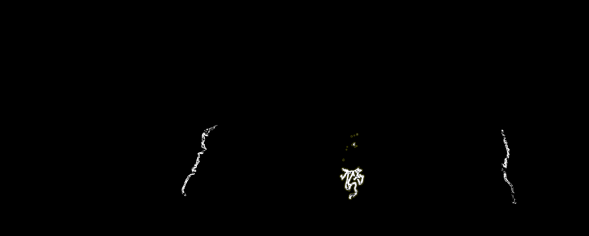

#  BIOIMAGING - INEB/i3S
Eduardo Conde-Sousa (econdesousa@gmail.com)

## particle analysis Choroid Plexus

 
 
### code version
1.0 
	
### last modification
11/08/2021

### Requirements
* imagej version 1.52a
* update sites:
	* ilastik

### Attribution:
If you use this macro please add in the acknowledgements of your papers and/or thesis (MSc and PhD) the reference to Bioimaging and the project PPBI-POCI-01-0145-FEDER-022122.
As a suggestion you may use the following sentence:
 * The authors acknowledge the support of the i3S Scientific Platform Bioimaging, member of the national infrastructure PPBI - Portuguese Platform of Bioimaging (PPBI-POCI-01-0145-FEDER-022122).


# initialize variables

```java


var width;
var height;
var voxelwidth;
var voxelheight;
var voxeldepth;
var unit;


```

# Reset all

```java
requires("1.52a");
close("*");
roiManager("reset");
resetNonImageWindows("ROI");


```

# open data and set up variables

```java
mainFileName=File.getNameWithoutExtension(inputfile);
inDir=File.getDirectory(inputfile);
outDir = inDir + File.separator;
File.setDefaultDir(inDir);

if (autoROIname){
	roiManager("Open", replace(inputfile,"_Cy5.tif","_ROI.zip"));
}else {
	roiname = File.openDialog("Choose ROI");
	roiManager("Open", roiname);
}
open(inputfile);
id=getImageID();
getDimensions(width, height, channels, slices, frames);
getVoxelSize(voxelwidth, voxelheight, voxeldepth, unit);
function resize(){
	if (unit == "cm") {
		unit="µm";
		voxelwidth = voxelwidth * pow(10, 4);
		voxelheight = voxelheight * pow(10, 4);
		voxeldepth = voxeldepth ;// these are single slice images. doesn't make sense change voxeldepth
	}
	setVoxelSize(voxelwidth, voxelheight, voxeldepth, unit);
}
selectImage(id);


```
<a href="image_1628870765916.png"></a>

# Clean up possible ROI mistakes

```java
run("Select None");
while (roiManager("count")>3){
	roiManager("select", 0);
	roiManager("delete");
}

```

# Rename ROIs

```java
roiManager("Select", 0);
roiManager("rename", "right");
roiManager("Select", 1);
roiManager("rename", "left");
roiManager("Select", 2);
roiManager("rename", "center");

```

# Run ilastik

```java
selectImage(id);
if (is2crop) cropImage();
function cropImage(){
	xm=0;ym=0;
	for (i = 0; i < roiManager("count")-1; i++) {
		roiManager("select", i);
		getSelectionCoordinates(xpoints, ypoints);
		Array.getStatistics(xpoints, xmin, xmax, mean, stdDev);
		if (xmax > xm) xm=xmax;
		Array.getStatistics(ypoints, ymin, ymax, mean, stdDev);	
		if (ymax > ym) ym=ymax;
	}
	if (1.1*xm >= width) {
		xm = width;
	}else {
		xm = floor(1.1*xm);
	}
	if (1.1*ym >= height) {
		hm = height;
	}else {
		ym = floor(1.1*ym);
	}
	
	makeRectangle(0, 0, xm, ym);
	run("Crop");
}

maskID = runIlastik("mask");
function runIlastik(outname) { // ilastikProject, voxelwidth, voxelheight, voxeldepth, unit are global vars defined at begining of the code
	orig=getTitle();
	run("Run Pixel Classification Prediction", "projectfilename=["+ilastikProject+"] inputimage=["+orig+"] pixelclassificationtype=Segmentation");
	rename(outname);
	setVoxelSize(voxelwidth, voxelheight, voxeldepth, unit);
	setThreshold(0, 1.5);
	run("Convert to Mask");
	if (is("Inverting LUT")) run("Invert LUT"); 
	maskID = getImageID();
	return maskID;
}

selectImage(maskID);
intersectROIsV2();//intersectROIs();
function intersectROIsV2(){	
	run("Select None");
	getStatistics(area, mean, min, max, std, histogram);
	if (max >=1) {
		setThreshold(1, 255);
		run("Create Selection");
	}else {
		makePoint(0, 0);
	}
	roiManager("add");
	roiManager("select", roiManager("count")-1);
	roiManager("rename", "mask");
	roiMaskID = roiManager("count")-1;
	
	
	getDimensions(width, height, channels, slices, frames);
	newImage("Untitled", "8-bit black", width, height, 1);
	idUntitled = getImageID();
	
	selectImage(idUntitled);
	for (i = 0; i < roiMaskID; i++) {
			roiManager("select", i);
			run("Set...", "value=255");
			run("Select None");
			roiManager("select", roiMaskID);
			getStatistics(area, mean, min, max, std, histogram);
			if (max > 0) {
				roiManager("select", newArray(i,roiMaskID));
				roiManager("AND");
				roiManager("Update");
			}else {
				roiManager("select", i);
				getSelectionBounds(xtmp, ytmp, widthtmp, heighttmp);
				makePoint(xtmp, ytmp);
				roiManager("update");
			}
			selectImage(idUntitled);
			run("Select All");
			run("Set...", "value=0");
	}
	roiManager("deselect");
	roiManager("select", roiMaskID);
	roiManager("delete");
	run("Select None");
	selectImage(idUntitled);close();

}
function intersectROIs() { 
	run("Select None");
	setThreshold(1, 255);
	run("Create Selection");
	roiManager("add");
	//out=getBoolean("continuar", "sim", "nao");if (!out) exit("error message");	
	roiManager("select", roiManager("count")-1);
	roiManager("rename", "mask");
	roiMaskID = roiManager("count")-1;
	for (i = 0; i < roiMaskID; i++) {
		roiManager("select", newArray(i,roiMaskID));
		roiManager("AND");
		roiManager("Update");
	}
	roiManager("deselect");
	roiManager("select", roiMaskID);
	roiManager("delete");
	run("Select None");
}	
enlargeROIs(nPx);
function enlargeROIs(nPx){
	nROIs=roiManager("count");
	for (i = 0; i < nROIs; i++) {
		roiManager("select", i);
		rName=Roi.getName;
		run("Enlarge...", "enlarge="+nPx+" pixel");
		roiManager("add");
		roiManager("select", roiManager("count")-1);
		roiManager("rename", rName+"_enlaged_by_"+nPx+"_px");
		roiManager("deselect");
	}
}

```
<a href="image_1628870946404.png"></a>
<a href="image_1628870984423.png"></a>

# Get Stats

```java
selectImage(id);
run("Set Measurements...", "area mean standard modal min centroid center perimeter bounding shape integrated median area_fraction display redirect=None decimal=9");
roiManager("Measure");

```
<table>
<tr><th>Label</th><th>Area</th><th>Mean</th><th>StdDev</th><th>Mode</th><th>Min</th><th>Max</th><th>X</th><th>Y</th><th>XM</th><th>YM</th><th>Perim.</th><th>BX</th><th>BY</th><th>Width</th><th>Height</th><th>Circ.</th><th>IntDen</th><th>Median</th><th>%Area</th><th>RawIntDen</th><th>AR</th><th>Round</th><th>Solidity</th></tr>
<tr><td>100_Cy5.tif:right</td><td>0.000192996</td><td>128.122147803</td><td>12.295191203</td><td>124</td><td>98</td><td>200</td><td>0.675565078</td><td>0.218380230</td><td>0.675529903</td><td>0.218085810</td><td>0.676060966</td><td>0.667554766</td><td>0.173327413</td><td>0.020574304</td><td>0.099023091</td><td>0.005306223</td><td>0.024727006</td><td>127</td><td>100</td><td>1128628.000000000</td><td>7.858256423</td><td>0.127254692</td><td>0.191020373</td></tr>
<tr><td>100_Cy5.tif:left</td><td>0.000261088</td><td>127.541998825</td><td>12.171277629</td><td>120</td><td>100</td><td>215</td><td>0.262825344</td><td>0.212471910</td><td>0.262699474</td><td>0.212742699</td><td>0.862111077</td><td>0.241267022</td><td>0.166962700</td><td>0.048549438</td><td>0.095174660</td><td>0.004414394</td><td>0.033299743</td><td>126</td><td>100</td><td>1519918.000000000</td><td>10.817907092</td><td>0.092439322</td><td>0.226236355</td></tr>
<tr><td>100_Cy5.tif:center</td><td>0.000418526</td><td>133.826310004</td><td>15.944677313</td><td>130</td><td>93</td><td>241</td><td>0.469935933</td><td>0.239084031</td><td>0.469919642</td><td>0.238956760</td><td>0.703872149</td><td>0.453374778</td><td>0.178804026</td><td>0.031971581</td><td>0.087181764</td><td>0.010615601</td><td>0.056009771</td><td>133</td><td>100</td><td>2556484.000000000</td><td>1.542457110</td><td>0.648316244</td><td>0.234581166</td></tr>
<tr><td>100_Cy5.tif:right_enlaged_by_5_px</td><td>0.000531225</td><td>121.946343878</td><td>11.648373953</td><td>110</td><td>98</td><td>245</td><td>0.676200733</td><td>0.222104961</td><td>0.676173834</td><td>0.221826290</td><td>0.299746385</td><td>0.666814683</td><td>0.172587330</td><td>0.022054470</td><td>0.100503256</td><td>0.074298609</td><td>0.064780980</td><td>120</td><td>100</td><td>2956833.000000000</td><td>8.044522393</td><td>0.124308188</td><td>0.452880583</td></tr>
<tr><td>100_Cy5.tif:left_enlaged_by_5_px</td><td>0.000621490</td><td>121.208023407</td><td>11.945759596</td><td>111</td><td>95</td><td>215</td><td>0.263934647</td><td>0.210387214</td><td>0.263829359</td><td>0.210600301</td><td>0.288721329</td><td>0.240526939</td><td>0.166222617</td><td>0.050029603</td><td>0.096654825</td><td>0.093688493</td><td>0.075329571</td><td>119</td><td>100</td><td>3438308.000000000</td><td>10.230042294</td><td>0.097751307</td><td>0.466938816</td></tr>
<tr><td>100_Cy5.tif:center_enlaged_by_5_px</td><td>0.000762474</td><td>124.548819033</td><td>17.183389038</td><td>110</td><td>85</td><td>304</td><td>0.469865625</td><td>0.237546737</td><td>0.469875546</td><td>0.237559383</td><td>0.360566632</td><td>0.452634695</td><td>0.178063943</td><td>0.033451747</td><td>0.088661930</td><td>0.073699360</td><td>0.094965210</td><td>120</td><td>100</td><td>4334548.000000000</td><td>2.080632497</td><td>0.480623080</td><td>0.393516398</td></tr>
</table>


# Edit results to remove single pixel ROIs

```java

selectWindow("Results");

str=Table.allHeadings;
str=split(str, "\t");


for (i = 0; i < nResults/2; i++) {
	val=getResult("Area", i);
	print(val);
	if (val < 0.00000001 ){
		for (j = 0; j < lengthOf(str); j++) {
			if (str[j]!="Label") {
				setResult(str[j],i,"0");
				setResult(str[j],i+3,"0");
			}
		}
	}
}


```
<pre>
> 0.000193
> 0.0002611
> 0.0004185
</pre>
<a href="image_1628870985758.png"></a>

# Save results and Close all

```java
selectWindow("Results");
saveAs("Results", outDir + mainFileName+"_"+"Results.csv");

roiManager("deselect");
roiManager("save", outDir + mainFileName+"_ROI_target_ChoroidPlexus.zip");

if (is2Close){
	resetNonImageWindows("");
	close("*");
}

```

# Auxiliary functions

```java

function getRoiIndex(name){
	for (i = 0; i < roiManager("count"); i++) {
		roiManager("select", i);
		if (name == Roi.getName){
			return i;
		}
	}
	i=-1;
	return i;
}


function resetNonImageWindows(except){
	if (except=="") except="ksajlasfofjncsdklnxz ,mzxkjcaosjcdç.dnxX´~ OUGIAD X";

	list = getList("window.titles");
	for (i = 0; i < lengthOf(list); i++) {
		if (indexOf(list[i], except)==-1) {
			selectWindow(list[i]);run("Close");
		}
	}
}
```


```
```
