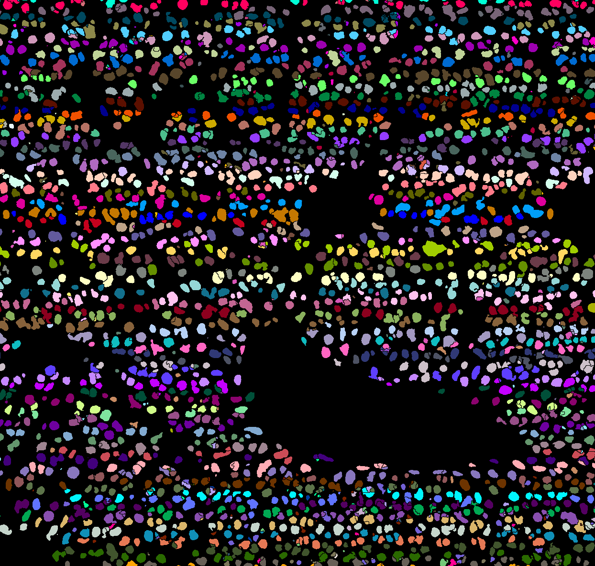
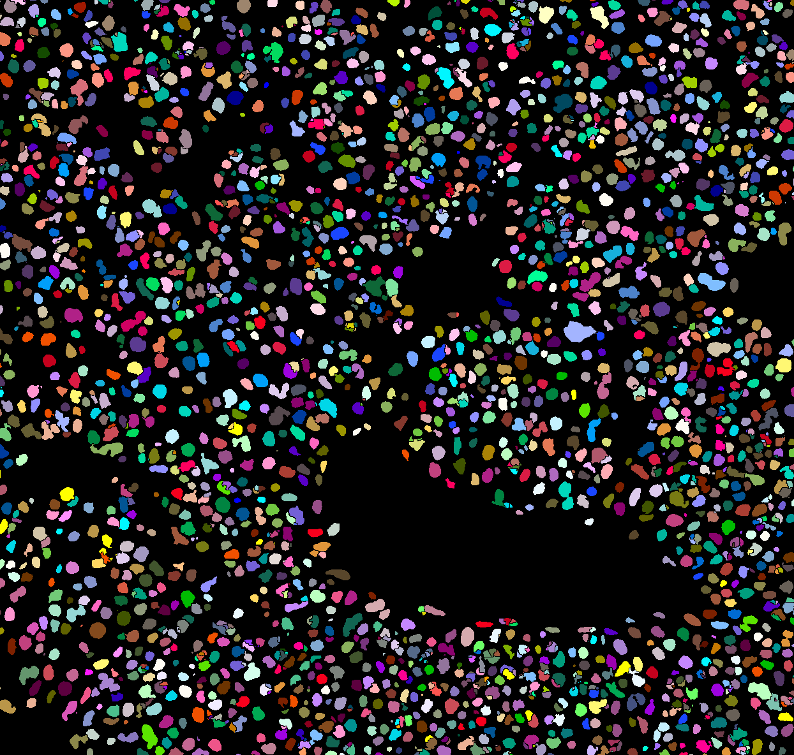

#  BIOIMAGING - INEB/i3S
Eduardo Conde-Sousa (econdesousa@gmail.com)

## Randomize Labels

If one labeled image has **too many labels**, "glasbey on dark" will not properly (visually) separate neighbours.
This macro randomizes labels so two neighbours have little chance of having close values.

* input
	* labeled image
* output
	* labeled image with labels randomized
 
### code version
0.1

### last modification
21/06/2021

### Attribution:
If you use this macro please add in the acknowledgements of your papers and/or thesis (MSc and PhD) the reference to Bioimaging and the project PPBI-POCI-01-0145-FEDER-022122.
As a suggestion you may use the following sentence:
 * The authors acknowledge the support of the i3S Scientific Platform Bioimaging, member of the national infrastructure PPBI - Portuguese Platform of Bioimaging (PPBI-POCI-01-0145-FEDER-022122).


### Code:

* Function Call

```java

randomizeLabels(false);

```
<a href="image_1624288333400.png"></a>
<a href="image_1624288334463.png"></a>

* Functions

```java
function randomizeLabels(is2Close){
	run("CLIJ2 Macro Extensions", "cl_device=[]");
	im1=getTitle();
	getVoxelSize(width, height, depth, unit);
	tmpid=getImageID();
	Ext.CLIJ2_push(im1);
	Ext.CLIJ2_getMaximumOfAllPixels(im1, MAX);
	vec2 = genArray(MAX);
	Ext.CLIJ2_pushArray(pointlist, vec2, lengthOf(vec2),1, 1);
	out = im1 + "_rand";
	Ext.CLIJ2_replaceIntensities(im1, pointlist, out);
	Ext.CLIJ2_pull(out);
	Ext.CLIJ2_release(im1);
	Ext.CLIJ2_release(pointlist);
	Ext.CLIJ2_release(out);
	if (is2Close) {
		selectImage(tmpid);close();
		rename(im1);
	}
	setVoxelSize(width, height, depth, unit);
	run("glasbey_on_dark");
}


function genArray(size){
	
	init=newArray(size);
	for (i = 0; i < size; i++) {
		init[i] = floor(random*100);
	}
	tmp = getIndexVec(init);
	for (i = 0; i < size; i++) {
		tmp[i] = tmp[i]+1;
	}
	out=Array.concat(newArray(1),tmp);
	return out;
}


function getIndexVec(inputArray){

	sortedValues = Array.copy(inputArray);
	Array.sort(sortedValues);
	rankPosArr = Array.rankPositions(inputArray);
	ranks = Array.rankPositions(rankPosArr);
	return ranks;
}

```


```
```
