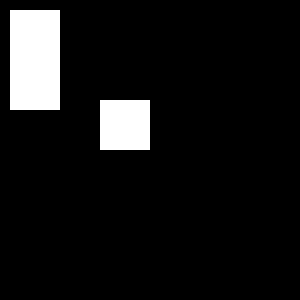
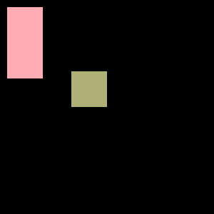
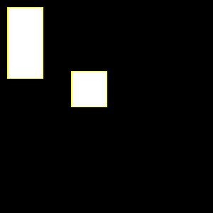

#  BIOIMAGING - INEB/i3S
Eduardo Conde-Sousa (econdesousa@gmail.com)

## Summary Table Vs Measure command

(considreing or not the size of the particles)

 
### code version
1

### last modification
30/07/2021

### Attribution:
If you use this macro please add in the acknowledgements of your papers and/or thesis (MSc and PhD) the reference to Bioimaging and the project PPBI-POCI-01-0145-FEDER-022122.
As a suggestion you may use the following sentence:
 * The authors acknowledge the support of the i3S Scientific Platform Bioimaging, member of the national infrastructure PPBI - Portuguese Platform of Bioimaging (PPBI-POCI-01-0145-FEDER-022122).


# Setup

```java


close("*");
roiManager("reset");


```

# Create a mask

* Create one image with two blobs
* the first has area 2500 and the second has area 5000 (twice the first)


```java
newImage("Untitled", "8-bit black", 300, 300, 1);
makeRectangle(100, 100, 50, 50);
run("Set...","value=255")
roiManager("add");
roiManager("select", 0);
roiManager("rename", "SquareArea5000");
makeRectangle(10, 10, 50, 100);
run("Set...","value=255")
roiManager("add");
roiManager("select", 1);
roiManager("rename", "RectangleArea2500");
run("Set...","value=255")
run("Select None");


```
<a href="image_1627656736011.png"></a>

# Create a demo "Intensity image" from the mask (called "label")

* Create a new image where the all pixels in first blob have intensity 1
* all pixels in the second blob have intensity 2

```java

run("Set Measurements...", "area mean integrated display redirect=None decimal=9");
run("Analyze Particles...", "  show=[Count Masks]");
rename("label");
setMinAndMax(0, 2);
run("glasbey_on_dark");


```
<a href="image_1627656736206.png"></a>
<a href="image_1627656736224.png"></a>

# Get the measurments

```java
run("Set Measurements...", "area mean integrated display redirect=label decimal=9");
selectWindow("Untitled");
run("Analyze Particles...", "  show=Nothing display clear summarize");


```
* Results table:


<table>
<tr><th>Label</th><th>Area</th><th>Mean</th><th>IntDen</th><th>RawIntDen</th></tr>
<tr><td>label</td><td>5000</td><td>1</td><td>5000</td><td>5000</td></tr>
<tr><td>label</td><td>2500</td><td>2</td><td>5000</td><td>5000</td></tr>
</table>

* Summary table:


<table>
<tr><th>Slice</th><th>Count</th><th>Total Area</th><th>Average Size</th><th>%Area</th><th>Mean</th><th>IntDen</th></tr>
<tr><td>Untitled</td><td>2</td><td>7500</td><td>3750</td><td>8.333333333</td><td>1.500000000</td><td>5000</td></tr>
</table>


# Get final measurements

* create a selection based on the mask and redirect that selection to the main image (the one called "label")
* measure there

```java
selectWindow("Untitled");
run("Create Selection");
selectWindow("label");
run("Restore Selection");
run("Measure");
```

* Results table (with one new line resulting from the `run("Measure");` command):


<a href="image_1627656737734.png"></a>
<table>
<tr><th>Label</th><th>Area</th><th>Mean</th><th>IntDen</th><th>RawIntDen</th></tr>
<tr><td>label</td><td>5000</td><td>1.000000000</td><td>5000</td><td>5000</td></tr>
<tr><td>label</td><td>2500</td><td>2.000000000</td><td>5000</td><td>5000</td></tr>
<tr><td>label</td><td>7500</td><td>1.333333333</td><td>10000</td><td>10000</td></tr>
</table>


```
```
