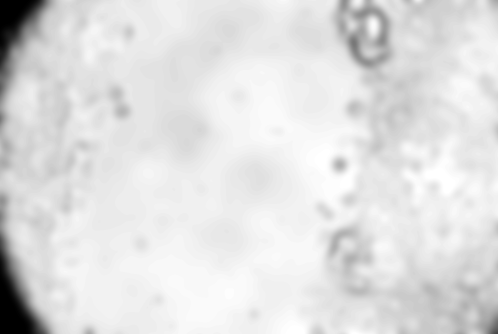
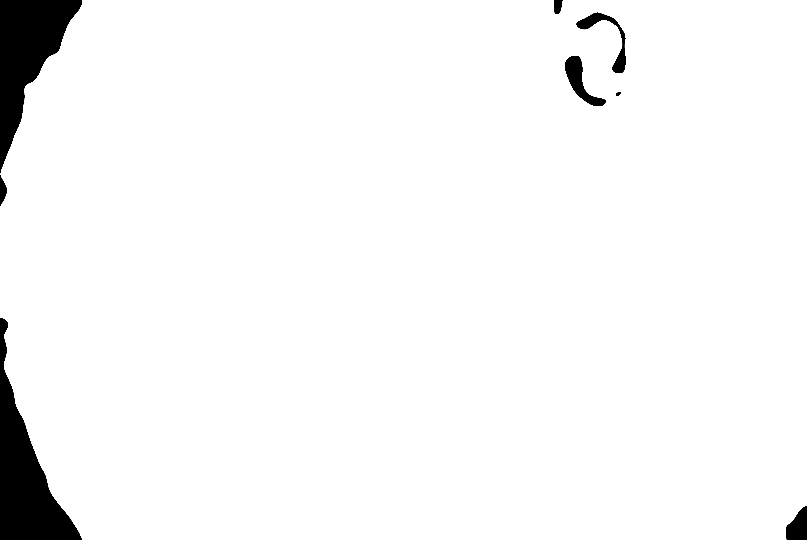
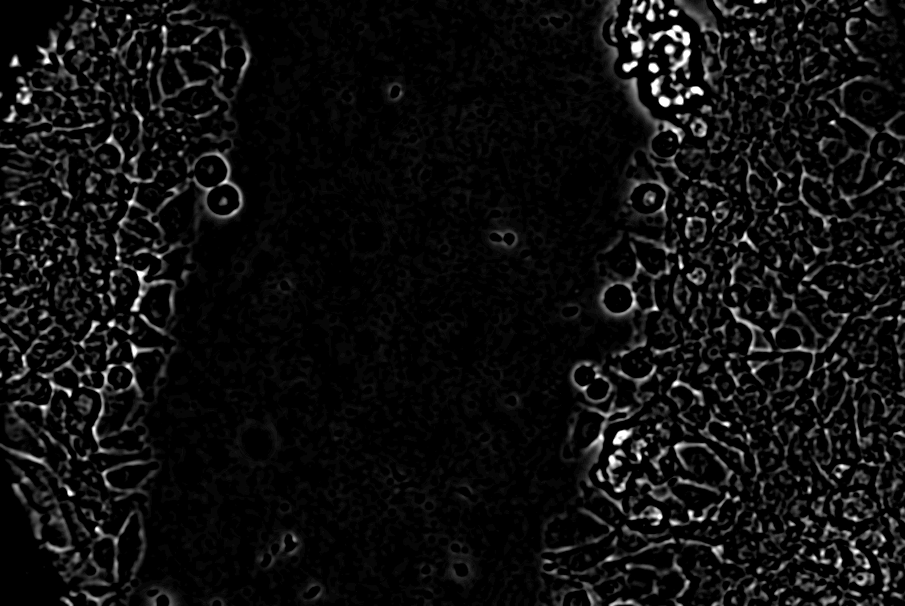
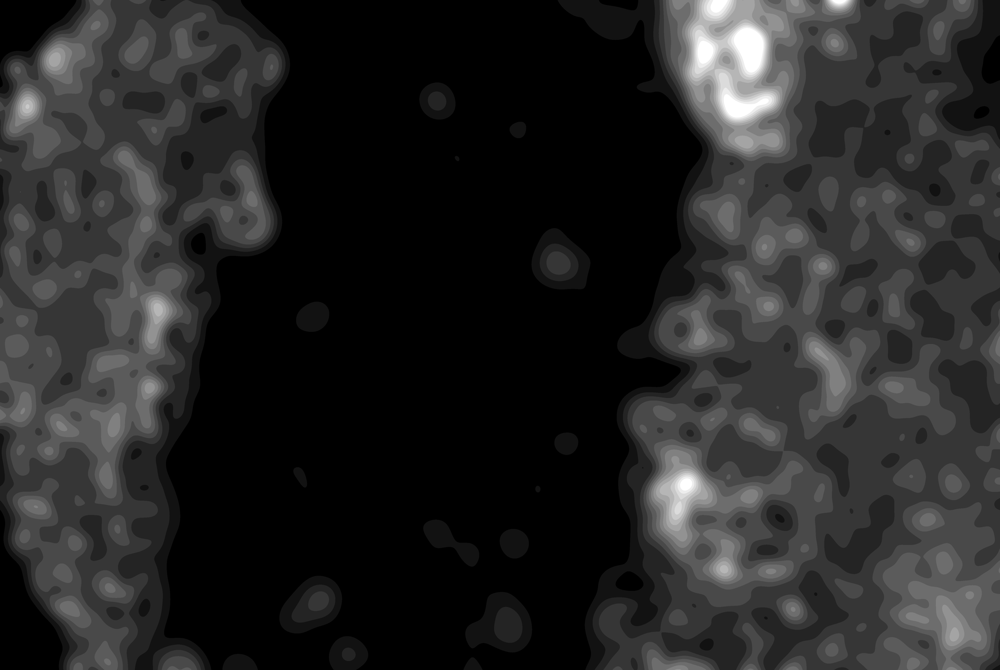
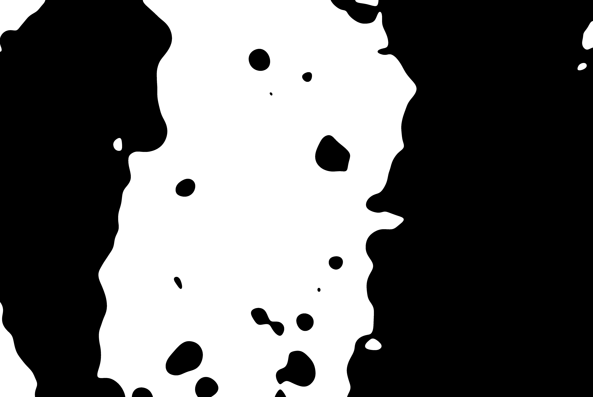
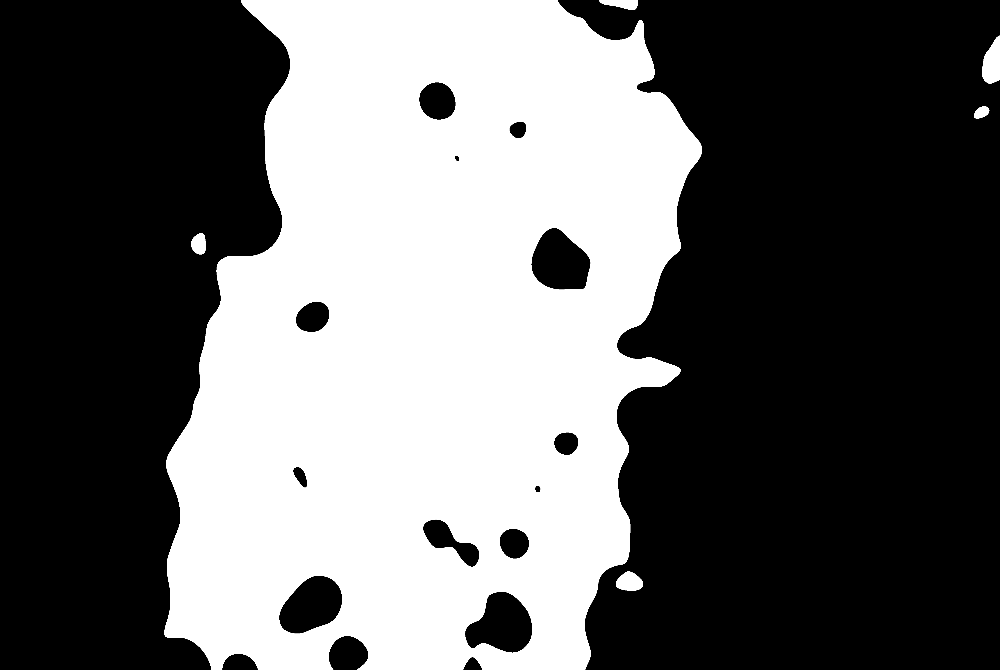
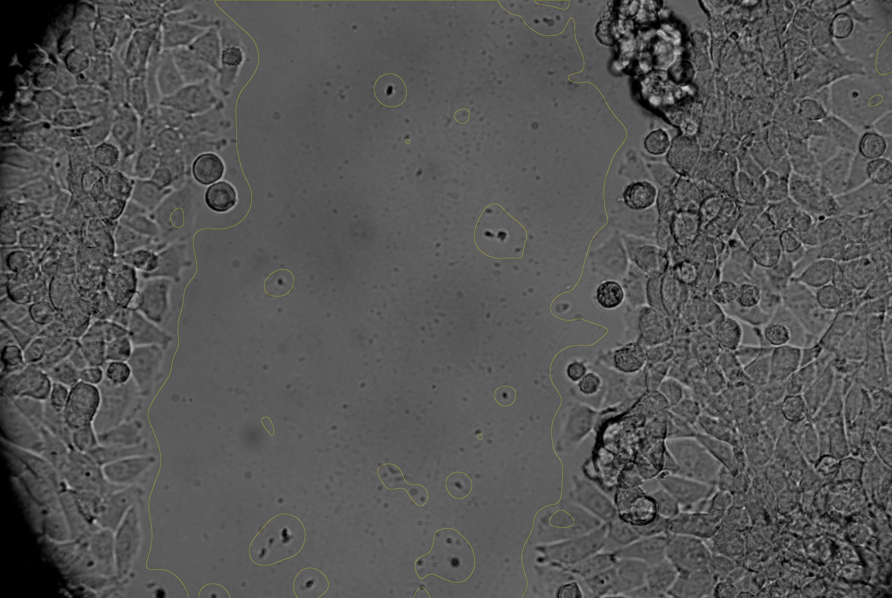

#  BIOIMAGING - INEB/i3S
Eduardo Conde-Sousa (econdesousa@gmail.com)

****************************************************
## Wound Healing
****************************************************

Wound Healing script.
It is prepared to work on a ztack. 
If image is a time lapse, please re-order hyperstack first.
Requirements: CLIJ2 

### code version
4

### last modification
28/04/2021 at 11:02:42 (GMT)

### Attribution:
If you use this macro please add in the acknowledgements of your papers and/or thesis (MSc and PhD) the reference to Bioimaging and the project PPBI-POCI-01-0145-FEDER-022122.
As a suggestion you may use the following sentence:
 * The authors acknowledge the support of the i3S Scientific Platform Bioimaging, member of the national infrastructure PPBI - Portuguese Platform of Bioimaging (PPBI-POCI-01-0145-FEDER-022122).


```java

```

# Setup

```java
run("CLIJ2 Macro Extensions", "cl_device=[]");
roiManager("reset");
mainID=getImageID();
id=getImageID();


```

# Main loop

```java
for (ct = 0; ct < nSlices; ct++) {
	run("Select None");
	setSlice(ct+1);
	close("\\Others");
	run("Duplicate...", "use");
	wait(100);
	proc1image(true,id);
	roiManager("add");
	run("Collect Garbage");
}


```
<a href="image_1619605319952.png"></a>
<a href="image_1619605333530.png"></a>
<a href="image_1619605335874.png"></a>
<a href="image_1619605336811.png"></a>
<a href="image_1619605343046.png"></a>
<a href="image_1619605344686.png"></a>
<a href="image_1619605345655.png"></a>
<a href="image_1619605345692.png"></a>


# Main Function

```java


//is2pull=true;id=getImageID();run("CLIJ2 Macro Extensions", "cl_device=[]");proc1image(is2pull,id);
function proc1image(is2pull,id){
	
	Ext.CLIJ2_clear();
	image1 = getTitle();
	inDir = getDirectory("image");
	output=image1 + "_mask";
	
	Ext.CLIJ2_pushCurrentZStack(image1);
	
	// Gaussian Blur2D
	sigma_x = 50.0;
	sigma_y = 50.0;
	Ext.CLIJ2_gaussianBlur2D(image1, image4, sigma_x, sigma_y);
	
	if (is2pull) Ext.CLIJ2_pull(image4);
	
	// Automatic Threshold
	method = "Default";
	Ext.CLIJ2_automaticThreshold(image4, image5, method);
	Ext.CLIJ2_release(image4);
	
	if (is2pull) Ext.CLIJ2_pull(image5);
	
	// Difference Of Gaussian2D
	sigma1x = 10.0;
	sigma1y = 10.0;
	sigma2x = 50.0;
	sigma2y = 50.0;
	Ext.CLIJ2_differenceOfGaussian2D(image1, image6, sigma1x, sigma1y, sigma2x, sigma2y);
	Ext.CLIJ2_release(image4);
	
	if (is2pull) Ext.CLIJ2_pull(image6);
	
	// Gaussian Blur2D
	sigma_x = 50.0;
	sigma_y = 50.0;
	Ext.CLIJ2_gaussianBlur2D(image6, image7, sigma_x, sigma_y);
	Ext.CLIJ2_release(image6);
	
	if (is2pull) Ext.CLIJ2_pull(image7);
	
	// Smaller Or Equal Constant
	constant = 0.0;
	Ext.CLIJ2_smallerOrEqualConstant(image7, image8, constant);
	Ext.CLIJ2_release(image7);
	
	if (is2pull) Ext.CLIJ2_pull(image8);
	
	// Multiply Images
	Ext.CLIJ2_multiplyImages(image8, image5, output);
	Ext.CLIJ2_release(image8);
	Ext.CLIJ2_release(image5);
	
	if (is2pull) Ext.CLIJ2_pull(output);
	Ext.CLIJ2_getMaximumOfAllPixels(output, MAX);
	selectImage(id);
	if (MAX > 0){
		Ext.CLIJ2_pullAsROI(output);
	}else{
		makeOval(floor(getWidth()), floor(getHeight()), 1,1);
	}
	Ext.CLIJ2_release(output);
	Ext.CLIJ2_clear();
}
```


```
```
