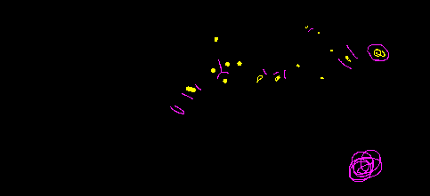
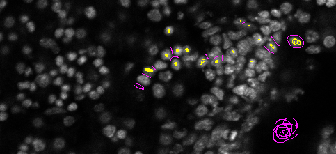

#  BIOIMAGING - INEB/i3S
Eduardo Conde-Sousa (econdesousa@gmail.com)

## addImageOverlay2IntesityImage
 
### code version
0.1

### last modification
18/04/2021 at 19:23 (GMT)

### Attribution:
If you use this macro please add in the acknowledgements of your papers and/or thesis (MSc and PhD) the reference to Bioimaging and the project PPBI-POCI-01-0145-FEDER-022122.
As a suggestion you may use the following sentence:
 * The authors acknowledge the support of the i3S Scientific Platform Bioimaging, member of the national infrastructure PPBI - Portuguese Platform of Bioimaging (PPBI-POCI-01-0145-FEDER-022122).


```java

addImageOverlay2IntesityImage();

function addImageOverlay2IntesityImage(){
	waitForUser("select \"intensity\" image and press ok");
	mainID=getImageID();
	print("\\Clear");
	print("Intensity image: "+getTitle());
	waitForUser("select \"labeled\" image and press ok");
	labelsID=getImageID();
	labels=getTitle();
	print("labeled image: "+labels);
	
	for (i = 0; i < nSlices; i++) {
		selectImage(labelsID);
		setSlice(i+1);
		selectImage(mainID);
		setSlice(i+1);
		run("Add Image...", "image="+labels+" x=0 y=0 opacity=80 zero");
	}
}
```
<pre>
> Intensity image: main
> labeled image: labels
</pre>
<a href="image_1618770371696.png"></a>
<a href="image_1618770372113.png"></a>


```
```
