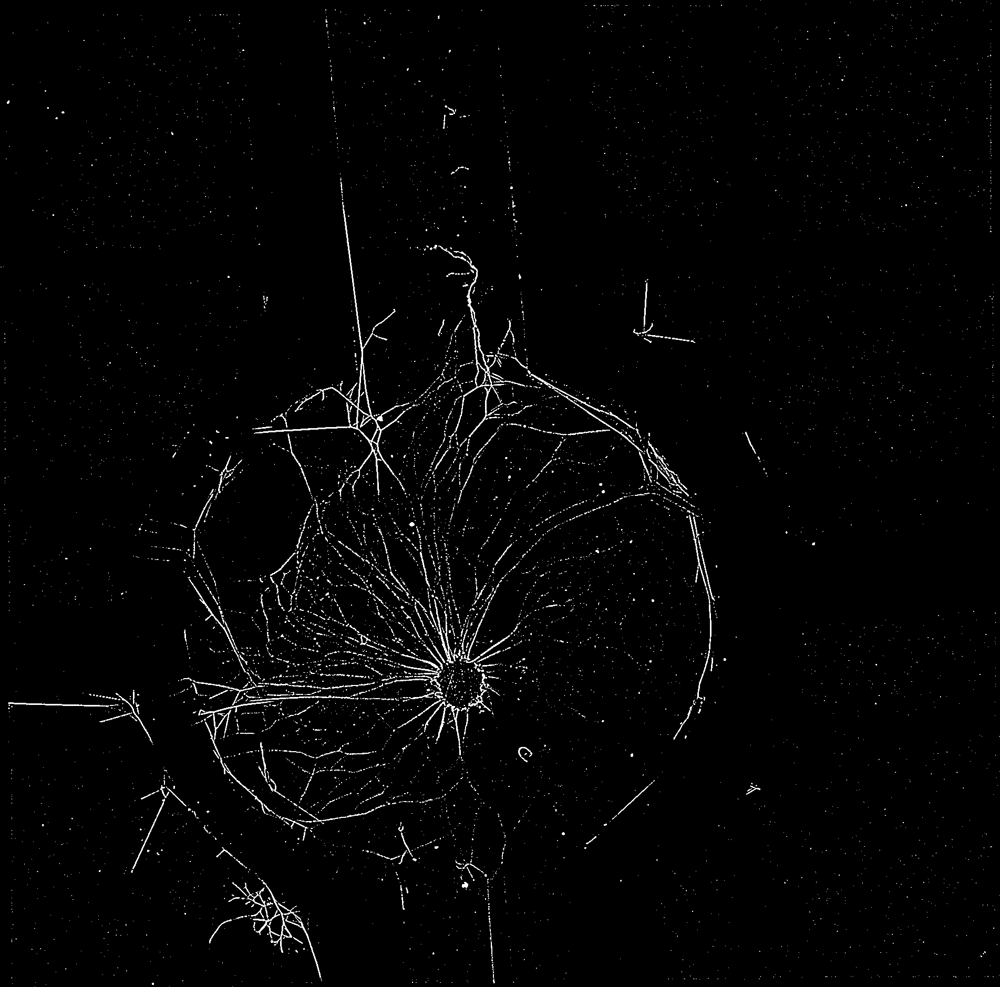
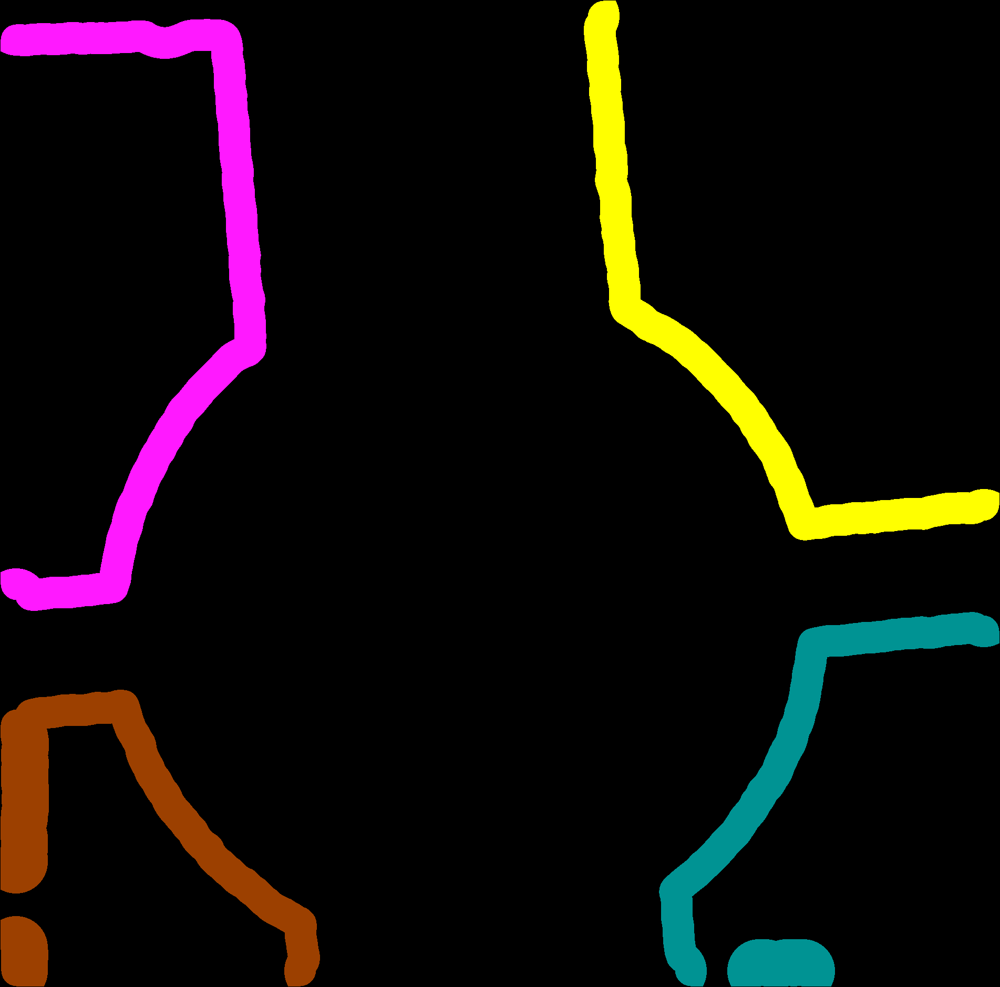

#  BIOIMAGING - INEB/i3S
Eduardo Conde-Sousa (econdesousa@gmail.com)

## neurite outgrowth 2D

 
### code version
1.1.0 
	Log
		updated to 2D
		changed to semi-automatic to increase reliability

### last modification
20/07/2021

### Attribution:
If you use this macro please add in the acknowledgements of your papers and/or thesis (MSc and PhD) the reference to Bioimaging and the project PPBI-POCI-01-0145-FEDER-022122.
As a suggestion you may use the following sentence:
 * The authors acknowledge the support of the i3S Scientific Platform Bioimaging, member of the national infrastructure PPBI - Portuguese Platform of Bioimaging (PPBI-POCI-01-0145-FEDER-022122).


```java


```

# Setup

```java
if (tmpImagesFlag) {
	tmpDir = getDirectory("Directory to save temporary images");
}else {
	tmpDir = "";
}


var xpoints = newArray;
var ypoints = newArray;
var mainWidth = 0;
var mainHeight = 0 ; 
var mainDepth = 0; 
var mainUnit = "";

requires("1.53f");

close("*");
resetNonImageWindows();
roiManager("reset");

seriesList = getLifSeriesNames(inputfile);
if (series <= -1) {
	outArray = arrayFilterUpdate(seriesList,keyword);
	outindex = getSeriesIndex(seriesList,outArray);
	series = outindex[0];
}
seriesName = seriesList[series-1];

```

# load data

```java
setBatchMode(true);
run("Bio-Formats Importer", "open=["+inputfile+"] autoscale color_mode=Colorized rois_import=[ROI manager] view=Hyperstack stack_order=XYCZT series_"+series);
mainName = File.getNameWithoutExtension(inputfile);
inDir = File.getDirectory(inputfile);

outputDir = inDir + "results" + File.separator;
if (!File.exists(outputDir)) File.makeDirectory(outputDir);
outputDir = outputDir + mainName + "_series_"+series + "_" + seriesName + File.separator;
if (!File.exists(outputDir)) File.makeDirectory(outputDir);


run("Z Project...", "projection=[Max Intensity]");
run("Duplicate...", "title=signal duplicate channels="+sChannel);
setBatchMode(false);
getVoxelSize(mainWidth, mainHeight, mainDepth, mainUnit);

```
<a href="image_1626890293444.png"></a>

# get ROIs

```java
run("Duplicate...", "title=tmp duplicate channels="+sChannel);
run("Subtract Background...", "rolling=100 create");

setMinAndMax(0,nGreyLevels);
run("Apply LUT");
run("Threshold...");
waitForUser("select threshold, press apply, and press ok");

selectWindow("Threshold");run("Close");

id = getImageID();
run("Morphological Filters", "operation=Closing element=Disk radius=30");
idMLJ = getImageID();
selectImage(id);close();
run("Fill Holes");
getDimensions(width, height, channels, slices, frames);
makeRectangle(shrink, shrink, width-(2*shrink), height-(2*shrink));
run("Make Inverse");
run("Set...", "value=0");
run("Select None");

run("Set Measurements...", "area redirect=None decimal=9");
run("Analyze Particles...", "size=10000-Infinity show=[Count Masks]");
idLabel=getImageID();

selectImage(idMLJ);close();
run("glasbey_on_dark");
idAllLabels = getImageID();

getLabelSelections();
print("please wait");
print("this step may take a while...");
setBatchMode(true);
run("Duplicate...", "title=Count-keepLabels duplicate");
for (i = 0; i < lengthOf(xpoints); i++) {
	val = getValue(xpoints[i],ypoints[i]);
	run("Replace/Remove Label(s)", "label(s)="+val+" final=0");	
}


run("Duplicate...", "title=centralAreaOFF duplicate");
makeRectangle(shrink, shrink, width-(2*shrink), height-(2*shrink));
run("Make Inverse");
run("Set...", "value=2");
run("Select None");

setThreshold(0, 0.1);
run("Create Selection");
roiManager("add");

selectWindow("Count-keepLabels");
run("Dilate Labels", "radius="+shrink);
roiManager("Select", 0);
run("Set...", "value=0");
run("Select None");
run("Fill Holes (Binary/Gray)");
run("Morphological Filters", "operation=Opening element=Disk radius="+shrink);
run("Remap Labels");
run("glasbey_on_dark");
setBatchMode(false);
selectWindow("Log");run("Close");

rename("ROI");
idROI = getImageID();
selectImage(idAllLabels);close();


run("Tile");

```
<a href="image_1626890324462.png"></a>

# Distance Soma - ROIs

```java
getSpotCenter("signal");
globalUnits();
if ( distanceType == "Center-Center"){
	run("3D Distances", "image_a=Soma image_b=ROI compute=All closest=Center center");
}else{
	run("3D Distances", "image_a=Soma image_b=ROI compute=All closest=Border(slow) border");
}
selectWindow("Soma");close();
run("Tile");

if ( distanceType == "Center-Center"){
	selectWindow("Distances_Center_Statistics");run("Close");
	selectWindow("Distances_Center");
	saveAs("Results", outputDir + File.separator + "distances_Center.csv");
}else{
	selectWindow("Distances_Border_Statistics");run("Close");
	selectWindow("Distances_Border");
	saveAs("Results", outputDir + File.separator + "distances_Border.csv");
}
wait(1000);
IJ.renameResults("tmpResults");
selectWindow("tmpResults");run("Close");
selectWindow("Log");run("Close");


```

# Segment Neurites

```java
getNeuriteSegmentation("signal");
globalUnits();
run("Tile");

```
<a href="image_1626890336447.png"></a>

# Cumulative Measurements

```java
image1 = "signal_DoG_Thresh";
image2 = "tmp";
quantifications(image1,image2,stepSize,nSteps,tmpDir);
saveAs("Results", outputDir + File.separator + "cumulativeMeasurements.csv");

```
<a href="image_1626890347838.png"></a>
<table>
<tr><th>id</th><th>Mean</th><th>NumberOfNeuritePixels</th><th>nVoxels</th></tr>
<tr><td>1</td><td>0.026286966</td><td>120.000000000</td><td>4565</td></tr>
<tr><td>2</td><td>0.019732078</td><td>109.000000000</td><td>5524</td></tr>
<tr><td>3</td><td>0.002180431</td><td>8.000000000</td><td>3669</td></tr>
<tr><td>4</td><td>0.020661157</td><td>95.000000000</td><td>4598</td></tr>
<tr><td>1</td><td>0.024473292</td><td>230.000000000</td><td>9398</td></tr>
<tr><td>2</td><td>0.013368747</td><td>151.000000000</td><td>11295</td></tr>
<tr><td>3</td><td>0.005741877</td><td>44.000000000</td><td>7663</td></tr>
<tr><td>4</td><td>0.046725967</td><td>436.000000000</td><td>9331</td></tr>
<tr><td>1</td><td>0.018422363</td><td>259.000000000</td><td>14059</td></tr>
<tr><td>2</td><td>0.010990959</td><td>186.000000000</td><td>16923</td></tr>
<tr><td>3</td><td>0.007313715</td><td>85.000000000</td><td>11622</td></tr>
<tr><td>4</td><td>0.060818465</td><td>859.000000000</td><td>14124</td></tr>
<tr><td>1</td><td>0.015376286</td><td>284.000000000</td><td>18470</td></tr>
<tr><td>2</td><td>0.008855127</td><td>197.000000000</td><td>22247</td></tr>
<tr><td>3</td><td>0.007432301</td><td>115.000000000</td><td>15473</td></tr>
<tr><td>4</td><td>0.057706627</td><td>1085.000000000</td><td>18802</td></tr>
<tr><td>1</td><td>0.014480150</td><td>333.000000000</td><td>22997</td></tr>
<tr><td>2</td><td>0.007478864</td><td>207.000000000</td><td>27678</td></tr>
<tr><td>3</td><td>0.007572657</td><td>148.000000000</td><td>19544</td></tr>
<tr><td>4</td><td>0.057128455</td><td>1360.000000000</td><td>23806</td></tr>
<tr><td>1</td><td>0.013926374</td><td>387.000000000</td><td>27789</td></tr>
<tr><td>2</td><td>0.006652483</td><td>222.000000000</td><td>33371</td></tr>
<tr><td>3</td><td>0.006880160</td><td>165.000000000</td><td>23982</td></tr>
<tr><td>4</td><td>0.057433126</td><td>1679.000000000</td><td>29234</td></tr>
<tr><td>1</td><td>0.013182325</td><td>426.000000000</td><td>32316</td></tr>
<tr><td>2</td><td>0.006034505</td><td>234.000000000</td><td>38777</td></tr>
<tr><td>3</td><td>0.006372133</td><td>180.000000000</td><td>28248</td></tr>
<tr><td>4</td><td>0.057953788</td><td>1999.000000000</td><td>34493</td></tr>
<tr><td>1</td><td>0.012617697</td><td>465.000000000</td><td>36853</td></tr>
<tr><td>2</td><td>0.005367334</td><td>237.000000000</td><td>44156</td></tr>
<tr><td>3</td><td>0.005997601</td><td>195.000000000</td><td>32513</td></tr>
<tr><td>4</td><td>0.055815239</td><td>2221.000000000</td><td>39792</td></tr>
<tr><td>1</td><td>0.012107764</td><td>502.000000000</td><td>41461</td></tr>
<tr><td>2</td><td>0.004934641</td><td>245.000000000</td><td>49649</td></tr>
<tr><td>3</td><td>0.005772827</td><td>213.000000000</td><td>36897</td></tr>
<tr><td>4</td><td>0.054564742</td><td>2469.000000000</td><td>45249</td></tr>
<tr><td>1</td><td>0.011884881</td><td>548.000000000</td><td>46109</td></tr>
<tr><td>2</td><td>0.004535806</td><td>250.000000000</td><td>55117</td></tr>
<tr><td>3</td><td>0.005426225</td><td>224.000000000</td><td>41281</td></tr>
<tr><td>4</td><td>0.053644513</td><td>2687.000000000</td><td>50089</td></tr>
<tr><td>1</td><td>0.011803551</td><td>597.000000000</td><td>50578</td></tr>
<tr><td>2</td><td>0.004371729</td><td>264.000000000</td><td>60388</td></tr>
<tr><td>3</td><td>0.005071777</td><td>230.000000000</td><td>45349</td></tr>
<tr><td>4</td><td>0.052656774</td><td>2860.000000000</td><td>54314</td></tr>
<tr><td>1</td><td>0.011717406</td><td>647.000000000</td><td>55217</td></tr>
<tr><td>2</td><td>0.004220947</td><td>278.000000000</td><td>65862</td></tr>
<tr><td>3</td><td>0.004784013</td><td>237.000000000</td><td>49540</td></tr>
<tr><td>4</td><td>0.051263673</td><td>3004.000000000</td><td>58599</td></tr>
<tr><td>1</td><td>0.011372772</td><td>679.000000000</td><td>59704</td></tr>
<tr><td>2</td><td>0.004020355</td><td>286.000000000</td><td>71138</td></tr>
<tr><td>3</td><td>0.004776119</td><td>256.000000000</td><td>53600</td></tr>
<tr><td>4</td><td>0.050991772</td><td>3198.000000000</td><td>62716</td></tr>
<tr><td>1</td><td>0.011135130</td><td>716.000000000</td><td>64301</td></tr>
<tr><td>2</td><td>0.003882911</td><td>297.000000000</td><td>76489</td></tr>
<tr><td>3</td><td>0.004674192</td><td>270.000000000</td><td>57764</td></tr>
<tr><td>4</td><td>0.050531319</td><td>3381.000000000</td><td>66909</td></tr>
<tr><td>1</td><td>0.010879209</td><td>748.000000000</td><td>68755</td></tr>
<tr><td>2</td><td>0.003721796</td><td>304.000000000</td><td>81681</td></tr>
<tr><td>3</td><td>0.004705160</td><td>291.000000000</td><td>61847</td></tr>
<tr><td>4</td><td>0.050064112</td><td>3553.000000000</td><td>70969</td></tr>
<tr><td>1</td><td>0.010709358</td><td>784.000000000</td><td>73207</td></tr>
<tr><td>2</td><td>0.003636782</td><td>316.000000000</td><td>86890</td></tr>
<tr><td>3</td><td>0.004624926</td><td>305.000000000</td><td>65947</td></tr>
<tr><td>4</td><td>0.048715146</td><td>3655.000000000</td><td>75028</td></tr>
<tr><td>1</td><td>0.010358894</td><td>805.000000000</td><td>77711</td></tr>
<tr><td>2</td><td>0.003505573</td><td>323.000000000</td><td>92139</td></tr>
<tr><td>3</td><td>0.004421497</td><td>310.000000000</td><td>70112</td></tr>
<tr><td>4</td><td>0.047977054</td><td>3797.000000000</td><td>79142</td></tr>
<tr><td>1</td><td>0.010002312</td><td>822.000000000</td><td>82181</td></tr>
<tr><td>2</td><td>0.003381469</td><td>329.000000000</td><td>97295</td></tr>
<tr><td>3</td><td>0.004281906</td><td>318.000000000</td><td>74266</td></tr>
<tr><td>4</td><td>0.047896565</td><td>3986.000000000</td><td>83221</td></tr>
<tr><td>1</td><td>0.009687774</td><td>839.000000000</td><td>86604</td></tr>
<tr><td>2</td><td>0.003349380</td><td>343.000000000</td><td>102407</td></tr>
<tr><td>3</td><td>0.004105781</td><td>322.000000000</td><td>78426</td></tr>
<tr><td>4</td><td>0.047269894</td><td>4126.000000000</td><td>87286</td></tr>
<tr><td>1</td><td>0.009495132</td><td>864.000000000</td><td>90994</td></tr>
<tr><td>2</td><td>0.003312706</td><td>356.000000000</td><td>107465</td></tr>
<tr><td>3</td><td>0.004045347</td><td>334.000000000</td><td>82564</td></tr>
<tr><td>4</td><td>0.046382494</td><td>4235.000000000</td><td>91306</td></tr>
</table>


#  Step Measurements

```java
idCol = "id";
targetCol = "nVoxels";
targetCol2= "NumberOfNeuritePixels";
tableName="Results";
nVoxels = getFreqs(tableName,idCol,targetCol);
NumberOfNeuritePixels = getFreqs(tableName,idCol,targetCol2);

selectWindow(tableName);
ID = Table.getColumn(idCol);
Array.sort(ID);
ratio=newArray(lengthOf(ID));
for (i = 0; i < lengthOf(NumberOfNeuritePixels); i++) {
	ratio[i]= NumberOfNeuritePixels[i] / nVoxels[i];
}
Array.show("outFunction", ID,NumberOfNeuritePixels,nVoxels,ratio);
saveAs("Results", outputDir + File.separator + "stepMeasurements.csv");


```
<table>
<tr><th>ID</th><th>NumberOfNeuritePixels</th><th>nVoxels</th><th>ratio</th></tr>
<tr><td>1</td><td>120.000000000</td><td>4565</td><td>0.026286966</td></tr>
<tr><td>1</td><td>110.000000000</td><td>4833</td><td>0.022760190</td></tr>
<tr><td>1</td><td>29.000000000</td><td>4661</td><td>0.006221841</td></tr>
<tr><td>1</td><td>25.000000000</td><td>4411</td><td>0.005667649</td></tr>
<tr><td>1</td><td>49.000000000</td><td>4527</td><td>0.010823945</td></tr>
<tr><td>1</td><td>54.000000000</td><td>4792</td><td>0.011268781</td></tr>
<tr><td>1</td><td>39.000000000</td><td>4527</td><td>0.008614977</td></tr>
<tr><td>1</td><td>39.000000000</td><td>4537</td><td>0.008595989</td></tr>
<tr><td>1</td><td>37.000000000</td><td>4608</td><td>0.008029514</td></tr>
<tr><td>1</td><td>46.000000000</td><td>4648</td><td>0.009896730</td></tr>
<tr><td>1</td><td>49.000000000</td><td>4469</td><td>0.010964422</td></tr>
<tr><td>1</td><td>50.000000000</td><td>4639</td><td>0.010778185</td></tr>
<tr><td>1</td><td>32.000000000</td><td>4487</td><td>0.007131714</td></tr>
<tr><td>1</td><td>37.000000000</td><td>4597</td><td>0.008048727</td></tr>
<tr><td>1</td><td>32.000000000</td><td>4454</td><td>0.007184553</td></tr>
<tr><td>1</td><td>36.000000000</td><td>4452</td><td>0.008086253</td></tr>
<tr><td>1</td><td>21.000000000</td><td>4504</td><td>0.004662522</td></tr>
<tr><td>1</td><td>17.000000000</td><td>4470</td><td>0.003803132</td></tr>
<tr><td>1</td><td>17.000000000</td><td>4423</td><td>0.003843545</td></tr>
<tr><td>1</td><td>25.000000000</td><td>4390</td><td>0.005694761</td></tr>
<tr><td>2</td><td>109.000000000</td><td>5524</td><td>0.019732078</td></tr>
<tr><td>2</td><td>42.000000000</td><td>5771</td><td>0.007277768</td></tr>
<tr><td>2</td><td>35.000000000</td><td>5628</td><td>0.006218905</td></tr>
<tr><td>2</td><td>11.000000000</td><td>5324</td><td>0.002066116</td></tr>
<tr><td>2</td><td>10.000000000</td><td>5431</td><td>0.001841282</td></tr>
<tr><td>2</td><td>15.000000000</td><td>5693</td><td>0.002634815</td></tr>
<tr><td>2</td><td>12.000000000</td><td>5406</td><td>0.002219756</td></tr>
<tr><td>2</td><td>3.000000000</td><td>5379</td><td>0.000557724</td></tr>
<tr><td>2</td><td>8.000000000</td><td>5493</td><td>0.001456399</td></tr>
<tr><td>2</td><td>5.000000000</td><td>5468</td><td>0.000914411</td></tr>
<tr><td>2</td><td>14.000000000</td><td>5271</td><td>0.002656042</td></tr>
<tr><td>2</td><td>14.000000000</td><td>5474</td><td>0.002557545</td></tr>
<tr><td>2</td><td>8.000000000</td><td>5276</td><td>0.001516300</td></tr>
<tr><td>2</td><td>11.000000000</td><td>5351</td><td>0.002055691</td></tr>
<tr><td>2</td><td>7.000000000</td><td>5192</td><td>0.001348228</td></tr>
<tr><td>2</td><td>12.000000000</td><td>5209</td><td>0.002303705</td></tr>
<tr><td>2</td><td>7.000000000</td><td>5249</td><td>0.001333587</td></tr>
<tr><td>2</td><td>6.000000000</td><td>5156</td><td>0.001163693</td></tr>
<tr><td>2</td><td>14.000000000</td><td>5112</td><td>0.002738654</td></tr>
<tr><td>2</td><td>13.000000000</td><td>5058</td><td>0.002570186</td></tr>
<tr><td>3</td><td>8.000000000</td><td>3669</td><td>0.002180431</td></tr>
<tr><td>3</td><td>36.000000000</td><td>3994</td><td>0.009013520</td></tr>
<tr><td>3</td><td>41.000000000</td><td>3959</td><td>0.010356151</td></tr>
<tr><td>3</td><td>30.000000000</td><td>3851</td><td>0.007790184</td></tr>
<tr><td>3</td><td>33.000000000</td><td>4071</td><td>0.008106116</td></tr>
<tr><td>3</td><td>17.000000000</td><td>4438</td><td>0.003830554</td></tr>
<tr><td>3</td><td>15.000000000</td><td>4266</td><td>0.003516174</td></tr>
<tr><td>3</td><td>15.000000000</td><td>4265</td><td>0.003516999</td></tr>
<tr><td>3</td><td>18.000000000</td><td>4384</td><td>0.004105839</td></tr>
<tr><td>3</td><td>11.000000000</td><td>4384</td><td>0.002509124</td></tr>
<tr><td>3</td><td>6.000000000</td><td>4068</td><td>0.001474926</td></tr>
<tr><td>3</td><td>7.000000000</td><td>4191</td><td>0.001670246</td></tr>
<tr><td>3</td><td>19.000000000</td><td>4060</td><td>0.004679803</td></tr>
<tr><td>3</td><td>14.000000000</td><td>4164</td><td>0.003362152</td></tr>
<tr><td>3</td><td>21.000000000</td><td>4083</td><td>0.005143277</td></tr>
<tr><td>3</td><td>14.000000000</td><td>4100</td><td>0.003414634</td></tr>
<tr><td>3</td><td>5.000000000</td><td>4165</td><td>0.001200480</td></tr>
<tr><td>3</td><td>8.000000000</td><td>4154</td><td>0.001925855</td></tr>
<tr><td>3</td><td>4.000000000</td><td>4160</td><td>0.000961538</td></tr>
<tr><td>3</td><td>12.000000000</td><td>4138</td><td>0.002899952</td></tr>
<tr><td>4</td><td>95.000000000</td><td>4598</td><td>0.020661157</td></tr>
<tr><td>4</td><td>341.000000000</td><td>4733</td><td>0.072047327</td></tr>
<tr><td>4</td><td>423.000000000</td><td>4793</td><td>0.088253703</td></tr>
<tr><td>4</td><td>226.000000000</td><td>4678</td><td>0.048311244</td></tr>
<tr><td>4</td><td>275.000000000</td><td>5004</td><td>0.054956035</td></tr>
<tr><td>4</td><td>319.000000000</td><td>5428</td><td>0.058769344</td></tr>
<tr><td>4</td><td>320.000000000</td><td>5259</td><td>0.060848070</td></tr>
<tr><td>4</td><td>222.000000000</td><td>5299</td><td>0.041894697</td></tr>
<tr><td>4</td><td>248.000000000</td><td>5457</td><td>0.045446216</td></tr>
<tr><td>4</td><td>218.000000000</td><td>4840</td><td>0.045041322</td></tr>
<tr><td>4</td><td>173.000000000</td><td>4225</td><td>0.040946746</td></tr>
<tr><td>4</td><td>144.000000000</td><td>4285</td><td>0.033605601</td></tr>
<tr><td>4</td><td>194.000000000</td><td>4117</td><td>0.047121691</td></tr>
<tr><td>4</td><td>183.000000000</td><td>4193</td><td>0.043644169</td></tr>
<tr><td>4</td><td>172.000000000</td><td>4060</td><td>0.042364532</td></tr>
<tr><td>4</td><td>102.000000000</td><td>4059</td><td>0.025129342</td></tr>
<tr><td>4</td><td>142.000000000</td><td>4114</td><td>0.034516286</td></tr>
<tr><td>4</td><td>189.000000000</td><td>4079</td><td>0.046334886</td></tr>
<tr><td>4</td><td>140.000000000</td><td>4065</td><td>0.034440344</td></tr>
<tr><td>4</td><td>109.000000000</td><td>4020</td><td>0.027114428</td></tr>
</table>


# Functions

```java
function resetNonImageWindows(){
	list = getList("window.titles");
	for (i = 0; i < lengthOf(list); i++) {
		selectWindow(list[i]);run("Close");
	}
}

function globalUnits(){
	for (i = 0; i < nImages; i++) {
		selectImage(i+1);
		setVoxelSize(mainWidth, mainHeight, mainDepth, mainUnit);
	}
}


function getSeriesIndex(inputArray,smallArray){
	a=newArray(lengthOf(inputArray));
	for (i = 0; i < lengthOf(smallArray); i++) {
		for (j=0; j < lengthOf(inputArray); j++){
			if (indexOf(inputArray[j], smallArray[i])>-1){
				a[j]=1;
			}
		}
	}
	b=newArray;
	for (i = 0; i < lengthOf(inputArray); i++) {
		if (a[i]==1){
			b=Array.concat(b,i+1);
		}
	}

	return b;
}

function arrayFilterUpdate(inputArray,keyword) { 
	keywords=split(keyword, "*");
	outArray = Array.copy(inputArray);
	for (i = 0; i < lengthOf(keywords); i++) {
		outArray = Array.filter(outArray, keywords[i]);
	}
	return outArray;
}

function getLifSeriesNames(inputfile) { 
	
	run("Bio-Formats Macro Extensions");
	Ext.setId(inputfile);
	Ext.getSeriesCount(seriesCount);
	
	seriesList = newArray;
	
	for (s = 0; s < seriesCount; s++){
		Ext.setSeries(s);
		Ext.getSeriesName(seriesName);
		seriesList = Array.concat(seriesList, seriesName);
	}
	
	return seriesList;
}

function getLabelSelections() {
	setTool("multipoint");
	waitForUser("Select Regions to delete and Press OK");
	setTool(0);
	getSelectionCoordinates(xpoints, ypoints);
}


function getSpotCenter(signal){
	selectWindow(signal);
	getDimensions(width, height, channels, slices, frames);
	setTool(1);
	waitForUser("Mark Soma and Press OK");
	setTool(0);
	run("Select None");
	newImage("Soma", "16-bit", width, height, channels* slices* frames);
	run("Restore Selection");
	run("Set...", "value=1");
	run("Select None");
	setMinAndMax(0,1);
	run("glasbey_on_dark");
}

function getNeuriteSegmentation(signal) {
	run("CLIJ2 Macro Extensions", "cl_device=");
	
	Ext.CLIJ2_push(signal);
	
	// Difference Of Gaussian2D
	sigma1 = 1.0;
	sigma2 = 2.0;
	Ext.CLIJ2_differenceOfGaussian2D(signal, signalDoG, sigma1, sigma1, sigma2, sigma2);
	Ext.CLIJ2_release(signal);
	
	// Threshold
	method = "Huang";
	signalDoGThresh = signal+"_DoG_Thresh";
	Ext.CLIJ2_automaticThreshold(signalDoG, signalDoGThresh, method);
	Ext.CLIJ2_release(signalDoG);
	
	Ext.CLIJ2_pull(signalDoGThresh);
	Ext.CLIJ2_release(signalDoGThresh);
}


function quantifications(image1,image2,stepSize,nSteps,savingDir){
	while (roiManager("count")>1) {
		roiManager("select", roiManager("count")-1);
		roiManager("delete");
	}
	
	setBatchMode(true);
	selectWindow(image1);
	getDimensions(width, height, channels, slices, frames);
	newImage("tmp", "16-bit", width, height, channels* slices* frames);
	id=newArray;
	Mean=newArray;
	nVoxels=newArray;
	Vol=newArray;
	for (i = 0; i < nSteps; i++) {
		selectImage("ROI");
		getMinAndMax(min, max);
		run("Select None");
		
		roiManager("select", 0);
		run("Enlarge...", "enlarge="+(stepSize+stepSize*i)+" pixel");
		roiManager("Add");
		roiManager("select", 1);
		run("Copy");
		run("Select None");
		selectWindow("tmp");
		roiManager("select", 1);
		roiManager("delete");
		run("Paste");
		setMinAndMax(min, max);
		run("glasbey_on_dark");
		run("Select None");
		if (File.isDirectory(savingDir)){
			print(savingDir + "tmp_"+IJ.pad(i,2)+".tif");
			saveAs("tif",savingDir + "tmp_"+IJ.pad(i,2)+".tif");
			rename("tmp");
		}
		run("Intensity Measurements 2D/3D", "input=signal_DoG_Thresh labels=tmp mean numberofvoxels volume");
		L1=Table.getColumn("Label");
		id = Array.concat(id,L1);
		M1=Table.getColumn("Mean");
		Mean=Array.concat(Mean,M1);
		nVoxels1=Table.getColumn("NumberOfVoxels");
		nVoxels=Array.concat(nVoxels,nVoxels1);
		//Vol1=Table.getColumn("Volume");
		//Vol=Array.concat(Vol,Vol1);
		
		selectWindow("tmp");
		run("Select None");
	}
	NumberOfNeuritePixels=newArray(lengthOf(id));
	for (i = 0; i < lengthOf(id); i++) {
		NumberOfNeuritePixels[i]=Mean[i]*nVoxels[i];
		id[i]=parseFloat(id[i]);
	}
	
	selectWindow("signal_DoG_Thresh-intensity-measurements");run("Close");
	Array.show("Results", id,Mean,NumberOfNeuritePixels,nVoxels);
}


function getFreqs(tableName,idCol,targetCol) { 

	selectWindow(tableName);
	ID = Table.getColumn(idCol);
	targetVarCumSum = Table.getColumn(targetCol);
	
	Array.sort(ID, targetVarCumSum);
	
	
	
	targetvar = newArray(lengthOf(targetVarCumSum));
	targetvar[0]=targetVarCumSum[0];
	
	for (i = 1; i < lengthOf(ID); i++) {
		if (ID[i]==ID[i-1]){
			targetvar[i]=targetVarCumSum[i]-targetVarCumSum[i-1];
		}else {
			targetvar[i]=targetVarCumSum[i];
		}
	}
	return targetvar;
}
```


```
```
