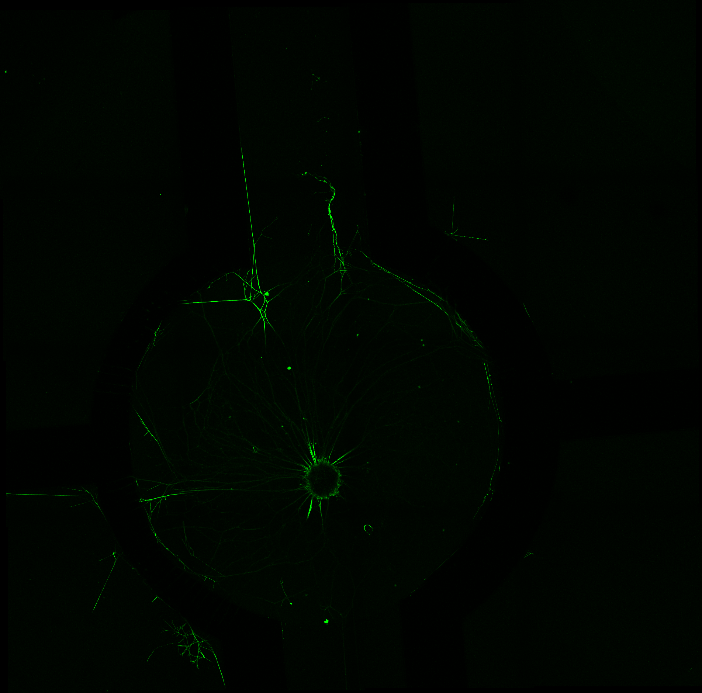
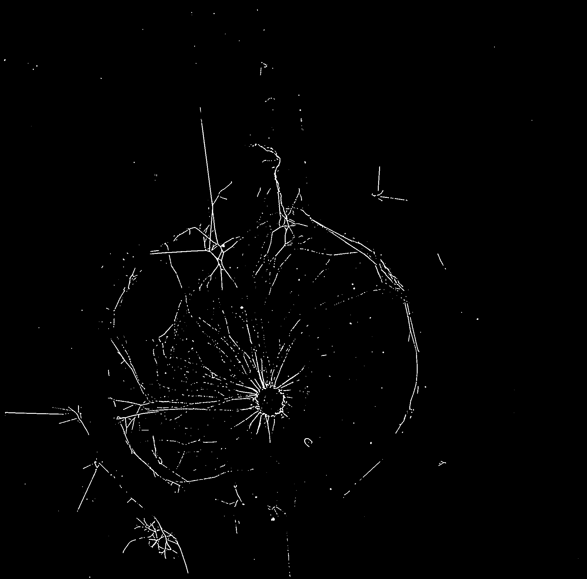

#  BIOIMAGING - INEB/i3S
Eduardo Conde-Sousa (econdesousa@gmail.com)

## neurite outgrowth 2D

 
### code version
* 1.2.0 
	* Log 1.2.0
		* quantifications start now from a circle obtained automatically
		* ROI and Segmenation images are saved by default
	* Log 1.1.0
		* updated to 2D
		* changed to semi-automatic to increase reliability

### last modification
12/08/2021

### Requirements
* imagej version 1.53f
* update sites:
	* PTBIOP 
	* CLIJ2
	* IJPB-plugins


### Attribution:
If you use this macro please add in the acknowledgements of your papers and/or thesis (MSc and PhD) the reference to Bioimaging and the project PPBI-POCI-01-0145-FEDER-022122.
As a suggestion you may use the following sentence:
 * The authors acknowledge the support of the i3S Scientific Platform Bioimaging, member of the national infrastructure PPBI - Portuguese Platform of Bioimaging (PPBI-POCI-01-0145-FEDER-022122).


# Setup

```java
if (tmpImagesFlag) {
	tmpDir = getDirectory("Directory to save temporary images");
}else {
	tmpDir = "";
}


var xpoints = newArray;
var ypoints = newArray;
var mainWidth = 0;
var mainHeight = 0 ; 
var mainDepth = 0; 
var mainUnit = "";

requires("1.53f");

close("*");
resetNonImageWindows();
roiManager("reset");

seriesList = getLifSeriesNames(inputfile);
if (series <= -1) {
	outArray = arrayFilterUpdate(seriesList,keyword);
	outindex = getSeriesIndex(seriesList,outArray);
	series = outindex[0];
}
seriesName = seriesList[series-1];

```

# load data

```java
setBatchMode(true);
run("Bio-Formats Importer", "open=["+inputfile+"] autoscale color_mode=Colorized rois_import=[ROI manager] view=Hyperstack stack_order=XYCZT series_"+series);
mainName = File.getNameWithoutExtension(inputfile);
inDir = File.getDirectory(inputfile);

outputDir = inDir + "results" + File.separator;
if (!File.exists(outputDir)) File.makeDirectory(outputDir);
outputDir = outputDir + mainName + "_series_"+series + "_" + seriesName + File.separator;
if (!File.exists(outputDir)) File.makeDirectory(outputDir);


run("Z Project...", "projection=[Max Intensity]");
run("Duplicate...", "title=signal duplicate channels="+sChannel);
setBatchMode(false);
getVoxelSize(mainWidth, mainHeight, mainDepth, mainUnit);

```
<a href="image_1628783065058.png"></a>

# get ROIs

```java
run("Duplicate...", "title=tmp duplicate channels="+sChannel);
run("Subtract Background...", "rolling=100 create");

setMinAndMax(0,nGreyLevels);
run("Apply LUT");
run("Threshold...");
waitForUser("select threshold, press apply, and press ok");

selectWindow("Threshold");run("Close");

id = getImageID();
run("Morphological Filters", "operation=Closing element=Disk radius=30");
idMLJ = getImageID();
selectImage(id);close();
run("Fill Holes");
getDimensions(width, height, channels, slices, frames);
run("Create Selection");
run("Make Inverse");
roiManager("Add");
run("Select None");
makeRectangle(shrink, shrink, width-(2*shrink), height-(2*shrink));
run("Make Inverse");
run("Set...", "value=0");
run("Select None");

run("Set Measurements...", "area redirect=None decimal=9");
run("Analyze Particles...", "size=10000-Infinity show=[Count Masks]");
idLabel=getImageID();

selectImage(idMLJ);close();
run("glasbey_on_dark");
idAllLabels = getImageID();

getLabelSelections();
print("please wait");
print("this step may take a while...");
setBatchMode(true);
run("Duplicate...", "title=Count-keepLabels duplicate");
for (i = 0; i < lengthOf(xpoints); i++) {
	val = getValue(xpoints[i],ypoints[i]);
	run("Replace/Remove Label(s)", "label(s)="+val+" final=0");	
}


run("Duplicate...", "title=centralAreaOFF duplicate");
makeRectangle(shrink, shrink, width-(2*shrink), height-(2*shrink));
run("Make Inverse");
run("Set...", "value=2");
run("Select None");

setThreshold(0, 0.1);
//run("Create Selection");
//roiManager("add");
setBatchMode("show");
run("Convert to Mask");
if (is("Inverting LUT")) run("Invert LUT");
run("Max Inscribed Circles", "minimum=0 minimum_0=0.50 closeness=5");
roiManager("Select", roiManager("count")-1);
run("Make Inverse");
run("Set...", "value=0");
//roiManager("Select", roiManager("count")-1);
//roiManager("Delete");
run("Select None");
selectWindow("centralAreaOFF");close();

selectWindow("Count-keepLabels");
run("Dilate Labels", "radius="+shrink);
roiManager("Select", 0);
run("Set...", "value=0");
run("Select None");
run("Fill Holes (Binary/Gray)");
shrink2=shrink*0.8;
run("Morphological Filters", "operation=Opening element=Disk radius="+shrink2);
run("Remap Labels");
run("Dilate Labels", "radius=20");
run("glasbey_on_dark");
setBatchMode(false);
selectWindow("Log");run("Close");
rename("ROI");
idROI = getImageID();
selectImage(idAllLabels);close();
roiManager("Select",0);
roiManager("Delete");

run("Tile");

```
<a href="image_1628783100581.png"></a>

# Distance Soma - ROIs

```java
getSpotCenter("signal");
globalUnits();
if ( distanceType == "Center-Center"){
	run("3D Distances", "image_a=Soma image_b=ROI compute=All closest=Center center");
}else{
	run("3D Distances", "image_a=Soma image_b=ROI compute=All closest=Border(slow) border");
}
selectWindow("Soma");close();
run("Tile");

if ( distanceType == "Center-Center"){
	selectWindow("Distances_Center_Statistics");run("Close");
	selectWindow("Distances_Center");
	saveAs("Results", outputDir + File.separator + "distances_Center.csv");
}else{
	selectWindow("Distances_Border_Statistics");run("Close");
	selectWindow("Distances_Border");
	saveAs("Results", outputDir + File.separator + "distances_Border.csv");
}
wait(1000);
IJ.renameResults("tmpResults");
selectWindow("tmpResults");run("Close");
selectWindow("Log");run("Close");


```

# Segment Neurites

```java
getNeuriteSegmentation("signal");
globalUnits();
run("Tile");

```
<a href="image_1628783112353.png"></a>

# Cumulative Measurements

```java
image1 = "signal_DoG_Thresh";
image2 = "tmp";
quantifications(image1,image2,stepSize,nSteps,tmpDir);
saveAs("Results", outputDir + File.separator + "cumulativeMeasurements.csv");

```
<a href="image_1628783121655.png"></a>
<table>
<tr><th>id</th><th>Mean</th><th>NumberOfNeuritePixels</th><th>nVoxels</th></tr>
<tr><td>1</td><td>0.015628645</td><td>268.000000000</td><td>17148</td></tr>
<tr><td>2</td><td>0.002122218</td><td>39.000000000</td><td>18377</td></tr>
<tr><td>3</td><td>0.003975155</td><td>80.000000000</td><td>20125</td></tr>
<tr><td>4</td><td>0.025093377</td><td>477.000000000</td><td>19009</td></tr>
<tr><td>1</td><td>0.014932369</td><td>446.000000000</td><td>29868</td></tr>
<tr><td>2</td><td>0.001476346</td><td>46.000000000</td><td>31158</td></tr>
<tr><td>3</td><td>0.002987326</td><td>99.000000000</td><td>33140</td></tr>
<tr><td>4</td><td>0.048877147</td><td>1554.000000000</td><td>31794</td></tr>
<tr><td>1</td><td>0.014387824</td><td>622.000000000</td><td>43231</td></tr>
<tr><td>2</td><td>0.001030397</td><td>46.000000000</td><td>44643</td></tr>
<tr><td>3</td><td>0.002111234</td><td>99.000000000</td><td>46892</td></tr>
<tr><td>4</td><td>0.055868389</td><td>2530.000000000</td><td>45285</td></tr>
<tr><td>1</td><td>0.012015368</td><td>688.000000000</td><td>57260</td></tr>
<tr><td>2</td><td>0.000850210</td><td>50.000000000</td><td>58809</td></tr>
<tr><td>3</td><td>0.001615351</td><td>99.000000000</td><td>61287</td></tr>
<tr><td>4</td><td>0.057172190</td><td>3397.000000000</td><td>59417</td></tr>
<tr><td>1</td><td>0.010457662</td><td>752.000000000</td><td>71909</td></tr>
<tr><td>2</td><td>0.000936749</td><td>69.000000000</td><td>73659</td></tr>
<tr><td>3</td><td>0.001297255</td><td>99.000000000</td><td>76315</td></tr>
<tr><td>4</td><td>0.053136382</td><td>3939.000000000</td><td>74130</td></tr>
<tr><td>1</td><td>0.008625139</td><td>752.000000000</td><td>87187</td></tr>
<tr><td>2</td><td>0.000774576</td><td>69.000000000</td><td>89081</td></tr>
<tr><td>3</td><td>0.001076461</td><td>99.000000000</td><td>91968</td></tr>
<tr><td>4</td><td>0.046919670</td><td>4185.000000000</td><td>89195</td></tr>
<tr><td>1</td><td>0.007291131</td><td>752.000000000</td><td>103139</td></tr>
<tr><td>2</td><td>0.000665754</td><td>70.000000000</td><td>105144</td></tr>
<tr><td>3</td><td>0.000914752</td><td>99.000000000</td><td>108226</td></tr>
<tr><td>4</td><td>0.041771462</td><td>4368.000000000</td><td>104569</td></tr>
<tr><td>1</td><td>0.006279487</td><td>752.000000000</td><td>119755</td></tr>
<tr><td>2</td><td>0.000623764</td><td>76.000000000</td><td>121841</td></tr>
<tr><td>3</td><td>0.000792431</td><td>99.000000000</td><td>124932</td></tr>
<tr><td>4</td><td>0.037982300</td><td>4545.000000000</td><td>119661</td></tr>
<tr><td>1</td><td>0.005488490</td><td>752.000000000</td><td>137014</td></tr>
<tr><td>2</td><td>0.000632193</td><td>88.000000000</td><td>139198</td></tr>
<tr><td>3</td><td>0.000711618</td><td>101.000000000</td><td>141930</td></tr>
<tr><td>4</td><td>0.034552331</td><td>4641.000000000</td><td>134318</td></tr>
<tr><td>1</td><td>0.004855717</td><td>752.000000000</td><td>154869</td></tr>
<tr><td>2</td><td>0.000559836</td><td>88.000000000</td><td>157189</td></tr>
<tr><td>3</td><td>0.000634454</td><td>101.000000000</td><td>159192</td></tr>
<tr><td>4</td><td>0.031610317</td><td>4699.000000000</td><td>148654</td></tr>
<tr><td>1</td><td>0.004337219</td><td>752.000000000</td><td>173383</td></tr>
<tr><td>2</td><td>0.000500671</td><td>88.000000000</td><td>175764</td></tr>
<tr><td>3</td><td>0.000572881</td><td>101.000000000</td><td>176302</td></tr>
<tr><td>4</td><td>0.029263705</td><td>4761.000000000</td><td>162693</td></tr>
<tr><td>1</td><td>0.003904465</td><td>752.000000000</td><td>192600</td></tr>
<tr><td>2</td><td>0.000451799</td><td>88.000000000</td><td>194777</td></tr>
<tr><td>3</td><td>0.000522718</td><td>101.000000000</td><td>193221</td></tr>
<tr><td>4</td><td>0.027346319</td><td>4824.000000000</td><td>176404</td></tr>
<tr><td>1</td><td>0.003539823</td><td>752.000000000</td><td>212440</td></tr>
<tr><td>2</td><td>0.000411446</td><td>88.000000000</td><td>213880</td></tr>
<tr><td>3</td><td>0.000480966</td><td>101.000000000</td><td>209994</td></tr>
<tr><td>4</td><td>0.025754852</td><td>4885.000000000</td><td>189673</td></tr>
<tr><td>1</td><td>0.003228812</td><td>752.000000000</td><td>232903</td></tr>
<tr><td>2</td><td>0.000380169</td><td>88.000000000</td><td>231476</td></tr>
<tr><td>3</td><td>0.000446064</td><td>101.000000000</td><td>226425</td></tr>
<tr><td>4</td><td>0.024188365</td><td>4892.000000000</td><td>202246</td></tr>
<tr><td>1</td><td>0.002961294</td><td>752.000000000</td><td>253943</td></tr>
<tr><td>2</td><td>0.000355448</td><td>88.000000000</td><td>247575</td></tr>
<tr><td>3</td><td>0.000416011</td><td>101.000000000</td><td>242782</td></tr>
<tr><td>4</td><td>0.023055189</td><td>4904.000000000</td><td>212707</td></tr>
<tr><td>1</td><td>0.002729117</td><td>752.000000000</td><td>275547</td></tr>
<tr><td>2</td><td>0.000334783</td><td>88.000000000</td><td>262857</td></tr>
<tr><td>3</td><td>0.000390123</td><td>101.000000000</td><td>258893</td></tr>
<tr><td>4</td><td>0.022122576</td><td>4904.000000000</td><td>221674</td></tr>
<tr><td>1</td><td>0.002525371</td><td>752.000000000</td><td>297778</td></tr>
<tr><td>2</td><td>0.000317078</td><td>88.000000000</td><td>277534</td></tr>
<tr><td>3</td><td>0.000367117</td><td>101.000000000</td><td>275117</td></tr>
<tr><td>4</td><td>0.021359257</td><td>4904.000000000</td><td>229596</td></tr>
<tr><td>1</td><td>0.002344761</td><td>752.000000000</td><td>320715</td></tr>
<tr><td>2</td><td>0.000301659</td><td>88.000000000</td><td>291720</td></tr>
<tr><td>3</td><td>0.000346555</td><td>101.000000000</td><td>291440</td></tr>
<tr><td>4</td><td>0.020747046</td><td>4904.000000000</td><td>236371</td></tr>
<tr><td>1</td><td>0.002184370</td><td>752.000000000</td><td>344264</td></tr>
<tr><td>2</td><td>0.000288061</td><td>88.000000000</td><td>305491</td></tr>
<tr><td>3</td><td>0.000328422</td><td>101.000000000</td><td>307531</td></tr>
<tr><td>4</td><td>0.020245974</td><td>4904.000000000</td><td>242221</td></tr>
<tr><td>1</td><td>0.002041708</td><td>752.000000000</td><td>368319</td></tr>
<tr><td>2</td><td>0.000275911</td><td>88.000000000</td><td>318944</td></tr>
<tr><td>3</td><td>0.000312819</td><td>101.000000000</td><td>322870</td></tr>
<tr><td>4</td><td>0.019826478</td><td>4904.000000000</td><td>247346</td></tr>
<tr><td>1</td><td>0.001915640</td><td>752.000000000</td><td>392558</td></tr>
<tr><td>2</td><td>0.000264964</td><td>88.000000000</td><td>332121</td></tr>
<tr><td>3</td><td>0.000301600</td><td>101.000000000</td><td>334881</td></tr>
<tr><td>4</td><td>0.019499083</td><td>4904.000000000</td><td>251499</td></tr>
<tr><td>1</td><td>0.001807975</td><td>752.000000000</td><td>415935</td></tr>
<tr><td>2</td><td>0.000255061</td><td>88.000000000</td><td>345015</td></tr>
<tr><td>3</td><td>0.000292870</td><td>101.000000000</td><td>344863</td></tr>
<tr><td>4</td><td>0.019251983</td><td>4904.000000000</td><td>254727</td></tr>
<tr><td>1</td><td>0.001715086</td><td>752.000000000</td><td>438462</td></tr>
<tr><td>2</td><td>0.000276779</td><td>99.000000000</td><td>357686</td></tr>
<tr><td>3</td><td>0.000285875</td><td>101.000000000</td><td>353301</td></tr>
<tr><td>4</td><td>0.019090106</td><td>4904.000000000</td><td>256887</td></tr>
<tr><td>1</td><td>0.001633387</td><td>752.000000000</td><td>460393</td></tr>
<tr><td>2</td><td>0.000270179</td><td>100.000000000</td><td>370125</td></tr>
<tr><td>3</td><td>0.000280214</td><td>101.000000000</td><td>360439</td></tr>
<tr><td>4</td><td>0.019011731</td><td>4904.000000000</td><td>257946</td></tr>
<tr><td>1</td><td>0.001560370</td><td>752.000000000</td><td>481937</td></tr>
<tr><td>2</td><td>0.000261490</td><td>100.000000000</td><td>382424</td></tr>
<tr><td>3</td><td>0.000275655</td><td>101.000000000</td><td>366400</td></tr>
<tr><td>4</td><td>0.018992587</td><td>4904.000000000</td><td>258206</td></tr>
</table>


#  Step Measurements

```java
idCol = "id";
targetCol = "nVoxels";
targetCol2= "NumberOfNeuritePixels";
tableName="Results";
nVoxels = getFreqs(tableName,idCol,targetCol);
NumberOfNeuritePixels = getFreqs(tableName,idCol,targetCol2);

selectWindow(tableName);
ID = Table.getColumn(idCol);
Array.sort(ID);
ratio=newArray(lengthOf(ID));
for (i = 0; i < lengthOf(NumberOfNeuritePixels); i++) {
	ratio[i]= NumberOfNeuritePixels[i] / nVoxels[i];
}
Array.show("outFunction", ID,NumberOfNeuritePixels,nVoxels,ratio);
saveAs("Results", outputDir + File.separator + "stepMeasurements.csv");

```
<table>
<tr><th>ID</th><th>NumberOfNeuritePixels</th><th>nVoxels</th><th>ratio</th></tr>
<tr><td>1</td><td>268.000000000</td><td>17148</td><td>0.015628645</td></tr>
<tr><td>1</td><td>178.000000000</td><td>12720</td><td>0.013993711</td></tr>
<tr><td>1</td><td>176.000000000</td><td>13363</td><td>0.013170695</td></tr>
<tr><td>1</td><td>66.000000000</td><td>14029</td><td>0.004704541</td></tr>
<tr><td>1</td><td>64.000000000</td><td>14649</td><td>0.004368899</td></tr>
<tr><td>1</td><td>0.000000000</td><td>15278</td><td>0.000000000</td></tr>
<tr><td>1</td><td>0.000000000</td><td>15952</td><td>0.000000000</td></tr>
<tr><td>1</td><td>0.000000000</td><td>16616</td><td>0.000000000</td></tr>
<tr><td>1</td><td>0.000000000</td><td>17259</td><td>0.000000000</td></tr>
<tr><td>1</td><td>0.000000000</td><td>17855</td><td>0.000000000</td></tr>
<tr><td>1</td><td>-1.137E-13</td><td>18514</td><td>-6.141E-18</td></tr>
<tr><td>1</td><td>1.137E-13</td><td>19217</td><td>5.916E-18</td></tr>
<tr><td>1</td><td>0.000000000</td><td>19840</td><td>0.000000000</td></tr>
<tr><td>1</td><td>0.000000000</td><td>20463</td><td>0.000000000</td></tr>
<tr><td>1</td><td>0.000000000</td><td>21040</td><td>0.000000000</td></tr>
<tr><td>1</td><td>0.000000000</td><td>21604</td><td>0.000000000</td></tr>
<tr><td>1</td><td>0.000000000</td><td>22231</td><td>0.000000000</td></tr>
<tr><td>1</td><td>0.000000000</td><td>22937</td><td>0.000000000</td></tr>
<tr><td>1</td><td>0.000000000</td><td>23549</td><td>0.000000000</td></tr>
<tr><td>1</td><td>0.000000000</td><td>24055</td><td>0.000000000</td></tr>
<tr><td>1</td><td>0.000000000</td><td>24239</td><td>0.000000000</td></tr>
<tr><td>1</td><td>0.000000000</td><td>23377</td><td>0.000000000</td></tr>
<tr><td>1</td><td>0.000000000</td><td>22527</td><td>0.000000000</td></tr>
<tr><td>1</td><td>0.000000000</td><td>21931</td><td>0.000000000</td></tr>
<tr><td>1</td><td>0.000000000</td><td>21544</td><td>0.000000000</td></tr>
<tr><td>2</td><td>39.000000000</td><td>18377</td><td>0.002122218</td></tr>
<tr><td>2</td><td>7.000000000</td><td>12781</td><td>0.000547688</td></tr>
<tr><td>2</td><td>0.000000000</td><td>13485</td><td>0.000000000</td></tr>
<tr><td>2</td><td>4.000000000</td><td>14166</td><td>0.000282366</td></tr>
<tr><td>2</td><td>19.000000000</td><td>14850</td><td>0.001279461</td></tr>
<tr><td>2</td><td>0.000000000</td><td>15422</td><td>0.000000000</td></tr>
<tr><td>2</td><td>1.000000000</td><td>16063</td><td>0.000062255</td></tr>
<tr><td>2</td><td>6.000000000</td><td>16697</td><td>0.000359346</td></tr>
<tr><td>2</td><td>12.000000000</td><td>17357</td><td>0.000691364</td></tr>
<tr><td>2</td><td>0.000000000</td><td>17991</td><td>0.000000000</td></tr>
<tr><td>2</td><td>0.000000000</td><td>18575</td><td>0.000000000</td></tr>
<tr><td>2</td><td>0.000000000</td><td>19013</td><td>0.000000000</td></tr>
<tr><td>2</td><td>0.000000000</td><td>19103</td><td>0.000000000</td></tr>
<tr><td>2</td><td>0.000000000</td><td>17596</td><td>0.000000000</td></tr>
<tr><td>2</td><td>0.000000000</td><td>16099</td><td>0.000000000</td></tr>
<tr><td>2</td><td>0.000000000</td><td>15282</td><td>0.000000000</td></tr>
<tr><td>2</td><td>0.000000000</td><td>14677</td><td>0.000000000</td></tr>
<tr><td>2</td><td>0.000000000</td><td>14186</td><td>0.000000000</td></tr>
<tr><td>2</td><td>0.000000000</td><td>13771</td><td>0.000000000</td></tr>
<tr><td>2</td><td>0.000000000</td><td>13453</td><td>0.000000000</td></tr>
<tr><td>2</td><td>0.000000000</td><td>13177</td><td>0.000000000</td></tr>
<tr><td>2</td><td>0.000000000</td><td>12894</td><td>0.000000000</td></tr>
<tr><td>2</td><td>11.000000000</td><td>12671</td><td>0.000868124</td></tr>
<tr><td>2</td><td>1.000000000</td><td>12439</td><td>0.000080392</td></tr>
<tr><td>2</td><td>0.000000000</td><td>12299</td><td>0.000000000</td></tr>
<tr><td>3</td><td>80.000000000</td><td>20125</td><td>0.003975155</td></tr>
<tr><td>3</td><td>19.000000000</td><td>13015</td><td>0.001459854</td></tr>
<tr><td>3</td><td>0.000000000</td><td>13752</td><td>0.000000000</td></tr>
<tr><td>3</td><td>0.000000000</td><td>14395</td><td>0.000000000</td></tr>
<tr><td>3</td><td>0.000000000</td><td>15028</td><td>0.000000000</td></tr>
<tr><td>3</td><td>0.000000000</td><td>15653</td><td>0.000000000</td></tr>
<tr><td>3</td><td>0.000000000</td><td>16258</td><td>0.000000000</td></tr>
<tr><td>3</td><td>0.000000000</td><td>16706</td><td>0.000000000</td></tr>
<tr><td>3</td><td>2.000000000</td><td>16998</td><td>0.000117661</td></tr>
<tr><td>3</td><td>0.000000000</td><td>17262</td><td>0.000000000</td></tr>
<tr><td>3</td><td>-1.421E-14</td><td>17110</td><td>-8.306E-19</td></tr>
<tr><td>3</td><td>1.421E-14</td><td>16919</td><td>8.399E-19</td></tr>
<tr><td>3</td><td>0.000000000</td><td>16773</td><td>0.000000000</td></tr>
<tr><td>3</td><td>0.000000000</td><td>16431</td><td>0.000000000</td></tr>
<tr><td>3</td><td>0.000000000</td><td>16357</td><td>0.000000000</td></tr>
<tr><td>3</td><td>0.000000000</td><td>16111</td><td>0.000000000</td></tr>
<tr><td>3</td><td>0.000000000</td><td>16224</td><td>0.000000000</td></tr>
<tr><td>3</td><td>0.000000000</td><td>16323</td><td>0.000000000</td></tr>
<tr><td>3</td><td>-1.421E-14</td><td>16091</td><td>-8.832E-19</td></tr>
<tr><td>3</td><td>2.842E-14</td><td>15339</td><td>1.853E-18</td></tr>
<tr><td>3</td><td>-1.421E-14</td><td>12011</td><td>-1.183E-18</td></tr>
<tr><td>3</td><td>0.000000000</td><td>9982</td><td>0.000000000</td></tr>
<tr><td>3</td><td>-1.421E-14</td><td>8438</td><td>-1.684E-18</td></tr>
<tr><td>3</td><td>1.421E-14</td><td>7138</td><td>1.991E-18</td></tr>
<tr><td>3</td><td>0.000000000</td><td>5961</td><td>0.000000000</td></tr>
<tr><td>4</td><td>477.000000000</td><td>19009</td><td>0.025093377</td></tr>
<tr><td>4</td><td>1077.000000000</td><td>12785</td><td>0.084239343</td></tr>
<tr><td>4</td><td>976.000000000</td><td>13491</td><td>0.072344526</td></tr>
<tr><td>4</td><td>867.000000000</td><td>14132</td><td>0.061350127</td></tr>
<tr><td>4</td><td>542.000000000</td><td>14713</td><td>0.036838170</td></tr>
<tr><td>4</td><td>246.000000000</td><td>15065</td><td>0.016329240</td></tr>
<tr><td>4</td><td>183.000000000</td><td>15374</td><td>0.011903213</td></tr>
<tr><td>4</td><td>177.000000000</td><td>15092</td><td>0.011728068</td></tr>
<tr><td>4</td><td>96.000000000</td><td>14657</td><td>0.006549771</td></tr>
<tr><td>4</td><td>58.000000000</td><td>14336</td><td>0.004045759</td></tr>
<tr><td>4</td><td>62.000000000</td><td>14039</td><td>0.004416269</td></tr>
<tr><td>4</td><td>63.000000000</td><td>13711</td><td>0.004594851</td></tr>
<tr><td>4</td><td>61.000000000</td><td>13269</td><td>0.004597181</td></tr>
<tr><td>4</td><td>7.000000000</td><td>12573</td><td>0.000556749</td></tr>
<tr><td>4</td><td>12.000000000</td><td>10461</td><td>0.001147118</td></tr>
<tr><td>4</td><td>0.000000000</td><td>8967</td><td>0.000000000</td></tr>
<tr><td>4</td><td>0.000000000</td><td>7922</td><td>0.000000000</td></tr>
<tr><td>4</td><td>0.000000000</td><td>6775</td><td>0.000000000</td></tr>
<tr><td>4</td><td>0.000000000</td><td>5850</td><td>0.000000000</td></tr>
<tr><td>4</td><td>0.000000000</td><td>5125</td><td>0.000000000</td></tr>
<tr><td>4</td><td>0.000000000</td><td>4153</td><td>0.000000000</td></tr>
<tr><td>4</td><td>0.000000000</td><td>3228</td><td>0.000000000</td></tr>
<tr><td>4</td><td>0.000000000</td><td>2160</td><td>0.000000000</td></tr>
<tr><td>4</td><td>0.000000000</td><td>1059</td><td>0.000000000</td></tr>
<tr><td>4</td><td>0.000000000</td><td>260</td><td>0.000000000</td></tr>
</table>


# Saving images

```java
selectWindow("signal_DoG_Thresh");
saveAs("Tif", outputDir + File.separator + "Segmentation.tif");
selectWindow("ROI");
saveAs("Tif", outputDir + File.separator + "ROIs.tif");

```

# Functions

```java
function resetNonImageWindows(){
	list = getList("window.titles");
	for (i = 0; i < lengthOf(list); i++) {
		selectWindow(list[i]);run("Close");
	}
}

function globalUnits(){
	for (i = 0; i < nImages; i++) {
		selectImage(i+1);
		setVoxelSize(mainWidth, mainHeight, mainDepth, mainUnit);
	}
}


function getSeriesIndex(inputArray,smallArray){
	a=newArray(lengthOf(inputArray));
	for (i = 0; i < lengthOf(smallArray); i++) {
		for (j=0; j < lengthOf(inputArray); j++){
			if (indexOf(inputArray[j], smallArray[i])>-1){
				a[j]=1;
			}
		}
	}
	b=newArray;
	for (i = 0; i < lengthOf(inputArray); i++) {
		if (a[i]==1){
			b=Array.concat(b,i+1);
		}
	}

	return b;
}

function arrayFilterUpdate(inputArray,keyword) { 
	keywords=split(keyword, "*");
	outArray = Array.copy(inputArray);
	for (i = 0; i < lengthOf(keywords); i++) {
		outArray = Array.filter(outArray, keywords[i]);
	}
	return outArray;
}

function getLifSeriesNames(inputfile) { 
	
	run("Bio-Formats Macro Extensions");
	Ext.setId(inputfile);
	Ext.getSeriesCount(seriesCount);
	
	seriesList = newArray;
	
	for (s = 0; s < seriesCount; s++){
		Ext.setSeries(s);
		Ext.getSeriesName(seriesName);
		seriesList = Array.concat(seriesList, seriesName);
	}
	
	return seriesList;
}

function getLabelSelections() {
	setTool("multipoint");
	waitForUser("Select Regions to delete and Press OK");
	setTool(0);
	getSelectionCoordinates(xpoints, ypoints);
}


function getSpotCenter(signal){
	selectWindow(signal);
	getDimensions(width, height, channels, slices, frames);
	setTool(1);
	waitForUser("Mark Soma and Press OK");
	setTool(0);
	run("Select None");
	newImage("Soma", "16-bit", width, height, channels* slices* frames);
	run("Restore Selection");
	run("Set...", "value=1");
	run("Select None");
	setMinAndMax(0,1);
	run("glasbey_on_dark");
}

function getNeuriteSegmentation(signal) {
	run("CLIJ2 Macro Extensions", "cl_device=");
	
	Ext.CLIJ2_push(signal);
	
	// Difference Of Gaussian2D
	sigma1 = 1.0;
	sigma2 = 2.0;
	Ext.CLIJ2_differenceOfGaussian2D(signal, signalDoG, sigma1, sigma1, sigma2, sigma2);
	Ext.CLIJ2_release(signal);
	
	// Threshold
	method = "Huang";
	signalDoGThresh = signal+"_DoG_Thresh";
	Ext.CLIJ2_automaticThreshold(signalDoG, signalDoGThresh, method);
	Ext.CLIJ2_release(signalDoG);
	
	Ext.CLIJ2_pull(signalDoGThresh);
	Ext.CLIJ2_release(signalDoGThresh);
	run("Median...", "radius=1");
	run("Median...", "radius=1");
}


function quantifications(image1,image2,stepSize,nSteps,savingDir){
	while (roiManager("count")>1) {
		roiManager("select", roiManager("count")-1);
		roiManager("delete");
	}
	
	setBatchMode(true);
	selectWindow(image1);
	getDimensions(width, height, channels, slices, frames);
	newImage("tmp", "16-bit", width, height, channels* slices* frames);
	id=newArray;
	Mean=newArray;
	nVoxels=newArray;
	Vol=newArray;
	for (i = 0; i < nSteps; i++) {
		selectImage("ROI");
		getMinAndMax(min, max);
		run("Select None");
		
		roiManager("select", 0);
		run("Enlarge...", "enlarge="+(stepSize+stepSize*i)+" pixel");
		roiManager("Add");
		roiManager("select", 1);
		run("Copy");
		run("Select None");
		selectWindow("tmp");
		roiManager("select", 1);
		roiManager("delete");
		run("Paste");
		setMinAndMax(min, max);
		run("glasbey_on_dark");
		run("Select None");
		if (File.isDirectory(savingDir)){
			print(savingDir + "tmp_"+IJ.pad(i,2)+".tif");
			saveAs("tif",savingDir + "tmp_"+IJ.pad(i,2)+".tif");
			rename("tmp");
		}
		run("Intensity Measurements 2D/3D", "input=signal_DoG_Thresh labels=tmp mean numberofvoxels volume");
		L1=Table.getColumn("Label");
		id = Array.concat(id,L1);
		M1=Table.getColumn("Mean");
		Mean=Array.concat(Mean,M1);
		nVoxels1=Table.getColumn("NumberOfVoxels");
		nVoxels=Array.concat(nVoxels,nVoxels1);
		//Vol1=Table.getColumn("Volume");
		//Vol=Array.concat(Vol,Vol1);
		
		selectWindow("tmp");
		run("Select None");
	}
	NumberOfNeuritePixels=newArray(lengthOf(id));
	for (i = 0; i < lengthOf(id); i++) {
		NumberOfNeuritePixels[i]=Mean[i]*nVoxels[i];
		id[i]=parseFloat(id[i]);
	}
	
	selectWindow("signal_DoG_Thresh-intensity-measurements");run("Close");
	Array.show("Results", id,Mean,NumberOfNeuritePixels,nVoxels);
}


function getFreqs(tableName,idCol,targetCol) { 

	selectWindow(tableName);
	ID = Table.getColumn(idCol);
	targetVarCumSum = Table.getColumn(targetCol);
	
	Array.sort(ID, targetVarCumSum);
	
	
	
	targetvar = newArray(lengthOf(targetVarCumSum));
	targetvar[0]=targetVarCumSum[0];
	
	for (i = 1; i < lengthOf(ID); i++) {
		if (ID[i]==ID[i-1]){
			targetvar[i]=targetVarCumSum[i]-targetVarCumSum[i-1];
		}else {
			targetvar[i]=targetVarCumSum[i];
		}
	}
	return targetvar;
}
```


```
```
