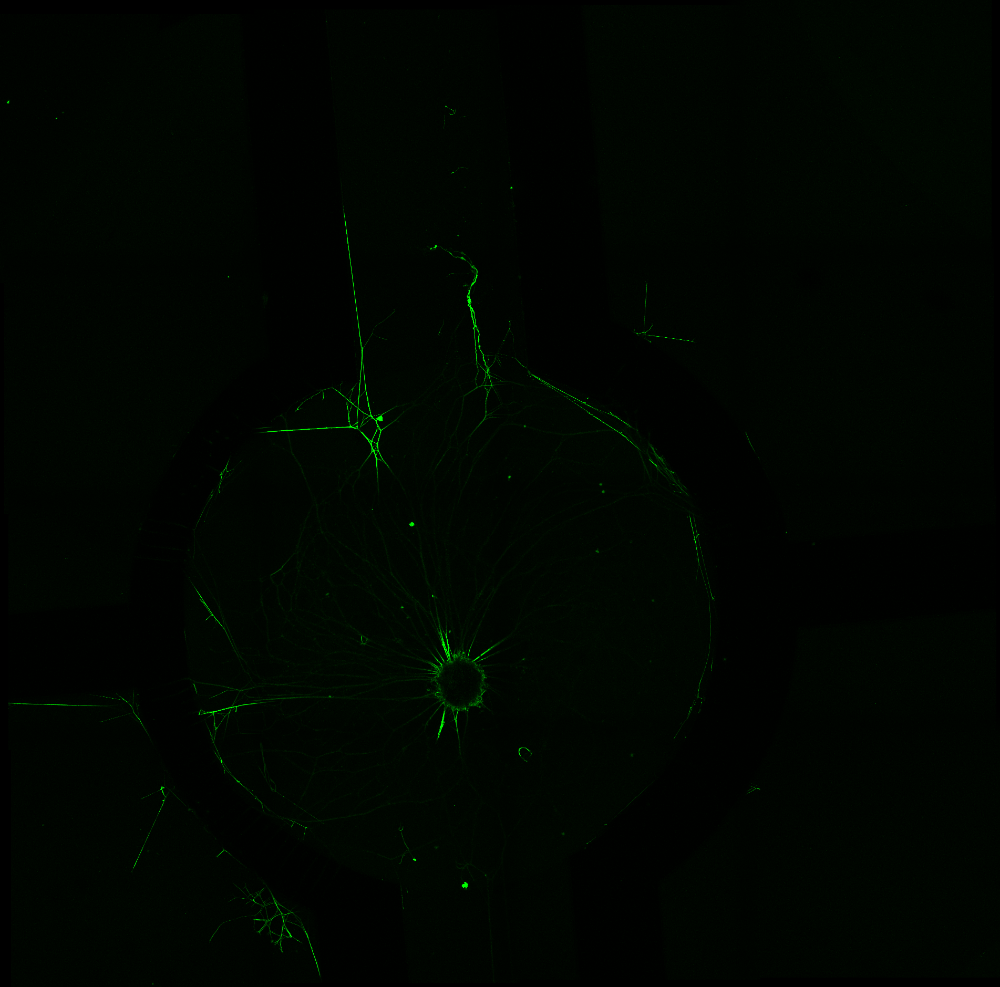
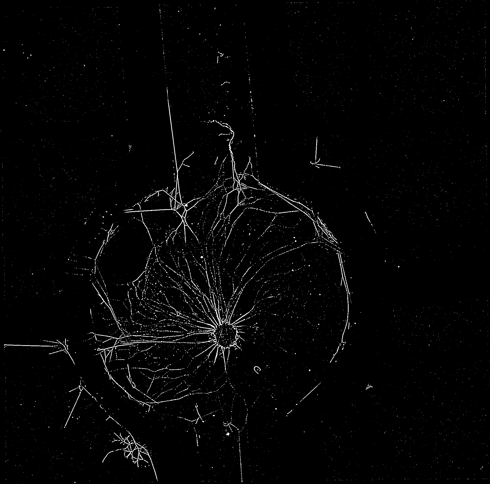

#  BIOIMAGING - INEB/i3S
Eduardo Conde-Sousa (econdesousa@gmail.com)

## neurite outgrowth 2D

 
### code version
1.1.0 
	Log
		updated to 2D
		changed to semi-automatic to increase reliability

### last modification
20/07/2021

### Attribution:
If you use this macro please add in the acknowledgements of your papers and/or thesis (MSc and PhD) the reference to Bioimaging and the project PPBI-POCI-01-0145-FEDER-022122.
As a suggestion you may use the following sentence:
 * The authors acknowledge the support of the i3S Scientific Platform Bioimaging, member of the national infrastructure PPBI - Portuguese Platform of Bioimaging (PPBI-POCI-01-0145-FEDER-022122).


```java

```

# setup

```java


```

# Setup

```java
if (tmpImagesFlag) {
	tmpDir = getDirectory("Directory to save temporary images");
}else {
	tmpDir = "";
}


var xpoints = newArray;
var ypoints = newArray;
var mainWidth = 0;
var mainHeight = 0 ; 
var mainDepth = 0; 
var mainUnit = "";

requires("1.53f");

close("*");
resetNonImageWindows();
roiManager("reset");

seriesList = getLifSeriesNames(inputfile);
if (series <= -1) {
	outArray = arrayFilterUpdate(seriesList,keyword);
	outindex = getSeriesIndex(seriesList,outArray);
	series = outindex[0];
}
seriesName = seriesList[series-1];

```

# load data

```java
setBatchMode(true);
run("Bio-Formats Importer", "open=["+inputfile+"] autoscale color_mode=Colorized rois_import=[ROI manager] view=Hyperstack stack_order=XYCZT series_"+series);
mainName = File.getNameWithoutExtension(inputfile);
inDir = File.getDirectory(inputfile);

outputDir = inDir + "results" + File.separator;
if (!File.exists(outputDir)) File.makeDirectory(outputDir);
outputDir = outputDir + mainName + "_series_"+series + "_" + seriesName + File.separator;
if (!File.exists(outputDir)) File.makeDirectory(outputDir);


run("Z Project...", "projection=[Max Intensity]");
run("Duplicate...", "title=signal duplicate channels="+sChannel);
setBatchMode(false);
getVoxelSize(mainWidth, mainHeight, mainDepth, mainUnit);

```
<a href="image_1626889911743.png"></a>

# get ROIs

```java
run("Duplicate...", "title=tmp duplicate channels="+sChannel);
run("Subtract Background...", "rolling=100 create");

setMinAndMax(0,nGreyLevels);
run("Apply LUT");
run("Threshold...");
waitForUser("select threshold, press apply, and press ok");

selectWindow("Threshold");run("Close");

id = getImageID();
run("Morphological Filters", "operation=Closing element=Disk radius=30");
idMLJ = getImageID();
selectImage(id);close();
run("Fill Holes");
getDimensions(width, height, channels, slices, frames);
makeRectangle(shrink, shrink, width-(2*shrink), height-(2*shrink));
run("Make Inverse");
run("Set...", "value=0");
run("Select None");

run("Set Measurements...", "area redirect=None decimal=9");
run("Analyze Particles...", "size=10000-Infinity show=[Count Masks]");
idLabel=getImageID();

selectImage(idMLJ);close();
run("glasbey_on_dark");
idAllLabels = getImageID();

getLabelSelections();
print("please wait");
print("this step may take a while...");
setBatchMode(true);
run("Duplicate...", "title=Count-keepLabels duplicate");
for (i = 0; i < lengthOf(xpoints); i++) {
	val = getValue(xpoints[i],ypoints[i]);
	run("Replace/Remove Label(s)", "label(s)="+val+" final=0");	
}


run("Duplicate...", "title=centralAreaOFF duplicate");
makeRectangle(shrink, shrink, width-(2*shrink), height-(2*shrink));
run("Make Inverse");
run("Set...", "value=2");
run("Select None");

setThreshold(0, 0.1);
run("Create Selection");
roiManager("add");

selectWindow("Count-keepLabels");
run("Dilate Labels", "radius="+shrink);
roiManager("Select", 0);
run("Set...", "value=0");
run("Select None");
run("Fill Holes (Binary/Gray)");
run("Morphological Filters", "operation=Opening element=Disk radius="+shrink);
run("Remap Labels");
run("glasbey_on_dark");
setBatchMode(false);
selectWindow("Log");run("Close");

rename("ROI");
idROI = getImageID();
selectImage(idAllLabels);close();


run("Tile");

```
<a href="image_1626889947359.png"></a>

# Distance Soma - ROIs

```java
getSpotCenter("signal");
globalUnits();
if ( distanceType == "Center-Center"){
	run("3D Distances", "image_a=Soma image_b=ROI compute=All closest=Center center");
}else{
	run("3D Distances", "image_a=Soma image_b=ROI compute=All closest=Border(slow) border");
}
selectWindow("Soma");close();
run("Tile");

if ( distanceType == "Center-Center"){
	selectWindow("Distances_Center_Statistics");run("Close");
	selectWindow("Distances_Center");
	saveAs("Results", outputDir + File.separator + "distances_Center.csv");
}else{
	selectWindow("Distances_Border_Statistics");run("Close");
	selectWindow("Distances_Border");
	saveAs("Results", outputDir + File.separator + "distances_Border.csv");
}
wait(1000);
IJ.renameResults("tmpResults");
selectWindow("tmpResults");run("Close");
selectWindow("Log");run("Close");


```

# Segment Neurites

```java
getNeuriteSegmentation("signal");
globalUnits();
run("Tile");

```
<a href="image_1626889963075.png"></a>

# Cumulative Measurements

```java
image1 = "signal_DoG_Thresh";
image2 = "tmp";
quantifications(image1,image2,stepSize,nSteps,tmpDir);
saveAs("Results", outputDir + File.separator + "cumulativeMeasurements.csv");

```
<a href="image_1626890010088.png"></a>
<table>
<tr><th>id</th><th>Mean</th><th>NumberOfNeuritePixels</th><th>nVoxels</th></tr>
<tr><td>1</td><td>0.026286966</td><td>120.000000000</td><td>4565</td></tr>
<tr><td>2</td><td>0.019732078</td><td>109.000000000</td><td>5524</td></tr>
<tr><td>3</td><td>0.002180431</td><td>8.000000000</td><td>3669</td></tr>
<tr><td>4</td><td>0.020661157</td><td>95.000000000</td><td>4598</td></tr>
<tr><td>1</td><td>0.024473292</td><td>230.000000000</td><td>9398</td></tr>
<tr><td>2</td><td>0.013368747</td><td>151.000000000</td><td>11295</td></tr>
<tr><td>3</td><td>0.005741877</td><td>44.000000000</td><td>7663</td></tr>
<tr><td>4</td><td>0.046725967</td><td>436.000000000</td><td>9331</td></tr>
<tr><td>1</td><td>0.018422363</td><td>259.000000000</td><td>14059</td></tr>
<tr><td>2</td><td>0.010990959</td><td>186.000000000</td><td>16923</td></tr>
<tr><td>3</td><td>0.007313715</td><td>85.000000000</td><td>11622</td></tr>
<tr><td>4</td><td>0.060818465</td><td>859.000000000</td><td>14124</td></tr>
<tr><td>1</td><td>0.015376286</td><td>284.000000000</td><td>18470</td></tr>
<tr><td>2</td><td>0.008855127</td><td>197.000000000</td><td>22247</td></tr>
<tr><td>3</td><td>0.007432301</td><td>115.000000000</td><td>15473</td></tr>
<tr><td>4</td><td>0.057706627</td><td>1085.000000000</td><td>18802</td></tr>
<tr><td>1</td><td>0.014480150</td><td>333.000000000</td><td>22997</td></tr>
<tr><td>2</td><td>0.007478864</td><td>207.000000000</td><td>27678</td></tr>
<tr><td>3</td><td>0.007572657</td><td>148.000000000</td><td>19544</td></tr>
<tr><td>4</td><td>0.057128455</td><td>1360.000000000</td><td>23806</td></tr>
<tr><td>1</td><td>0.013926374</td><td>387.000000000</td><td>27789</td></tr>
<tr><td>2</td><td>0.006652483</td><td>222.000000000</td><td>33371</td></tr>
<tr><td>3</td><td>0.006880160</td><td>165.000000000</td><td>23982</td></tr>
<tr><td>4</td><td>0.057433126</td><td>1679.000000000</td><td>29234</td></tr>
<tr><td>1</td><td>0.013182325</td><td>426.000000000</td><td>32316</td></tr>
<tr><td>2</td><td>0.006034505</td><td>234.000000000</td><td>38777</td></tr>
<tr><td>3</td><td>0.006372133</td><td>180.000000000</td><td>28248</td></tr>
<tr><td>4</td><td>0.057953788</td><td>1999.000000000</td><td>34493</td></tr>
<tr><td>1</td><td>0.012617697</td><td>465.000000000</td><td>36853</td></tr>
<tr><td>2</td><td>0.005367334</td><td>237.000000000</td><td>44156</td></tr>
<tr><td>3</td><td>0.005997601</td><td>195.000000000</td><td>32513</td></tr>
<tr><td>4</td><td>0.055815239</td><td>2221.000000000</td><td>39792</td></tr>
<tr><td>1</td><td>0.012107764</td><td>502.000000000</td><td>41461</td></tr>
<tr><td>2</td><td>0.004934641</td><td>245.000000000</td><td>49649</td></tr>
<tr><td>3</td><td>0.005772827</td><td>213.000000000</td><td>36897</td></tr>
<tr><td>4</td><td>0.054564742</td><td>2469.000000000</td><td>45249</td></tr>
<tr><td>1</td><td>0.011884881</td><td>548.000000000</td><td>46109</td></tr>
<tr><td>2</td><td>0.004535806</td><td>250.000000000</td><td>55117</td></tr>
<tr><td>3</td><td>0.005426225</td><td>224.000000000</td><td>41281</td></tr>
<tr><td>4</td><td>0.053644513</td><td>2687.000000000</td><td>50089</td></tr>
<tr><td>1</td><td>0.011803551</td><td>597.000000000</td><td>50578</td></tr>
<tr><td>2</td><td>0.004371729</td><td>264.000000000</td><td>60388</td></tr>
<tr><td>3</td><td>0.005071777</td><td>230.000000000</td><td>45349</td></tr>
<tr><td>4</td><td>0.052656774</td><td>2860.000000000</td><td>54314</td></tr>
<tr><td>1</td><td>0.011717406</td><td>647.000000000</td><td>55217</td></tr>
<tr><td>2</td><td>0.004220947</td><td>278.000000000</td><td>65862</td></tr>
<tr><td>3</td><td>0.004784013</td><td>237.000000000</td><td>49540</td></tr>
<tr><td>4</td><td>0.051263673</td><td>3004.000000000</td><td>58599</td></tr>
<tr><td>1</td><td>0.011372772</td><td>679.000000000</td><td>59704</td></tr>
<tr><td>2</td><td>0.004020355</td><td>286.000000000</td><td>71138</td></tr>
<tr><td>3</td><td>0.004776119</td><td>256.000000000</td><td>53600</td></tr>
<tr><td>4</td><td>0.050991772</td><td>3198.000000000</td><td>62716</td></tr>
<tr><td>1</td><td>0.011135130</td><td>716.000000000</td><td>64301</td></tr>
<tr><td>2</td><td>0.003882911</td><td>297.000000000</td><td>76489</td></tr>
<tr><td>3</td><td>0.004674192</td><td>270.000000000</td><td>57764</td></tr>
<tr><td>4</td><td>0.050531319</td><td>3381.000000000</td><td>66909</td></tr>
<tr><td>1</td><td>0.010879209</td><td>748.000000000</td><td>68755</td></tr>
<tr><td>2</td><td>0.003721796</td><td>304.000000000</td><td>81681</td></tr>
<tr><td>3</td><td>0.004705160</td><td>291.000000000</td><td>61847</td></tr>
<tr><td>4</td><td>0.050064112</td><td>3553.000000000</td><td>70969</td></tr>
<tr><td>1</td><td>0.010709358</td><td>784.000000000</td><td>73207</td></tr>
<tr><td>2</td><td>0.003636782</td><td>316.000000000</td><td>86890</td></tr>
<tr><td>3</td><td>0.004624926</td><td>305.000000000</td><td>65947</td></tr>
<tr><td>4</td><td>0.048715146</td><td>3655.000000000</td><td>75028</td></tr>
<tr><td>1</td><td>0.010358894</td><td>805.000000000</td><td>77711</td></tr>
<tr><td>2</td><td>0.003505573</td><td>323.000000000</td><td>92139</td></tr>
<tr><td>3</td><td>0.004421497</td><td>310.000000000</td><td>70112</td></tr>
<tr><td>4</td><td>0.047977054</td><td>3797.000000000</td><td>79142</td></tr>
<tr><td>1</td><td>0.010002312</td><td>822.000000000</td><td>82181</td></tr>
<tr><td>2</td><td>0.003381469</td><td>329.000000000</td><td>97295</td></tr>
<tr><td>3</td><td>0.004281906</td><td>318.000000000</td><td>74266</td></tr>
<tr><td>4</td><td>0.047896565</td><td>3986.000000000</td><td>83221</td></tr>
<tr><td>1</td><td>0.009687774</td><td>839.000000000</td><td>86604</td></tr>
<tr><td>2</td><td>0.003349380</td><td>343.000000000</td><td>102407</td></tr>
<tr><td>3</td><td>0.004105781</td><td>322.000000000</td><td>78426</td></tr>
<tr><td>4</td><td>0.047269894</td><td>4126.000000000</td><td>87286</td></tr>
<tr><td>1</td><td>0.009495132</td><td>864.000000000</td><td>90994</td></tr>
<tr><td>2</td><td>0.003312706</td><td>356.000000000</td><td>107465</td></tr>
<tr><td>3</td><td>0.004045347</td><td>334.000000000</td><td>82564</td></tr>
<tr><td>4</td><td>0.046382494</td><td>4235.000000000</td><td>91306</td></tr>
<tr><td>1</td><td>0.009237100</td><td>880.000000000</td><td>95268</td></tr>
<tr><td>2</td><td>0.003327728</td><td>374.000000000</td><td>112389</td></tr>
<tr><td>3</td><td>0.003948325</td><td>342.000000000</td><td>86619</td></tr>
<tr><td>4</td><td>0.045576295</td><td>4339.000000000</td><td>95203</td></tr>
<tr><td>1</td><td>0.008908440</td><td>889.000000000</td><td>99793</td></tr>
<tr><td>2</td><td>0.003274896</td><td>385.000000000</td><td>117561</td></tr>
<tr><td>3</td><td>0.003804706</td><td>346.000000000</td><td>90940</td></tr>
<tr><td>4</td><td>0.044709269</td><td>4442.000000000</td><td>99353</td></tr>
<tr><td>1</td><td>0.008682790</td><td>904.000000000</td><td>104114</td></tr>
<tr><td>2</td><td>0.003208294</td><td>393.000000000</td><td>122495</td></tr>
<tr><td>3</td><td>0.003816754</td><td>363.000000000</td><td>95107</td></tr>
<tr><td>4</td><td>0.044277158</td><td>4576.000000000</td><td>103349</td></tr>
<tr><td>1</td><td>0.009074644</td><td>984.000000000</td><td>108434</td></tr>
<tr><td>2</td><td>0.003186563</td><td>406.000000000</td><td>127410</td></tr>
<tr><td>3</td><td>0.003756824</td><td>373.000000000</td><td>99286</td></tr>
<tr><td>4</td><td>0.044058733</td><td>4729.000000000</td><td>107334</td></tr>
<tr><td>1</td><td>0.009007650</td><td>1015.000000000</td><td>112682</td></tr>
<tr><td>2</td><td>0.003183943</td><td>421.000000000</td><td>132226</td></tr>
<tr><td>3</td><td>0.003664456</td><td>379.000000000</td><td>103426</td></tr>
<tr><td>4</td><td>0.043280899</td><td>4815.000000000</td><td>111250</td></tr>
<tr><td>1</td><td>0.008799884</td><td>1030.000000000</td><td>117047</td></tr>
<tr><td>2</td><td>0.003120330</td><td>428.000000000</td><td>137165</td></tr>
<tr><td>3</td><td>0.003574844</td><td>385.000000000</td><td>107697</td></tr>
<tr><td>4</td><td>0.042323040</td><td>4879.000000000</td><td>115280</td></tr>
<tr><td>1</td><td>0.008530595</td><td>1035.000000000</td><td>121328</td></tr>
<tr><td>2</td><td>0.003049274</td><td>433.000000000</td><td>142001</td></tr>
<tr><td>3</td><td>0.003530695</td><td>395.000000000</td><td>111876</td></tr>
<tr><td>4</td><td>0.041520286</td><td>4952.000000000</td><td>119267</td></tr>
<tr><td>1</td><td>0.008260776</td><td>1037.000000000</td><td>125533</td></tr>
<tr><td>2</td><td>0.003026049</td><td>444.000000000</td><td>146726</td></tr>
<tr><td>3</td><td>0.003497953</td><td>405.000000000</td><td>115782</td></tr>
<tr><td>4</td><td>0.040742005</td><td>5012.000000000</td><td>123018</td></tr>
<tr><td>1</td><td>0.008067437</td><td>1047.000000000</td><td>129781</td></tr>
<tr><td>2</td><td>0.003009980</td><td>456.000000000</td><td>151496</td></tr>
<tr><td>3</td><td>0.003451129</td><td>413.000000000</td><td>119671</td></tr>
<tr><td>4</td><td>0.040013893</td><td>5069.000000000</td><td>126681</td></tr>
<tr><td>1</td><td>0.007829235</td><td>1049.000000000</td><td>133985</td></tr>
<tr><td>2</td><td>0.003002426</td><td>469.000000000</td><td>156207</td></tr>
<tr><td>3</td><td>0.003376928</td><td>417.000000000</td><td>123485</td></tr>
<tr><td>4</td><td>0.039140852</td><td>5097.000000000</td><td>130222</td></tr>
<tr><td>1</td><td>0.007632815</td><td>1055.000000000</td><td>138219</td></tr>
<tr><td>2</td><td>0.002952071</td><td>475.000000000</td><td>160904</td></tr>
<tr><td>3</td><td>0.003314691</td><td>422.000000000</td><td>127312</td></tr>
<tr><td>4</td><td>0.038215132</td><td>5112.000000000</td><td>133769</td></tr>
<tr><td>1</td><td>0.007439358</td><td>1059.000000000</td><td>142351</td></tr>
<tr><td>2</td><td>0.003021349</td><td>500.000000000</td><td>165489</td></tr>
<tr><td>3</td><td>0.003289423</td><td>431.000000000</td><td>131026</td></tr>
<tr><td>4</td><td>0.037428828</td><td>5134.000000000</td><td>137167</td></tr>
<tr><td>1</td><td>0.007267392</td><td>1065.000000000</td><td>146545</td></tr>
<tr><td>2</td><td>0.002968598</td><td>505.000000000</td><td>170114</td></tr>
<tr><td>3</td><td>0.003234565</td><td>436.000000000</td><td>134794</td></tr>
<tr><td>4</td><td>0.036685111</td><td>5158.000000000</td><td>140602</td></tr>
<tr><td>1</td><td>0.007087492</td><td>1068.000000000</td><td>150688</td></tr>
<tr><td>2</td><td>0.002970977</td><td>519.000000000</td><td>174690</td></tr>
<tr><td>3</td><td>0.003212811</td><td>445.000000000</td><td>138508</td></tr>
<tr><td>4</td><td>0.036038039</td><td>5188.000000000</td><td>143959</td></tr>
<tr><td>1</td><td>0.006923499</td><td>1072.000000000</td><td>154835</td></tr>
<tr><td>2</td><td>0.002935137</td><td>526.000000000</td><td>179208</td></tr>
<tr><td>3</td><td>0.003185475</td><td>453.000000000</td><td>142208</td></tr>
<tr><td>4</td><td>0.035450256</td><td>5222.000000000</td><td>147305</td></tr>
<tr><td>1</td><td>0.006794846</td><td>1080.000000000</td><td>158944</td></tr>
<tr><td>2</td><td>0.002917896</td><td>536.000000000</td><td>183694</td></tr>
<tr><td>3</td><td>0.003146832</td><td>459.000000000</td><td>145861</td></tr>
<tr><td>4</td><td>0.034967960</td><td>5266.000000000</td><td>150595</td></tr>
<tr><td>1</td><td>0.006692759</td><td>1091.000000000</td><td>163012</td></tr>
<tr><td>2</td><td>0.002881078</td><td>542.000000000</td><td>188124</td></tr>
<tr><td>3</td><td>0.003104883</td><td>464.000000000</td><td>149442</td></tr>
<tr><td>4</td><td>0.034396437</td><td>5290.000000000</td><td>153795</td></tr>
<tr><td>1</td><td>0.006572056</td><td>1098.000000000</td><td>167071</td></tr>
<tr><td>2</td><td>0.002862115</td><td>551.000000000</td><td>192515</td></tr>
<tr><td>3</td><td>0.003124060</td><td>478.000000000</td><td>153006</td></tr>
<tr><td>4</td><td>0.033835688</td><td>5312.000000000</td><td>156994</td></tr>
<tr><td>1</td><td>0.006444037</td><td>1103.000000000</td><td>171166</td></tr>
<tr><td>2</td><td>0.002864398</td><td>564.000000000</td><td>196900</td></tr>
<tr><td>3</td><td>0.003097359</td><td>485.000000000</td><td>156585</td></tr>
<tr><td>4</td><td>0.033341657</td><td>5341.000000000</td><td>160190</td></tr>
<tr><td>1</td><td>0.006324706</td><td>1108.000000000</td><td>175186</td></tr>
<tr><td>2</td><td>0.002842858</td><td>572.000000000</td><td>201206</td></tr>
<tr><td>3</td><td>0.003079672</td><td>493.000000000</td><td>160082</td></tr>
<tr><td>4</td><td>0.032887566</td><td>5371.000000000</td><td>163314</td></tr>
<tr><td>1</td><td>0.006236786</td><td>1118.000000000</td><td>179259</td></tr>
<tr><td>2</td><td>0.002816915</td><td>579.000000000</td><td>205544</td></tr>
<tr><td>3</td><td>0.003037656</td><td>497.000000000</td><td>163613</td></tr>
<tr><td>4</td><td>0.032398395</td><td>5392.000000000</td><td>166428</td></tr>
<tr><td>1</td><td>0.006129177</td><td>1123.000000000</td><td>183222</td></tr>
<tr><td>2</td><td>0.002784333</td><td>584.000000000</td><td>209745</td></tr>
<tr><td>3</td><td>0.003005412</td><td>502.000000000</td><td>167032</td></tr>
<tr><td>4</td><td>0.031978185</td><td>5418.000000000</td><td>169428</td></tr>
<tr><td>1</td><td>0.006029566</td><td>1129.000000000</td><td>187244</td></tr>
<tr><td>2</td><td>0.002841095</td><td>608.000000000</td><td>214002</td></tr>
<tr><td>3</td><td>0.002968647</td><td>506.000000000</td><td>170448</td></tr>
<tr><td>4</td><td>0.031540437</td><td>5440.000000000</td><td>172477</td></tr>
<tr><td>1</td><td>0.005930993</td><td>1134.000000000</td><td>191199</td></tr>
<tr><td>2</td><td>0.002832848</td><td>618.000000000</td><td>218155</td></tr>
<tr><td>3</td><td>0.002952671</td><td>513.000000000</td><td>173741</td></tr>
<tr><td>4</td><td>0.031144551</td><td>5464.000000000</td><td>175440</td></tr>
<tr><td>1</td><td>0.005882564</td><td>1148.000000000</td><td>195153</td></tr>
<tr><td>2</td><td>0.002820703</td><td>627.000000000</td><td>222285</td></tr>
<tr><td>3</td><td>0.002932535</td><td>519.000000000</td><td>176980</td></tr>
<tr><td>4</td><td>0.030759397</td><td>5486.000000000</td><td>178352</td></tr>
<tr><td>1</td><td>0.005781828</td><td>1151.000000000</td><td>199072</td></tr>
<tr><td>2</td><td>0.002796233</td><td>633.000000000</td><td>226376</td></tr>
<tr><td>3</td><td>0.002908526</td><td>524.000000000</td><td>180160</td></tr>
<tr><td>4</td><td>0.030383142</td><td>5505.000000000</td><td>181186</td></tr>
<tr><td>1</td><td>0.005688618</td><td>1155.000000000</td><td>203037</td></tr>
<tr><td>2</td><td>0.002767728</td><td>638.000000000</td><td>230514</td></tr>
<tr><td>3</td><td>0.002896164</td><td>531.000000000</td><td>183346</td></tr>
<tr><td>4</td><td>0.030026472</td><td>5524.000000000</td><td>183971</td></tr>
<tr><td>1</td><td>0.005615615</td><td>1162.000000000</td><td>206923</td></tr>
<tr><td>2</td><td>0.002758532</td><td>647.000000000</td><td>234545</td></tr>
<tr><td>3</td><td>0.002907273</td><td>542.000000000</td><td>186429</td></tr>
<tr><td>4</td><td>0.029720533</td><td>5546.000000000</td><td>186605</td></tr>
<tr><td>1</td><td>0.005564463</td><td>1173.000000000</td><td>210802</td></tr>
<tr><td>2</td><td>0.002771035</td><td>661.000000000</td><td>238539</td></tr>
<tr><td>3</td><td>0.002891729</td><td>548.000000000</td><td>189506</td></tr>
<tr><td>4</td><td>0.029463700</td><td>5573.000000000</td><td>189148</td></tr>
<tr><td>1</td><td>0.005510656</td><td>1183.000000000</td><td>214675</td></tr>
<tr><td>2</td><td>0.002845373</td><td>690.000000000</td><td>242499</td></tr>
<tr><td>3</td><td>0.002898024</td><td>558.000000000</td><td>192545</td></tr>
<tr><td>4</td><td>0.029172320</td><td>5590.000000000</td><td>191620</td></tr>
<tr><td>1</td><td>0.005458555</td><td>1193.000000000</td><td>218556</td></tr>
<tr><td>2</td><td>0.002848171</td><td>702.000000000</td><td>246474</td></tr>
<tr><td>3</td><td>0.002884070</td><td>564.000000000</td><td>195557</td></tr>
<tr><td>4</td><td>0.028916867</td><td>5611.000000000</td><td>194039</td></tr>
<tr><td>1</td><td>0.005382896</td><td>1197.000000000</td><td>222371</td></tr>
<tr><td>2</td><td>0.002820311</td><td>706.000000000</td><td>250327</td></tr>
<tr><td>3</td><td>0.002891717</td><td>574.000000000</td><td>198498</td></tr>
<tr><td>4</td><td>0.028687398</td><td>5633.000000000</td><td>196358</td></tr>
<tr><td>1</td><td>0.005371780</td><td>1215.000000000</td><td>226182</td></tr>
<tr><td>2</td><td>0.002796988</td><td>711.000000000</td><td>254202</td></tr>
<tr><td>3</td><td>0.002884191</td><td>581.000000000</td><td>201443</td></tr>
<tr><td>4</td><td>0.028466705</td><td>5654.000000000</td><td>198618</td></tr>
<tr><td>1</td><td>0.005318039</td><td>1223.000000000</td><td>229972</td></tr>
<tr><td>2</td><td>0.002833081</td><td>731.000000000</td><td>258023</td></tr>
<tr><td>3</td><td>0.002882592</td><td>589.000000000</td><td>204330</td></tr>
<tr><td>4</td><td>0.028265384</td><td>5676.000000000</td><td>200811</td></tr>
<tr><td>1</td><td>0.005256967</td><td>1229.000000000</td><td>233785</td></tr>
<tr><td>2</td><td>0.002803067</td><td>734.000000000</td><td>261856</td></tr>
<tr><td>3</td><td>0.002953782</td><td>612.000000000</td><td>207192</td></tr>
<tr><td>4</td><td>0.027983880</td><td>5680.000000000</td><td>202974</td></tr>
<tr><td>1</td><td>0.005182351</td><td>1231.000000000</td><td>237537</td></tr>
<tr><td>2</td><td>0.002778855</td><td>738.000000000</td><td>265577</td></tr>
<tr><td>3</td><td>0.002938263</td><td>617.000000000</td><td>209988</td></tr>
<tr><td>4</td><td>0.027786042</td><td>5697.000000000</td><td>205031</td></tr>
<tr><td>1</td><td>0.005121851</td><td>1236.000000000</td><td>241319</td></tr>
<tr><td>2</td><td>0.002829085</td><td>762.000000000</td><td>269345</td></tr>
<tr><td>3</td><td>0.002908766</td><td>619.000000000</td><td>212805</td></tr>
<tr><td>4</td><td>0.027544604</td><td>5703.000000000</td><td>207046</td></tr>
<tr><td>1</td><td>0.005060832</td><td>1240.000000000</td><td>245019</td></tr>
<tr><td>2</td><td>0.002831502</td><td>773.000000000</td><td>273000</td></tr>
<tr><td>3</td><td>0.002885949</td><td>622.000000000</td><td>215527</td></tr>
<tr><td>4</td><td>0.027319240</td><td>5708.000000000</td><td>208937</td></tr>
<tr><td>1</td><td>0.005012904</td><td>1247.000000000</td><td>248758</td></tr>
<tr><td>2</td><td>0.002804846</td><td>776.000000000</td><td>276664</td></tr>
<tr><td>3</td><td>0.002873326</td><td>627.000000000</td><td>218214</td></tr>
<tr><td>4</td><td>0.027101647</td><td>5713.000000000</td><td>210799</td></tr>
<tr><td>1</td><td>0.004974888</td><td>1256.000000000</td><td>252468</td></tr>
<tr><td>2</td><td>0.002804278</td><td>786.000000000</td><td>280286</td></tr>
<tr><td>3</td><td>0.002874513</td><td>635.000000000</td><td>220907</td></tr>
<tr><td>4</td><td>0.026896464</td><td>5718.000000000</td><td>212593</td></tr>
<tr><td>1</td><td>0.004930801</td><td>1263.000000000</td><td>256145</td></tr>
<tr><td>2</td><td>0.002825297</td><td>802.000000000</td><td>283864</td></tr>
<tr><td>3</td><td>0.002853846</td><td>638.000000000</td><td>223558</td></tr>
<tr><td>4</td><td>0.026689935</td><td>5720.000000000</td><td>214313</td></tr>
<tr><td>1</td><td>0.004896225</td><td>1272.000000000</td><td>259792</td></tr>
<tr><td>2</td><td>0.002815019</td><td>809.000000000</td><td>287387</td></tr>
<tr><td>3</td><td>0.002851988</td><td>645.000000000</td><td>226158</td></tr>
<tr><td>4</td><td>0.026493562</td><td>5722.000000000</td><td>215977</td></tr>
<tr><td>1</td><td>0.004862753</td><td>1281.000000000</td><td>263431</td></tr>
<tr><td>2</td><td>0.002794938</td><td>813.000000000</td><td>290883</td></tr>
<tr><td>3</td><td>0.002832713</td><td>648.000000000</td><td>228756</td></tr>
<tr><td>4</td><td>0.026300914</td><td>5723.000000000</td><td>217597</td></tr>
<tr><td>1</td><td>0.004829760</td><td>1290.000000000</td><td>267094</td></tr>
<tr><td>2</td><td>0.002775324</td><td>817.000000000</td><td>294380</td></tr>
<tr><td>3</td><td>0.002831857</td><td>655.000000000</td><td>231297</td></tr>
<tr><td>4</td><td>0.026124646</td><td>5726.000000000</td><td>219180</td></tr>
<tr><td>1</td><td>0.004790910</td><td>1297.000000000</td><td>270721</td></tr>
<tr><td>2</td><td>0.002769981</td><td>825.000000000</td><td>297836</td></tr>
<tr><td>3</td><td>0.002818142</td><td>659.000000000</td><td>233842</td></tr>
<tr><td>4</td><td>0.025976792</td><td>5733.000000000</td><td>220697</td></tr>
<tr><td>1</td><td>0.004756958</td><td>1305.000000000</td><td>274335</td></tr>
<tr><td>2</td><td>0.002791831</td><td>841.000000000</td><td>301236</td></tr>
<tr><td>3</td><td>0.002796783</td><td>661.000000000</td><td>236343</td></tr>
<tr><td>4</td><td>0.025809181</td><td>5734.000000000</td><td>222169</td></tr>
<tr><td>1</td><td>0.004739319</td><td>1317.000000000</td><td>277888</td></tr>
<tr><td>2</td><td>0.002780723</td><td>847.000000000</td><td>304597</td></tr>
<tr><td>3</td><td>0.002792957</td><td>667.000000000</td><td>238815</td></tr>
<tr><td>4</td><td>0.025660752</td><td>5737.000000000</td><td>223571</td></tr>
<tr><td>1</td><td>0.004699756</td><td>1323.000000000</td><td>281504</td></tr>
<tr><td>2</td><td>0.002772970</td><td>854.000000000</td><td>307973</td></tr>
<tr><td>3</td><td>0.002785261</td><td>672.000000000</td><td>241270</td></tr>
<tr><td>4</td><td>0.025509614</td><td>5739.000000000</td><td>224974</td></tr>
<tr><td>1</td><td>0.004673061</td><td>1332.000000000</td><td>285038</td></tr>
<tr><td>2</td><td>0.002766309</td><td>861.000000000</td><td>311245</td></tr>
<tr><td>3</td><td>0.002765991</td><td>674.000000000</td><td>243674</td></tr>
<tr><td>4</td><td>0.025360926</td><td>5739.000000000</td><td>226293</td></tr>
<tr><td>1</td><td>0.004633272</td><td>1337.000000000</td><td>288565</td></tr>
<tr><td>2</td><td>0.002759805</td><td>868.000000000</td><td>314515</td></tr>
<tr><td>3</td><td>0.002759355</td><td>679.000000000</td><td>246072</td></tr>
<tr><td>4</td><td>0.025228733</td><td>5741.000000000</td><td>227558</td></tr>
<tr><td>1</td><td>0.004591412</td><td>1341.000000000</td><td>292067</td></tr>
<tr><td>2</td><td>0.002753789</td><td>875.000000000</td><td>317744</td></tr>
<tr><td>3</td><td>0.002737057</td><td>680.000000000</td><td>248442</td></tr>
<tr><td>4</td><td>0.025115063</td><td>5746.000000000</td><td>228787</td></tr>
<tr><td>1</td><td>0.004570257</td><td>1351.000000000</td><td>295607</td></tr>
<tr><td>2</td><td>0.002741647</td><td>880.000000000</td><td>320975</td></tr>
<tr><td>3</td><td>0.002719407</td><td>682.000000000</td><td>250790</td></tr>
<tr><td>4</td><td>0.025000000</td><td>5750.000000000</td><td>230000</td></tr>
<tr><td>1</td><td>0.004556989</td><td>1363.000000000</td><td>299101</td></tr>
<tr><td>2</td><td>0.002730403</td><td>885.000000000</td><td>324128</td></tr>
<tr><td>3</td><td>0.002725947</td><td>690.000000000</td><td>253123</td></tr>
<tr><td>4</td><td>0.024875191</td><td>5750.000000000</td><td>231154</td></tr>
<tr><td>1</td><td>0.004531557</td><td>1371.000000000</td><td>302545</td></tr>
<tr><td>2</td><td>0.002734845</td><td>895.000000000</td><td>327258</td></tr>
<tr><td>3</td><td>0.002717051</td><td>694.000000000</td><td>255424</td></tr>
<tr><td>4</td><td>0.024761856</td><td>5750.000000000</td><td>232212</td></tr>
<tr><td>1</td><td>0.004490402</td><td>1374.000000000</td><td>305986</td></tr>
<tr><td>2</td><td>0.002721257</td><td>899.000000000</td><td>330362</td></tr>
<tr><td>3</td><td>0.002712435</td><td>699.000000000</td><td>257702</td></tr>
<tr><td>4</td><td>0.024682993</td><td>5756.000000000</td><td>233197</td></tr>
<tr><td>1</td><td>0.004456106</td><td>1379.000000000</td><td>309463</td></tr>
<tr><td>2</td><td>0.002720097</td><td>907.000000000</td><td>333444</td></tr>
<tr><td>3</td><td>0.002700499</td><td>702.000000000</td><td>259952</td></tr>
<tr><td>4</td><td>0.024585683</td><td>5756.000000000</td><td>234120</td></tr>
<tr><td>1</td><td>0.004416958</td><td>1382.000000000</td><td>312885</td></tr>
<tr><td>2</td><td>0.002716398</td><td>914.000000000</td><td>336475</td></tr>
<tr><td>3</td><td>0.002700260</td><td>708.000000000</td><td>262197</td></tr>
<tr><td>4</td><td>0.024498621</td><td>5756.000000000</td><td>234952</td></tr>
<tr><td>1</td><td>0.004391748</td><td>1389.000000000</td><td>316275</td></tr>
<tr><td>2</td><td>0.002715950</td><td>922.000000000</td><td>339476</td></tr>
<tr><td>3</td><td>0.002692696</td><td>712.000000000</td><td>264419</td></tr>
<tr><td>4</td><td>0.024428219</td><td>5758.000000000</td><td>235711</td></tr>
<tr><td>1</td><td>0.004361211</td><td>1394.000000000</td><td>319636</td></tr>
<tr><td>2</td><td>0.002704281</td><td>926.000000000</td><td>342420</td></tr>
<tr><td>3</td><td>0.002696904</td><td>719.000000000</td><td>266602</td></tr>
<tr><td>4</td><td>0.024359706</td><td>5759.000000000</td><td>236415</td></tr>
<tr><td>1</td><td>0.004333882</td><td>1400.000000000</td><td>323036</td></tr>
<tr><td>2</td><td>0.002707304</td><td>935.000000000</td><td>345362</td></tr>
<tr><td>3</td><td>0.002701235</td><td>726.000000000</td><td>268766</td></tr>
<tr><td>4</td><td>0.024292096</td><td>5759.000000000</td><td>237073</td></tr>
</table>


#  Step Measurements

```java
idCol = "id";
targetCol = "nVoxels";
targetCol2= "NumberOfNeuritePixels";
tableName="Results";
nVoxels = getFreqs(tableName,idCol,targetCol);
NumberOfNeuritePixels = getFreqs(tableName,idCol,targetCol2);

selectWindow(tableName);
ID = Table.getColumn(idCol);
Array.sort(ID);
ratio=newArray(lengthOf(ID));
for (i = 0; i < lengthOf(NumberOfNeuritePixels); i++) {
	ratio[i]= NumberOfNeuritePixels[i] / nVoxels[i];
}
Array.show("outFunction", ID,NumberOfNeuritePixels,nVoxels,ratio);
saveAs("Results", outputDir + File.separator + "stepMeasurements.csv");


```
<table>
<tr><th>ID</th><th>NumberOfNeuritePixels</th><th>nVoxels</th><th>ratio</th></tr>
<tr><td>1</td><td>120.000000000</td><td>4565</td><td>0.026286966</td></tr>
<tr><td>1</td><td>110.000000000</td><td>4833</td><td>0.022760190</td></tr>
<tr><td>1</td><td>29.000000000</td><td>4661</td><td>0.006221841</td></tr>
<tr><td>1</td><td>25.000000000</td><td>4411</td><td>0.005667649</td></tr>
<tr><td>1</td><td>49.000000000</td><td>4527</td><td>0.010823945</td></tr>
<tr><td>1</td><td>54.000000000</td><td>4792</td><td>0.011268781</td></tr>
<tr><td>1</td><td>39.000000000</td><td>4527</td><td>0.008614977</td></tr>
<tr><td>1</td><td>39.000000000</td><td>4537</td><td>0.008595989</td></tr>
<tr><td>1</td><td>37.000000000</td><td>4608</td><td>0.008029514</td></tr>
<tr><td>1</td><td>46.000000000</td><td>4648</td><td>0.009896730</td></tr>
<tr><td>1</td><td>49.000000000</td><td>4469</td><td>0.010964422</td></tr>
<tr><td>1</td><td>50.000000000</td><td>4639</td><td>0.010778185</td></tr>
<tr><td>1</td><td>32.000000000</td><td>4487</td><td>0.007131714</td></tr>
<tr><td>1</td><td>37.000000000</td><td>4597</td><td>0.008048727</td></tr>
<tr><td>1</td><td>32.000000000</td><td>4454</td><td>0.007184553</td></tr>
<tr><td>1</td><td>36.000000000</td><td>4452</td><td>0.008086253</td></tr>
<tr><td>1</td><td>21.000000000</td><td>4504</td><td>0.004662522</td></tr>
<tr><td>1</td><td>17.000000000</td><td>4470</td><td>0.003803132</td></tr>
<tr><td>1</td><td>17.000000000</td><td>4423</td><td>0.003843545</td></tr>
<tr><td>1</td><td>25.000000000</td><td>4390</td><td>0.005694761</td></tr>
<tr><td>1</td><td>16.000000000</td><td>4274</td><td>0.003743566</td></tr>
<tr><td>1</td><td>9.000000000</td><td>4525</td><td>0.001988950</td></tr>
<tr><td>1</td><td>15.000000000</td><td>4321</td><td>0.003471419</td></tr>
<tr><td>1</td><td>80.000000000</td><td>4320</td><td>0.018518519</td></tr>
<tr><td>1</td><td>31.000000000</td><td>4248</td><td>0.007297552</td></tr>
<tr><td>1</td><td>15.000000000</td><td>4365</td><td>0.003436426</td></tr>
<tr><td>1</td><td>5.000000000</td><td>4281</td><td>0.001167951</td></tr>
<tr><td>1</td><td>2.000000000</td><td>4205</td><td>0.000475624</td></tr>
<tr><td>1</td><td>10.000000000</td><td>4248</td><td>0.002354049</td></tr>
<tr><td>1</td><td>2.000000000</td><td>4204</td><td>0.000475737</td></tr>
<tr><td>1</td><td>6.000000000</td><td>4234</td><td>0.001417100</td></tr>
<tr><td>1</td><td>4.000000000</td><td>4132</td><td>0.000968054</td></tr>
<tr><td>1</td><td>6.000000000</td><td>4194</td><td>0.001430615</td></tr>
<tr><td>1</td><td>3.000000000</td><td>4143</td><td>0.000724113</td></tr>
<tr><td>1</td><td>4.000000000</td><td>4147</td><td>0.000964553</td></tr>
<tr><td>1</td><td>8.000000000</td><td>4109</td><td>0.001946946</td></tr>
<tr><td>1</td><td>11.000000000</td><td>4068</td><td>0.002704031</td></tr>
<tr><td>1</td><td>7.000000000</td><td>4059</td><td>0.001724563</td></tr>
<tr><td>1</td><td>5.000000000</td><td>4095</td><td>0.001221001</td></tr>
<tr><td>1</td><td>5.000000000</td><td>4020</td><td>0.001243781</td></tr>
<tr><td>1</td><td>10.000000000</td><td>4073</td><td>0.002455193</td></tr>
<tr><td>1</td><td>5.000000000</td><td>3963</td><td>0.001261670</td></tr>
<tr><td>1</td><td>6.000000000</td><td>4022</td><td>0.001491795</td></tr>
<tr><td>1</td><td>5.000000000</td><td>3955</td><td>0.001264223</td></tr>
<tr><td>1</td><td>14.000000000</td><td>3954</td><td>0.003540718</td></tr>
<tr><td>1</td><td>3.000000000</td><td>3919</td><td>0.000765501</td></tr>
<tr><td>1</td><td>4.000000000</td><td>3965</td><td>0.001008827</td></tr>
<tr><td>1</td><td>7.000000000</td><td>3886</td><td>0.001801338</td></tr>
<tr><td>1</td><td>11.000000000</td><td>3879</td><td>0.002835782</td></tr>
<tr><td>1</td><td>10.000000000</td><td>3873</td><td>0.002581978</td></tr>
<tr><td>1</td><td>10.000000000</td><td>3881</td><td>0.002576656</td></tr>
<tr><td>1</td><td>4.000000000</td><td>3815</td><td>0.001048493</td></tr>
<tr><td>1</td><td>18.000000000</td><td>3811</td><td>0.004723170</td></tr>
<tr><td>1</td><td>8.000000000</td><td>3790</td><td>0.002110818</td></tr>
<tr><td>1</td><td>6.000000000</td><td>3813</td><td>0.001573564</td></tr>
<tr><td>1</td><td>2.000000000</td><td>3752</td><td>0.000533049</td></tr>
<tr><td>1</td><td>5.000000000</td><td>3782</td><td>0.001322052</td></tr>
<tr><td>1</td><td>4.000000000</td><td>3700</td><td>0.001081081</td></tr>
<tr><td>1</td><td>7.000000000</td><td>3739</td><td>0.001872158</td></tr>
<tr><td>1</td><td>9.000000000</td><td>3710</td><td>0.002425876</td></tr>
<tr><td>1</td><td>7.000000000</td><td>3677</td><td>0.001903726</td></tr>
<tr><td>1</td><td>9.000000000</td><td>3647</td><td>0.002467782</td></tr>
<tr><td>1</td><td>9.000000000</td><td>3639</td><td>0.002473207</td></tr>
<tr><td>1</td><td>9.000000000</td><td>3663</td><td>0.002457002</td></tr>
<tr><td>1</td><td>7.000000000</td><td>3627</td><td>0.001929970</td></tr>
<tr><td>1</td><td>8.000000000</td><td>3614</td><td>0.002213614</td></tr>
<tr><td>1</td><td>12.000000000</td><td>3553</td><td>0.003377428</td></tr>
<tr><td>1</td><td>6.000000000</td><td>3616</td><td>0.001659292</td></tr>
<tr><td>1</td><td>9.000000000</td><td>3534</td><td>0.002546689</td></tr>
<tr><td>1</td><td>5.000000000</td><td>3527</td><td>0.001417635</td></tr>
<tr><td>1</td><td>4.000000000</td><td>3502</td><td>0.001142204</td></tr>
<tr><td>1</td><td>10.000000000</td><td>3540</td><td>0.002824859</td></tr>
<tr><td>1</td><td>12.000000000</td><td>3494</td><td>0.003434459</td></tr>
<tr><td>1</td><td>8.000000000</td><td>3444</td><td>0.002322880</td></tr>
<tr><td>1</td><td>3.000000000</td><td>3441</td><td>0.000871840</td></tr>
<tr><td>1</td><td>5.000000000</td><td>3477</td><td>0.001438021</td></tr>
<tr><td>1</td><td>3.000000000</td><td>3422</td><td>0.000876680</td></tr>
<tr><td>1</td><td>7.000000000</td><td>3390</td><td>0.002064897</td></tr>
<tr><td>1</td><td>5.000000000</td><td>3361</td><td>0.001487652</td></tr>
<tr><td>1</td><td>6.000000000</td><td>3400</td><td>0.001764706</td></tr>
<tr><td>2</td><td>109.000000000</td><td>5524</td><td>0.019732078</td></tr>
<tr><td>2</td><td>42.000000000</td><td>5771</td><td>0.007277768</td></tr>
<tr><td>2</td><td>35.000000000</td><td>5628</td><td>0.006218905</td></tr>
<tr><td>2</td><td>11.000000000</td><td>5324</td><td>0.002066116</td></tr>
<tr><td>2</td><td>10.000000000</td><td>5431</td><td>0.001841282</td></tr>
<tr><td>2</td><td>15.000000000</td><td>5693</td><td>0.002634815</td></tr>
<tr><td>2</td><td>12.000000000</td><td>5406</td><td>0.002219756</td></tr>
<tr><td>2</td><td>3.000000000</td><td>5379</td><td>0.000557724</td></tr>
<tr><td>2</td><td>8.000000000</td><td>5493</td><td>0.001456399</td></tr>
<tr><td>2</td><td>5.000000000</td><td>5468</td><td>0.000914411</td></tr>
<tr><td>2</td><td>14.000000000</td><td>5271</td><td>0.002656042</td></tr>
<tr><td>2</td><td>14.000000000</td><td>5474</td><td>0.002557545</td></tr>
<tr><td>2</td><td>8.000000000</td><td>5276</td><td>0.001516300</td></tr>
<tr><td>2</td><td>11.000000000</td><td>5351</td><td>0.002055691</td></tr>
<tr><td>2</td><td>7.000000000</td><td>5192</td><td>0.001348228</td></tr>
<tr><td>2</td><td>12.000000000</td><td>5209</td><td>0.002303705</td></tr>
<tr><td>2</td><td>7.000000000</td><td>5249</td><td>0.001333587</td></tr>
<tr><td>2</td><td>6.000000000</td><td>5156</td><td>0.001163693</td></tr>
<tr><td>2</td><td>14.000000000</td><td>5112</td><td>0.002738654</td></tr>
<tr><td>2</td><td>13.000000000</td><td>5058</td><td>0.002570186</td></tr>
<tr><td>2</td><td>18.000000000</td><td>4924</td><td>0.003655565</td></tr>
<tr><td>2</td><td>11.000000000</td><td>5172</td><td>0.002126837</td></tr>
<tr><td>2</td><td>8.000000000</td><td>4934</td><td>0.001621403</td></tr>
<tr><td>2</td><td>13.000000000</td><td>4915</td><td>0.002644964</td></tr>
<tr><td>2</td><td>15.000000000</td><td>4816</td><td>0.003114618</td></tr>
<tr><td>2</td><td>7.000000000</td><td>4939</td><td>0.001417291</td></tr>
<tr><td>2</td><td>5.000000000</td><td>4836</td><td>0.001033912</td></tr>
<tr><td>2</td><td>11.000000000</td><td>4725</td><td>0.002328042</td></tr>
<tr><td>2</td><td>12.000000000</td><td>4770</td><td>0.002515723</td></tr>
<tr><td>2</td><td>13.000000000</td><td>4711</td><td>0.002759499</td></tr>
<tr><td>2</td><td>6.000000000</td><td>4697</td><td>0.001277411</td></tr>
<tr><td>2</td><td>25.000000000</td><td>4585</td><td>0.005452563</td></tr>
<tr><td>2</td><td>5.000000000</td><td>4625</td><td>0.001081081</td></tr>
<tr><td>2</td><td>14.000000000</td><td>4576</td><td>0.003059441</td></tr>
<tr><td>2</td><td>7.000000000</td><td>4518</td><td>0.001549358</td></tr>
<tr><td>2</td><td>10.000000000</td><td>4486</td><td>0.002229157</td></tr>
<tr><td>2</td><td>6.000000000</td><td>4430</td><td>0.001354402</td></tr>
<tr><td>2</td><td>9.000000000</td><td>4391</td><td>0.002049647</td></tr>
<tr><td>2</td><td>13.000000000</td><td>4385</td><td>0.002964652</td></tr>
<tr><td>2</td><td>8.000000000</td><td>4306</td><td>0.001857873</td></tr>
<tr><td>2</td><td>7.000000000</td><td>4338</td><td>0.001613647</td></tr>
<tr><td>2</td><td>5.000000000</td><td>4201</td><td>0.001190193</td></tr>
<tr><td>2</td><td>24.000000000</td><td>4257</td><td>0.005637773</td></tr>
<tr><td>2</td><td>10.000000000</td><td>4153</td><td>0.002407898</td></tr>
<tr><td>2</td><td>9.000000000</td><td>4130</td><td>0.002179177</td></tr>
<tr><td>2</td><td>6.000000000</td><td>4091</td><td>0.001466634</td></tr>
<tr><td>2</td><td>5.000000000</td><td>4138</td><td>0.001208313</td></tr>
<tr><td>2</td><td>9.000000000</td><td>4031</td><td>0.002232697</td></tr>
<tr><td>2</td><td>14.000000000</td><td>3994</td><td>0.003505258</td></tr>
<tr><td>2</td><td>29.000000000</td><td>3960</td><td>0.007323232</td></tr>
<tr><td>2</td><td>12.000000000</td><td>3975</td><td>0.003018868</td></tr>
<tr><td>2</td><td>4.000000000</td><td>3853</td><td>0.001038152</td></tr>
<tr><td>2</td><td>5.000000000</td><td>3875</td><td>0.001290323</td></tr>
<tr><td>2</td><td>20.000000000</td><td>3821</td><td>0.005234232</td></tr>
<tr><td>2</td><td>3.000000000</td><td>3833</td><td>0.000782677</td></tr>
<tr><td>2</td><td>4.000000000</td><td>3721</td><td>0.001074980</td></tr>
<tr><td>2</td><td>24.000000000</td><td>3768</td><td>0.006369427</td></tr>
<tr><td>2</td><td>11.000000000</td><td>3655</td><td>0.003009576</td></tr>
<tr><td>2</td><td>3.000000000</td><td>3664</td><td>0.000818777</td></tr>
<tr><td>2</td><td>10.000000000</td><td>3622</td><td>0.002760906</td></tr>
<tr><td>2</td><td>16.000000000</td><td>3578</td><td>0.004471772</td></tr>
<tr><td>2</td><td>7.000000000</td><td>3523</td><td>0.001986943</td></tr>
<tr><td>2</td><td>4.000000000</td><td>3496</td><td>0.001144165</td></tr>
<tr><td>2</td><td>4.000000000</td><td>3497</td><td>0.001143838</td></tr>
<tr><td>2</td><td>8.000000000</td><td>3456</td><td>0.002314815</td></tr>
<tr><td>2</td><td>16.000000000</td><td>3400</td><td>0.004705882</td></tr>
<tr><td>2</td><td>6.000000000</td><td>3361</td><td>0.001785183</td></tr>
<tr><td>2</td><td>7.000000000</td><td>3376</td><td>0.002073460</td></tr>
<tr><td>2</td><td>7.000000000</td><td>3272</td><td>0.002139364</td></tr>
<tr><td>2</td><td>7.000000000</td><td>3270</td><td>0.002140673</td></tr>
<tr><td>2</td><td>7.000000000</td><td>3229</td><td>0.002167854</td></tr>
<tr><td>2</td><td>5.000000000</td><td>3231</td><td>0.001547509</td></tr>
<tr><td>2</td><td>5.000000000</td><td>3153</td><td>0.001585791</td></tr>
<tr><td>2</td><td>10.000000000</td><td>3130</td><td>0.003194888</td></tr>
<tr><td>2</td><td>4.000000000</td><td>3104</td><td>0.001288660</td></tr>
<tr><td>2</td><td>8.000000000</td><td>3082</td><td>0.002595717</td></tr>
<tr><td>2</td><td>7.000000000</td><td>3031</td><td>0.002309469</td></tr>
<tr><td>2</td><td>8.000000000</td><td>3001</td><td>0.002665778</td></tr>
<tr><td>2</td><td>4.000000000</td><td>2944</td><td>0.001358696</td></tr>
<tr><td>2</td><td>9.000000000</td><td>2942</td><td>0.003059143</td></tr>
<tr><td>3</td><td>8.000000000</td><td>3669</td><td>0.002180431</td></tr>
<tr><td>3</td><td>36.000000000</td><td>3994</td><td>0.009013520</td></tr>
<tr><td>3</td><td>41.000000000</td><td>3959</td><td>0.010356151</td></tr>
<tr><td>3</td><td>30.000000000</td><td>3851</td><td>0.007790184</td></tr>
<tr><td>3</td><td>33.000000000</td><td>4071</td><td>0.008106116</td></tr>
<tr><td>3</td><td>17.000000000</td><td>4438</td><td>0.003830554</td></tr>
<tr><td>3</td><td>15.000000000</td><td>4266</td><td>0.003516174</td></tr>
<tr><td>3</td><td>15.000000000</td><td>4265</td><td>0.003516999</td></tr>
<tr><td>3</td><td>18.000000000</td><td>4384</td><td>0.004105839</td></tr>
<tr><td>3</td><td>11.000000000</td><td>4384</td><td>0.002509124</td></tr>
<tr><td>3</td><td>6.000000000</td><td>4068</td><td>0.001474926</td></tr>
<tr><td>3</td><td>7.000000000</td><td>4191</td><td>0.001670246</td></tr>
<tr><td>3</td><td>19.000000000</td><td>4060</td><td>0.004679803</td></tr>
<tr><td>3</td><td>14.000000000</td><td>4164</td><td>0.003362152</td></tr>
<tr><td>3</td><td>21.000000000</td><td>4083</td><td>0.005143277</td></tr>
<tr><td>3</td><td>14.000000000</td><td>4100</td><td>0.003414634</td></tr>
<tr><td>3</td><td>5.000000000</td><td>4165</td><td>0.001200480</td></tr>
<tr><td>3</td><td>8.000000000</td><td>4154</td><td>0.001925855</td></tr>
<tr><td>3</td><td>4.000000000</td><td>4160</td><td>0.000961538</td></tr>
<tr><td>3</td><td>12.000000000</td><td>4138</td><td>0.002899952</td></tr>
<tr><td>3</td><td>8.000000000</td><td>4055</td><td>0.001972873</td></tr>
<tr><td>3</td><td>4.000000000</td><td>4321</td><td>0.000925712</td></tr>
<tr><td>3</td><td>17.000000000</td><td>4167</td><td>0.004079674</td></tr>
<tr><td>3</td><td>10.000000000</td><td>4179</td><td>0.002392917</td></tr>
<tr><td>3</td><td>6.000000000</td><td>4140</td><td>0.001449275</td></tr>
<tr><td>3</td><td>6.000000000</td><td>4271</td><td>0.001404823</td></tr>
<tr><td>3</td><td>10.000000000</td><td>4179</td><td>0.002392917</td></tr>
<tr><td>3</td><td>10.000000000</td><td>3906</td><td>0.002560164</td></tr>
<tr><td>3</td><td>8.000000000</td><td>3889</td><td>0.002057084</td></tr>
<tr><td>3</td><td>4.000000000</td><td>3814</td><td>0.001048768</td></tr>
<tr><td>3</td><td>5.000000000</td><td>3827</td><td>0.001306506</td></tr>
<tr><td>3</td><td>9.000000000</td><td>3714</td><td>0.002423263</td></tr>
<tr><td>3</td><td>5.000000000</td><td>3768</td><td>0.001326964</td></tr>
<tr><td>3</td><td>9.000000000</td><td>3714</td><td>0.002423263</td></tr>
<tr><td>3</td><td>8.000000000</td><td>3700</td><td>0.002162162</td></tr>
<tr><td>3</td><td>6.000000000</td><td>3653</td><td>0.001642486</td></tr>
<tr><td>3</td><td>5.000000000</td><td>3581</td><td>0.001396258</td></tr>
<tr><td>3</td><td>14.000000000</td><td>3564</td><td>0.003928171</td></tr>
<tr><td>3</td><td>7.000000000</td><td>3579</td><td>0.001955854</td></tr>
<tr><td>3</td><td>8.000000000</td><td>3497</td><td>0.002287675</td></tr>
<tr><td>3</td><td>4.000000000</td><td>3531</td><td>0.001132824</td></tr>
<tr><td>3</td><td>5.000000000</td><td>3419</td><td>0.001462416</td></tr>
<tr><td>3</td><td>4.000000000</td><td>3416</td><td>0.001170960</td></tr>
<tr><td>3</td><td>7.000000000</td><td>3293</td><td>0.002125721</td></tr>
<tr><td>3</td><td>6.000000000</td><td>3239</td><td>0.001852424</td></tr>
<tr><td>3</td><td>5.000000000</td><td>3180</td><td>0.001572327</td></tr>
<tr><td>3</td><td>7.000000000</td><td>3186</td><td>0.002197112</td></tr>
<tr><td>3</td><td>11.000000000</td><td>3083</td><td>0.003567953</td></tr>
<tr><td>3</td><td>6.000000000</td><td>3077</td><td>0.001949951</td></tr>
<tr><td>3</td><td>10.000000000</td><td>3039</td><td>0.003290556</td></tr>
<tr><td>3</td><td>6.000000000</td><td>3012</td><td>0.001992032</td></tr>
<tr><td>3</td><td>10.000000000</td><td>2941</td><td>0.003400204</td></tr>
<tr><td>3</td><td>7.000000000</td><td>2945</td><td>0.002376910</td></tr>
<tr><td>3</td><td>8.000000000</td><td>2887</td><td>0.002771043</td></tr>
<tr><td>3</td><td>23.000000000</td><td>2862</td><td>0.008036338</td></tr>
<tr><td>3</td><td>5.000000000</td><td>2796</td><td>0.001788269</td></tr>
<tr><td>3</td><td>2.000000000</td><td>2817</td><td>0.000709975</td></tr>
<tr><td>3</td><td>3.000000000</td><td>2722</td><td>0.001102131</td></tr>
<tr><td>3</td><td>5.000000000</td><td>2687</td><td>0.001860811</td></tr>
<tr><td>3</td><td>8.000000000</td><td>2693</td><td>0.002970665</td></tr>
<tr><td>3</td><td>3.000000000</td><td>2651</td><td>0.001131648</td></tr>
<tr><td>3</td><td>7.000000000</td><td>2600</td><td>0.002692308</td></tr>
<tr><td>3</td><td>3.000000000</td><td>2598</td><td>0.001154734</td></tr>
<tr><td>3</td><td>7.000000000</td><td>2541</td><td>0.002754821</td></tr>
<tr><td>3</td><td>4.000000000</td><td>2545</td><td>0.001571709</td></tr>
<tr><td>3</td><td>2.000000000</td><td>2501</td><td>0.000799680</td></tr>
<tr><td>3</td><td>6.000000000</td><td>2472</td><td>0.002427184</td></tr>
<tr><td>3</td><td>5.000000000</td><td>2455</td><td>0.002036660</td></tr>
<tr><td>3</td><td>2.000000000</td><td>2404</td><td>0.000831947</td></tr>
<tr><td>3</td><td>5.000000000</td><td>2398</td><td>0.002085071</td></tr>
<tr><td>3</td><td>1.000000000</td><td>2370</td><td>0.000421941</td></tr>
<tr><td>3</td><td>2.000000000</td><td>2348</td><td>0.000851789</td></tr>
<tr><td>3</td><td>8.000000000</td><td>2333</td><td>0.003429061</td></tr>
<tr><td>3</td><td>4.000000000</td><td>2301</td><td>0.001738375</td></tr>
<tr><td>3</td><td>5.000000000</td><td>2278</td><td>0.002194908</td></tr>
<tr><td>3</td><td>3.000000000</td><td>2250</td><td>0.001333333</td></tr>
<tr><td>3</td><td>6.000000000</td><td>2245</td><td>0.002672606</td></tr>
<tr><td>3</td><td>4.000000000</td><td>2222</td><td>0.001800180</td></tr>
<tr><td>3</td><td>7.000000000</td><td>2183</td><td>0.003206596</td></tr>
<tr><td>3</td><td>7.000000000</td><td>2164</td><td>0.003234750</td></tr>
<tr><td>4</td><td>95.000000000</td><td>4598</td><td>0.020661157</td></tr>
<tr><td>4</td><td>341.000000000</td><td>4733</td><td>0.072047327</td></tr>
<tr><td>4</td><td>423.000000000</td><td>4793</td><td>0.088253703</td></tr>
<tr><td>4</td><td>226.000000000</td><td>4678</td><td>0.048311244</td></tr>
<tr><td>4</td><td>275.000000000</td><td>5004</td><td>0.054956035</td></tr>
<tr><td>4</td><td>319.000000000</td><td>5428</td><td>0.058769344</td></tr>
<tr><td>4</td><td>320.000000000</td><td>5259</td><td>0.060848070</td></tr>
<tr><td>4</td><td>222.000000000</td><td>5299</td><td>0.041894697</td></tr>
<tr><td>4</td><td>248.000000000</td><td>5457</td><td>0.045446216</td></tr>
<tr><td>4</td><td>218.000000000</td><td>4840</td><td>0.045041322</td></tr>
<tr><td>4</td><td>173.000000000</td><td>4225</td><td>0.040946746</td></tr>
<tr><td>4</td><td>144.000000000</td><td>4285</td><td>0.033605601</td></tr>
<tr><td>4</td><td>194.000000000</td><td>4117</td><td>0.047121691</td></tr>
<tr><td>4</td><td>183.000000000</td><td>4193</td><td>0.043644169</td></tr>
<tr><td>4</td><td>172.000000000</td><td>4060</td><td>0.042364532</td></tr>
<tr><td>4</td><td>102.000000000</td><td>4059</td><td>0.025129342</td></tr>
<tr><td>4</td><td>142.000000000</td><td>4114</td><td>0.034516286</td></tr>
<tr><td>4</td><td>189.000000000</td><td>4079</td><td>0.046334886</td></tr>
<tr><td>4</td><td>140.000000000</td><td>4065</td><td>0.034440344</td></tr>
<tr><td>4</td><td>109.000000000</td><td>4020</td><td>0.027114428</td></tr>
<tr><td>4</td><td>104.000000000</td><td>3897</td><td>0.026687195</td></tr>
<tr><td>4</td><td>103.000000000</td><td>4150</td><td>0.024819277</td></tr>
<tr><td>4</td><td>134.000000000</td><td>3996</td><td>0.033533534</td></tr>
<tr><td>4</td><td>153.000000000</td><td>3985</td><td>0.038393977</td></tr>
<tr><td>4</td><td>86.000000000</td><td>3916</td><td>0.021961185</td></tr>
<tr><td>4</td><td>64.000000000</td><td>4030</td><td>0.015880893</td></tr>
<tr><td>4</td><td>73.000000000</td><td>3987</td><td>0.018309506</td></tr>
<tr><td>4</td><td>60.000000000</td><td>3751</td><td>0.015995734</td></tr>
<tr><td>4</td><td>57.000000000</td><td>3663</td><td>0.015561016</td></tr>
<tr><td>4</td><td>28.000000000</td><td>3541</td><td>0.007907371</td></tr>
<tr><td>4</td><td>15.000000000</td><td>3547</td><td>0.004228926</td></tr>
<tr><td>4</td><td>22.000000000</td><td>3398</td><td>0.006474397</td></tr>
<tr><td>4</td><td>24.000000000</td><td>3435</td><td>0.006986900</td></tr>
<tr><td>4</td><td>30.000000000</td><td>3357</td><td>0.008936550</td></tr>
<tr><td>4</td><td>34.000000000</td><td>3346</td><td>0.010161387</td></tr>
<tr><td>4</td><td>44.000000000</td><td>3290</td><td>0.013373860</td></tr>
<tr><td>4</td><td>24.000000000</td><td>3200</td><td>0.007500000</td></tr>
<tr><td>4</td><td>22.000000000</td><td>3199</td><td>0.006877149</td></tr>
<tr><td>4</td><td>29.000000000</td><td>3196</td><td>0.009073842</td></tr>
<tr><td>4</td><td>30.000000000</td><td>3124</td><td>0.009603073</td></tr>
<tr><td>4</td><td>21.000000000</td><td>3114</td><td>0.006743738</td></tr>
<tr><td>4</td><td>26.000000000</td><td>3000</td><td>0.008666667</td></tr>
<tr><td>4</td><td>22.000000000</td><td>3049</td><td>0.007215480</td></tr>
<tr><td>4</td><td>24.000000000</td><td>2963</td><td>0.008099899</td></tr>
<tr><td>4</td><td>22.000000000</td><td>2912</td><td>0.007554945</td></tr>
<tr><td>4</td><td>19.000000000</td><td>2834</td><td>0.006704305</td></tr>
<tr><td>4</td><td>19.000000000</td><td>2785</td><td>0.006822262</td></tr>
<tr><td>4</td><td>22.000000000</td><td>2634</td><td>0.008352316</td></tr>
<tr><td>4</td><td>27.000000000</td><td>2543</td><td>0.010617381</td></tr>
<tr><td>4</td><td>17.000000000</td><td>2472</td><td>0.006877023</td></tr>
<tr><td>4</td><td>21.000000000</td><td>2419</td><td>0.008681273</td></tr>
<tr><td>4</td><td>22.000000000</td><td>2319</td><td>0.009486848</td></tr>
<tr><td>4</td><td>21.000000000</td><td>2260</td><td>0.009292035</td></tr>
<tr><td>4</td><td>22.000000000</td><td>2193</td><td>0.010031920</td></tr>
<tr><td>4</td><td>4.000000000</td><td>2163</td><td>0.001849283</td></tr>
<tr><td>4</td><td>17.000000000</td><td>2057</td><td>0.008264463</td></tr>
<tr><td>4</td><td>6.000000000</td><td>2015</td><td>0.002977667</td></tr>
<tr><td>4</td><td>5.000000000</td><td>1891</td><td>0.002644104</td></tr>
<tr><td>4</td><td>5.000000000</td><td>1862</td><td>0.002685285</td></tr>
<tr><td>4</td><td>5.000000000</td><td>1794</td><td>0.002787068</td></tr>
<tr><td>4</td><td>2.000000000</td><td>1720</td><td>0.001162791</td></tr>
<tr><td>4</td><td>2.000000000</td><td>1664</td><td>0.001201923</td></tr>
<tr><td>4</td><td>1.000000000</td><td>1620</td><td>0.000617284</td></tr>
<tr><td>4</td><td>3.000000000</td><td>1583</td><td>0.001895136</td></tr>
<tr><td>4</td><td>7.000000000</td><td>1517</td><td>0.004614370</td></tr>
<tr><td>4</td><td>1.000000000</td><td>1472</td><td>0.000679348</td></tr>
<tr><td>4</td><td>3.000000000</td><td>1402</td><td>0.002139800</td></tr>
<tr><td>4</td><td>2.000000000</td><td>1403</td><td>0.001425517</td></tr>
<tr><td>4</td><td>0.000000000</td><td>1319</td><td>0.000000000</td></tr>
<tr><td>4</td><td>2.000000000</td><td>1265</td><td>0.001581028</td></tr>
<tr><td>4</td><td>5.000000000</td><td>1229</td><td>0.004068348</td></tr>
<tr><td>4</td><td>4.000000000</td><td>1213</td><td>0.003297609</td></tr>
<tr><td>4</td><td>0.000000000</td><td>1154</td><td>0.000000000</td></tr>
<tr><td>4</td><td>0.000000000</td><td>1058</td><td>0.000000000</td></tr>
<tr><td>4</td><td>6.000000000</td><td>985</td><td>0.006091371</td></tr>
<tr><td>4</td><td>0.000000000</td><td>923</td><td>0.000000000</td></tr>
<tr><td>4</td><td>0.000000000</td><td>832</td><td>0.000000000</td></tr>
<tr><td>4</td><td>2.000000000</td><td>759</td><td>0.002635046</td></tr>
<tr><td>4</td><td>1.000000000</td><td>704</td><td>0.001420455</td></tr>
<tr><td>4</td><td>0.000000000</td><td>658</td><td>0.000000000</td></tr>
</table>


# Functions

```java
function resetNonImageWindows(){
	list = getList("window.titles");
	for (i = 0; i < lengthOf(list); i++) {
		selectWindow(list[i]);run("Close");
	}
}

function globalUnits(){
	for (i = 0; i < nImages; i++) {
		selectImage(i+1);
		setVoxelSize(mainWidth, mainHeight, mainDepth, mainUnit);
	}
}


function getSeriesIndex(inputArray,smallArray){
	a=newArray(lengthOf(inputArray));
	for (i = 0; i < lengthOf(smallArray); i++) {
		for (j=0; j < lengthOf(inputArray); j++){
			if (indexOf(inputArray[j], smallArray[i])>-1){
				a[j]=1;
			}
		}
	}
	b=newArray;
	for (i = 0; i < lengthOf(inputArray); i++) {
		if (a[i]==1){
			b=Array.concat(b,i+1);
		}
	}

	return b;
}

function arrayFilterUpdate(inputArray,keyword) { 
	keywords=split(keyword, "*");
	outArray = Array.copy(inputArray);
	for (i = 0; i < lengthOf(keywords); i++) {
		outArray = Array.filter(outArray, keywords[i]);
	}
	return outArray;
}

function getLifSeriesNames(inputfile) { 
	
	run("Bio-Formats Macro Extensions");
	Ext.setId(inputfile);
	Ext.getSeriesCount(seriesCount);
	
	seriesList = newArray;
	
	for (s = 0; s < seriesCount; s++){
		Ext.setSeries(s);
		Ext.getSeriesName(seriesName);
		seriesList = Array.concat(seriesList, seriesName);
	}
	
	return seriesList;
}

function getLabelSelections() {
	setTool("multipoint");
	waitForUser("Select Regions to delete and Press OK");
	setTool(0);
	getSelectionCoordinates(xpoints, ypoints);
}


function getSpotCenter(signal){
	selectWindow(signal);
	getDimensions(width, height, channels, slices, frames);
	setTool(1);
	waitForUser("Mark Soma and Press OK");
	setTool(0);
	run("Select None");
	newImage("Soma", "16-bit", width, height, channels* slices* frames);
	run("Restore Selection");
	run("Set...", "value=1");
	run("Select None");
	setMinAndMax(0,1);
	run("glasbey_on_dark");
}

function getNeuriteSegmentation(signal) {
	run("CLIJ2 Macro Extensions", "cl_device=");
	
	Ext.CLIJ2_push(signal);
	
	// Difference Of Gaussian2D
	sigma1 = 1.0;
	sigma2 = 2.0;
	Ext.CLIJ2_differenceOfGaussian2D(signal, signalDoG, sigma1, sigma1, sigma2, sigma2);
	Ext.CLIJ2_release(signal);
	
	// Threshold
	method = "Huang";
	signalDoGThresh = signal+"_DoG_Thresh";
	Ext.CLIJ2_automaticThreshold(signalDoG, signalDoGThresh, method);
	Ext.CLIJ2_release(signalDoG);
	
	Ext.CLIJ2_pull(signalDoGThresh);
	Ext.CLIJ2_release(signalDoGThresh);
}


function quantifications(image1,image2,stepSize,nSteps,savingDir){
	while (roiManager("count")>1) {
		roiManager("select", roiManager("count")-1);
		roiManager("delete");
	}
	
	setBatchMode(true);
	selectWindow(image1);
	getDimensions(width, height, channels, slices, frames);
	newImage("tmp", "16-bit", width, height, channels* slices* frames);
	id=newArray;
	Mean=newArray;
	nVoxels=newArray;
	Vol=newArray;
	for (i = 0; i < nSteps; i++) {
		selectImage("ROI");
		getMinAndMax(min, max);
		run("Select None");
		
		roiManager("select", 0);
		run("Enlarge...", "enlarge="+(stepSize+stepSize*i)+" pixel");
		roiManager("Add");
		roiManager("select", 1);
		run("Copy");
		run("Select None");
		selectWindow("tmp");
		roiManager("select", 1);
		roiManager("delete");
		run("Paste");
		setMinAndMax(min, max);
		run("glasbey_on_dark");
		run("Select None");
		if (File.isDirectory(savingDir)){
			print(savingDir + "tmp_"+IJ.pad(i,2)+".tif");
			saveAs("tif",savingDir + "tmp_"+IJ.pad(i,2)+".tif");
			rename("tmp");
		}
		run("Intensity Measurements 2D/3D", "input=signal_DoG_Thresh labels=tmp mean numberofvoxels volume");
		L1=Table.getColumn("Label");
		id = Array.concat(id,L1);
		M1=Table.getColumn("Mean");
		Mean=Array.concat(Mean,M1);
		nVoxels1=Table.getColumn("NumberOfVoxels");
		nVoxels=Array.concat(nVoxels,nVoxels1);
		//Vol1=Table.getColumn("Volume");
		//Vol=Array.concat(Vol,Vol1);
		
		selectWindow("tmp");
		run("Select None");
	}
	NumberOfNeuritePixels=newArray(lengthOf(id));
	for (i = 0; i < lengthOf(id); i++) {
		NumberOfNeuritePixels[i]=Mean[i]*nVoxels[i];
		id[i]=parseFloat(id[i]);
	}
	
	selectWindow("signal_DoG_Thresh-intensity-measurements");run("Close");
	Array.show("Results", id,Mean,NumberOfNeuritePixels,nVoxels);
}


function getFreqs(tableName,idCol,targetCol) { 

	selectWindow(tableName);
	ID = Table.getColumn(idCol);
	targetVarCumSum = Table.getColumn(targetCol);
	
	Array.sort(ID, targetVarCumSum);
	
	
	
	targetvar = newArray(lengthOf(targetVarCumSum));
	targetvar[0]=targetVarCumSum[0];
	
	for (i = 1; i < lengthOf(ID); i++) {
		if (ID[i]==ID[i-1]){
			targetvar[i]=targetVarCumSum[i]-targetVarCumSum[i-1];
		}else {
			targetvar[i]=targetVarCumSum[i];
		}
	}
	return targetvar;
}
```


```
```
